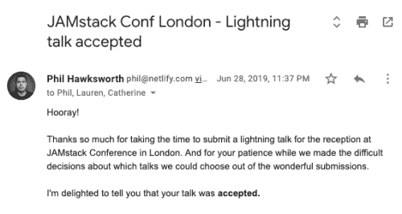
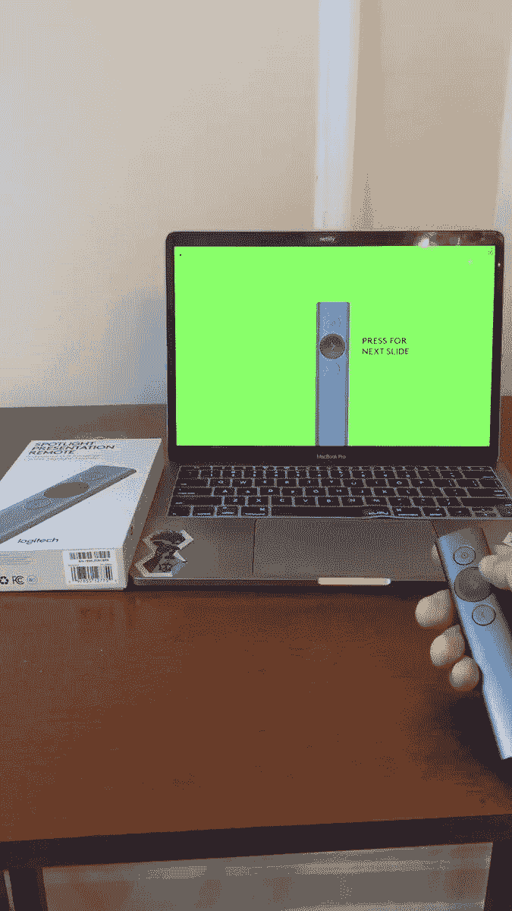
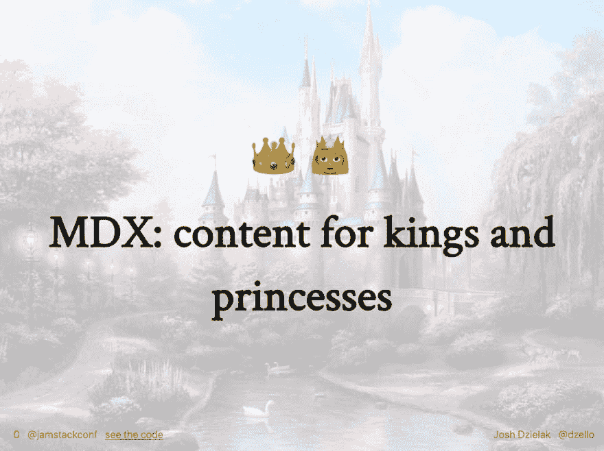
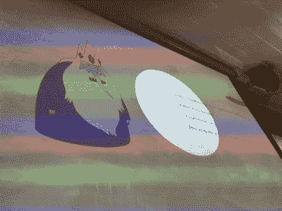
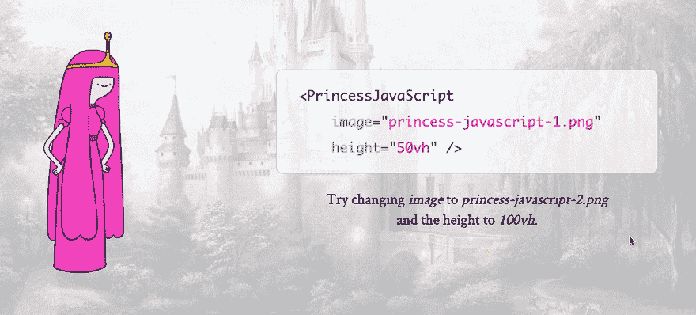
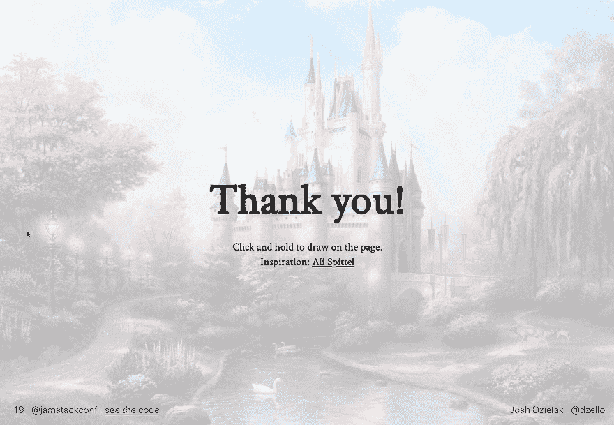

# 道具归道具:我如何为伦敦 JAMstack Conf 做了一次不寻常的皇家演讲

> 原文：<https://dev.to/dzello/props-for-props-how-i-made-a-royally-unusual-talk-for-jamstack-conf-london-59ah>

在今年的伦敦 JAMstack Conf】的招待会上有 4 场闪电会谈。这是一个我发现自己如何给其中一个人戴上带皇冠的金色太阳镜，并用权杖指挥幻灯片的故事。

这一切都是从呼吁会谈的人说会谈将于晚上在一家酒吧举行开始的。所以，我想我会提出一些有趣的东西。技术性强，但不太难让观众理解，就像一个故事。这是我发过去的提议:

> “从前有一个寡居的国王，名叫马克龙国王。老国王 Markdown 和他的臣民更喜欢他们的内容是静态的，线性的，主要是文本。有一天，国王遇到了最宁静的 XML 王国的 JavaScript 公主。公主和她的人民更喜欢他们的内容是丰富多彩的，动态的，互动的。尽管有分歧，Markdown 国王和 JavaScript 女士还是深深相爱了。但是他们各自王国的内容创建者怎么可能一起建立 JAMstack 网站呢？为此，我们需要一个英雄。不仅仅是一个英雄——一个王子。”

你可以想象当我收到来自会议主持人菲尔·霍克斯沃斯的邮件时我有多惊讶:

[](https://res.cloudinary.com/practicaldev/image/fetch/s--8HaisJkH--/c_limit%2Cf_auto%2Cfl_progressive%2Cq_auto%2Cw_880/https://res.cloudinary.com/dzello/image/upload/w_500/v1563699451/blog/email-jamstack-conf-talk-accepted)

LOL。真的吗？他们很认真。酷！好吧...

1.  这太棒了
2.  事实上，我现在必须写这篇演讲
3.  这些是[会议当天的发言人](https://jamstackconf.com/london/#speakers)😮
4.  我有 11 天时间

如果你想知道演讲的结果，请点击 **[查看幻灯片](https://mdx-fairy-tale.developermode.com/)** 或 **[查看代码](https://github.com/developermode/mdx-fairy-tale)** 。

请继续阅读，看看我是如何在此后的日子里设计和构建演讲的，以及作为一个极易犯错的人，在短时间内组织演讲的一些经验教训。

# 4p 年代

我有一个框架，可以在没有任何压力的情况下撰写和发表高度组织和精心排练的演讲。这就是所谓的 4 P。

*   阿尼奇
*   罗拉斯蒂涅
*   第一次
*   执行

如果我遵循 4 P，一切都会好的。

🤮🤮🤮🤮

# 惊慌失措

如果恐慌听起来是一件坏事，那是因为它确实是。但是恐慌也是创造性想法的来源之一。一旦我开始对演讲感到恐慌，我的大脑就会被迫想出疯狂的方法来实现它，而不管它们是否真的有效。

通常，这种创造性的能量会把我带到有趣的地方，无论是精神上还是身体上。例如，在我的瑜伽馆和办公室之间有一家名为“马戏团”的服装店，我在收到菲尔的电子邮件的第二天路过了这家服装店。我一走进去，你瞧，我看到了这些配套的太阳镜和权杖。

[](https://res.cloudinary.com/practicaldev/image/fetch/s--KsozEpw1--/c_limit%2Cf_auto%2Cfl_progressive%2Cq_auto%2Cw_880/https://res.cloudinary.com/dzello/image/upload/w_400/v1563724029/blog/king-sunglasses-royal-sceptre)

是的。是啊！我会穿得像国王一样去演讲。我将成为减价王。

在这一点上，我没有任何内容，但我有一个不可动摇的信心，那就是这个演讲需要我花 30 欧元去一个叫马戏团的地方。我照做了。

回到办公室后，我不再开始写演讲稿，而是又去抢购了。我在亚马逊上花 90 欧元买了一个罗技聚光灯，因为我看到了 T2 的推特，它看起来很酷。*情有可原*拖延症，阿米利特？

> <video loop="" controls=""><source src="https://video.twimg.com/ext_tw_video/1127598606679191554/pu/vid/320x568/4_qwG3VLBNzQtUu-.mp4?tag=9" type="video/mp4"></video>swyx🌟

如果观众讨厌这个演讲，至少我可以用这个花哨的指针分散他们的注意力，就像他们是猫一样！

罗技聚光灯很酷。它可以让你突出显示和放大演示文稿的一部分，只需指向屏幕并拖动一个圆圈。它有一个内置的加速度计，不需要外部传感器。Spotlight 还有“下一个”和“上一个”按钮，可以配置为当您连按它们时发送自定按键。

我仍然没有计划也没有内容，但是我有*东西*。

# 拖延

除了理发，我一个星期什么也没做。

# 出汗

从 7 月 7 日中午 12 点到 7 月 9 日晚上 7 点的 55 个小时里，我花了大约 30 个小时准备和排练这个演讲。

但是为什么要花那么长时间来建立一个 10 分钟的闪电谈话呢？

是的，为什么？

## MDX 甲板

因为我正在做一个关于 MDX 的演讲，我知道我不能像一些旅行的伪君子一样在 Keynote 或 Google Slides 中创建我的幻灯片。我不得不在 MDX 中构建它们。这个决定让我构建了一个完整的单一用途 React 应用程序，包括六个新的 React 组件和所有与之配套的自定义 CSS。

谢天谢地，有一个很棒的工具叫做 [MDX Deck](https://github.com/jxnblk/mdx-deck) 。MDX Deck 允许您用 markdown 编写幻灯片，并使用 JSX 语法嵌入 React 组件(这就是 MDX)。我刚刚用它为 JAMstack Paris 写了一篇[演讲。它有一个演示模式，也支持演讲者注释。](https://developermode.com/blog/mdx-authors-jamstack/)

我强烈推荐 MDX Deck，但请记住，您仍在**编写幻灯片**。没有拖放定位或调整文本大小。没有华丽的过渡。有一些现成的主题和布局，但是您需要在此基础上构建 React、styled-components 以及所有这些。

```
$ npm ls --parseable | wc -l
993 
```

Enter fullscreen mode Exit fullscreen mode

本次讲座由 993 NPM 套餐为您带来！

这些是我扩展或创建的一些组件:

*   `Horizontal`:可定制宽度的布局
*   `Appear`:在子元素可见之前，让子元素递增地出现而不占用空间，并在初始渲染时让第一个子元素可见
*   `Character`:国王和公主的基本组件，用于呈现图像并连接悬停和点击处理程序
*   `Code`:用语法高亮显示代码
*   `Provider`和`Footer`:在每张幻灯片的底部放置一个带有 twitter 句柄和幻灯片编号的页脚

为什么是页脚？如果你想让人们更容易地在推特上发布你的演讲，让你的推特句柄和会议推特句柄或标签一直显示是很重要的。

[](https://res.cloudinary.com/practicaldev/image/fetch/s--YK7un4l9--/c_limit%2Cf_auto%2Cfl_progressive%2Cq_auto%2Cw_880/https://res.cloudinary.com/dzello/image/upload/blog/mdx-fairy-tale-title-slide-with-footer)

在 GitHub 上，你可以查看所有这些组件的[代码。](https://github.com/developermode/mdx-fairy-talk/tree/master/components)

## 创意方向

事实证明，拖延症的一周并不完全没有成效。一个在我脑中运行的背景程序拼凑出了一个演讲将如何进行的大概想法。

**故事**

*   童话故事情节中的紧张局势将是国王和公主之间围绕王国应该产生什么样的内容——文本重还是互动——的争论。
*   王国的内容团队将被称为皇家内容学院，团队中的工程师将会拯救世界。
*   一个叫做 JAMstack 王国的相邻主权国家掌握着将 Markdown 和 JavaScript 组件结合起来的秘密😉

**技术**

*   King Markdown 和 Princess JavaScript 将是 React 组件。
*   当悬停在上面时，会发生一些动画。
*   当点击时，React 组件的代码将会出现。

**道具**

*   罗技聚光灯将被固定在*皇家权杖*的底座上，并被隐藏起来，这样权杖本身看起来就像是在推动展示。
*   聚光灯将触发人物的悬停和点击事件。
*   当我解释时，聚光灯会放大代码的各个部分。
*   聚光灯会动态改变 React 组件的道具，字面意思是“改变道具的道具”。

这是屏幕看起来的样子，皇家权杖将高亮气泡从 Markdown 国王移向产生他的代码。

[](https://res.cloudinary.com/practicaldev/image/fetch/s--nFOAlU_0--/c_limit%2Cf_auto%2Cfl_progressive%2Cq_auto%2Cw_880/https://res.cloudinary.com/dzello/image/upload/w_400/blog/king-markdown-spotlight)

即使在嘈杂的酒吧里，这种效果也能集中观众的注意力。

## 现场编码

不管出于什么原因，用定制的 React 组件讲述一个童话故事，并用世界上最昂贵的点击器制作动画，这种挑战对于在酒吧里进行 10 分钟的谈话来说似乎不够。

当然也必须有一些现场编码。

现场编码在[幻灯片 16](https://mdx-fairy-tale.developermode.com/16) 上结束。呈现的 HTML 输出和 Princess JavaScript 实例的代码并排显示。多亏了 [react-live](https://github.com/FormidableLabs/react-live) ，在编辑器中更改代码会导致组件立即重新呈现。

[](https://res.cloudinary.com/practicaldev/image/fetch/s--RH8Ao2UL--/c_limit%2Cf_auto%2Cfl_progressive%2Cq_66%2Cw_880/https://res.cloudinary.com/dzello/video/upload/e_loop/v1563708541/blog/princess-javascript-live-coding-animated.gif)

我没有时间给皇家权杖接上电线来输入真实的字符(这是可能的！所以我只是用我的笔记本电脑键盘来改变这些值。

## 现场绘图？

有一次，我在排练《皇家权杖》，我想“如果我只需要指着幻灯片就能在上面画画，那不是很酷吗？”

我最近在 DEV 社区的离线页面上发现了一个优雅的浏览器内绘图实现，并阅读了 Ali Spittel 关于她如何构建它的帖子。谢谢阿里！

[](/aspittel) [## 如何在 DEV 的离线页面上创建绘图交互

### Ali Spittel，7 月 3 日至 19 日，4 分钟阅读

#javascript #art #showdev](/aspittel/how-to-create-the-drawing-interaction-on-dev-s-offline-page-1mbe)

我从[她的 Codepen](https://codepen.io/aspittel/pen/JaZWvE) 那里借来代码，把它硬塞进一个 React 组件，做了一些调整，使它能与 Spotlight 指针*一起工作，嘣，它工作了！

我使用这个 React 组件作为幻灯片的 [MDX 布局](https://github.com/jxnblk/mdx-deck/blob/master/docs/layouts.md) :
，使得最终幻灯片的整个表面区域都是可绘制的

```
<Drawable color="#ce4999" width={20}>

# Thank you!

<div style={{ fontSize: "24px" }}>
  Click and hold to draw on the page.
</div>

</Drawable> 
```

Enter fullscreen mode Exit fullscreen mode

在演讲结束时，我将罗技聚光灯对准屏幕，并在“谢谢”下面画了线。

[](https://res.cloudinary.com/practicaldev/image/fetch/s--HDiNjibq--/c_limit%2Cf_auto%2Cfl_progressive%2Cq_66%2Cw_880/https://res.cloudinary.com/dzello/video/upload/e_loop/v1563727350/blog/jamstack-london-mdx-drawing-slide.gif)

*在[发布的幻灯片](https://mdx-fairy-tale.developermode.com/)中，可以点击鼠标并按住进行绘制。聚光灯不能做到这一点。对于真正的演示，我修改了代码，只需在悬停时进行绘制，这可以通过按住顶部按钮挥动聚光灯来完成。

# 执行

我从来没有在真正的观众面前测试过这些。我不知道屏幕实际上会在酒吧的什么地方，也不知道是否有可能在不背对人群的情况下指向它。但这是**执行**阶段，没有**惊慌**的余地。

菲尔非常友好，让我到酒吧后做一些测试。屏幕在我身后，但不太远。皇家权杖可以移动上面的荧光笔。这是个好消息。

然后是出发时间。我把笔记本电脑放在吧台上，插上一根太短的 HDMI 线，以最大音量对着麦克风说话，自由地使用皇家权杖。观众们很投入，我们在一起玩得很开心。

在推特上，人们说他们喜欢这个话题。耶！

液体错误:内部

这里还有一个:

液体错误:内部

最后，通过 4 P 并花时间来建立对话绝对是值得的。我学到了很多关于 MDX 和 MDX deck 的知识，并与那些对其工作原理感到好奇的人进行了许多有趣的交谈。这给了我在这里写这篇文章的动力。

😅😅😅😅

# 结论

有结论吗？我希望如此。

4 P 的框架很恐怖，请不要这样写演讲稿。

Logitech Spotlight 非常酷，我只是对它与 React 和 MDX 结合使用时如何进行非常交互式的演示略知一二。

Phil 和整个 JAMstack Conf 团队开了一个非常棒的会议。他们是好人。我感谢他们选择了我的演讲，并没有认为这是一个虚假的提交。

没有视频，但您可以通过 **[观看幻灯片](https://mdx-fairy-tale.developermode.com/)** 和 **[查看代码](https://github.com/developermode/mdx-fairy-tale)** 来了解 MDX，并了解演讲中的所有内容是如何构建的。

如果您有关于 MDX、MDX Deck 或(未使用)4 P 的问题，请提问。

感谢您的阅读！