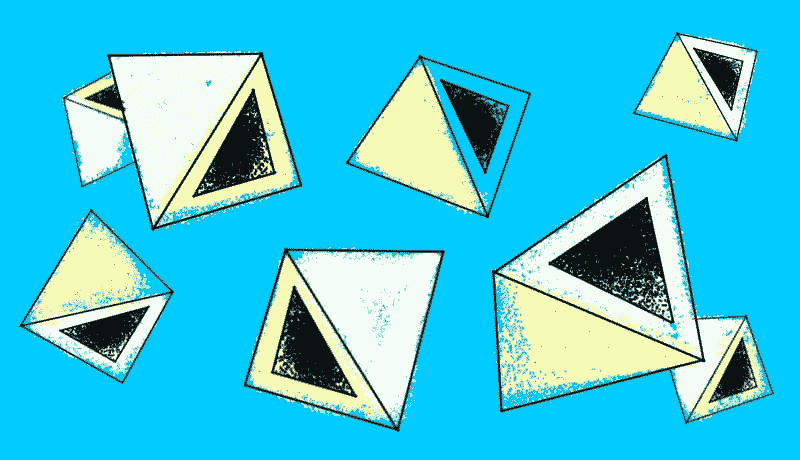
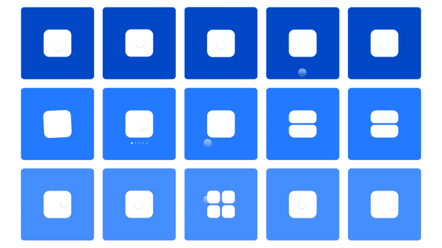
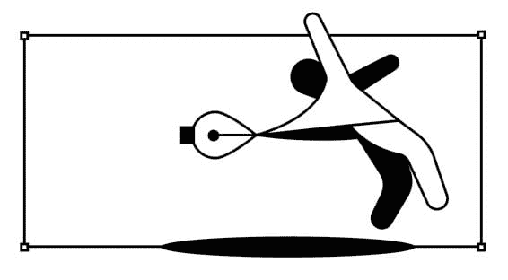
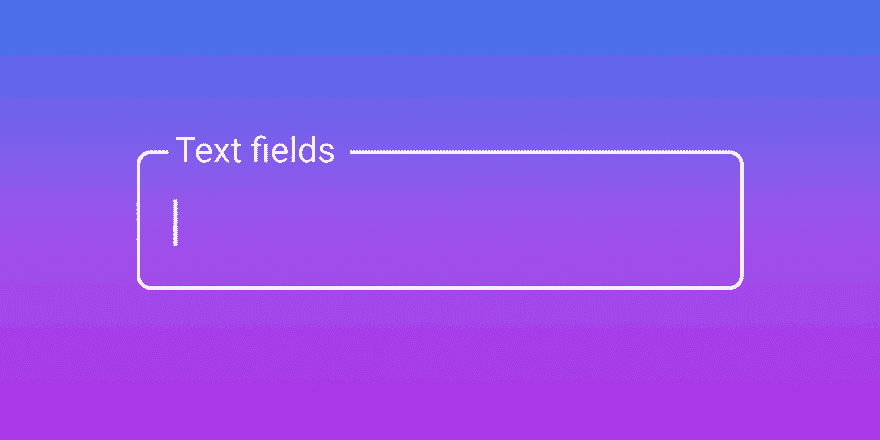
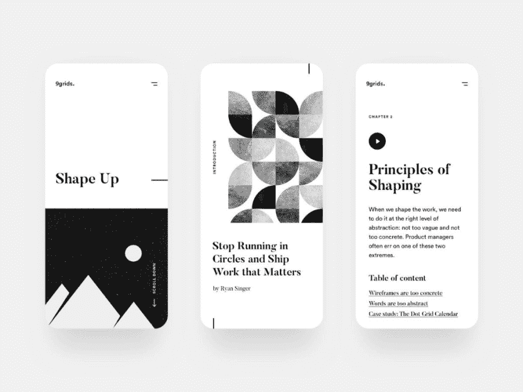
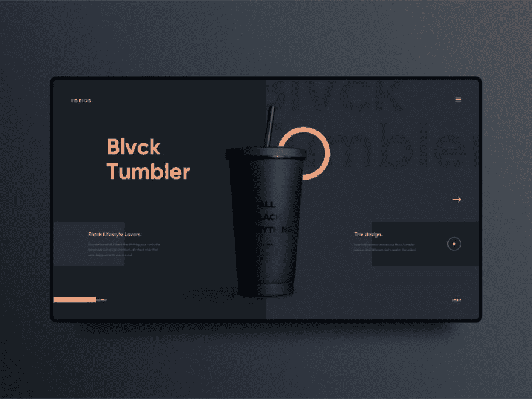
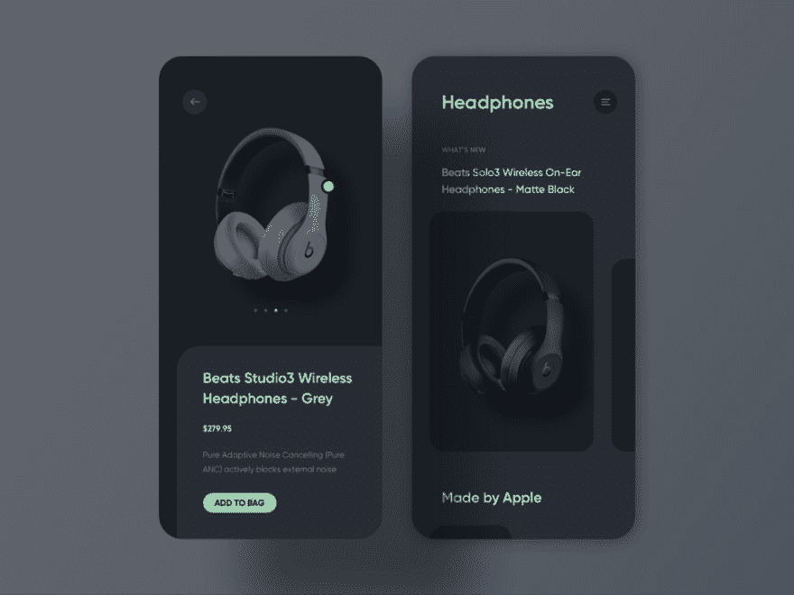
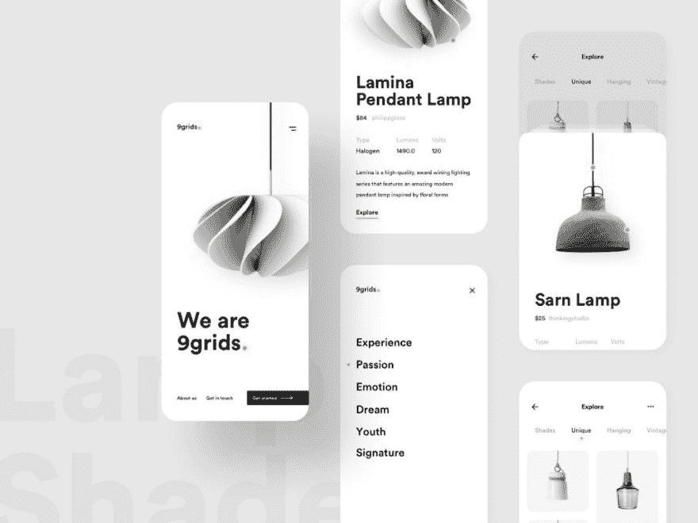

# 原型神话、UI 备忘单、响应式 AR——本周还有更多 UX 链接

> 原文：<https://dev.to/fabriciot/prototyping-myths-ui-cheat-sheet-responsive-ar-and-more-ux-links-this-week-4mc0>

#### 每周精选的设计链接，由你在 UX 集体的朋友带给你。

*   [**黑暗图案**](https://uxdesign.cc/the-possibility-gap-its-time-to-label-this-dark-pattern-4bd627978a6?source=friends_link&sk=2c69f6e8fc2c166f822c7c15659089bf) →是时候给黑暗图案贴上标签了。
*   [**不是设计师**](https://uxdesign.cc/lets-be-honest-not-everyone-is-a-designer-and-that-s-okay-318159e6c742?source=friends_link&sk=59a3e71cd60cf82c64f73186eede11ab) →不是每个人都是设计师——没关系。
*   [**意向性价值**](https://uxdesign.cc/create-value-not-a-game-of-chance-2bef9933ed2f) →摆脱无限滚动，专注于创造意向性而非偶然性的价值。

### 来自社区的故事

[**关于高保真原型机的误区**](https://uxdesign.cc/4-myths-busted-about-hi-fi-prototyping-44508ad85f15?source=friends_link&sk=d3688f369f8d4b596c5f7840bdd61368) →

关于高保真原型机的误区和学习。

[**设计工具阻碍了我们**](https://uxdesign.cc/design-tools-are-holding-us-back-1aca266b333e?source=friends_link&sk=759131de0cce0b6e40010acbe659a6e3) →

我们的工具仍然使用平面设计中的工作流程和功能。

[**UI 备忘单:文本字段**](https://uxdesign.cc/ui-cheat-sheet-text-fields-2152112615f8?source=friends_link&sk=45186712df4127e5e3ff75e36b870a15) →

看着叶老不起眼的文本字段又该如何样式化。

更多头条新闻:

*   [**希望我的媒体文章能提高媒体**](https://uxdesign.cc/hope-my-medium-article-could-improve-medium-a-ux-case-study-ac05ac72f6bd?source=friends_link&sk=0b4e7ba9a799be9bf1efd1bf3a46824b) →
*   [**为什么用便利贴开会不是我的最爱**](https://uxdesign.cc/design-meetings-with-sticky-notes-c827c553545e?source=friends_link&sk=5681d86f3976915272e24d1cbe1e0352) →
*   [**我如何从零开始建立我的 UX 投资组合**](https://uxdesign.cc/how-i-designed-and-built-my-ux-design-portfolio-from-scratch-f1f9b5261029?source=friends_link&sk=efd6b8aae25229f6ad0c21b406b127d5) →

### 新闻&观点

*   [**响应式 AR**](https://www.torch.app/blog/foundational-ideas-responsive-augmented-reality-content) →响应式 AR 内容的基础思路。
*   [**标题尖叫**](https://www.titlescream.com/) →类型+图形灵感来自 8/16 位游戏。
*   [**深度学习**](https://tabnine.com/blog/deep) →用深度学习为开发者自动补全。
*   [**不是问题**](https://www.demilked.com/useless-inventions-matt-benedetto/) →解决不存在问题的发明。

### 精选作品

[**由全哈**](https://dribbble.com/quanht) →

### 工具&资源

*   [**字体指南**](https://betterwebtype.com/articles/2019/07/14/recognising-font-styles/) →浩瀚宇宙字体风格指南。
*   [**串联聊天**](https://tandem.chat/) →远程团队的虚拟闲置办公室。
*   [**Brill App**](https://brill.app/) →节省用照片或语音数字化笔记的时间。
*   [**无障碍颜色**](http://clrs.cc/a11y/) →将这些颜色混合，打造无障碍主题。

* * *