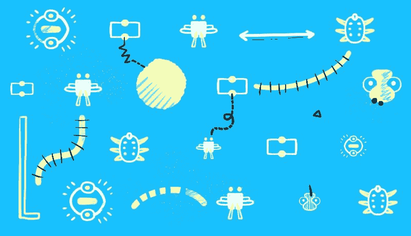
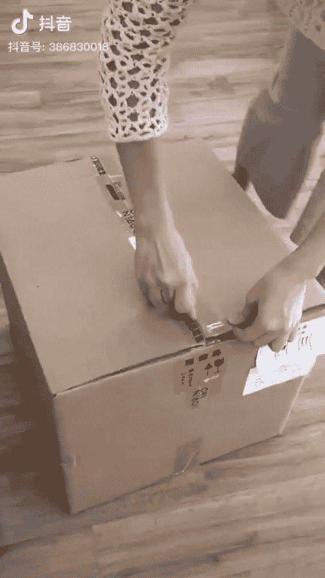
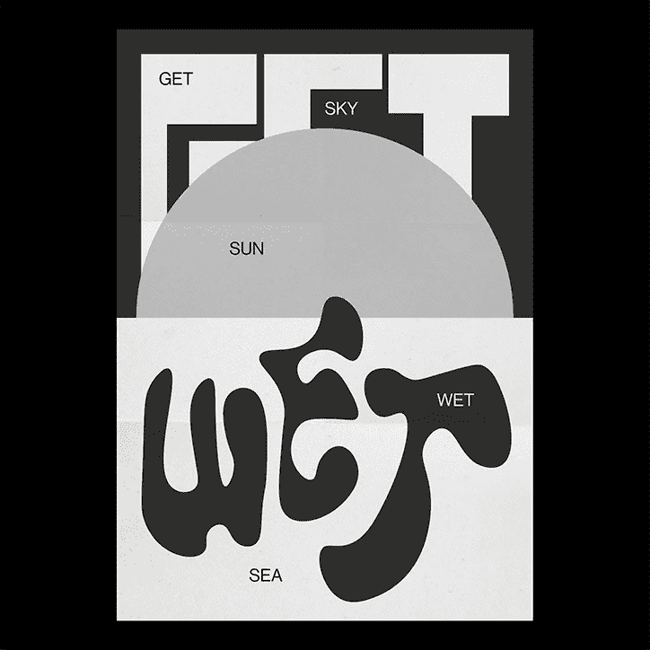
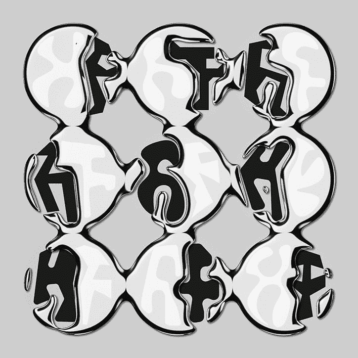
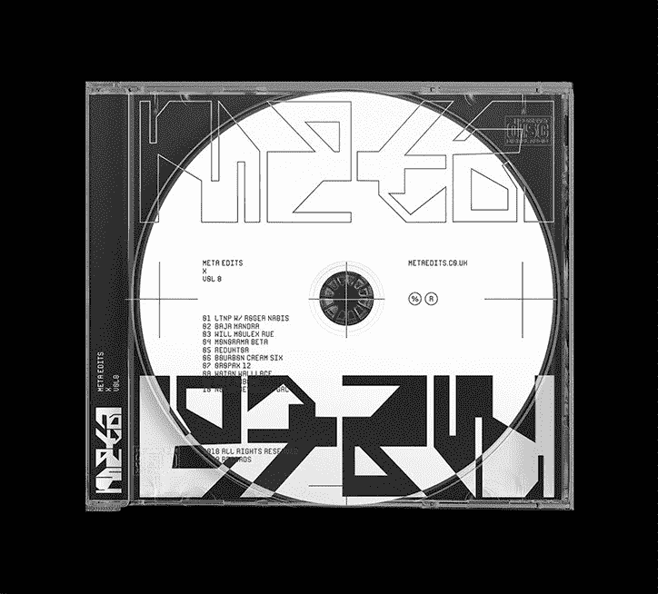
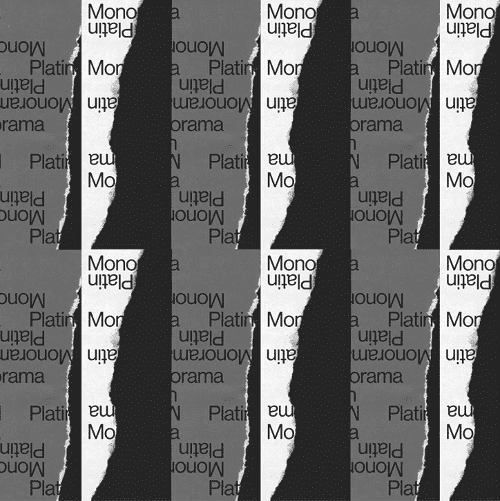
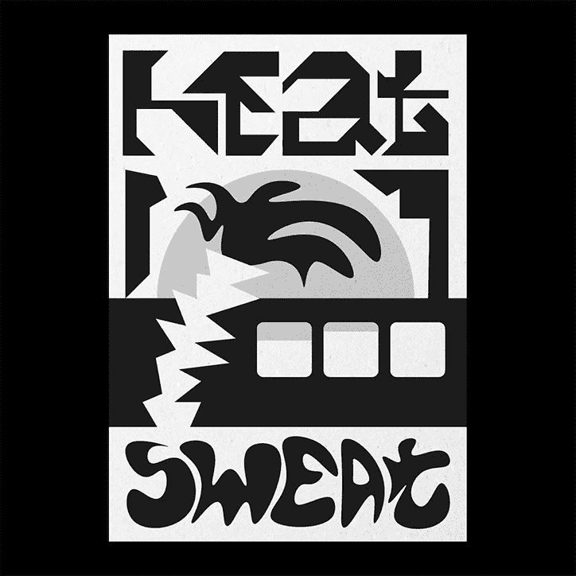
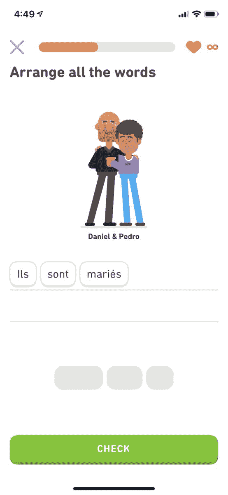

# 不和谐的原型，30 大设计公司，待完成的工作——以及本周更多的 UX 链接

> 原文：<https://dev.to/uxcollective/prototyping-with-discord-top-30-design-companies-jobs-to-be-done-and-more-ux-links-this-week-33ne>

#### 每周精选的设计链接，由你在 UX 集体的朋友带给你。

[](https://res.cloudinary.com/practicaldev/image/fetch/s--tTnVCeAK--/c_limit%2Cf_auto%2Cfl_progressive%2Cq_auto%2Cw_880/https://cdn-images-1.medium.com/max/800/0%2Aq1hNp6G9RKdqogXg.jpg)

*   [**更好的搜索**](https://bradleytaunt.com/better-search-results/)→UX 一项实验重新思考搜索结果布局。
*   [**设计导师**](https://medium.com/dropbox-design/designing-design-mentorship-3bc796a16634)→Dropbox 如何设计他们的设计导师。
*   [**电子游戏 UX**](https://jenson.org/games/) →游戏如何创造火花、紧张和活力。

### 来自社区的故事

[](https://res.cloudinary.com/practicaldev/image/fetch/s--ambLrBQI--/c_limit%2Cf_auto%2Cfl_progressive%2Cq_auto%2Cw_880/https://cdn-images-1.medium.com/max/728/0%2AXpgV60Gm-gcJrv0Y.jpg)

**→

作者[鲁本斯·坎图尼](https://medium.com/u/d7ca111e7984)**

 **[](https://res.cloudinary.com/practicaldev/image/fetch/s--3bnoCD69--/c_limit%2Cf_auto%2Cfl_progressive%2Cq_auto%2Cw_880/https://cdn-images-1.medium.com/max/728/0%2ArfuD7YAY4zNCUezu.jpg)

[**老年人界面设计指南**](https://uxdesign.cc/a-guide-to-interface-design-for-older-adults-31109468d46d?source=friends_link&sk=7f8b74a6ce94f1910d5ad0d89085f484) →

作者[卡梅隆·查普曼](https://medium.com/u/3a1f15cedbc8)

[](https://res.cloudinary.com/practicaldev/image/fetch/s--51W-UYLr--/c_limit%2Cf_auto%2Cfl_progressive%2Cq_auto%2Cw_880/https://cdn-images-1.medium.com/max/728/0%2AU8B9oHTS4x5YpDAg.jpg)

[**不和谐与懈怠的原型**](https://uxdesign.cc/prototyping-in-discord-and-slack-30bc5aea145?source=friends_link&sk=0f6b8f1c9b910a6ef21b351a66e02153) →

作者[丹·格尔登福斯](https://medium.com/u/e968b9c1610d)

更多头条新闻:

*   [**把最好的自己带到产品设计行为访谈**](https://uxdesign.cc/bringing-your-best-self-to-product-design-behavioral-interviews-597a68111f12?source=friends_link&sk=fb645e4ad6136b7b880d901aa2c1a4cc) →作者[丹·施洛夫](https://medium.com/u/739de99cf277)
*   [**如何应对不“懂”设计的人**](https://uxdesign.cc/how-to-deal-with-people-who-dont-get-design-design-and-strategy-3a1ef8c1841e?source=friends_link&sk=6e8df062645d616c9115ba5684d3d7e7) → By [摩根·彭](https://medium.com/u/ab0fa74d2f6)
*   [**没有 Spool 先生，不是每个人都是设计师**](https://uxdesign.cc/no-mr-spool-not-everyone-is-a-designer-53b62596b059?source=friends_link&sk=0d35032a6a677f5700fb2126ee95da22) → By [jeffm8](https://medium.com/u/40017e97e0ac)
*   [**为什么你不该在 UX 追求事业**](https://uxdesign.cc/why-you-shouldnt-pursue-a-career-in-ux-1072d466df53?source=friends_link&sk=c561d655d67762523b046c6e05f2ac41) →由[约书亚到达](https://medium.com/u/a2117d71a13d)
*   [**介质待完成工作**](https://uxdesign.cc/the-jobs-to-be-done-for-medium-10317327cd5f?source=friends_link&sk=baafbeb98fee9741725215d6621b4c48) →由[爱德华多·埃尔南德斯](https://medium.com/u/540ca32e659d)
*   [**设计更好的移动应用排版指南**](https://uxdesign.cc/guide-for-designing-better-mobile-apps-typography-5796495ef86f?source=friends_link&sk=a9123b5d69b45a97df63192fc61ffb41) →作者[安德烈·朱里丁](https://medium.com/u/b41b5d673ced)
*   [**如何让继承设计有意义**](https://uxdesign.cc/how-to-make-sense-of-inherited-design-17b7495362bb?source=friends_link&sk=f70813f2946ab447e45c03c59f64819f) → By [@kingsidharth](https://medium.com/u/ea17deaeaa97)

> <video loop="" controls=""><source src="https://video.twimg.com/ext_tw_video/1172414450093084672/pu/pl/FyqpQvEB3NFvaLhF.m3u8?tag=10" type="application/x-mpegURL"></video>neu@ neudotstudio你甚至设计过饮料包装 brah 吗？
> 
> 这是马云(阿里巴巴创始人)最近发给员工的 20 周年礼物。2019 年 9 月 13 日上午 07:39[](https://twitter.com/intent/tweet?in_reply_to=1172414502219812864)[](https://twitter.com/intent/retweet?tweet_id=1172414502219812864)917[](https://twitter.com/intent/like?tweet_id=1172414502219812864)2440

### 新闻&观点

*   [**顶级设计公司**](https://www.fastcompany.com/90386243/innovation-by-design-2019-design-company-of-the-year)→FastCo 评出的 30 家最重要的设计公司。（👋嘿！)
*   [**包豪斯 UX**](https://medium.com/google-design/the-bauhaus-finding-creative-inspiration-in-collaboration-60aebabdbc7b)→UX 能从标志性的包豪斯设计学院学到什么？
*   [**响应式文案**](https://getcoleman.com/) →这位作家的作品集让你选择他的介绍文案有多俗气。
*   [**如何自主？**](https://www.washingtonpost.com/graphics/2019/business/how-does-an-autonomous-car-work/) →自动驾驶汽车如何工作？不太好。

[](https://res.cloudinary.com/practicaldev/image/fetch/s--EdmB99GX--/c_limit%2Cf_auto%2Cfl_progressive%2Cq_auto%2Cw_880/https://cdn-images-1.medium.com/max/724/1%2AqLedQxRku187vb8NSFGoHw.jpeg)

[](https://res.cloudinary.com/practicaldev/image/fetch/s--wKNCzWZn--/c_limit%2Cf_auto%2Cfl_progressive%2Cq_auto%2Cw_880/https://cdn-images-1.medium.com/max/724/1%2AhakxJyq_0_JuI8INNGTrjw.jpeg)

[](https://res.cloudinary.com/practicaldev/image/fetch/s--1EY7RQSn--/c_limit%2Cf_auto%2Cfl_progressive%2Cq_auto%2Cw_880/https://cdn-images-1.medium.com/max/724/1%2AhwXiauCgxwZ5O2eVCb9x7A.jpeg)

[](https://res.cloudinary.com/practicaldev/image/fetch/s--_dEa_W6s--/c_limit%2Cf_auto%2Cfl_progressive%2Cq_auto%2Cw_880/https://cdn-images-1.medium.com/max/724/1%2AQZMJGGE32AWT3leGJ6y3Og.jpeg)

[](https://res.cloudinary.com/practicaldev/image/fetch/s--w9NeLd7N--/c_limit%2Cf_auto%2Cfl_progressive%2Cq_auto%2Cw_880/https://cdn-images-1.medium.com/max/724/1%2AN04aVoP6bG6BEl8BgGzrDg.jpeg) 

<figcaption>[**精选作品:汉斯·芬德林**](https://www.itsnicethat.com/articles/hans-findling-graphic-design-120919) →</figcaption>

> fabric io Teixeira[【fabric IOT](https://dev.to/fabriciot)嘿 [@duolingo](https://twitter.com/duolingo) ，我正在看你一直在做的伟大工作——不仅仅是用你令人钦佩的产品 [#UX](https://twitter.com/hashtag/UX) ，而是通过文字+插图打破性别/家庭陈规。向你的团队致敬，为多元化和理解构建了一条美丽的道路，一次一课。2019 年 9 月 02 日下午 15:13[](https://twitter.com/intent/tweet?in_reply_to=1168542431941464064)200[](https://twitter.com/intent/like?tweet_id=1168542431941464064)1100

### 工具&资源

*   [**Mozilla 设计**](https://mozilla.design/) →拥有资源、文章和指南的新中心。
*   [**按钮对比**](https://www.aditus.io/button-contrast-checker/) →你的按钮符合 WCAG 2.1 吗？
*   [**查克拉 UI**](https://chakra-ui.com/) →快速构建易访问的 React 应用&网站。
*   [**癫痫病 UX**](https://www.epilepsyblocker.com/epilepsy_ux) →检查你的设计让有光敏性癫痫病的人查看。

```
We believe designers are thinkers as much as they are makers. So we created the [design newsletter](https://newsletter.uxdesign.cc/) we have always wanted to receive. 
```

* * ***