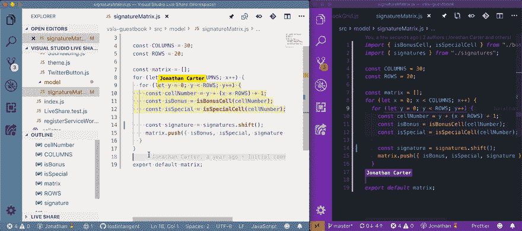
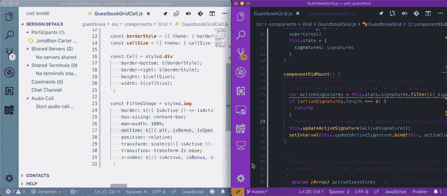
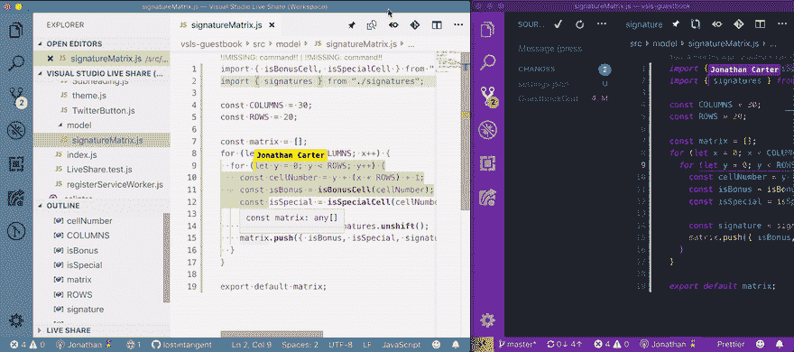
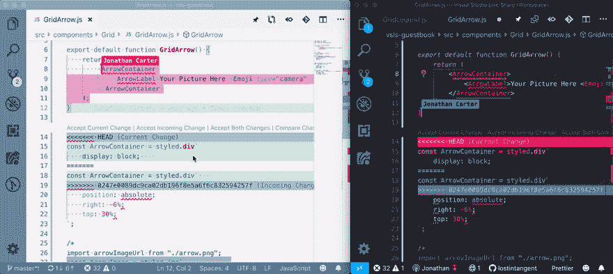
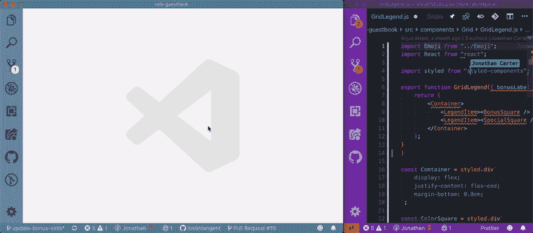

# 为基于 Git 的协作提供实时补充

> 原文：<https://dev.to/lostintangent/providing-a-real-time-compliment-for-git-based-collaboration-1aah>

每天，数百万开发人员使用软件中最基本的工具之一进行协作: [Git](https://git-scm.com/) 。作为一个[分布式版本控制系统](https://en.wikipedia.org/wiki/Distributed_version_control) (DVCS)，Git 使你能够与个人的离线代码库副本一起工作，当准备好时，[小心地将](https://git-scm.com/book/en/v2/Git-Basics-Recording-Changes-to-the-Repository)你的更改合并到[托管的仓库](https://GitHub.com)中，在团队中共享。这支持一种极其灵活的形式的[异步协作](https://devops.com/collaboration-types)，并且对于维护项目的历史是不可或缺的。

然而，尽管 Git 代表了**团队范围的长期协作**的基础，但它并不是为**短期的同步交互**而构建的。例如:当你结对编程，指导另一个开发人员，或者仅仅是寻求同事的帮助时，你需要一个**实时的、对话式的体验**，这是高度迭代的，并且不需要为了原型或交换想法而影响项目历史。这正是我们构建 [Visual Studio Live Share](https://aka.ms/vsls) 的原因:为 Git 提供**实时补充。**

在[之前的一篇文章](https://aka.ms/vsls-why)中，我展示了 Live Share 如何为一系列[开发者用例](https://aka.ms/vsls-usecases)实现一种独特的协作形式。然而，由于大多数团队将使用 Live Share **结合版本控制**，我想展示它如何在整个开发生命周期中为基于 Git 的工作流提供更好的体验(例如，代码审查、合并冲突、拉请求)。让我们看看这个看起来怎么样！

## 提交之间的协作

当您使用 Live Share 共享项目时，会话中的每个人都可以立即查看和编辑文件，**而无需下载或克隆任何内容**。然而，访问文件内容只是故事的一部分，对于 Git 版本化的项目，还有另一个基本的上下文:[工作目录](https://git-scm.com/book/en/v1/Getting-Started-Git-Basics#The-Three-States)的状态。没有这一点，参与者就无法识别进行中/未提交的更改，这对于集中讨论和理解/记住所做的事情至关重要。

在实时共享会话中，您只需打开`Source Control`选项卡，即可立即查看已更改和/或暂存的文件列表。从那里，您可以点击任何文件(或[装订线指示器](https://code.visualstudio.com/docs/editor/versioncontrol#_gutter-indicators))来查看其差异，甚至放弃不需要的更改。看起来和感觉上好像每个人都在使用他们自己的本地副本，但是不需要提交、推送或拉取更改。这实现了一种形式的**实时对等协作，在 Git 的分布式文件系统**之上🚀

*一位实时分享嘉宾(左)在他们的编辑器中直接查看和放弃更改*

此外，Live Share 允许您向任何代码行添加注释，当与 shared diffs 结合使用时，使您能够完全执行**实时、专门的代码评审**，而无需依赖其他工具或服务。我们发现这对于进行基于主干的开发的团队，或者只是希望在发出团队范围的拉取请求之前获得一些初始建议的团队来说是非常强大的🔥

*一位现场分享嘉宾(左)通过代码评论与主持人(右)交流*

## 从历史中学习

除了查看项目工作目录的状态(即未提交的更改)，有时查看文件的**提交历史也是有价值的，以便了解具体的更改是何时由谁引入的。Visual Studio 代码没有提供用于查看提交历史的内置解决方案，但是，获得这一功能只是一个扩展——安装！**

GitLens 是市场上最受欢迎的扩展之一，它为导航和搜索 Git 历史提供了丰富的体验。更酷的是，它完全启用了[Live Share](https://aka.ms/vsls-awesome)，因此，如果访客安装了它，他们可以浏览项目历史，就像他们正在处理本地存储库一样。

*使用 GitLens 扩展导航文件历史的实时共享访客(左)*

## 协同可以有冲突

当您在实时共享会话中协作编辑文件时，会使用一种叫做[操作转换](https://en.wikipedia.org/wiki/Operational_transformation)的算法实时同步更新。因此，多个开发人员可以编辑完全相同的行/文件，并且可以放心，任何冲突都会被自动处理(就像 Google Docs/Word 一样)。然而，由于 Git 是一种异步形式的协作，当多个开发人员以不同的方式编辑同一行时，有时会发生冲突(例如，您重命名了一个我删除的变量)，并且您试图[将竞争的更改合并在一起](https://help.github.com/en/articles/resolving-a-merge-conflict-using-the-command-line)。

虽然有些合并冲突很容易解决，但是其他的冲突可能会非常困难，这取决于冲突的数量以及竞争变更背后的环境。使用 Live Share，您可以简单地邀请必要的开发人员参加会议，并实时处理每个冲突。此外，由于 Live Share 支持[独立编辑/导航](https://dev.to/lostintangent/collaboration-doesn-t-come-in-one-size-fits-all-33ai)，您可以选择逐个处理冲突，或者各个击破。完全由你决定！

*一位实时分享嘉宾(左)实时协作解决合并冲突*

## 拉取请求

一旦你完成了你的工作，你可能会决定是时候创建一个拉动请求了，这样你就可以在整个团队中进行社会化的改变，并寻求更广泛的反馈。由于 PR 讨论是完全异步的(就像 Git！)，交流是通过评论进行的，这实现了一种轻量级的迭代方式，而不用考虑每个人的日程安排。然而，有时一个回顾持续足够长的时间，与某人实时讨论你的改变是值得的，因为同步对话可以更有响应性。

如果您安装了 [GitHub Pull Requests](https://marketplace.visualstudio.com/items?itemName=GitHub.vscode-pull-request-github) 扩展，它使您能够直接在 Visual Studio 代码中检查您的 PR 分支，并查看它们各自的更改和注释。更酷的是，由于该扩展完全支持实时共享，您可以在“查看模式”下启动协作会话，您的客人将能够看到 PR 更改列表，以及查看/添加评论。你几乎可以把它想象成一个拉动请求的涡轮按钮！🏎️

*一位实时共享访客(左)正在查看拉取请求中的更改和评论*

## 向前看

希望这篇文章说明了 Live Share 如何补充您现有的基于 Git 的工作流，无论您是否希望在未提交的代码上进行协作，在棘手的合并冲突上获得帮助，或者执行实时代码审查(有或没有拉请求)。我们仍然有很大的改进空间(例如，持久化代码注释，编辑级用户属性)，但我们已经看到团队成功地使用 Git + Live Share。最终，我们的目标是通过利用最适合团队的异步和同步工作流，使团队能够持续协作。