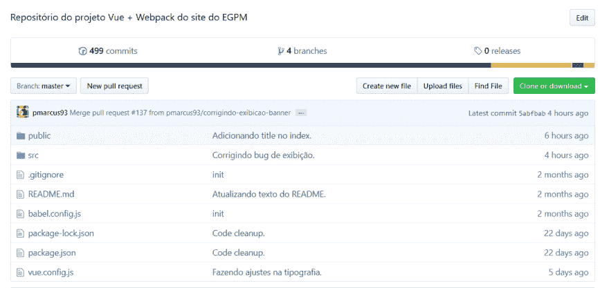
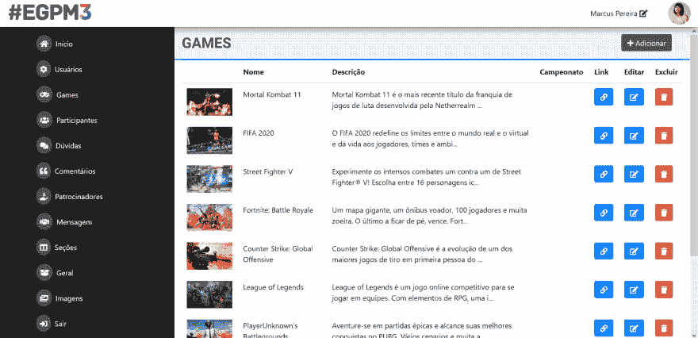

# [pt-BR]您是否希望通过网站和 CMS 来吸引玩家

> 原文：<https://dev.to/pmarcus93/pt-br-como-criamos-o-site-e-o-cms-do-encontro-gamer-de-para-de-minas-com-vue-e-webpack-46m4>

如果你的葡萄牙语不流利，这里还有这篇文章的英文版本。T3】

* * *

我是帕拉米诺大学 it 管理课程的学生。每六个月，我们都制定了一个项目，将学习的知识应用于学科。这一次，我的团队决定为每年在大学举办的一次活动制作一个网页:地雷游戏玩家会议。

始于静态站点的内容已成为使用通过 API 注册到 CMS 的内容的 via 应用程序。在这篇帖子里，我会讲一点我们的经历以及我们在路上学到的东西。

# 启动项目

我的团队由三名成员组成:我、卢卡斯和爱德华多。我们是开发者。Lucas 和我合作开发网络系统 Eduardo 在 Delphi 开发系统(他在网络、托管和基础设施方面有丰富的经验)。

最初的想法是开发一个静态登录页，显示活动的主要细节。发展的时间有限，我们打算把范围缩小很多。

在开始使用代码之前，我们决定重新设计事件的可视标识。这很重要，这样我们才能在页面上嵌入项目标识。我们创建了一个基于欧洲版超级任天堂控件按钮颜色的概念。

有了设计好的标志和色彩，是时候寻求灵感了。

# 灵感与原型

作为起点，我们分析了多个事件站点，记录了哪些站点有效，哪些无效。重点是从页面上的文章和信息的安排中寻求灵感。

我们创建了一些小型原型(更像功能性的 wireframes)，以便在实际选择技术并开始开发之前测试每个布局的可行性。

# 选择技术

除了创建使用体验良好的页面外，优先考虑的是将项目用作实验和学习的操场。选择不同于我们日常工作中使用的技术是实现这一目标的最佳途径之一。

我们选择了-我...。

### 视图。JS 作为 JS + Webpack 框架作为 bundler 模块

vista 的语法非常友好，项目有充分的文档记录，社区规模巨大。我们使用预先设定好的 webpack 开放原始码范本，让您可以在. vue 档案中建立个别元件。此范本提供了许多便利:设计编译指令、CSS 前置处理器支援、现代 JS 堆叠程式、每次档案变更时自动更新页面的本机伺服器

### 自举 4

不做介绍。我们选择 Bootstrap 4 作为最佳的网格和组件系统。

### sass(SCS)

CSS 预处理程序。SASS 使您能够更智能、更易读地编写 CSS，并自动执行多个过程。我们使用 SCS 语法，因为它更像传统 CSS。

### Git + Github

版本控制是现代项目的基础。使用 git 作为版本控制工具，我们选择 Github 来托管源代码存储库。我们在工作中使用 Bitbucket，选择 Github 是了解服务之间差异和等效性的好方法。

# 把手放在面团上

## 以异步方式协同工作

<figure>

<figcaption>Muitos e muitos commits!</figcaption>

</figure>

我们在 Github 上创建了一个存储库，并使用问题和提取请求来组织自己。因为卢卡斯和我熟悉 Bitbucket，所以在 Github 上学习等价的东西很容易。在我写这篇帖子时，我们有 491 个提交和 24 个已关闭的问题在存储库中。

流基本上是:

1.  定义功能的创建：
2.  打开新功能/修补程序的问题并将其分配给其中一个节点，然后创建新分支。
3.  desenvolver
4.  创建一个指向 branch master 的 pull request，将另一个作为审阅者插入；
5.  核准后，合并变更并删除旧分支。

它运作得很好，我们很少发生代码冲突。我们组织得很好，即使周末在完全不同的时间发展。

## 视图，视图，视图

配置 webpack 模板并启动存储库后，我们开始开发。我们研究了该框架的基本概念，并且在一周多一点的时间内，已经有了一个功能性的网站应用框架。

最初的挑战之一是了解现代 JavaScript(ECMAScript 6+)，因为所有库和组件的导入和导出都基于最新版 ecmascript 的模块化功能。

vista 有一个非常易于学习的语法，特别是如果您以前使用过框架作为角度。文档非常出色，非常详细。如果英语不是你的强项，那就放心吧:它也有葡萄牙语版本。

将 view 与 Webpack 一起使用时，我最喜欢的一个功能是在创建组件时使用. view 文件。它们在一个文件中包含组件的 HTML、CSS 和 Javascript。e 要使用 banner . vue 组件，例如，只需使用“`<Banner></Banner>`”。这使代码对开发者来说更容易阅读。

## 创建 CMS 的必要性

<figure>

<figcaption>Simples, porém efetivo.</figcaption>

</figure>

随着网站的发展，为内容记录创建 CMS 的需求也越来越大。我们需要一个内容管理系统，用于记录活动中的游戏，包括标题(视频、艺术等)、锦标赛、位置信息、门票购买链接、常见问题解答和证词。

CMS 是 Lucas 的完整构建，使用了他在个人项目中使用的自定义 PHP 框架。CMS 前端具有与站点相同的基本结构，使用了组件化概念。它由一个面板组成，分为多个部分，用于记录、编辑和删除内容。数据以 JSON 格式返回，由站点使用的 API。

CMS 代码目前包含在两个存储库中:一个用于前端，另一个用于后端。

## 零部件、SASS 和布局试验的简便性

vista 组件化使一系列实验得以在最小的努力下进行。例如，要测试项目、颜色或字体的新排列方式，只需更改组件代码即可。该零部件的所有引用都将自动继承更改。

使用 SASS 是一个正确的选择。正如我在文本开头所述，SASS 允许您创建变量和代码片段，以自动化涉及 CSS 的过程，而且其语法比纯 CSS 更易于阅读。

请记住，归根结底，用 SASS 写的东西都会变成 CSS。改变的是组织代码的方式。我选择了 SCS 语法，它保留了用于分隔行和选择器末尾的键和分号。

## 反应性和图像

即使现在开始进入 web 开发领域，您也应该知道，拥有一个响应性网站/系统至关重要。在一个大多数上网都是通过智能手机和其他移动设备进行的世界里，拥有一个非常适合小屏幕的网站是一件很基本的事情。

我们非常重视为通过智能手机访问网站的用户提供出色的体验。这不仅仅是定位正确且可读的文章。页面用于显示内容的数据量也非常重要-因为大多数人使用的移动网络速度慢且数据有限。

我们的网站极度依赖图像，而图像占了该页面数据的大部分。考虑到这一点，我们在 CMS 中实施了一个解决方案，以便在上传时调整图像大小并压缩图像。

此解决方案生成具有不同分辨率(和大小)的同一图像的一系列变体。使用`<picture>`和`<options>`标签，我们检查了设备的显示宽度，并在屏幕上显示最适合的图像变体，从而大大降低了显示图像的数据消耗。

# Iterando，polindo e testando

我们反复练习，直到到达最终布局。因为他们没有施加任何限制，所以我们有足够的自由去实验。例如，字体大小、图标和项目间距的图案仅在项目交付时设置。

在迭代过程中，我们决定遵循基于“少即是多”的路径。例如，最初的迭代充满了 CSS 动画。我们决定将它们减少到最小数量，以免分散用户对内容的注意力。

除了内部测试外，我们还创建了测试 URL，并与亲密朋友和同学共享。大部分字体来自这些用户的反馈。

# 前台

我们在倒数第二个月的整合项目样本中发布了该网站。接待很积极。尽管网站上的内容有限，但访问我们的人喜欢通过演示文稿中可用的智能手机和计算机访问网站的体验。

最好的是对发展背后的技术超级感兴趣的同学。我相信我们敦促很多人开始玩这样的项目(对此我们很高兴！)！

# 有什么可以改进的？

即使在交付之后，我们仍不断重复有关该项目的内容。在接下来的几周中，我们通过修复错误、在 CMS 中添加功能以及改善整体体验，进行了许多调整和改进。

但我们知道还有很多事情要做。计划的更新包括:

*   改善页面的无障碍性；
*   实现动画框架，防止从 API 加载任何内容后“跳过”页面；
*   对基础设施部分进行改进:缓存、HTTPS 等；
*   提高网站首次上传到移动设备的速度(初始内容通常需要几秒钟)；
*   在页面顶部看不到的图像上实现套索加载；
*   实施自动化测试工具。

# 总结-我...。

我们从项目的发展中学到了很多。摆脱日常工作流程，使用不同的工具玩耍，是学习新的概念和构建系统的方法的好方法。我已经在工作中应用了一些新知识，包括

任何疑问或建议，只留下评论！:)