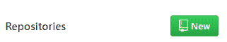
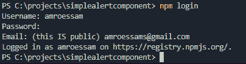
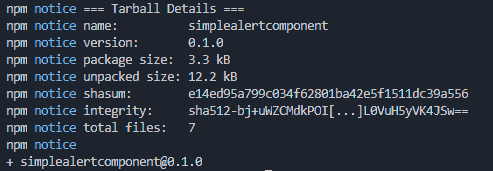

# 发布您的第一个 NPM 包(Vue) -第 2 部分

> 原文：<https://dev.to/amroessam/publish-your-first-npm-package-vue-part-2-4g6g>

又见面了，

因此，在昨天的教程中，我们将创建一个 git repo，将我们的代码推送给它，然后通过 cli 登录 npm，然后发布我们在上一篇文章中创建的包。

### 1。把代码推给 github

前往[http://github.com](http://github.com)T2【注册或登录】，然后点击新建资源库按钮

[](https://res.cloudinary.com/practicaldev/image/fetch/s---bp5gaIh--/c_limit%2Cf_auto%2Cfl_progressive%2Cq_auto%2Cw_880/https://thepracticaldev.s3.amazonaws.com/i/h597f911xohzzc7ya8cw.PNG)

填写 github 要求的所有细节，然后点击 create repository

一旦完成，我们就把代码传到 github。

但在此之前，我们将把 dist 文件夹包含在我们的`.gitignore`中，这样我们就不会把我们的构建文件夹推到 github。

打开`.gitignore`文件和下面末尾的

```
...
dist/ 
```

现在让我们推进我们的代码😎

在我们的终端中，在将目录更改到我们的项目文件夹
后，我们键入以下内容

```
git remote add origin https://github.com/amroessam/simplealertcomponent.git
git push -u origin master 
```

现在我们的代码被推送到我们的 github 库。

### 2。将包上载到 npm

我们需要做的第一件事是使用我们的终端
登录 npm

```
npm login 
```

添加您的日志详细信息

[](https://res.cloudinary.com/practicaldev/image/fetch/s--OcK5chHe--/c_limit%2Cf_auto%2Cfl_progressive%2Cq_auto%2Cw_880/https://thepracticaldev.s3.amazonaws.com/i/dzch738sl55diac81vbt.PNG)

它将确认您已登录，从这里开始，您将能够从您的终端推送至 npm

现在我们已经成功登录，让我们发布包。

```
npm publish 
```

如果一切正常，您应该会得到以下消息

[](https://res.cloudinary.com/practicaldev/image/fetch/s--q_MCTPiS--/c_limit%2Cf_auto%2Cfl_progressive%2Cq_auto%2Cw_880/https://thepracticaldev.s3.amazonaws.com/i/16uqvfnycr1htrm2egbj.PNG)

你也可以去 npm 包页面
[https://www.npmjs.com/package/simplealertcomponent](https://www.npmjs.com/package/simplealertcomponent)确认

现在，只需安装一个 npm，就可以使用这个包了。

### 3。庆祝并写一篇关于你如何发布了一个每个人都可以使用的令人敬畏的 npm 包的文章😍