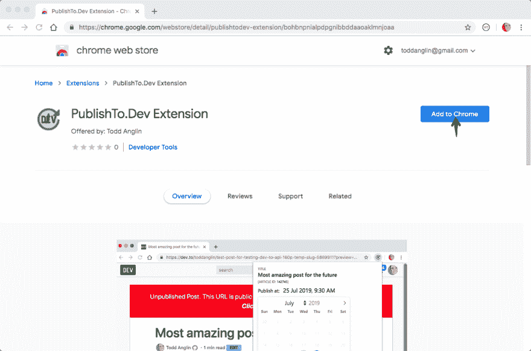
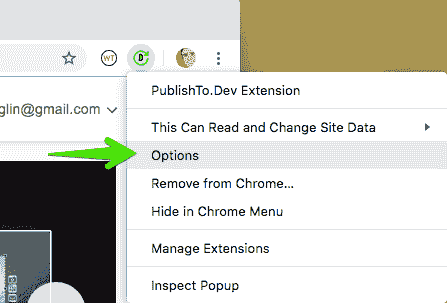
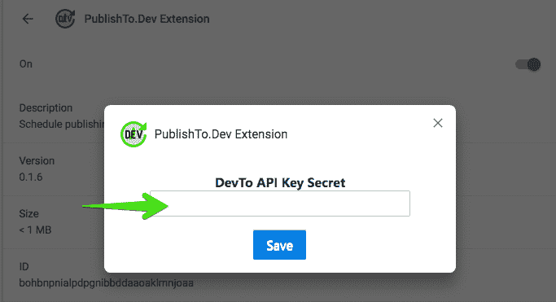
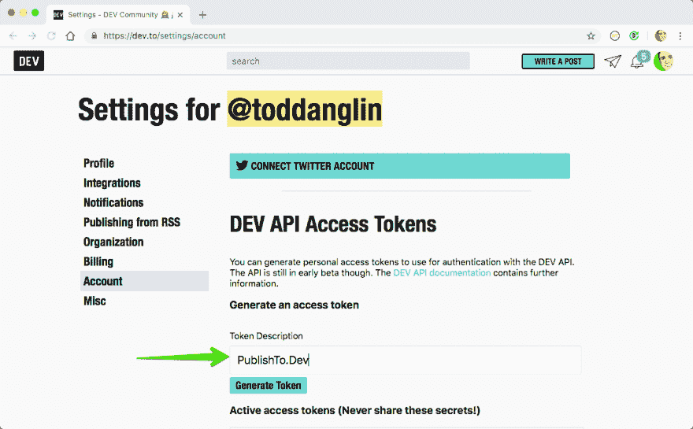
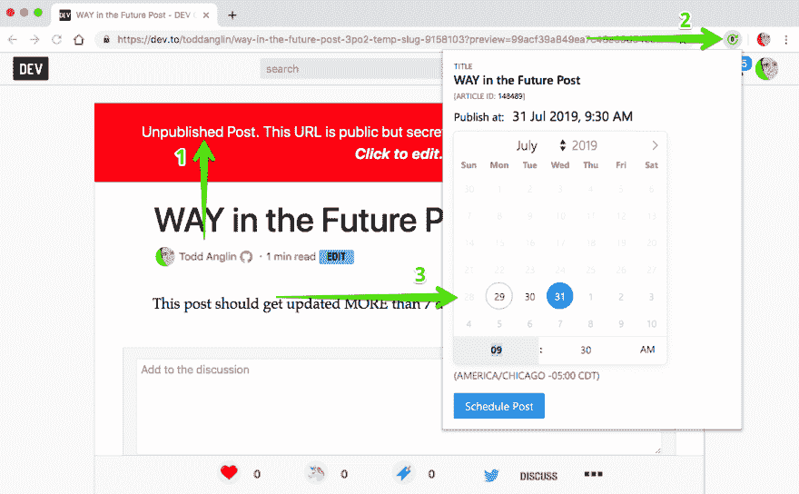
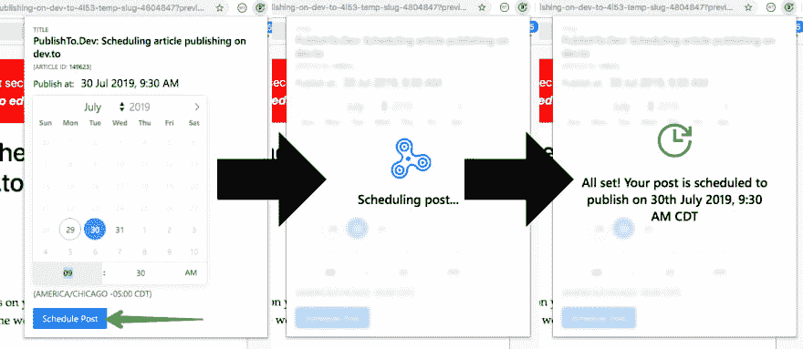
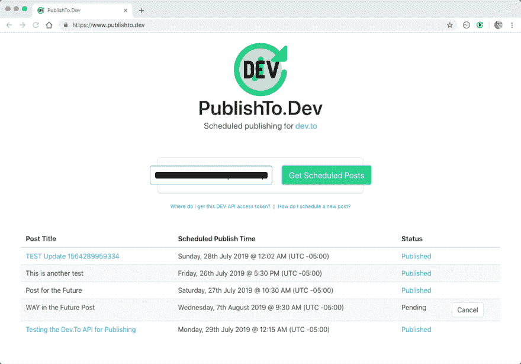
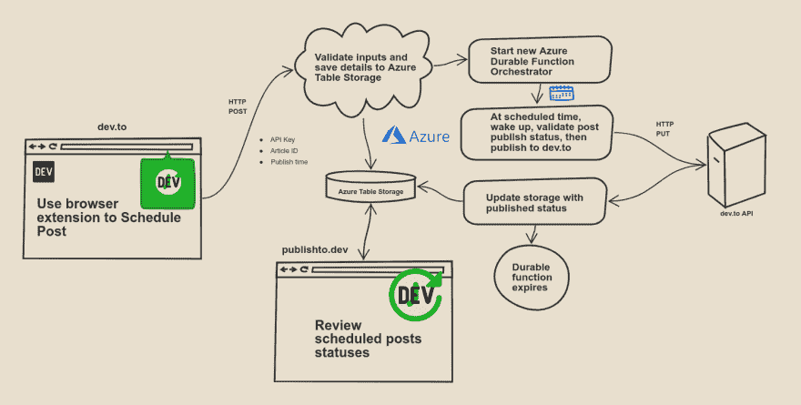

# PublishTo。Dev:在 dev.to 上安排文章发布

> 原文：<https://dev.to/toddanglin/publishto-dev-scheduling-article-publishing-on-dev-to-3m0o>

现在是晚上 11 点。

你终于完成了下一篇关于 dev.to 的大作文章。你迫不及待地想与世界分享它，并开始收集那些❤️和🦄。

您将光标移动到“发布”按钮，然后暂停...

你应该现在发表这篇文章，冒着被早上的头条新闻埋没的风险吗？你是否应该设置一个闹钟，试着记住在[正确的时刻](https://www.blogtyrant.com/best-time-to-publish-blog-articles/)返回草稿并点击“发布”？

这是一个难题，现在想这么难已经太晚了。

我有一个解决办法: [PublishTo。开发](https://www.publishto.dev)。一个简单的工具，让你选择你想要你的文章草稿上线的确切日期和时间。只要选择一个时间，安排好你的文章，然后上床睡觉，知道你的内容会在最佳时间到达。

## 什么是出版。戴夫。

其核心是出版。Dev 是 dev.to authors 的一个调度服务。它使用最近引入的 [dev.to API](https://dev.to/api) 在特定的日期和时间发布文章草稿。好吧，我让这个视频来解释。

[https://www.youtube.com/embed/8y9piBXwXts](https://www.youtube.com/embed/8y9piBXwXts)

该服务有 3 个主要组成部分:

1.  用于安排文章的[浏览器扩展](https://chrome.google.com/webstore/detail/publishtodev-extension/bohbnpnialpdpgnibbddaaoaklmnjoaa)
2.  一个 Azure 无服务器后端，处理时间安排
3.  一个[静态站点](https://www.publishto.dev)用于查看/取消预定发布

浏览器扩展可以与谷歌 Chrome 和微软 Edge Insider 兼容。该扩展可以直接从 [Chrome 网络商店](https://chrome.google.com/webstore/detail/publishtodev-extension/bohbnpnialpdpgnibbddaaoaklmnjoaa)(以及最终的微软 Edge 扩展商店)安装，或者从 [GitHub 源](https://github.com/toddanglin/PublishToDev)“解压”加载。

PublishTo。Dev 没有试图改变文章创作体验。它适用于已保存的、未发布的草稿，这些草稿已经使用现有工具进行了创作。PublishTo。Dev 专注于安排文章。

### 调度流程

让我们看看如何使用 PublishTo.Dev 安排一篇文章的草稿。

#### 设置

首先，您需要安装浏览器扩展。遵循 GitHub repo 中的说明，或者(如果你使用 Chrome)只需从商店安装[。](https://chrome.google.com/webstore/detail/publishtodev-extension/bohbnpnialpdpgnibbddaaoaklmnjoaa)

安装了扩展之后，只需一个一次性的配置步骤就可以添加惟一的 dev.to API 访问令牌。这是如何出版的。Dev 代表你出版。右键单击浏览器中的扩展图标，然后选择“选项”。或者，您也可以导航到`chrome://extensions`或`edge://extensions`进入选项页面。

这里，要求您提供 API 访问令牌。

为此，导航到 dev.to 上的[设置帐户页面](https://dev.to/settings/account)并为 PublishTo.Dev 生成一个新的令牌。

#### 调度

既然你都设置好了，让我们安排一篇文章。

导航到已保存的草稿。当你在文章顶部看到红色的“未发表”的大横幅时，你就知道你在正确的页面上了。从这里，单击浏览器扩展图标，并选择您希望文章上线的日期和时间。

**注意:**选择的发布时间必须是未来(很明显)，从现在起最多 30 天。这是一个任意的限制，将来可能会取消，但现在，文章可以提前一个月预定。选择时间时，可以在日历文本框中直接输入具体的小时或分钟。

选定日期和时间后，点按“安排发布”

如果一切顺利，您将在扩展弹出窗口中看到一条确认消息。

#### 重新安排

哎呀！你刚刚记起，周三的比周一的更适合你的内容。你如何改变你的出版时间表？

简单。只需重新查看需要重新排期的未发布稿，按照原流程进行即可。只要文章尚未发表，新的计划时间将覆盖以前的计划。

### 审核和取消排班

虽然浏览器扩展用于所有文章调度，但有一个单独的网站[可用于](https://www.publishto.dev)查看已调度文章的状态。

要使用该网站，只需输入与您的浏览器扩展配置相同的 dev.to API 访问令牌，然后单击“Get Scheduled Posts”

如果您安排了文章，它们将与以下状态指示器一起显示:

*   **已发布:**已成功发布预定文章
*   **待定:**文章等待在预定时间发布
*   **失败:**出现问题，文章没有在预定时间发表
*   **取消:**作者(您)取消了预定的发布

任何处于**待定**状态的文章，如果你不再想让它自动发布，都可以取消。只需点击该文章所在行的“取消”按钮。

如果你决定在未来重新安排一篇**被取消的**帖子，只需按照原来的安排流程，文章就会被重新安排。唯一“最终”的状态是**出版。**已发布的帖子不能使用 PublishTo.Dev 重新发布或取消发布。

## 这是怎么回事？

在幕后，PublishTo 的重担。开发是通过 Azure 持久功能实现的。持久函数非常适合处理长时间运行的异步任务，只有在等待期间需要做一些事情时才主动运行(和计费)。等待可能是几秒、几分钟、几小时、几天...或者更长*。

*(*耐用功能定时器[今天不能持续超过 7 天](https://cda.ms/111)，但是...这是一个正在被消除的限制，现在有设置更长定时器的变通方法。我将在另一篇文章中讨论这个问题。)*

以 PublishTo 为例。Dev 是一个无服务器的函数，当一篇文章最初被调度时运行，然后使用一个[持久函数定时器](https://cda.ms/10T)，“休眠”直到发布文章的时间。这消除了进行任何类型的间隔轮询来了解帖子何时需要发布的需要。

当预定的发布时间到来时，持久函数会自动唤醒并尝试使用 dev.to API 发布帖子。

持久函数适用于许多不同类型的长时间运行的异步场景。事实上，[文档强调了六种常见场景](https://cda.ms/10W)，比如链接异步函数，甚至是等待人工输入的，在这些场景中，持久函数让你的生活变得更加轻松。

在以后的文章中，我将详细介绍 PublishTo.Dev 的技术实现，敬请关注。

## 把所有的东西放在一起

从一开始，我们的目标就是提供一种简单的方法来安排后期发布。戴夫做到了。或者，对我来说是的。

让我知道你的想法。它对你有什么作用？它如何成为更有用的工具？

有一天，我完全期待 dev.to 能够支持原生的 post scheduling，并且不再需要这个工具，但是在那之前，我希望它能够帮助你改进你的发布工作流程。