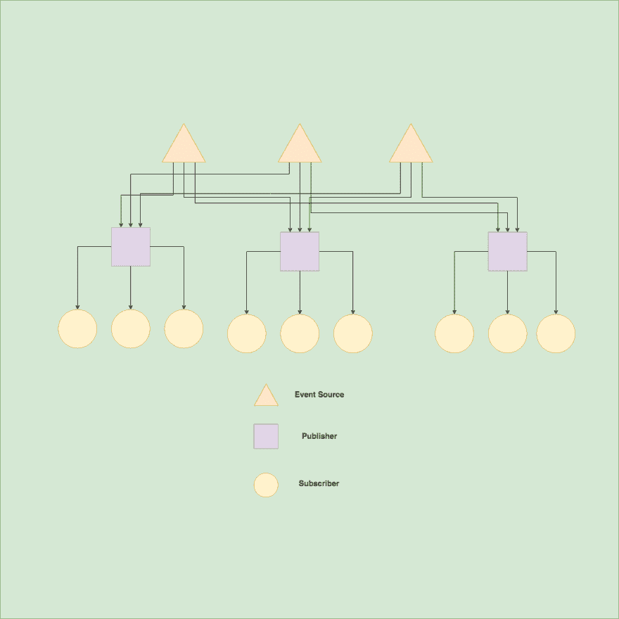

# 用 Javascript 在 5 分钟或更短时间内发布订阅

> 原文：<https://dev.to/zeeshanhyder/pubsub-with-javascript-in-5-minutes-or-less-1o6n>

## 我们开始吧

好吧，首先。我不是 10xer 或专业模式，所以如果有任何差异，请纠正我。这只会提高我和你对这个概念的理解。
有了这个小小的免责声明，让我们开始深入研究吧。

## 简介

你可能听说过这个术语 *PubSub* (特别是自从 Angular 让反应模式/事件驱动模式在前端世界出名之后)或者你可能只是偶然发现了它。无论哪种方式，如果你想知道 PubSub 是什么，这篇文章将帮助你更好地理解这个概念，以及用 VanillaJS 的基本实现(对不起，我真的喜欢简单的东西！).

## 什么是 PubSub？

发布订阅或发布者-订阅者模型是一个基本上包含两个方面的概念。*发布者*和*订阅者*。或者用很简单的话来说:**给予者**和**接受者**。这将告诉您一些关于模式中数据流的信息。是的，没错。出版商将需要提供一些数据(*让我们现在不要担心它是从哪里得到这些数据的*),订阅者可以:

*   显示，
*   操纵，
*   后处理或
*   用...施黑魔法。我不知道，这不关我的事。

那么，如果数据不仅仅是一个人/接收者所需要的呢？可能是很多人都想要的普遍的东西吧。比方说，你正沿着 666 号公路行驶，500 米处发生了车祸。666 上不太可能只有你一个人(如果是，祝你好运！)，可能很少有其他人开车。想象一下这些信息对他们所有人有多有用。对吗？现在，让我们假设在上 666 号公路之前，你们所有人都注册了这项服务，这项服务会向你们提供 666 号公路沿线发生的*事件*的最新消息，直到你们下了公路(取消订阅)。所以现在，所有签约的人都是*的订阅者*，你签约的服务提供商是你的*发行商*。注意到单词 **event** 是怎么出现的吗？信息通常是由发布者在一些“事件”(发生)之后发送的。PubSub 不是一次性的模型。通常这是一个持续的过程。无论如何，你得到了要点，对不对？我们发现了什么？

[](https://res.cloudinary.com/practicaldev/image/fetch/s--Lm_VOBeY--/c_limit%2Cf_auto%2Cfl_progressive%2Cq_auto%2Cw_880/https://thepracticaldev.s3.amazonaws.com/i/yprblc0nxdzqp78ekfbr.png)

<figcaption>PubSub Model</figcaption>

## 发现

1.  PubSub 有两端:发布者(给予者)和订阅者(接受者)。
2.  PubSub 以事件为单位进行讨论。
3.  PubSub 有一个发布者(事件的起源)和多个订阅者(事件的高潮)。
4.  PubSub 是一种持续的模式，而不是一次性的。(您超时接收事件)。
5.  您注册(订阅)接收信息，注销(取消订阅)停止接收进一步的信息。

现在让我们利用这些概念，用优秀的 ol' Javascript 创建一个基本的工作模型。
我将使用带有私有成员的 ES6 类(Javascript ES6 本身不支持`private`)。

## 代码示例

首先让我们构建发布者-订阅者模块的准系统结构。我们将采用一种基于`class`的方法，它将包含所有的 pubsub 逻辑以及任何需要的数据结构。下面的列表说明了我们需要完成什么，然后我们将建立一个准系统结构。

### 要求

1.  一些事件(假的)源来生成数据。(在现实世界中，这可能会从现实世界的事件中产生，但为了这个例子的目的，我们将伪造它)。
2.  一些持有我们的订户名单，以便我们知道我们需要发送数据给谁(数据)。
3.  以某种方式注册/注销用户(方法)。
4.  以某种方式向所有订户发送数据(逻辑)。

### 准系统

#### 数据

为了在 PubSub 模型中存储元数据，我们将使用以下变量:

1.  在现实世界中，这可能是你的 WebSockets、服务器发送的事件或任何其他实时源地址。我们将只在代码中初始化它，而不连接到实际的后端。
2.  `private subscribers`:保存我们的订户列表的对象数组。非常欢迎您找出更优的方法，但这不是本文的重点。

#### 方法

1.  `private _addSubscriber()`:将用户添加到列表中。
2.  `private _removeSubscriber()`:从列表中删除订户。
3.  `private _removeAllSubscribers()`:清除用户列表。
4.  `public subscribe()`:可供内部调用`_addSubscriber`的实例化类使用。
5.  `public unsubscribe()`:可供内部调用`_removeSubscriber`的实例化类使用。
6.  `public unsubscribeAll()`:可供内部调用`_removeAllSubscribers`的实例化类使用。

#### 逻辑

1.  `private _pushPayloadToSubscribers()`:将数据推送给所有订户。

#### 附加方法

由于我们将伪造事件源，我们需要额外的数据和方法来实现这一点。这些不是实际发布者-订阅者模型的一部分。

##### 数据

1.  `private __tick`:保存事件源(定时器)的当前参考。

##### 法

1.  `private __tickHandler()`:间隔一定时间后执行，向发布者发送数据。
2.  `public plugSource()`:插入事件源，开始馈送。
3.  `public unplugSource()`:拔掉事件源，停止进给。

好了，看起来我们已经准备好了所有的组件，现在让我们继续构建我们的 PubSub 模型。

### 实现

```
const PubSub = (function(){
    // private variables and data
    return class _PubSubInternal{
        // public methods and data
    }
})(); 
```

那是什么鬼东西？

对不起，正如我所说的，Javascript 本身不支持`private`访问器，我们必须使用这个小的变通方法在我们的类中拥有“私有”变量。我们正在做的是使用[生命](https://developer.mozilla.org/en-US/docs/Glossary/IIFE)和[闭包](https://developer.mozilla.org/en-US/docs/Web/JavaScript/Closures)。
外部函数在脚本被处理时立即执行，内部函数被调用并返回`_PubSubInternal`。
因为我们从函数内部返回`_PubSubInternal`，函数内部声明的所有变量和方法都可以被这个返回的类访问(但不能被这个类的实例化对象访问)。这就叫完结。很酷，对吧？！

> Javascript 相当牛逼！

总之，继续。

```
 const PubSub = (function(){
        // private variables and data
        let eventSourceAddress;
        let subscribers;
        let __tick;

        function __tickHandler() {
            _pushPayloadToSubscribers(new Date());
        }

        function _pushPayloadToSubscribers(payload) {
            subscribers.map(subscriber => {
                subscriber.callback(payload);
            });
        }

        function _addSubscriber(callback) {
            var id = new Date().getTime();
            subscribers.push({ id, callback });
            return id;
        }

        function _removeSubscriber(id) {
            subscribers = subscribers.filter(subscriber => subscriber.id !== id);
        }

        function _removeAllSubscribers() {
            subscribers = [];
        }

        return class _PubSubInternal{
            // public methods and data
            constructor(address) {
                eventSourceAddress = address;
                subscribers = [];
                __tick = null;
            }

            plugSource() {
                console.log("Event feed attached!");
                __tick = window.setInterval(__tickHandler.bind(this), 4000);
            }

            unplugSource() {
                window.clearInterval(__tick);
                console.log("Event feed unplugged!");
            }

            subscribe(callback) {
                return _addSubscriber(callback);
            }

            unsubscribe(id) {
                return _removeSubscriber(id);
            }

            unsubscribeAll() {
                return _removeAllSubscribers();
            }

        }
    })(); 
```

就是这样。这就完成了我们的发布者-订阅者模型的实现。

## 运行它

```
var pubSub = new PubSub(someEventSourceAddress);

// add subscribers
let subscriber1 = pubSub.subscribe( (data) => {
    console.log("Consoling from Subscriber 1");
    console.log(data);
});

let subscriber2 = pubSub.subscribe( (data) => {
    console.log("Consoling from Subscriber 2");
    console.log(data);
});

// Start fake feed
pubSub.plugSource(); 
```

我们实例化了我们的`PubSub`到`pubSub`变量，它保存了对`PubSub`对象的引用。`subscriber1`和`subscriber2`持有他们订阅的`Resource ID`(订阅 id ),可以在以后用于取消订阅。每当新数据被推送到这些订阅服务器时，就会执行回调。示例输出如下。

```
// Output

// subscriber 1 subscribed
// subscriber 2 subscribed
> Event feed attached!

// after 4 secs
> Consoling from Subscriber 1
> Sun Aug 04 2019 17:44:44 GMT-0400 (Eastern Daylight Time)

> Consoling from Subscriber 2
> Sun Aug 04 2019 17:44:44 GMT-0400 (Eastern Daylight Time)
...
... 
```

要停止订阅和订阅，只需:

```
pubSub.unsubscribe(subscriber1);
pubSub.unsubscribe(subscriber2);
// OR
pubSub.unsubscribeAll();

// Stop feed
pubSub.unplugSource(); // Event feed unplugged! 
```

就是这样，伙计们！希望你喜欢这篇文章，并学到了一些新东西:)

你可以修改 codesandbox
[https://codesandbox.io/embed/optimistic-lumiere-nzlmu](https://codesandbox.io/embed/optimistic-lumiere-nzlmu) 上的实现

祝你好运！