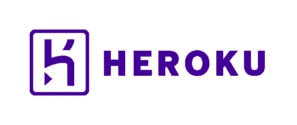

# Docker 的 Python 替代品

> 原文：<https://dev.to/mblayman/python-alternative-to-docker-343e>

将 Python 应用程序部署到服务器上出奇的困难。不眨眼，你将处理虚拟环境和其他复杂的主机。

部署方法的前景是巨大的。如果我告诉你有一种方法可以把你的应用程序构建成一个单独的文件，而它*不是一个 Docker 容器*会怎么样？

在本文中，我们将探讨部署 Python 应用程序的常用方法。我们将探索 Docker 容器被吹捧的好处，以理解为什么容器在 web 应用程序中如此受欢迎。最后，我们将看一下 Docker 的一个替代方案,它对于您的 Python web 应用程序来说可能要简单得多，并将这个替代方案与 Docker 进行比较和对比。

## App 部署 101

在互联网上部署 web 应用程序的核心目标可以用几个词来概括:

> 把你的应用程序代码放到一个服务器(机器)上，在那里它可以运行并被互联网上的人访问。

在这个陈述中，有许多对你的 web 应用的明确和隐含的需求。一些大的需求如下:

1.  你必须有一个应用程序。
2.  你必须有一台可以存储应用程序的机器。
3.  你必须有一个机制让应用程序在机器上运行。
4.  您必须有可以运行该应用程序的 web 服务器。
5.  您的计算机必须可以在 internet 上的某个域中访问。
6.  您的机器必须是安全的(基于您的业务需求的某种合理的“安全”级别)。

本文假设您已经有了一个应用程序。如果你没有，Python 有一套很棒的 web 框架来帮助你构建你想要的应用。在我看来， [Django](https://www.djangoproject.com/) 是一个很好的(如果不是最好的)起点。

#### 平台即服务侧栏

在这个阶段，如果我不强调平台即服务(PaaS)的巨大价值，我会给你造成很大的伤害。

如果你正在开发一个新的网络应用，并且上市时间对你来说非常重要，那么(*拜托！*)考虑使用 PaaS 以金钱换取时间。我并没有得到任何 PaaS 的赞助来告诉你这些，但是 PaaS(像 [Heroku](https://www.heroku.com/) 或者 [PythonAnywhere](https://www.pythonanywhere.com/) )将会为你节省大量的时间来获得更多的预付现金。

[](https://res.cloudinary.com/practicaldev/image/fetch/s--ErhD2fOJ--/c_limit%2Cf_auto%2Cfl_progressive%2Cq_auto%2Cw_880/https://thepracticaldev.s3.amazonaws.com/i/t77u53h6a2nqt4xswtk0.png)

说真的，看看这个。

由于您的时间在早期业务中非常宝贵，我建议您将 PaaS 作为部署目标。你未来的自己会感谢你，因为你能够专注于你的问题，而不是与服务器打交道。

结束边栏。

还在吗？很好。我认为这个话题仍然非常有趣，因为我们深入到内脏。

### 从 app 到服务器

一旦你创建了你的最小可行产品(MVP)应用程序，你需要能够向世界展示它。我们可以通过托管服务来访问服务器。

托管服务包括像[亚马逊网络服务(AWS)](https://aws.amazon.com/) 、[谷歌云平台(GCP)](https://cloud.google.com/) 或[微软 Azure](https://azure.microsoft.com/en-us/) 这样的大玩家。这些大公司提供大量的产品，从托管数据库到内容交付网络，再到卫星地面站控制([最后一个我不是开玩笑的！](https://aws.amazon.com/ground-station/))。代价是拥有所有这些产品需要处理大量配置选项。

其他托管服务提供虚拟专用服务器(VPS)和少量额外服务。这些服务倾向于为小型企业提供更简单的服务。这一领域的一些受欢迎的玩家有[数字海洋(DO)](https://www.digitalocean.com/) 或[利诺德](https://www.linode.com/)。

当你选择了一个托管服务，并且有了一台可以在他们的云上使用的机器之后，还有很多东西需要配置。这种配置是通过称为配置工具的软件来完成的。 [Ansible](https://www.ansible.com/) 和 [SaltStack](https://www.saltstack.com/) 是 Python 空间中常用的。

配置工具几乎可以在服务器上做任何事情。您可以使用它们来:

*   从操作系统的软件包管理器安装软件包。
*   运行负载平衡器和监控软件等流程。
*   添加 cron 作业以按计划执行任务。
*   配置 Python 应用程序。

当我们谈论进行*部署*时，我们通常指的是运行配置工具来对您的服务器基础架构进行更改。

这些工具面临的挑战是，默认情况下，它们直接在环境中执行。这意味着，如果供应工具失败并停止，您可能会使您的服务器处于一种奇怪的中间状态。

提高配置工具(以及部署)可靠性的最佳策略是**少做**。

### 你的 Python app 里有多少？

对于 Python 应用程序，您的服务器需要:

*   应用程序代码。
*   应用程序的依赖项。
*   运行应用程序的网络服务器。

看起来很简单，对吧？稍等一下。

我将概述一种方法来做到这一点，你可以看到所有涉及到的。

*   要获得应用程序代码，将您的 git 存储库克隆到服务器上。
*   要克隆存储库，需要添加一个 ssh 部署密钥来访问存储库。
*   要添加 ssh 部署密钥，请将其控制在您的配置工具可以访问的加密位置。
*   要添加应用依赖关系，请创建一个[虚拟环境](https://docs.python.org/3/library/venv.html)。
*   使用 pip 将依赖项安装到虚拟环境中。
*   如果任何包需要 C 扩展(如 lxml 或 PIL)，使用您的包管理器安装 C 开发头文件和库，如 libjpeg。
*   确保安装了编译器，这样它就可以编译扩展。
*   安装 web 服务器。
*   配置 web 服务器以使用应用程序代码。
*   如果您有像 CSS 和 JavaScript 这样的静态资产，安装构建和缩小这些静态资产所需的所有预处理器和工具链(这可能是一个巨大的任务！).

在这一系列行动中，有许多点可能会失败。我们能从部署过程中去掉这些步骤吗？

## 选项 A:码头集装箱

Docker 旨在帮助解决这个问题。Docker 的核心思想是上述步骤与生产服务器分开完成，并放在一个*容器*中。

使用一个特殊的构建过程，Docker 将把所有输出，如 Python 代码、依赖项、编译后的扩展和静态资产放入容器。

容器是这个等式中有趣的部分。**什么事？**

容器是一个叫做映像的文件，它使用特殊的文件系统结构来存储你的所有应用程序。它不是像虚拟机一样的完整操作系统。相反，Docker 守护进程(它是一个后台程序)与服务器操作系统的内核交互来运行映像。

图像本身不运行。它充当了一个 cookie cutter 模板。Docker 守护进程使用这个模板来启动一个容器*实例*。实例是将执行应用程序代码的实际运行进程。

如果这开始让你感到复杂，那么你的软件开发人员蜘蛛侠的感觉是正确的。容器是一项强大的技术，由需要扩展到大量用户负载的大型商业企业使用。

容器的好处在于，它是一个可互换的部件，具有清晰的界面，可以方便地四处移动。事实上，“集装箱”的意思是变戏法的形象，航运集装箱具有类似的属性。

容器的缺点是会给系统带来很多额外的开销。如果您在 VPS 上运行自己的基础设施，那么您必须承担管理 Docker 守护进程和其他与容器相关的部分的负担。

[](https://res.cloudinary.com/practicaldev/image/fetch/s--pyAmL2ad--/c_limit%2Cf_auto%2Cfl_progressive%2Cq_auto%2Cw_880/https://thepracticaldev.s3.amazonaws.com/i/bjmi2afy1nh5p5qftc97.jpg)

容器并不总是最合适的。

容器也给你的软件开发过程带来了开销。开发者工具越来越好，就像微软最近宣布的 [VS 代码容器支持](https://code.visualstudio.com/docs/remote/containers)，但是并不是所有的编辑器都支持这种接口。这意味着在容器中编辑和调试可能比在本地操作系统上编辑和调试流更难。

## 选项 B:捆绑 Python 应用 Shiv

如果你能把你的 Python 应用捆绑到一个单独的可执行文件中，而不是把一大块操作系统放到一个容器中，会怎么样？这正是 [Shiv](https://shiv.readthedocs.io/en/latest/) 的作用。Shiv 是来自 [LinkedIn](https://www.linkedin.com/) 的一个项目。

Shiv 使用了 Python 语言中一个更不为人知的角落，Python Zip 应用程序。Zipapps 不是 Python 中的新特性。zipapp PEP， [PEP 441](https://www.python.org/dev/peps/pep-0441/) ，于 2015 年获得批准。但是*什么是 ziapp*？

Zipapps 是一种直接从 Zip 格式的归档文件执行 Python 代码的方法。Python 将通过将文件中的任何包添加到 Python 路径来执行该文件，然后运行归档根目录下的`__main__.py`文件。这个方案的好处在于它是**一个**可执行文件。作为一个单一的文件，作为一个版本化的“构建工件”进行跟踪是很简单的

构建工件指的是某个构建过程的输出。工件通常是部署将安装在服务器上的东西。在普通的 Python 应用程序中，您可能会将您的应用程序代码视为一个构建工件，并将每个依赖项视为其自己的构建工件。一个系统拥有的工件越多，失败的几率就越高，工件之间出现不匹配的机会也就越多。

使用 Shiv 应用程序，您的所有应用程序代码和依赖项都捆绑在一起。这就产生了一个要么工作要么失败的单一单元。如果失败，**不要出货！拥有一个工件消除了不良交互进入生产系统的可能性。**

例如，让我们考虑一个更传统的 Python 应用程序。假设您的应用程序在持续集成(CI)中使用版本 2 的包 A 进行了测试。如果应用程序代码被部署到一个服务器上，可能包 A 没有更新，服务器的版本是 1。您的应用程序可能会开始失败，因为这两个不同的部分没有一起测试。

现在考虑这个场景的 Shiv 应用程序版本。Shiv 应用程序是在 CI 中构建的，它将您的应用程序代码*与版本 2 的*包 A 捆绑在一起。当测试通过时，整个单元被部署并且应该工作，因为你的应用程序代码没有机会与版本 1 中的包 A 交互。

我认为这是一个巨大的胜利！

> 通过使用单个构建工件，我们消除了部署破损代码的风险。风险从会影响客户的生产系统转移到不会影响客户的 CI 系统。

让我们看看如何开始使用 Shiv，这样您就可以获得这些好处。

## 练刀

第一步是安装 Shiv。

```
$ pip install shiv 
```

我喜欢将我所有的开发工具链工具(比如 Shiv)保存在一个`requirements-dev.txt`文件中，但是做对你有用的事情，不管这意味着使用 Pipenv 还是某种需求文件。

一旦你安装了 Shiv，你就可以使用一个`shiv`命令行工具。

在我们可以使用 Shiv 之前，我们必须对我们的应用程序做一些准备工作。Shiv 想要使用 Python 包，所以我们需要打包我们的应用程序。

### 旋风包装教程

包装是一个很大的话题，但是我会试着提供一个合理的例子。如果您想深入了解打包，请查看 [Python 打包用户指南](https://packaging.python.org/)。

要制作一个标准 Django 应用程序包，我们至少需要:

1.  一个`setup.py`文件，告诉 Python 核心元数据和代码在哪里。
2.  告诉 Python 你的数据文件(比如模板)在哪里。

免责声明:有很多处理包装的方法。如果你是包装专家，不喜欢我列出的方法，对不起。

`setup.py`文件看起来像:

```
from setuptools import find_packages, setup

setup(
    name="myapp",
    version="1.0.0"
    packages=find_packages(),
    include_package_data=True,
) 
```

有两件事值得一提:

1.  `find_packages`为你的应用程序寻找 Python 代码。
2.  `include_package_data=True`告诉`setuptools`使用`MANIFEST.in`文件获取包数据。

`MANIFEST.in`文件看起来类似于:

```
recursive-include myapp/templates * 
```

这里假设您有一个名为`myapp`的 Python 包，其中包含一个`templates`目录，该目录中有模板文件。因为使用了`recursive-include`，打包系统会将*所有的*文件包含在模板目录中，即使它们嵌套在其他目录中。

跑`python setup.py sdist`就够做一个包了！

### 使用`shiv`和你闪亮的新包裹

我们希望将应用程序和依赖关系的所有打包代码放在一个地方。这将给 Shiv 一个清晰的位置来将所有代码捆绑在一起。现在您已经有了一个包，这个过程在一个命令中就完成了。

如果在一个`requirements.txt`文件中有所有的依赖项，那么可以运行:

```
$ pip install . -r requirements.txt --target dist/ 
```

命令中的点(`.`)指示 pip 使用 install 它可以在本地找到的内容。这意味着它会找到你的`setup.py`文件并安装你的应用程序。

`-r requirements.txt`是 pip 一次性安装软件包列表的方法。这就是所有依赖项的安装方式。

但是我们要安装到哪里呢？这就是`--target`旗的作用。target 标志使 pip 将所有代码放入您选择的位置，而不是安装包通常放入的标准目录`site-packages`。

一旦所有代码都在`dist`目录中，我们就准备好构建 Shiv 应用程序了。让我们来看看执行该操作的命令。

```
shiv --site-packages dist --compressed \
    -p '/usr/bin/env python3' \
    -o myapp.pyz \
    -e myapp.main:main 
```

标志告诉 Shiv 代码的位置。`--compressed`指示 Shiv 在构建 zip 存档时使用压缩格式。

`-p`标志描述了 Shiv 在运行时应该在哪里寻找 Python。通过使用`/usr/bin/env`，我们可以告诉 Shiv 在路径上寻找它能找到的任何版本的 Python。这是一个有用的技巧，因为它可以解析到不同的路径，如`/usr/bin/python3`或`/usr/local/bin/python3`，这取决于你的操作系统如何安装 Python。这种技术可以避免在指定目标环境中不存在的 Python 路径时可能出现的细微错误。

`-o`标志是输出文件名。当我在持续集成中使用它时，我提供了一个类似于`myapp-${CIRCLECI_SHA1}.pyz`的名字，这样我就可以惟一地标识 CI 生成的版本。

最后，`-e`标志指导 Shiv 在哪里找到应用程序的入口点。在本例中，冒号前的部分是模块路径，冒号后的部分是函数名。这意味着 Shiv 会尝试执行一个位于项目的`myapp/main.py`文件中的`main`函数。

### `main`里有什么？

至此，我已经排除了你放在`main`函数里的东西？如果你运行的是 webapp，`main`应该运行 web 服务器。

对于我在 Django 上构建的辅助项目，`main`函数看起来有点像:

```
import sys
from gunicorn.app import wsgiapp

def main():
    os.environ.setdefault("DJANGO_SETTINGS_MODULE", "settings.development")
    django.setup()

    sys.argv.append("conductor.wsgi:application")
    wsgiapp.run() 
```

我的项目使用流行的 [Gunicorn](https://gunicorn.org/) web 服务器。该函数包含足够的信息，应用程序可以加载 WSGI 入口点，而无需额外的指令。结果是，我可以在没有任何附加标志的情况下启动应用程序。

```
$ ./conductor.pyz
[2019-09-17 02:50:06 +0000] [INFO] Starting gunicorn 19.9.0
[2019-09-17 02:50:06 +0000] [INFO] Listening at: http://127.0.0.1:8000 (85833)
[2019-09-17 02:50:06 +0000] [INFO] Using worker: sync
[2019-09-17 02:50:06 +0000] [INFO] Booting worker with pid: 85844 
```

这种方法有一些非常好的特性，我希望你注意到了:

1.  代码不必在虚拟环境中运行。
2.  不需要调用外部工具(即 web 服务器)。

### 挂钩成部署

有了一个功能正常的 Shiv 应用程序，您就可以将该应用程序挂接到部署中。请注意，这并不意味着取消您的部署工具。如果您在 VPS 上配置您自己的环境，那么在一个功能完整的系统中有很多部分。Shiv 应用程序没有消除这些部分，但它减少了与 Python 应用程序代码相关的任务数量。

要部署一个应用程序，你可能需要几个部分。

*   生成最新 Shiv 应用程序的地方。持续集成是您的最佳选择。
*   存储生成的 pyz 应用程序文件。为此，我使用了 AWS S3。可能的选择几乎是无穷无尽的，所以选择你最喜欢的。
*   从您的存储位置获取最新 Shiv 应用程序的部署任务。
*   从服务的进程管理器(例如 Systemd 或 Supervisord)运行 Shiv 应用程序的配置。

简而言之，这就是 Shiv 应用程序部署。我还没有描绘出完整的画面，但我希望你对如何运行单个文件 Shiv 应用程序作为更传统的 Python 应用程序部署的替代方案有足够的了解。

接下来我们来对比一下 Docker 和 Shiv。

## Docker vs Shiv

[](https://res.cloudinary.com/practicaldev/image/fetch/s--QuXC1VIu--/c_limit%2Cf_auto%2Cfl_progressive%2Cq_auto%2Cw_880/https://thepracticaldev.s3.amazonaws.com/i/gevpl2dmvqro2yxz9sbl.jpg)

是的，我知道这是你真正来这里看的。

让我们从一开始就明确一点: *Docker 和 Shiv 都是可以为您的项目工作的可靠工具。*当我们比较这些时，我并不是要抛弃其中一个。如果你能看到相同点和不同点，你就能判断哪个更适合你的项目。

首先，Docker:

*   Docker 有一个庞大的生态系统。该工具不是特定于语言的，所以广大社区投入了大量的精力。
*   Docker 囊括了许多操作系统特性和工具。如果你选择一个足够大的容器，你可以在你的 web 服务器之外运行其他命令。
*   如果你的项目不适合 Python，那么 Docker 会比 Shiv 更适合。Shiv 非常专注于服务 Python 应用程序。
*   除非非常小心，否则 Docker 图像会变得很大(图像达到 2GB 并不难)。尺寸变得累赘，尤其是如果你没有一个很好的互联网连接。
*   Docker 容器插入像 Kubernetes 这样的大型编排系统。如果您的组织需要这种级别的协调，您会知道的。

希夫呢。

*   Shiv 是为 Python 量身定制的。这一狭窄的焦点意味着您将获得一个专门用于 Python 特定需求的工具，比如将您的包捆绑在一起。
*   Shiv 应用程序很容易保持小。因为该应用是捆绑的 Python 代码，带有一个入口点，所以它没有引入额外的东西，如编译器或开发头。例如，我的副业只有 23MB。
*   Shiv 的行为完全像一个可执行文件。管理执行不需要额外的守护进程(不像 Docker 映像和容器关系)。
*   从某种意义上说，Shiv 是一个比 Docker 生态系统小得多的生态系统。没有专门关注 Shiv 应用程序的工具。从好的方面来看，Shiv 应用程序是 Python zipapps，因此 Shiv 生态系统 ***是 Python 生态系统的*** 。

### 何时到达码头

当我在一个拥有大量活动部件的大型组织中时，我会使用 Docker。这些组织有可伸缩性需求和不断发展的体系结构，如微服务模型，由于容器的可互换性，这使得容器很有吸引力。

例如，在 Kubernetes 环境中工作时，Docker 是一个非常常见的选择。容器接口已经很好地建立了。这个公共接口意味着 Kubernetes 中的管理流程可以动态地伸缩和启动新的容器实例，以应对 web 流量的增加和减少。

*重要的是*，Docker 在以下情况下工作良好:

*   专门的开发运维/SRE 团队支持基础设施*或*
*   一个托管服务，使用 AWS Fargate 之类的容器或使用 Heroku 上的 Docker。

没有资源支持容器基础设施的小型组织可能希望寻求替代架构。

### 何时伸手去拿刀

当我管理更受限的基础设施和部署 Python 应用程序时，我会使用 Shiv。Shiv 以牺牲灵活性为代价避免了容器基础设施的开销。

Shiv 在以下情况下工作良好:

*   一个团队有一个执行特定任务的 Python 应用程序，比如运行在 Gunicorn 上的 Django 应用程序。
*   一个团队希望部署到虚拟机，并希望尽可能少地就地更新这些虚拟机(即，非破坏性部署)。

明确一点，我确定 Shiv 可以在大型机构工作。记住:Shiv 来自 LinkedIn，LinkedIn 不是一个小组织。我的主要观点是，Shiv 非常适合那些试图以最小开销运营的小型组织。

## 什么适合你？

对我来说，作为一个有副业项目和运行我自己的基础设施的经验的人，Shiv 很棒。该工具帮助我清理了部署，使它们变得快速而轻松。

对你来说，可能 Docker 还是最适合的。或者，也许，Shiv 的简单性激起了你的兴趣，你准备尝试一下。

我希望这篇文章对你的概述足够了，这样你就可以打这个电话，并尝试创建你自己的 Python 可执行应用程序。

如果你有问题或者喜欢这篇文章，请随时在 Twitter 上给我发消息，地址是 [@mblayman](https://twitter.com/mblayman) ，或者如果其他人也感兴趣，请分享。

这篇文章最初发表在 mattlayman.com 的上。