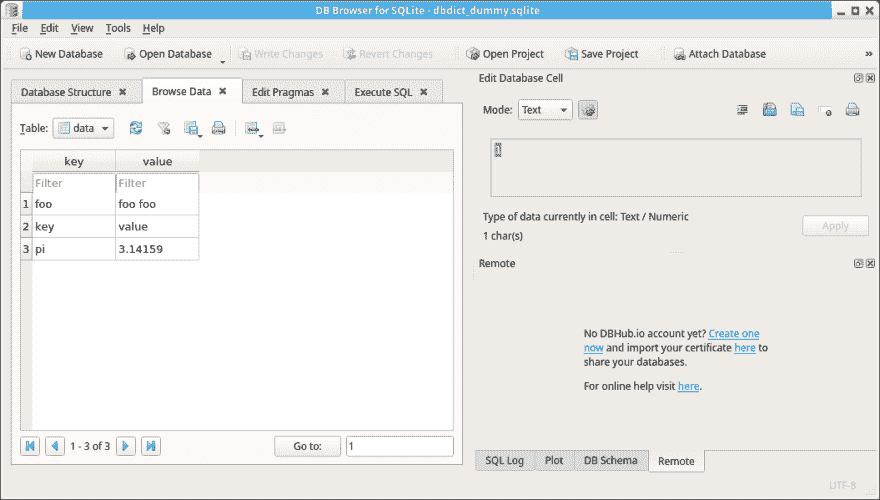

# 将类似 Python 字典的对象导入数据库

> 原文：<https://dev.to/petercour/python-dictionary-like-objects-into-database-3d25>

[](https://res.cloudinary.com/practicaldev/image/fetch/s--WjBkuKxy--/c_limit%2Cf_auto%2Cfl_progressive%2Cq_66%2Cw_880/https://i.imgur.com/eMW3zH8.gif)

字典是键、值对组。但默认情况下，它存储在内存中。这很好，直到你耗尽内存。

你可以创建像字典一样的对象，数据被立即存储到 SQLite 数据库中。

这和一般的字典有什么不同？

*   数据存储在磁盘上，而不是内存中
*   创建 sqlite 数据库文件并在其中存储数据
*   可以使用 sqlitebrowser 之类的工具来浏览字典

像这样的用法:

```
#!/usr/bin/python3
from dbdict import dbdict

d = dbdict("dummy")
d["foo"] = "bar"
d["key"] = "value"
d["pi"] = 3.14159
print(d["key"])

d["foo"] = "foo foo"
print(d["foo"])
print(d.keys())

for key in d.keys():
    print("* d[" + str(key) + "] = " + str(d[key])) 
```

然后，您可以使用任何 sqlite 浏览器程序进行探索。

[](https://res.cloudinary.com/practicaldev/image/fetch/s--04QNN17a--/c_limit%2Cf_auto%2Cfl_progressive%2Cq_auto%2Cw_880/https://raw.githubusercontent.com/petercour/sqlite-dict-for-python/master/program.png)

该类完成所有的查询、插入、表创建等工作。

因此，如果您想使用另一个数据库而不是 sqlite，您可以只更改模块(SQLite)并更改该数据库系统的查询。从理论上讲，这应该适用于任何修改过的数据库系统。

下载类:[https://github . com/Peter cour/SQLite-dict-for-python/blob/master/db dict . py](https://github.com/petercour/sqlite-dict-for-python/blob/master/dbdict.py)

学习 Python:

*   [https://pythonbasics.org](https://pythonbasics.org)
*   [https://pythonprogramminglanguage.com/](https://pythonprogramminglanguage.com/)