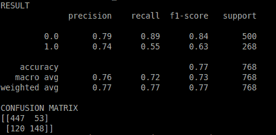

# Python 机器学习乐趣

> 原文：<https://dev.to/petercour/python-machine-learning-fun-17g4>

机器学习很棒。可以利用已经有的数据，做出各种 app。

为什么是数据？机器学习算法使用数据。没有数据，就没有机器学习。那么你能用数据做什么呢？

一个例子是做预测。如果算法被编程，就很难制造出智能机器，因为可能出现的情况比程序员的时间还多。

[](https://i.giphy.com/media/lj11uKKMhr4Os/giphy.gif)

所以你需要使用数据，训练算法。sklearn 模块是制作机器学习应用程序的常用模块。

哦天哪！做笔记

[](https://res.cloudinary.com/practicaldev/image/fetch/s--vGEkkW3I--/c_limit%2Cf_auto%2Cfl_progressive%2Cq_66%2Cw_880/https://proxy.duckduckgo.com/iu/%3Fu%3Dhttps%253A%252F%252Fmedia.giphy.com%252Fmedia%252FxkmQfH1TB0dLW%252Fgiphy.gif%26f%3D1)

### 机器学习算法

首先加载数据。假设您有 csv 格式的数据。
[皮马印第安人糖尿病数据集](https://gist.githubusercontent.com/ktisha/c21e73a1bd1700294ef790c56c8aec1f/raw/819b69b5736821ccee93d05b51de0510bea00294/pima-indians-diabetes.csv)

我买了印度糖尿病套餐。但是这个原则适用于任何数据集。加载它:

```
#!/usr/bin/python3
# load the CSV file as a numpy matrix dataset = np.loadtxt("./pima-indians-diabetes.csv", delimiter=",")

# separate the data from the target attributes X = dataset[:,0:7]
y = dataset[:,8] 
```

所以你有 X 和 y。你需要使用一个算法，使用这些数据，并作出预测

```
model = LogisticRegression()
model.fit(X, y) 
```

什么是适合？Fit 是从数据中学习的算法。好的。然后你可以做出预测:

```
expected = y
predicted = model.predict(X) 
```

因为你知道预期的和预测的，你可以测量算法的预测有多好。

[](https://res.cloudinary.com/practicaldev/image/fetch/s--xvwAbBAk--/c_limit%2Cf_auto%2Cfl_progressive%2Cq_auto%2Cw_880/https://thepracticaldev.s3.amazonaws.com/i/d2r4x2cs2dm9jv6lnuix.png)

### 运行 App

因为我们有 X 和 y，你可以看到预测器做得有多好。

```
#!/usr/bin/python3 from sklearn import metrics
from sklearn.linear_model import LogisticRegression
import numpy as np                                               

# load the CSV file as a numpy matrix dataset = np.loadtxt("./pima-indians-diabetes.csv", delimiter=",")

# separate the data from the target attributes X = dataset[:,0:7]
y = dataset[:,8]

# make predictions expected = y
predicted = model.predict(X)

# summarize the fit of the model print('RESULT')
print(metrics.classification_report(expected, predicted))
print('CONFUSION MATRIX') 
```

那很有趣！

相关链接:

*   [机器学习课程&例题](https://gumroad.com/l/MnRYU)
*   [Python 机器学习博客](https://pythonprogramminglanguage.com/python-machine-learning/)
*   [Sklearn 机器学习模块](https://scikit-learn.org/stable/index.html)
*   [为什么用 Python 进行机器学习](https://pythonbasics.org/why-python-for-machine-learning/)