# 使用诗歌和 VSCode 的 Python 项目。第二部分

> 原文：<https://dev.to/wilfredinni/python-projects-with-poetry-and-vscode-part-2-596b>

在[第一部分](https://www.pythoncheatsheet.org/blog/python-projects-with-poetry-and-vscode-part-1)中，我们学习了什么是`pyproject.toml`文件以及如何使用它，使用[诗歌](https://poetry.eustace.io/)来开始一个新项目，创建一个虚拟环境以及添加和删除依赖关系。所有这些都是通过以下命令实现的:

| 命令 | 描述 |
| --- | --- |
| `poetry new [package-name]` | 开始一个新的 Python 项目。 |
| `poetry init` | 交互式创建一个 *pyproject.toml* 文件。 |
| `poetry install` | 在 *pyproject.toml* 文件中安装软件包。 |
| `poetry add [package-name]` | 将包添加到虚拟环境中。 |
| `poetry add -D [package-name]` | 向虚拟环境添加开发包。 |
| `poetry remove [package-name]` | 从虚拟环境中删除包。 |
| `poetry remove -D [package-name]` | 从虚拟环境中删除开发包。 |

在第二部分，我们将:

*   将我们的虚拟环境添加到 [VSCode](https://code.visualstudio.com/) 中。
*   更新我们的依赖关系。
*   将我们的开发依赖项与编辑器集成:
    *   *薄片 8*
    *   *黑色*
    *   *Pytest*

在第三部分，我们将:

*   写一个样本库。
*   用*诗歌*构建我们的项目。
*   发布在 *PyPI* 上。

在我们开始之前，请确保您已经安装了 [VSCode](https://code.visualstudio.com/) ，添加了 [Python](https://marketplace.visualstudio.com/itemdetails?itemName=ms-python.python) 扩展，并且您已经遵循和/或理解了本系列的[第一部分](https://www.pythoncheatsheet.org/blog/python-projects-with-poetry-and-vscode-part-1)。

## 在 VSCode 上设置诗歌

第一部分已经过去几天了，所以检查一下我们的依赖项的新版本可能是个好主意。打开您的终端，在您的项目文件夹中导航，并键入`poetry update`命令:

[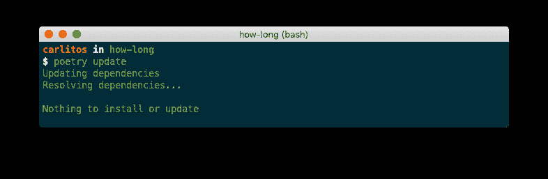](https://res.cloudinary.com/practicaldev/image/fetch/s--tcc_2Y5K--/c_limit%2Cf_auto%2Cfl_progressive%2Cq_auto%2Cw_880/https://raw.githubusercontent.com/wilfredinni/pysheetComments/master/2019/April/poetry_vscode_p2/img/update.png)

好的，到目前为止还没有新的版本。

当您使用 *venv* 命令创建一个虚拟环境时， *VSCode* 会自动将其设置为该项目的默认 Python 环境。当使用*诗歌*时，第一次我们需要在终端和项目文件夹中输入以下内容:

```
$ poetry shell
$ code . 
```

Enter fullscreen mode Exit fullscreen mode

第一个命令`poetry shell`，将在我们的虚拟环境中生成我们，`code .`将在 *VSCode* 中打开当前文件夹。

[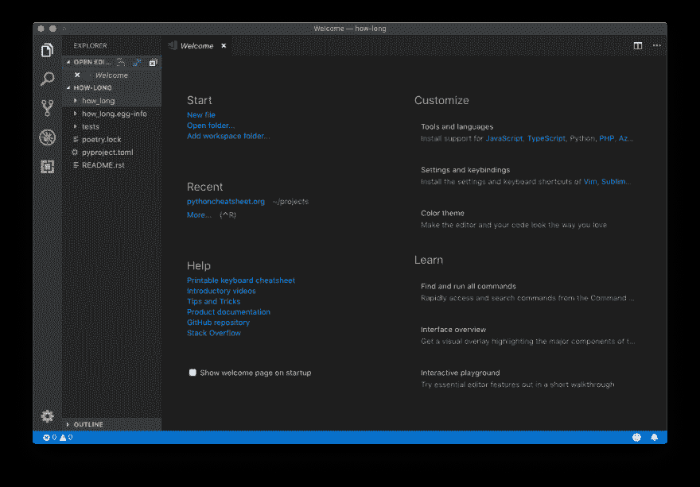](https://res.cloudinary.com/practicaldev/image/fetch/s--E6VUKPAU--/c_limit%2Cf_auto%2Cfl_progressive%2Cq_auto%2Cw_880/https://raw.githubusercontent.com/wilfredinni/pysheetComments/master/2019/April/poetry_vscode_p2/img/vscode.png)

使用左边的面板打开**多长的**文件夹(或者有你的项目名称的文件夹)，在`__init__.py`旁边，创建一个`how-long.py`文件。在左下角，您将看到当前的 Python 环境:

[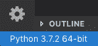](https://res.cloudinary.com/practicaldev/image/fetch/s--3zLxeUqL--/c_limit%2Cf_auto%2Cfl_progressive%2Cq_auto%2Cw_880/https://raw.githubusercontent.com/wilfredinni/pysheetComments/master/2019/April/poetry_vscode_p2/img/python-code.png)

单击它，将显示可用环境的列表。选择包含您的项目名称的名称:

[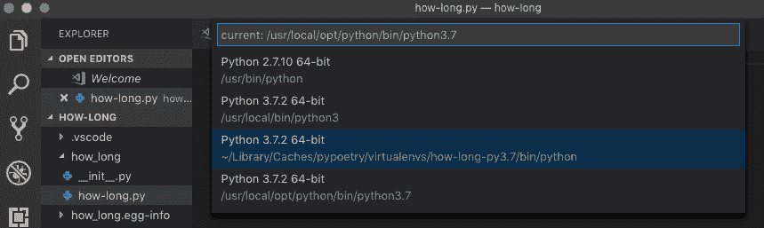](https://res.cloudinary.com/practicaldev/image/fetch/s--3cAgeESF--/c_limit%2Cf_auto%2Cfl_progressive%2Cq_auto%2Cw_880/https://raw.githubusercontent.com/wilfredinni/pysheetComments/master/2019/April/poetry_vscode_p2/img/choose-environment.png)

现在，让我们将我们的开发依赖项、 *Flake8* 、 *Black* 和 *Pytest* 集成到 Visual Studio 代码中。

## 薄片 8

Flake8 将为我们的项目提供*林挺*的能力。换句话说，语法和风格错误的警告，感谢 VSCode，我们可以在输入时知道它们。

默认情况下，Python 扩展带有启用的 *Pylint* ，这很强大，但是配置起来很复杂。要切换到 *Flake8* 对任何 Python 文件进行更改并保存，右下角会弹出一条消息:

[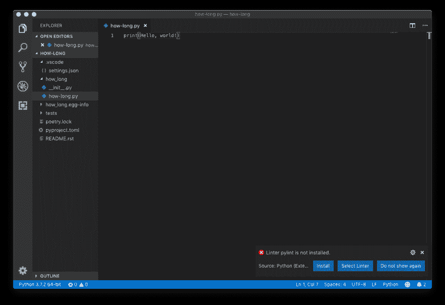](https://res.cloudinary.com/practicaldev/image/fetch/s--LYpk-PY2--/c_limit%2Cf_auto%2Cfl_progressive%2Cq_auto%2Cw_880/https://raw.githubusercontent.com/wilfredinni/pysheetComments/master/2019/April/poetry_vscode_p2/img/select-linter.png)

点击**选择棉绒**并从列表中选择**棉绒 8** 。现在， *VSCode* 会告诉我们*语法*和*风格*的问题，根据问题的严重程度显示为绿色或红色，并且总是带有对错误的详细描述:

[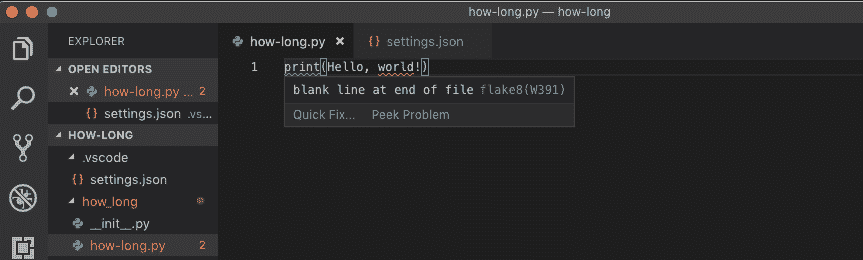](https://res.cloudinary.com/practicaldev/image/fetch/s--7V5e2wVG--/c_limit%2Cf_auto%2Cfl_progressive%2Cq_auto%2Cw_880/https://raw.githubusercontent.com/wilfredinni/pysheetComments/master/2019/April/poetry_vscode_p2/img/linting.png)

看起来我们有两个问题:我们在文件(样式)的末尾缺少了一个空行，并且忘记给我们的 *Hello，World 添加引号！*字符串(语法)。修复它们，看到所有警告消失。

## 黑色

[Black](https://github.com/ambv/black) 是一个代码格式化程序，它是一个工具，可以查看我们的代码，并根据 [PEP 8](https://www.python.org/dev/peps/pep-0008/) 风格指南自动格式化它，同样的 *PEP* 使用 *Flake8* 来处理我们的风格错误。

按住`shift + cmd/ctrl + p`打开命令面板，输入**格式文件**，回车。将出现一条新的弹出消息:

[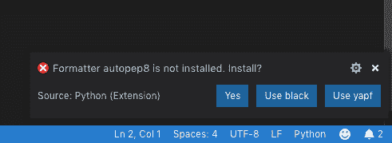](https://res.cloudinary.com/practicaldev/image/fetch/s--ewCnoMDu--/c_limit%2Cf_auto%2Cfl_progressive%2Cq_auto%2Cw_880/https://raw.githubusercontent.com/wilfredinni/pysheetComments/master/2019/April/poetry_vscode_p2/img/format-popup.png)

选择**使用黑色**。现在将这段格式不佳的代码复制到您的 python 文件中:

```
for i in range(5):         # this comment has too many spaces
      print(i)  # this line has 6 space indentation. 
```

Enter fullscreen mode Exit fullscreen mode

多丑的一块 s** *...代码。尝试重新格式化，看看*Black* 如何为您修复所有这些问题！

我们可以做的另一件事是配置 VSCode，这样每次我们保存时， *Black* 会自动格式化我们的代码。按住`cmd/ctrl + ,`打开设置。确保您处于**工作区设置**，在保存时搜索**格式并激活复选框:**

[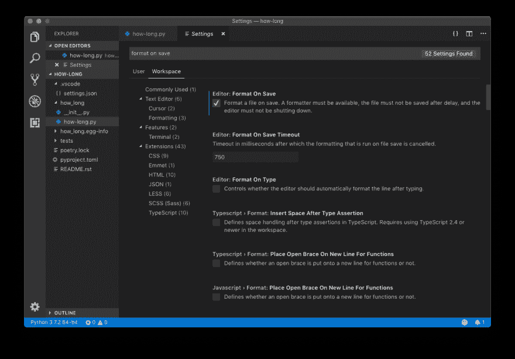](https://res.cloudinary.com/practicaldev/image/fetch/s--QYNVlksh--/c_limit%2Cf_auto%2Cfl_progressive%2Cq_auto%2Cw_880/https://raw.githubusercontent.com/wilfredinni/pysheetComments/master/2019/April/poetry_vscode_p2/img/format-on-save.png)

最后，*黑色*默认为每行 88 个字符，而*薄片 8* 允许 80 个字符，所以为了避免冲突，打开**。vscode** 文件夹，并在 **settings.json** 文件的末尾添加以下内容:

```
{  ...  "python.linting.flake8Args":  [  "--max-line-length=88"  ],  } 
```

Enter fullscreen mode Exit fullscreen mode

[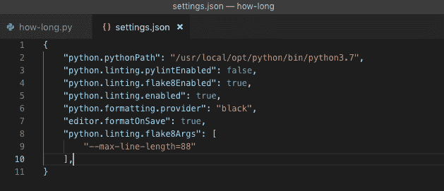](https://res.cloudinary.com/practicaldev/image/fetch/s--qo5AbTTh--/c_limit%2Cf_auto%2Cfl_progressive%2Cq_auto%2Cw_880/https://raw.githubusercontent.com/wilfredinni/pysheetComments/master/2019/April/poetry_vscode_p2/img/black-settings.png)

## Pytest

如果你对编程很认真，学习如何测试你的项目是至关重要的。这是一项非常有用的技能，通过降低发布后出现灾难性错误的可能性，它将让您满怀信心地编写和交付程序。

Pytest 是一个非常流行的用户友好的测试框架。我们[已经安装了它](https://www.pythoncheatsheet.org/blog/python-projects-with-poetry-and-vscode-part-1#Dependency-Management)，所以我们也将把它与 *VSCode* 整合。

打开**测试**文件夹，选择`test_how_long.py`文件。*诗歌*已经给了我们第一次考验:

```
# test_how_long.py from how_long import __version__

def test_version():
    assert __version__ == '0.1.0' 
```

Enter fullscreen mode Exit fullscreen mode

该测试从 **how_long** 文件夹中的`__init__.py`文件导入`__version__`变量，并断言当前版本是 *0.1.0* 。通过转到**端子>新端子**打开集成端子，并键入:

```
$ pytest 
```

Enter fullscreen mode Exit fullscreen mode

输出将如下所示:

[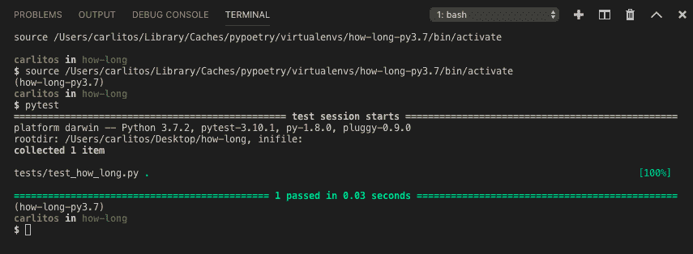](https://res.cloudinary.com/practicaldev/image/fetch/s--ZF8zRACh--/c_limit%2Cf_auto%2Cfl_progressive%2Cq_auto%2Cw_880/https://raw.githubusercontent.com/wilfredinni/pysheetComments/master/2019/April/poetry_vscode_p2/img/pytest-terminal.png)

好的，一切都很好。用`shift + cmd/ctrl + p`打开命令面板:

*   编写**单元**并选择 **Python:配置单元测试**。
*   选择 **pytest** 。
*   选择存储测试的目录，在我们的例子中是 **tests** 。

发生了三件事:

*   状态栏出现了一个新按钮:**运行测试**。这与在终端中键入 *pytest* 是一样的。按下并选择**运行所有单元测试**。完成后，它会通知您通过的测试数和未通过的测试数:

    [](https://res.cloudinary.com/practicaldev/image/fetch/s--_y7E2Z8o--/c_limit%2Cf_auto%2Cfl_progressive%2Cq_auto%2Cw_880/https://raw.githubusercontent.com/wilfredinni/pysheetComments/master/2019/April/poetry_vscode_p2/img/test-statusbar.png)

*   左侧栏中的新图标。如果你点击它，会出现一个显示所有测试的面板。在这里，您可以单独运行每一个:

    [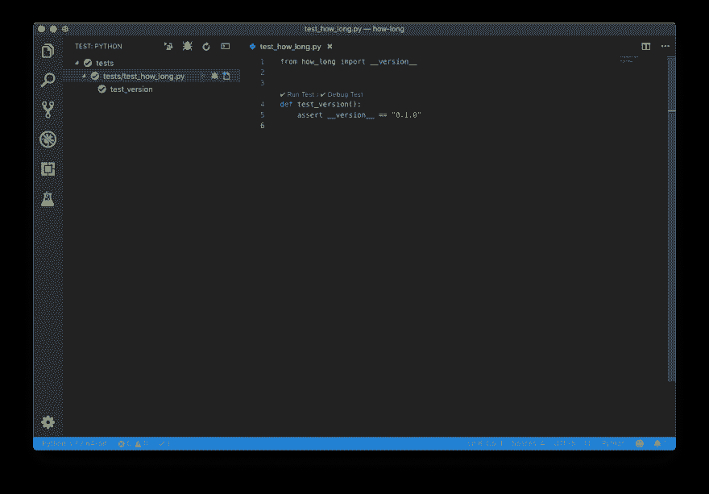](https://res.cloudinary.com/practicaldev/image/fetch/s--NFxfTpXH--/c_limit%2Cf_auto%2Cfl_progressive%2Cq_auto%2Cw_880/https://raw.githubusercontent.com/wilfredinni/pysheetComments/master/2019/April/poetry_vscode_p2/img/test-side-panel.png)

*   在测试文件中，新的选项将在每个测试函数之前显示:如果 ok，将出现一个检查图标，否则将出现一个 *x* 。它还允许您运行特定的测试:

    [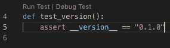](https://res.cloudinary.com/practicaldev/image/fetch/s--56ZTRUSc--/c_limit%2Cf_auto%2Cfl_progressive%2Cq_auto%2Cw_880/https://raw.githubusercontent.com/wilfredinni/pysheetComments/master/2019/April/poetry_vscode_p2/img/test-inline.png)

## 结论

到目前为止，我们已经:

*   [开始了新的项目](https://www.pythoncheatsheet.org/blog/python-projects-with-poetry-and-vscode-part-1#Starting-a-New-Project)。
*   [用*的诗*创造了一个虚拟环境](https://www.pythoncheatsheet.org/blog/python-projects-with-poetry-and-vscode-part-1#Creating-a-Virtual-Environment)。
*   [增加、删除、更新](https://www.pythoncheatsheet.org/blog/python-projects-with-poetry-and-vscode-part-1#Dependency-Management)依赖关系。
*   将我们的虚拟环境添加到 VSCode。
*   当我们键入代码时，配置 *Flake8* 为 *lint* 代码。
*   选择*黑色*作为我们项目的格式化程序。
*   和 *Pytest* 以可视化的方式运行我们的测试。

在第三个和最后一个[部分，我们将:](https://www.pythoncheatsheet.org/blog/python-projects-with-poetry-and-vscode-part-3)

*   写一个样本库。
*   用*诗歌*构建我们的项目。
*   发布在 *PyPI* 上。

就这样，祝你愉快！