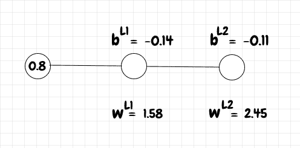

# PyTorch Hello World

> 原文：<https://dev.to/nestedsoftware/pytorch-hello-world-37mo>

我最近开始与 PyTorch 合作，这是一个用于神经网络和机器学习的 Python 框架。由于机器学习涉及处理大量数据，有时很难理解从网络上获得的结果。在进入任何更复杂的事情之前，让我们复制一个真正基本的反向传播作为健全性检查。要运行本文中的代码，您需要安装 [NumPy](https://www.numpy.org/) 和 [PyTorch](https://pytorch.org/get-started) 。

在[神经网络初级读本](https://dev.to/nestedsoftware/neural-networks-primer-374i)中，我们看到了如何手动计算由一个输入神经元、一个隐藏神经元和一个输出神经元组成的微小网络的前向和反向传播:

[](https://res.cloudinary.com/practicaldev/image/fetch/s--Rv98-LPx--/c_limit%2Cf_auto%2Cfl_progressive%2Cq_auto%2Cw_880/https://thepracticaldev.s3.amazonaws.com/i/7xbmlv7qpot4zvrioaxf.png)

我们通过网络运行了一个 *0.8* 的输入，然后使用 *1* 作为目标值进行反向传播，学习速率为 *0.1* 。我们使用 sigmoid 作为激活函数和二次成本函数来比较网络的实际输出和期望输出。

下面的代码使用 PyTorch 做同样的事情:

```
import torch
import torch.nn as nn
import torch.optim as optim

class Net(nn.Module):
    def __init__(self):
        super(Net, self).__init__()
        self.hidden_layer = nn.Linear(1, 1)
        self.hidden_layer.weight = torch.nn.Parameter(torch.tensor([[1.58]]))
        self.hidden_layer.bias = torch.nn.Parameter(torch.tensor([-0.14]))

        self.output_layer = nn.Linear(1, 1)
        self.output_layer.weight = torch.nn.Parameter(torch.tensor([[2.45]]))
        self.output_layer.bias = torch.nn.Parameter(torch.tensor([-0.11]))

    def forward(self, x):
        x = torch.sigmoid(self.hidden_layer(x))
        x = torch.sigmoid(self.output_layer(x))
        return x

net = Net()
print(f"network topology: {net}")

print(f"w_l1 = {round(net.hidden_layer.weight.item(), 4)}")
print(f"b_l1 = {round(net.hidden_layer.bias.item(), 4)}")
print(f"w_l2 = {round(net.output_layer.weight.item(), 4)}")
print(f"b_l2 = {round(net.output_layer.bias.item(), 4)}")

# run input data forward through network input_data = torch.tensor([0.8])
output = net(input_data)
print(f"a_l2 = {round(output.item(), 4)}")

# backpropagate gradient target = torch.tensor([1.])
criterion = nn.MSELoss()
loss = criterion(output, target)
net.zero_grad()
loss.backward()

# update weights and biases optimizer = optim.SGD(net.parameters(), lr=0.1)
optimizer.step()

print(f"updated_w_l1 = {round(net.hidden_layer.weight.item(), 4)}")
print(f"updated_b_l1 = {round(net.hidden_layer.bias.item(), 4)}")
print(f"updated_w_l2 = {round(net.output_layer.weight.item(), 4)}")
print(f"updated_b_l2 = {round(net.output_layer.bias.item(), 4)}")

output = net(input_data)
print(f"updated_a_l2 = {round(output.item(), 4)}") 
```

关于此代码的一些注释:

*   `nn.Linear`用于完全连接或密集的层。对于这个简单的例子，每一层都有一个输入和一个输出。
*   当我们用`output = net(input_data)`将输入传递到网络中时，就会调用`forward`方法。
*   默认情况下，PyTorch 设置随机权重和偏差。然而，在这里我们直接初始化它们，因为我们希望结果与我们的手动计算相匹配(在本文后面会显示)。
*   在 PyTorch 中，`tensor`类似于 numpy 中的`array`。
*   `criterion = nn.MSELoss()`建立二次成本函数——尽管在 PyTorch 中它被称为均方误差损失函数。
*   `loss = criterion(output, target)`计算成本，也称为损失。
*   接下来，我们使用`net.zero_grad()`将梯度重置为零(否则反向传播是累积的)。这在这里并不是绝对必要的，但是在循环中运行反向传播时，最好记住这一点。
*   `loss.backward()`计算梯度，即成本相对于所有权重和偏差的导数。
*   最后，我们使用这个梯度来更新使用`SGD`(随机梯度下降)优化器的网络中的权重和偏差，学习速率为 *0.1* 。

结果如下:

```
C:\Dev\python\pytorch>python backprop_pytorch.py
network topology: Net(
  (hidden_layer): Linear(in_features=1, out_features=1, bias=True)
  (output_layer): Linear(in_features=1, out_features=1, bias=True)
)
w_l1 = 1.58
b_l1 = -0.14
w_l2 = 2.45
b_l2 = -0.11
a_l2 = 0.8506
updated_w_l1 = 1.5814
updated_b_l1 = -0.1383
updated_w_l2 = 2.4529
updated_b_l2 = -0.1062
updated_a_l2 = 0.8515 
```

在反向传播步骤之前和之后，我们打印出网络拓扑以及权重、偏差和输出。

下面，让我们用普通的 Python 来复制这个计算。这个计算几乎和我们在神经网络初级读本中看到的一样。唯一的区别是 PyTorch 的`MSELoss`函数没有额外的除以 2 的功能，所以在下面的代码中，我调整了`dc_da_l2 = 2 * (a_l2-1)`来匹配 PyTorch 的功能:

```
import numpy as np

def sigmoid(z_value):
    return 1.0/(1.0+np.exp(-z_value))

def z(w, a, b):
    return w * a + b

def sigmoid_prime(z_value):
    return sigmoid(z_value)*(1-sigmoid(z_value))

def dc_db(z_value, dc_da):
    return sigmoid_prime(z_value) * dc_da

def dc_dw(a_prev, dc_db_value):
    return a_prev * dc_db_value

def dc_da_prev(w, dc_db_value):
    return w * dc_db_value

a_l0 = 0.8
w_l1 = 1.58
b_l1 = -0.14
print(f"w_l1 = {round(w_l1, 4)}")
print(f"b_l1 = {round(b_l1, 4)}")

z_l1 = z(w_l1, a_l0, b_l1)
a_l1 = sigmoid(z_l1)

w_l2 = 2.45
b_l2 = -0.11
print(f"w_l2 = {round(w_l2, 4)}")
print(f"b_l2 = {round(b_l2, 4)}")

z_l2 = z(w_l2, a_l1, b_l2)
a_l2 = sigmoid(z_l2)
print(f"a_l2 = {round(a_l2, 4)}")

dc_da_l2 = 2 * (a_l2-1)
dc_db_l2 = dc_db(z_l2, dc_da_l2)
dc_dw_l2 = dc_dw(a_l1, dc_db_l2)
dc_da_l1 = dc_da_prev(w_l2, dc_db_l2)

step_size = 0.1
updated_b_l2 = b_l2 - dc_db_l2 * step_size
updated_w_l2 = w_l2 - dc_dw_l2 * step_size

dc_db_l1 = dc_db(z_l1, dc_da_l1)
dc_dw_l1 = dc_dw(a_l0, dc_db_l1)

updated_b_l1 = b_l1 - dc_db_l1 * step_size
updated_w_l1 = w_l1 - dc_dw_l1 * step_size

print(f"updated_w_l1 = {round(updated_w_l1, 4)}")
print(f"updated_b_l1 = {round(updated_b_l1, 4)}")

print(f"updated_w_l2 = {round(updated_w_l2, 4)}")
print(f"updated_b_l2 = {round(updated_b_l2, 4)}")

updated_z_l1 = z(updated_w_l1, a_l0, updated_b_l1)
updated_a_l1 = sigmoid(updated_z_l1)
updated_z_l2 = z(updated_w_l2, updated_a_l1, updated_b_l2)
updated_a_l2 = sigmoid(updated_z_l2)
print(f"updated_a_l2 = {round(updated_a_l2, 4)}") 
```

结果如下:

```
C:\Dev\python\pytorch>python backprop_manual_calculation.py
w_l1 = 1.58
b_l1 = -0.14
w_l2 = 2.45
b_l2 = -0.11
a_l2 = 0.8506
updated_w_l1 = 1.5814
updated_b_l1 = -0.1383
updated_w_l2 = 2.4529
updated_b_l2 = -0.1062
updated_a_l2 = 0.8515 
```

我们可以看到结果与 PyTorch 网络的结果相匹配！在下一篇文章中，我们将使用 PyTorch 来识别 MNIST 数据库中的数字。

该代码可在 github 上获得:

##  [嵌套软件](https://github.com/nestedsoftware) / [ pytorch](https://github.com/nestedsoftware/pytorch)

### PyTorch 基本用法演示。包括使用密集以及卷积网络的 MNIST 识别。

<article class="markdown-body entry-content container-lg" itemprop="text">

这个项目包含了演示 PyTorch 基本用法的脚本。代码需要 python 3、numpy 和 pytorch。

## 手动与 PyTorch 反向投影计算

要将手动反向投影计算与等效 PyTorch 版本进行比较，请运行:

```
python backprop_manual_calculation.py
w_l1 = 1.58
b_l1 = -0.14
w_l2 = 2.45
b_l2 = -0.11
a_l2 = 0.8506
updated_w_l1 = 1.5814
updated_b_l1 = -0.1383
updated_w_l2 = 2.4529
updated_b_l2 = -0.1062
updated_a_l2 = 0.8515 
```

和

```
python backprop_pytorch.py
network topology: Net(
  (hidden_layer): Linear(in_features=1, out_features=1, bias=True)
  (output_layer): Linear(in_features=1, out_features=1, bias=True)
)
w_l1 = 1.58
b_l1 = -0.14
w_l2 = 2.45
b_l2 = -0.11
a_l2 = 0.8506
updated_w_l1 = 1.5814
updated_b_l1 = -0.1383
updated_w_l2 = 2.4529
updated_b_l2 = -0.1062
updated_a_l2 = 0.8515 
```

博文: [PyTorch Hello World](https://dev.to/nestedsoftware/pytorch-hello-world-37mo)

## MNIST 认可

接下来的例子首先使用密集的网络识别 MNIST 数字，然后是几个卷积网络设计(例子改编自 Michael Nielsen 的书《神经网络和深度学习》)。

我添加了…

</article>

[View on GitHub](https://github.com/nestedsoftware/pytorch)

## 相关

*   [神经网络初级读本](https://dev.to/nestedsoftware/neural-networks-primer-374i)