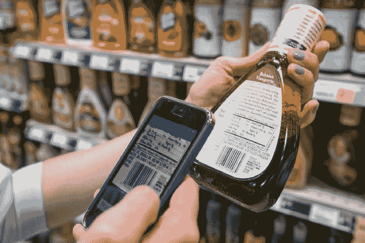
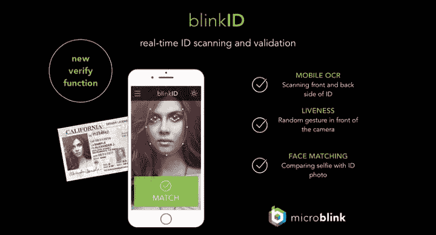
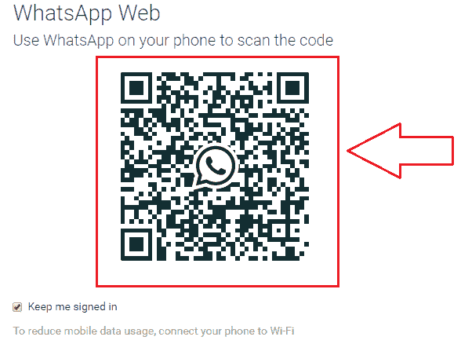
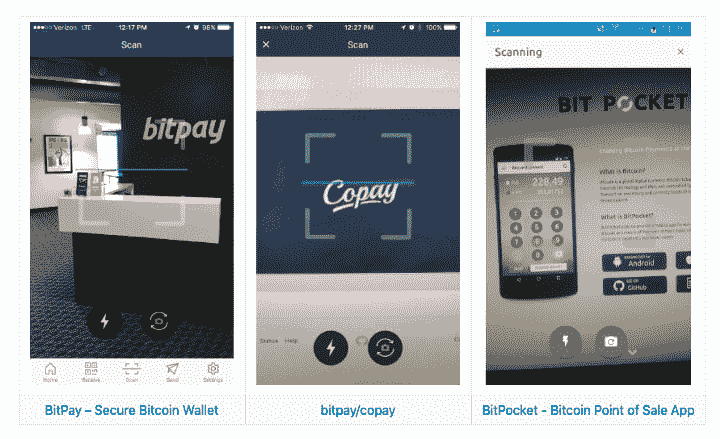
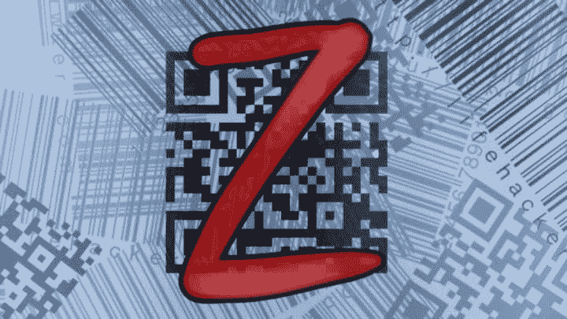

# Ionic 4 中的 QR 码、扫描和光学字符识别(OCR)

> 原文：<https://dev.to/enappd/qr-code-scanning-and-optical-character-recognition-ocr-in-ionic-4-9jl>

* * *

几乎每个智能手机用户都至少扫描过一次二维码或条形码。我们在超市扫描产品上的二维码，哦，亚马逊送货！这是一种非常方便的识别产品的方法，而不是输入 16 位长的 ID 号等。同样，如果你是一家国际酒店的老板，并且要求客人携带护照作为身份证，那么从护照上读取身份证号码会非常方便。或者你想用你的手机读出一个汽车注册号码。


以下是这些插件在 Ionic 4 应用中的一些潜在用例

*   超级市场应用程序—QR/条形码扫描仪可以向用户提供产品信息
*   交付应用程序—条形码扫描可以跟踪/签收包裹
*   快速访问优惠信息—扫描二维码并访问网页
*   移动应用程序的 Web 身份验证—类似于 Whatsapp Web
*   活动应用程序—扫描门票或活动入场券

……以及更多

所有这些现在都可以在 Ionic 应用程序中完成，Ionic 4 中有最新的插件。在本文中，我们将重点讨论这类插件。这些插件有些从 Ionic 1 开始就有了，之后一直在变，有些还是新的。这里有一些你可以用 Ionic 4 实现的扫描插件和功能。

### 1.条形码扫描器



<figure>

<figcaption class="imageCaption">A shopper scanning barcode to know more about product</figcaption>

</figure>

条形码是由一系列平行的黑白线条组成的图像，当扫描时，这些线条传递关于产品的信息。条形码用于自动将产品信息(例如价格)从产品传送到电子系统，如收银机。条形码传统上由光学设备读取，例如条形码读取器或扫描仪。新的技术进步允许消费者使用内置摄像头，用智能手机和平板电脑扫描条形码。现在你也可以用你的 Ionic 4 应用做同样的事情。

用安装插件

```
ionic cordova plugin add phonegap-plugin-barcodescanner
```

```
npm install @ionic-native/barcode-scanner
```

对于所有插件，在组件中导入插件的步骤将保持不变(只需更改插件名称)

```
import { BarcodeScanner } from '@ionic-native/barcode-scanner/ngx';
```

```
constructor(private barcodeScanner: BarcodeScanner) { }
```

在此之后，您可以简单地使用以下功能来完成扫描过程。

```
this.barcodeScanner.scan().then(barcodeData => {
 console.log('Barcode data', barcodeData);
}).catch(err => {
    console.log('Error', err);
});
```

该功能将打开手机的摄像头，允许您扫描条形码，结果将提供`success`或`error`。

也可以在`scan({options})`函数中传递一个`options`对象。这些选项是

```
preferFrontCamera : true, // iOS and Android
showFlipCameraButton : true, // iOS and Android
showTorchButton : true, // iOS and Android
torchOn: true, // Android, launch with the torch switched on (if   available)
saveHistory: true, // Android, save scan history (default false)
prompt : "Place a barcode inside the scan area", // Android
resultDisplayDuration: 500, // Android, display scanned text for X ms. 0 suppresses it entirely, default 1500
formats : "QR_CODE,PDF_417", // default: all but PDF_417 and RSS_EXPANDED
orientation : "landscape", // Android only (portrait|landscape), default unset so it rotates with the device
disableAnimations : true, // iOS
disableSuccessBeep: false // iOS and Android
```

这个插件当然需要一个摄像头和设备上的文件保存权限，所以要按照你的设备来处理。从 iOS 10 开始，必须在`Info.plist`中添加一个`NSCameraUsageDescription`。要添加这个条目，您可以像这样使用`config.xml`中的`edit-config`标签:

```
<edit-config target="NSCameraUsageDescription" file="*-Info.plist" mode="merge">
    <string>To scan barcodes</string>
</edit-config>
```

更多详情和问题，可以访问([)https://github.com/phonegap/phonegap-plugin-barcodescanner](https://github.com/phonegap/phonegap-plugin-barcodescanner)

### 2.BlinkId



<figure>

<figcaption class="imageCaption">blinkID</figcaption>

</figure>

BlinkID 使用手机或网络摄像头在几秒钟内捕捉身份证、护照、驾照、签证、工作许可证和其他身份文件的数据。BlinkID 支持所有包含 MRZ(机器可读区)的文档，包括大多数护照和身份证。还支持带有 PDF417 条形码的身份证和驾照。对于某些文档，完整的数据提取可用于文档的正面和背面。

BlinkId 是[**micro link 有限公司**](https://microblink.com) 的产品，该公司是一家研发公司，提供使用摄像头输入简化移动和网络应用程序中数据输入的解决方案。你也可以在 [Play store](https://play.google.com/store/apps/details?id=com.microblink.blinkidapp) 和 [App store](https://itunes.apple.com/us/app/blinkid-id-card-scanner-with-ocr/id1258136557?mt=8) 上下载他们的演示应用，查看可用的功能。该 SDK 是一个高级 SDK，所以免费试用将只让您访问 SDK 的某些功能。

在使用该插件之前，你需要从 MicroBlink 网站[生成一个免费许可证](https://microblink.com/login?url=/customer/generatedemolicence)。要在应用中安装插件，请使用

```
ionic cordova plugin add blinkid-cordova
```

```
npm install @ionic-native/blinkid
```

在组件中导入插件

```
import { BlinkId, RecognizerResultState } from '@ionic-native/blinkid/ngx';
```

```
constructor(private blinkId: BlinkId) { }
```

在此之后，您可以简单地使用以下功能来完成扫描过程。

```
const overlaySettings = new this.blinkId.DocumentOverlaySettings();
```

```
const usdlRecognizer = new this.blinkId.UsdlRecognizer();
const usdlSuccessFrameGrabber = new this.blinkId.SuccessFrameGrabberRecognizer(usdlRecognizer);
```

```
const barcodeRecognizer = new this.blinkId.BarcodeRecognizer();
barcodeRecognizer.scanPdf417 = true;
```

```
const recognizerCollection = new this.blinkId.RecognizerCollection([
  usdlSuccessFrameGrabber,
  barcodeRecognizer,
]);
```

```
const canceled = await this.blinkId.scanWithCamera(
  overlaySettings,
  recognizerCollection,
  { ios: IOS_LICENSE_KEY, android: ANDROID_LICENSE_KEY },
);
```

```
if (!canceled) {
  if (usdlRecognizer.result.resultState === RecognizerResultState.valid) {
    const successFrame = usdlSuccessFrameGrabber.result.successFrame;
    if (successFrame) {
      this.base64Img = `data:image/jpg;base64, ${successFrame}`;
      this.fields = usdlRecognizer.result.fields;
    }
  } else {
    this.barcodeStringData = barcodeRecognizer.result.stringData;
  }
}
```

MicroBlink 提供了一个关于 Cordova 设置的很棒的教程。

参考解释`DocumnetVerificationOverlay`和`CombinedRecognizer`实现的另一个视频

你也可以使用 BlinkID 插件来检查一个示例 **PhoneGap** 应用程序，这与 Ionic 4 应用程序非常相似——https://github.com/BlinkID/blinkid-phonegapT3

### 3.QR 扫描仪



<figure>

<figcaption class="imageCaption">WhatsApp user scans QR code on screen for Web Login</figcaption>

</figure>

看着眼熟？快速响应(QR)码是一种包含点阵的条形码。它可以使用 QR 扫描仪或内置摄像头的智能手机进行扫描。一旦被扫描，设备上的软件将代码中的点转换成数字或一串字符。例如，用手机扫描二维码可能会在手机的网络浏览器中打开一个网址。

QR 码能够包含比传统条形码更多的信息。现在你的 Ionic 4 应用程序可以非常高效地扫描二维码。

要在应用中安装插件，请使用

```
ionic cordova plugin add cordova-plugin-qrscanner
```

```
npm install @ionic-native/qr-scanner
```

在组件中导入插件

```
import { QRScanner, QRScannerStatus } from '@ionic-native/qr-scanner/ngx';
```

```
constructor(private qrScanner: QRScanner) { }
```

之后，使用以下方法获取扫描权限，然后执行扫描处理措施。

```
this.qrScanner.prepare()
  .then((status: QRScannerStatus) => {
     if (status.authorized) {
       // camera permission was granted 
```

```
 // start scanning
       let scanSub = this.qrScanner.scan().subscribe((text: string) => {
         console.log('Scanned something', text);
```

```
 this.qrScanner.hide(); // hide camera preview
         scanSub.unsubscribe(); // stop scanning
       });
```

```
 } else if (status.denied) {
       // camera permission was permanently denied
     } else {
       // permission was denied, but not permanently. You can ask for permission again at a later time.
     }
  })
  .catch((e: any) => console.log('Error is', e));
```



<figure>

<figcaption class="imageCaption">QR Scanning in Bitpay app</figcaption>

</figure>

如果相机权限被永久拒绝，您必须使用`QRScanner.openSettings()`方法将用户引导至设置页面，然后他们可以从那里授予权限。

您也可以使用`QRScanner.useFrontCamera()`来使用前置摄像头进行扫描。
相机打开时，使用`pausePreview`暂停扫描。
使用`resumePreview`恢复扫描。
使用`destroy`运行`hide`、`cancelScan`，停止视频采集，移除视频预览，并尽可能地解除分配。

更多详情可以访问[https://github.com/bitpay/cordova-plugin-qrscanner](https://github.com/bitpay/cordova-plugin-qrscanner)

### 4.ABBYY 实时识别


<figure>

<figcaption class="imageCaption">ABBYY Logo</figcaption>

</figure>

ABBYY 是内容智能解决方案和服务的全球提供商。它的实时识别 SDK 使开发人员能够将“即时”文本捕获功能添加到移动应用程序中。发票上的支付数据、身份证上的个人信息以及印刷在日常商品上用于消费竞赛的代码、街道标志或警示牌上的文本都可以立即被捕捉并在移动应用程序中使用——用户只需将相机对准文本。

要在应用中安装插件，请使用

```
ionic cordova plugin add cordova-plugin-abbyy-rtr-sdk
```

```
npm install @ionic-native/abbyy-rtr
```

在组件中导入插件

```
import { AbbyyRTR } from '@ionic-native/abbyy-rtr/ngx';
```

```
constructor(private abbyyRTR: AbbyyRTR) { }
```

您需要从[【https://rtrsdk.com/】](https://rtrsdk.com/)下载 ABBYY RTR SDK(或从 [ABBYY 销售团队](https://rtrsdk.com/contacts/)获取扩展版本)并将其添加到您的项目中:

*   在项目中创建`www/rtr_assets`子目录。
*   将 RTR SDK 资产(模式和字典)和许可文件(`AbbyyRtrSdk.license`)复制到`www/rtr_assets`。
*   将安卓库(`abbyy-rtr-sdk-1.0.aar`)复制到`libs/android`。
*   将 iOS 框架(`AbbyyRtrSDK.framework`)复制到`libs/ios`。

然后您需要将`libs/android`和`libs/ios`添加到链接器搜索路径中。

*   对于 Android，将以下设置添加到`platforms/android/build.gradle`:

```
allprojects {
  repositories {
    flatDir {
      dirs '../../../libs/android' // cordova-android >= 7
      dirs '../../libs/android' // cordova-android <= 6
    }
  }
}
```

*   对于 iOS，将以下内容添加到`platforms/ios/cordova/build.xcconfig`:

```
FRAMEWORK_SEARCH_PATHS = "../../libs/ios"
```

*   之后，使用以下方法执行扫描处理措施。

```
this.abbyyRTR.startTextCapture(options)
  .then((res: any) => console.log(res))
  .catch((error: any) => console.error(error)); 
```

```
this.abbyyRTR.startDataCapture(options)
  .then((res: any) => console.log(res))
  .catch((error: any) => console.error(error));
```

### 5.Zbar



<figure>

<figcaption class="imageCaption">Zbar</figcaption>

</figure>

ZBar 是一个开源软件套件，用于读取各种来源的条形码，如视频流、图像文件和原始强度传感器。它支持许多流行的*符号*(条形码类型)，包括 EAN-13/UPC-A、UPC-E、EAN-8、Code 128、Code 39、Interleaved 2 of 5 和 QR 码。在功能上，它或多或少与上面描述的其他扫描仪插件相同。

要在应用中安装插件，请使用

```
ionic cordova plugin add cordova-plugin-cszbar
```

```
npm install @ionic-native/zbar
```

在组件中导入插件

```
import { ZBar, ZBarOptions } from '@ionic-native/zbar/ngx';
```

```
constructor(private zbar: ZBar) { }
```

之后，使用以下方法执行扫描处理措施。

```
let options: ZBarOptions = {
      flash: 'off',
      drawSight: false
    }
```

```
this.zbar.scan(options)
   .then(result => {
      console.log(result); // Scanned code
   })
   .catch(error => {
      console.log(error); // Error message
   });
```

### 结论:

在这篇文章中，我们学习了四个伟大的插件，用于扫描不同类型的文本、代码等。给你的 Ionic 4 应用。您可以在各种应用程序中使用这些插件，使应用程序更加用户友好，处理数据更快。请继续关注 Ionic 4 上更多有趣的帖子——插件、功能和应用。

* * *

### 觉得这个帖子有意思？

还可以看看我们的其他博客文章，包括与 Ionic 4 中的[Firebase](https://medium.com/enappd/how-to-use-firebase-with-ionic-4-complete-guide-for-beginners-1888b1034024)、Ionic 4 中的[地理定位](https://medium.com/enappd/using-geolocation-and-beacon-plugins-in-ionic-4-754b41304007)、Ionic 4 中的[二维码和扫描仪](https://medium.com/enappd/qr-code-scanning-and-optical-character-recognition-ocr-in-ionic-4-95fd46be91dd)以及 Ionic 4 中的[支付网关](https://medium.com/enappd/payment-solutions-in-ionic-8c4bb28ce5cc)

也可以看看这个有趣的帖子[如何用 Phaser](https://medium.com/enappd/how-to-create-mobile-games-pwa-with-ionic4-and-phaser-7fb1e917678e) 在 Ionic 4 中创建游戏

### 需要免费离子 4 启动器？

你也可以在我们的网站[enappd.com](http://enappd.com)找到免费的离子 4 启动器

*   【Ionic 4 的免费聊天主题启动器
*   [游离离子 4 —燃烧基启动器](https://store.enappd.com/product/ionic4-firebase-starter/)

你也可以使用 [Ionic 4 完整版应用](https://store.enappd.com/product/ionic-4-full-app/)制作你的下一个精彩应用

### 参考

*   [离子文件](https://ionicframework.com/docs)

其他
[https://www.investopedia.com/terms/b/barcode.asp](https://www.investopedia.com/terms/b/barcode.asp)
[https://news . Fei nberg . northwestern . edu/WP-content/uploads/sites/15/2018/06/1-扫描-条形码-使用-app-salad . jpg](https://news.feinberg.northwestern.edu/wp-content/uploads/sites/15/2018/06/1-Scanning-barcode-using-app-salad.jpg)
[https://microblink.com/products/blinkid](https://microblink.com/products/blinkid)
[https://www . investopedia . com/terms/q/quick-response-QR-code . ASP](https://www.investopedia.com/terms/q/quick-response-qr-code.asp)

*本博客最初发表于* [*Enappd*](https://enappd.com/blog/) *。*