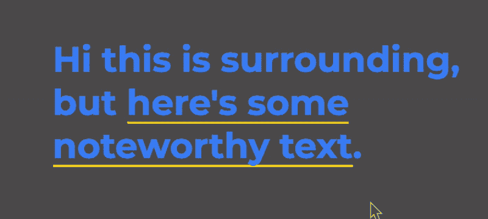

# 快速简单的文本突出显示动画

> 原文：<https://dev.to/wtaylor45/quick-and-easy-text-highlight-animation-386e>

在你的网站上突出文本是一个很好的方法来引起对关键特征或重要上下文的注意。当然，你可以默认高亮显示文本，但是如果你能做到如丝般平滑😎酷毙了😎方式？

得到一个看起来就像这样的效果是超级简单的，所以让我给你看看！

[](https://res.cloudinary.com/practicaldev/image/fetch/s--6QIawR3K--/c_limit%2Cf_auto%2Cfl_progressive%2Cq_66%2Cw_880/https://i.imgur.com/yJAj5LS.gif)

让我们从文本带下划线的初始状态开始。虽然看起来我们使用了一个`border-bottom`或者一个`text-decoration`，但是它实际上是一些背景属性。

```
span {
  background-image: linear-gradient(#ffd900, #ffd900);
  background-repeat: no-repeat;
  background-position: 0% 100%;
  background-size: 100% 2px;
} 
```

上面的代码说有一个`background-image`实际上只是纯色`#ffd900`。然而，通过使用`background-image`，我们可以将`background-repeat`设置为`no-repeat`，以完全控制背景的大小和位置。

给我们线条本身的代码是`background-size: 100% 2px`，它说背景应该填充整个宽度但高度只有 2px。为了将这一行定位在文本下面，我们使用了`background-position: 0% 100%`，它告诉背景将自己水平定位在文本的开头，但一直垂直定位在结尾。

现在，我们来谈谈突出显示的状态！我将让突出显示的状态在悬停时触发，但你可以让它以任何你想要的方式触发。为了突出显示文本，我们只需要对初始状态做一些调整:

```
span:hover {
  background-size: 100% 100%;
  background-position: 0% 0%;
} 
```

没那么糟吧！我们只是用`background-size`让背景覆盖容器 100%的宽度和高度，用`background-position`把背景的起点移到容器的顶部。

好的，太棒了！我们最初给文本加下划线，然后在悬停时高亮显示。然而，它在各州之间的突然变化令人十分不快。所以让我们来动画这个坏男孩吧！

这样做真的真的很简单。`background-position`和`background-size`都可以被动画化，这是我们想要做的关键。这意味着只需将一个`transition`应用到我们的初始和高亮状态，我们就可以达到我们想要的结果！下面是这些转换的样子:

```
span {
  transition: background-size .5s, background-position .3s ease-in .5s;
}
span:hover {
  transition: background-position .5s, background-size .3s ease-in .5s;
} 
```

悬停过渡首先将下划线带到顶部，然后将`background-size`增加到 100%。回到初始状态的转换几乎是相同的，但是我们首先收缩`background-size`,然后把下划线拉回来。为了使一个接一个地发生，我们只需要将转换延迟设置为与第一个转换相同的长度。我使用简写的`transition`属性来设置`transition-delay`以及其他几个属性。

将这几行代码组合在一起，就产生了我之前展示的流畅动画！但是，它并不一定要就此停止！您可以随意设置这些属性的动画。你可以随意触发它们。除了突出显示文本之外，您还可以将它们用于其他用途。这是一件真正为创造力留下空间的事情，我强烈建议你去尝试一下！

感谢阅读！✌️

*[在 CodePen](https://codepen.io/wtaylor45/pen/pXGbeY)* 上查看该动画的来源