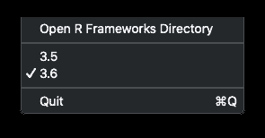

# 快速命中:一个新的 64 位 Swift 5 RSwitch 应用程序

> 原文：<https://dev.to/hrbrmstr/quick-hit-a-new-64-bit-swift-5-rswitch-app-4l62>

在 macOS 开发者页面的 [R 的底部，提到了一个叫做“RSwitch”的“其他二进制文件”，也就是*“一个小 GUI，允许你在 R 版本之间快速切换(如果你安装了多个版本的 R framework)。”*上述切换要求您使用 macOS 开发者页面上的 R 的“tar.gz”版本，因为官方的 CRAN 二进制安装程序会很好地自行清理，以防止潜在的古怪行为。](http://mac.r-project.org/)

RSwitch GUI 所做的只是将`/Library/Frameworks/R.framework/Versions`中的`Current`别名目标更改为适当的版本。你可以从命令行完成，但是 switcher GUI 的创建意味着有些人更喜欢点击切换，我发现自己有时会使用 GUI(在它在 macOS Vista^wCatalina).上停止工作之前)

因为我:

*   大部分时间在卡塔利娜工作
*   使用 R 的 oldrel 和 devel 版本
*   需要温习 Swift 5 编码
*   我希望 RSwitch 是一个菜单栏应用程序，而不是一个带有对话框的应用程序，我很容易在 15 个桌面上丢失它
*   决定看看是否有可能让它在沙盒中工作(TLDR:这是不可能的)
*   我真的想要一个不同的二进制图标
*   昨晚睡不着

有足够的理由创建这个应用程序的 64 位版本。

您可以从以下任何社交编码网站克隆该项目:

*   [Gitea](https://git.rud.is/hrbrmstr/RSwitch) (自托管)
*   [来源帽子](https://git.sr.ht/~hrbrmstr/RSwitch)
*   [GitLab](https://gitlab.com/hrbrmstr/RSwitch)
*   [BitBucket](https://bitbucket.com/hrbrmstr/RSwitch)
*   [GitHub](https://github.com/hrbrmstr/)

而且，你可以自己编译它——这是推荐的，因为现在是 2019 年，甚至远程信任互联网上的二进制文件的日子都已经过去了——或者构建它。既然我把 10.14+定为目标，那么*应该在 10.14+上工作，但是如果你有问题，那么*用代码或二进制文件发布*。*

一旦你真的让它工作了，菜单栏中就会出现一个拨号开关菜单，菜单看起来应该是这样的:

带复选框的项目是`Current`别名。

### 鳍

踢轮胎，文件问题和公关，因为你习惯于这样做，并准备为即将到来的点击启示，因为苹果公司接近其 GA 发布的卡特琳娜。