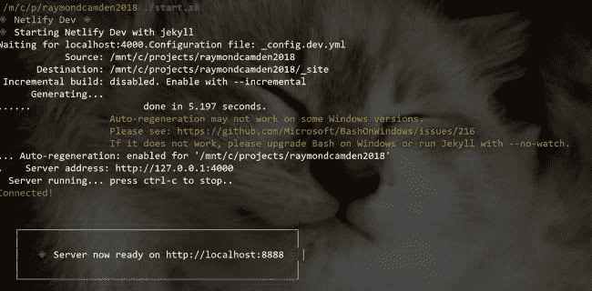

# 复杂静态站点的快速网络开发技巧

> 原文：<https://dev.to/raymondcamden/quick-netlify-dev-tip-for-complex-static-sites-1pai>

嘿，大家好，这篇技巧可能只有非常有限的观众，但对我来说这是一件大事，所以我想与他人分享，以防他们遇到同样的问题。如果你不知道的话， [Netlify Dev](https://dev.to/scottw/netlify-dev-3je3-temp-slug-5267792) 是一种在本地运行 Netlify 平台的方法。这意味着像重定向、函数等特性将在本地工作。

作为一个实际的例子，我经常使用重定向功能，因为我的网站多年来经历了不同的引擎和域。能够在本地快速测试这种支持真是太棒了。

然而，我的网站遇到了一个有趣的问题。这个博客有超过六千个条目。一个完整的构建需要十分钟多一点。所以当我在本地工作时，我使用一个不同的配置文件来修改`exclude`参数:

```
exclude: [_posts/2003,_posts/2004,_posts/2005,_posts/2006,_posts/2007,_posts/2008,_posts/2009,_posts/2010,_posts/2011,_posts/2012,_posts/2013,_posts/2014,_posts/2015,_posts/2016,_posts/2017,_posts/2018/01,_posts/2018/02,_posts/2018/03,_posts/2018/04,node_modules] 
```

我还编写了一个名为`start.sh`的快速 shell 脚本，以便更容易地使用这个配置:

```
#!/bin/bash
bundle exec jekyll serve --config _config.dev.yml 
```

顺便提一下，`jekyll` CLI 确实支持“仅呈现最后 N 篇文章”选项，但是我发现在之后的*中，我使用了`exclude`功能。像大多数事情一样，解决问题的方法不止一种。*

这种不同的配置将我的典型构建时间缩短到大约五秒钟，这已经足够快了。

太棒了。

[](https://res.cloudinary.com/practicaldev/image/fetch/s--MZR64Zks--/c_limit%2Cf_auto%2Cfl_progressive%2Cq_auto%2Cw_880/https://static.raymondcamden.cimg/2019/07/happycat.jpg)

不幸的是，当我开始使用 Netlify Dev 时，我立即发现我的构建花费了通常的、非常长的时间。我对它有点满意，因为它让我对我的重定向进行测试，但它显然不够理想。

所以我当然去了论坛，[贴出了](https://community.netlify.com/t/configure-jekyll-config-with-netlify-dev/2038/4)一个关于这个的问题。

因为我张贴了一个问题，我当然在大约一分钟后发现了如何做。

原来 CLI 支持一种绕过 Dev 使用的正常启动命令的方法。就像传递`-c`和你需要的命令一样简单。这是我在博客中使用的:

```
netlify dev -c "bundle exec jekyll serve --config _config.dev.yml" 
```

我修改了我的`start.sh`来使用它，我准备好了。在本地运行 Jekyll 和 Netlify Dev。

[](https://res.cloudinary.com/practicaldev/image/fetch/s--rf96hc6d--/c_limit%2Cf_auto%2Cfl_progressive%2Cq_auto%2Cw_880/https://static.raymondcamden.cimg/2019/07/nd1.jpg)

*由[萨姆·张丹](https://unsplash.com/@sam_truong?utm_source=unsplash&utm_medium=referral&utm_content=creditCopyText)在 Unsplash 上拍摄的标题照片*