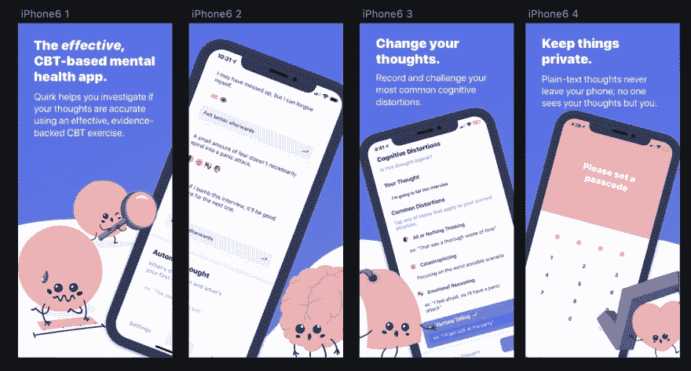

# 开源认知行为疗法

> 原文：<https://dev.to/flaque/quirk-open-source-cognitive-behavioral-therapy-l2o>

我在开发 Quirk，[一款面向 iOS 和 Android 的开源](https://github.com/flaque/quirk)认知行为治疗应用。Quirk 最初是一个小型命令行工具，我用它来帮助我自己的恐慌症发作，并最终发展成为一家公司。

最初，我的目标只是停止恐慌症发作(在我一生中的大部分时间里，我每周都会发作几次)。我真的不再发作了，至少不像以前那样了。CBT 和 Quirk 特别帮我克服了。

当 Quirk 开始帮助其他人克服困难时，目标变得更大了。今天，Quirk 的任务是创建可访问的、按需的 CBT。我们想降低获得帮助的难度，让大多数人都能从 CBT 中受益。

想象一下，如果每次你想吃得更健康，你都去看营养学家。很可能只有当情况变得非常糟糕时，人们才会去看营养学家；没有人会在更早的时候养成更健康的习惯。这就是今天精神健康治疗的基本方式。基于证据的、真正的解决方案只适用于最严重的病例，因为只有最严重的病例才会千方百计去看治疗师。另外，抑郁(和某些形式的焦虑)会让你不太可能采取措施来帮助自己；它耗尽你的精力，让你相信没有什么能真正起作用。更糟糕的是，一些想要获得精神健康资源的人负担不起，或者由于结构性不平等而无法获得。即使人们愿意并且能够负担得起，也没有足够的心理健康专业人员来治疗数量庞大的心理健康障碍患者(1/4)。

许多公司试图通过“缩放”治疗师来解决这个问题。也许他们建立软件让治疗师看更多的人，或者他们做某种形式的远程医疗。我们祝他们好运；我们要衡量人们。或者更确切地说，我们将帮助人们更早地控制他们的心理健康，在他们出现严重状况之前。

为了做到这一点，我们正在利用 CBT 的锻炼和基于目标的性质。如果你以前从未看过治疗师；类比理疗师最容易理解。在理疗师的帮助下，你的临床医生会给你安排一些练习，这些练习在你的恢复过程中占很大一部分。CBT 挺像的；这很大程度上依赖于你在治疗师办公室之外所做的事情。

Quirk 基本上是建立这些练习，但对于那些可能从来没有看过治疗师的人来说。这是一个 50%的解决方案。你可以和你现有的临床医生一起使用它，但是如果你没有见任何人，这比什么都不做要好得多。如果你认为“哦，我真的没有什么严重的问题，我不认为我真的需要看医生，”Quirk 是一个便宜而简单的“婴儿步骤”，你可以采取。

大多数人可以从社区康复中受益；我遇到的许多人都很惊讶地看到它对他们的帮助有多大，即使他们没有任何诊断出的障碍。

如果你正在处理冒名顶替综合症、面试焦虑或对老板或团队的不满，你可能会发现怪癖很有用。CBT 可以帮助你做出更好的决定，更有同理心，总体上感觉更快乐。

有一天 CBT 会像慢跑一样普遍。如果是的话，我的恐慌症就不会像他们那样严重了。如果是的话，我们可以大大减少精神健康的耻辱。如果是的话，普通人会更快乐。

如果你想支持 Quirk，[去产品搜索上看看吧。](https://www.producthunt.com/posts/quirk-2-0)我们今天发布新版本，这是一款完全重新设计的应用程序，重点关注隐私和个人证据构建。