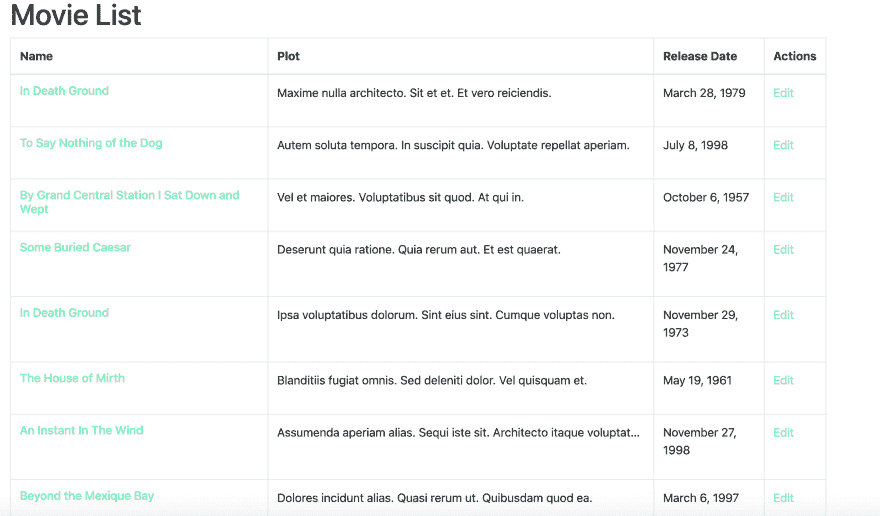

# 内置前端的 Rails API，第四部分。

> 原文：<https://dev.to/jean182/rails-api-with-a-frontend-built-in-react-part-iv-217e>

在本系列的这一部分中，我们将连接前端和我们的 API，
概括上一章，我们允许我们的 API 接收来自任何来源的请求，这将允许我们在端口 3001 运行前端，同时在端口 3000 运行我们的 API。

现在让我们开始创建一个文件夹来存储我们的组件。

```
$ mkdir src/components
$ mkdir src/components/pages
$ mkdir src/components/partials 
```

Enter fullscreen mode Exit fullscreen mode

为了创建我们的电影可视化，我们需要添加 react 路由器来链接我们的组件，并避免在不需要的时候重新渲染。

```
yarn add react-router-dom 
```

Enter fullscreen mode Exit fullscreen mode

我们将创建一个文件来声明我们的路由。

```
touch src/AppRouter.js 
```

Enter fullscreen mode Exit fullscreen mode

在该文件中，我们将添加以下内容:

```
import React from "react"
import { Route, Switch } from "react-router-dom"
import HomePage from "./components/pages/HomePage"
import MoviePage from "./components/pages/MoviePage"

const AppRouter = () => {
  return (
    <div>
      <Switch>
        <Route exact path="/" component={HomePage} />
        <Route exact path="/movies" component={MoviePage} />
      </Switch>
    </div>
  )
}

export default AppRouter 
```

Enter fullscreen mode Exit fullscreen mode

请注意，我们使用了 react-router-dom 中的两个组件，并且定义了我们的根路由，但是我们还没有这样的组件，所以让我们快速做一个

```
touch src/components/pages/HomePage.js 
```

Enter fullscreen mode Exit fullscreen mode

让我们把它添加到我们的主页:

```
import React from "react"

const HomePage = () => {
  return (
    <div>
      <div className="jumbotron jumbotron-fluid">
        <div className="container">
          <h1 className="display-4">Movie App</h1>
          <p className="lead">This is an App to display and create movies</p>
        </div>
      </div>
    </div>
  )
}

export default HomePage 
```

Enter fullscreen mode Exit fullscreen mode

我们需要将我们现有的更改与我们的 App.js 文件集成在一起，因此我们必须在我们的`App.js` :
中执行以下操作

```
// Rest of the imports
import { BrowserRouter as Router } from "react-router-dom";
import AppRouter from "./AppRouter"

const store = setupStore()

function App() {
  return (
    <Provider store={store}>
      <Router>
        <AppRouter />
      </Router>
    </Provider>
  )
}

export default App 
```

Enter fullscreen mode Exit fullscreen mode

现在代码应该不会编译(因为我们还没有创建 MoviePage)，不要惊慌，让我们创建一个负责显示电影列表的组件。

```
$ touch src/components/pages/MoviePage.js 
```

Enter fullscreen mode Exit fullscreen mode

这个组件将是一个包含我们数据库中所有可用电影的表。它将对我们的端点执行 get 请求，以检索所有可用的电影，并在表中显示它们。

我们将创建基本结构，但首先我们需要添加 react bootstrap，以便在 bootstrap 中使用 JS 功能。

让我们编辑我们的`MoviePage.js`并在该组件中添加一个表，我们可以在 react-bootstrap 中使用[表](https://react-bootstrap.github.io/components/table/)组件，但这没有多大意义，因为我们可以自己完成。

```
import React, { Component } from "react"

class MoviePage extends Component {
  render() {
    return (
      <div className="container">
        <h1>Movie List</h1>
        <table className="table">
          <thead>
            <tr>
              <th scope="col">Name</th>
              <th scope="col">Plot</th>
              <th>Release Date</th>
              <th scope="col">Actions</th>
            </tr>
          </thead>
          <tbody>
            <tr>
              <th scope="row">Movie 1</th>
              <td>This is the movie description</td>
              <td>This is the relase date</td>
              <td>My action</td>
            </tr>
          </tbody>
        </table>
      </div>
    )
  }
}

export default MoviePage 
```

Enter fullscreen mode Exit fullscreen mode

现在，如果我们转到本地服务器，添加根 url /movies，我们应该会看到我们刚刚创建的表。这是暂时的，因为我们需要将提取物分成小的成分。

我们需要添加一个电影缩小，这将包含一个电影数组，它将添加，删除和编辑电影。让我们创建文件

```
touch src/redux/modules/movie.js 
```

Enter fullscreen mode Exit fullscreen mode

让我们编辑这个文件，我们正在重新创建我们的虚拟模块，它将是相同的结构，但它将包含更多的行动。

```
import { all, put, call, takeLatest } from "redux-saga/effects"
import { handleActions, createAction } from "redux-actions"

// Actions
export const FETCH_MOVIES = "movie-frontend/movie/FETCH_MOVIES"
export const FETCH_MOVIES_SUCCEEDED =
  "movie-frontend/movie/FETCH_MOVIES_SUCCEEDED"
export const FETCH_MOVIES_FAILED = "movie-frontend/movie/FETCH_MOVIES_FAILED" 
```

Enter fullscreen mode Exit fullscreen mode

在我们的电影模块的这个摘录中，我们定义了 3 个模块来获取电影列表，如果你熟悉 rails，上面的动作将负责处理对我们的 API 的 get 请求，以获取我们数据库中所有现有的电影，我们有第一个动作将触发请求，其他动作用于处理响应，这可能成功也可能失败。

现在，我们必须定义我们的初始状态，在这种情况下，我们将有一个电影数组，默认情况下是一个空数组，一个布尔值，如果请求完成，它将改变，以及一个错误变量，如果有错误，它将显示错误。

```
// Rest of the code

// Initial State
export const getInitialState = () => {
  return {
    fetching: false,
    movies: [],
    error: null,
  }
} 
```

Enter fullscreen mode Exit fullscreen mode

现在我们需要 reducer，把 reducer 想象成我们的状态应该在给定的动作下发生变化的方式，例如当我们执行`FETCH_MOVIES`动作时，我们应该改变我们现有的电影状态，因为这个动作意味着我们正在执行 get 请求，所以获取布尔值应该切换到 true，错误应该保持它们的 null 值，我们的电影数组也应该是空的，因为我们还没有收到来自服务器的响应。记住这一点很重要，因为第一次使用时，异径管可能会很复杂。

```
// Rest of the code

// Reducer

const movieReducer = handleActions(
  {
    [FETCH_MOVIES]: state => {
      return {
        ...state,
        fetching: true,
        error: null,
      }
    },
    [FETCH_MOVIES_SUCCEEDED]: (state, action) => {
      const { data } = action.payload
      return {
        ...state,
        fetching: false,
        movies: data,
      }
    },
    [FETCH_MOVIES_FAILED]: (state, action) => {
      const message = action.payload
      return {
        ...state,
        fetching: false,
        error: message,
      }
    },
  },
  getInitialState()
)

export default movieReducer 
```

Enter fullscreen mode Exit fullscreen mode

请注意初始状态是如何通过操作发生变化的，以及定义错误和成功操作如何帮助我们以更好的方式处理请求。让我们创建动作创建者(他们将负责分派或触发动作)。

```
// Rest of the code

// Action Creators
export default movieReducer

export const requestMoviesFetch = createAction(FETCH_MOVIES)

export const succeededMoviesFetch = createAction(FETCH_MOVIES_SUCCEEDED)

export const failedMoviesFetch = createAction(FETCH_MOVIES_FAILED) 
```

Enter fullscreen mode Exit fullscreen mode

最后但同样重要的是，我们需要使用 redux-saga 来处理副作用(在这种情况下是 get 请求)，redux saga 充当中间件，因此当一个动作被调度时，saga 也会被触发。我们需要定义它，并创建一个生成器函数来执行这个流。

```
// Rest of the code
// Sagas
export function* fetchMoviesSaga() {
  try {
    const payload = yield call(fetchMoviesData)
    yield put(succeededMoviesFetch(payload))
  } catch (error) {
    yield put(failedMoviesFetch(error.message))
  }
}

// Main Saga
export function* movieSaga() {
  yield all([takeLatest(FETCH_MOVIES, fetchMoviesSaga)])
} 
```

Enter fullscreen mode Exit fullscreen mode

我们的 fetchMoviesSaga 是一个执行 get 请求的生成器函数，该函数在我们调度`requestMoviesFetch`动作创建器时被触发，我们尝试使用 redux Saga 中的[调用](https://redux-saga.js.org/docs/api/#callfn-args)效果来调用我们的 api，我们正在使用一个我们还没有创建的函数`fetchMoviesData`，并且给定该调用的结果，我们将在我们的 saga 中调度`succeededMoviesFetch`或`failedMoviesFetch`。听起来很简单，那么最后一个函数 movieSaga 是给定资源的所有传奇的包装器，我们将在创建新传奇时更新它。

我们还没有调用，所以让我们创建它:

```
$ touch src/api/movie.js 
```

Enter fullscreen mode Exit fullscreen mode

让我们编辑该文件，请记住，在本系列的上一篇文章中，我们使用 React 创建了一个名为 api.js 的文件，我们将在该文件中导出 axios 实例。

```
import API from "./api"

export const fetchMoviesData = () => {
  return API.get("/movies/")
} 
```

Enter fullscreen mode Exit fullscreen mode

这里我们指向我们的 rails route 电影，它应该返回整个电影数组。没有必要使用完整的 url，因为它已经在 api.js 文件中定义了。所以一切都差不多设置好了，来修改我们的前端，但是首先我们要添加一些东西

```
/* src/redux/modules/movie.js */

// Don't forget to add this import
import { fetchMoviesData } from "../../api/movie"

/* src/redux/modules/rootReducer.js */
import { combineReducers } from "redux"

import dummy from "./modules/dummy"
import movie from "./modules/movie"

const rootReducer = combineReducers({
  dummy,
  movie,
})

export default rootReducer

/* src/redux/modules/rootSaga.js */

import { all } from "redux-saga/effects"
import { dummySaga } from "./modules/dummy"
import { movieSaga } from "./modules/movie"

export default function* rootSaga() {
  yield all([dummySaga(), movieSaga()])
} 
```

Enter fullscreen mode Exit fullscreen mode

我们刚刚把我们的新电影添加到我们的 rootReducer 中，把我们的新传奇添加到我们的 rootSaga 中，另外我们在电影模块中添加了缺失的导入。

我们已经设置好了一切，现在我们需要在端口 3000 运行 rails 服务器，然后我们可以在您想要的端口运行 React 项目，但是 rails 端口应该是 3000，因为这是我们在 axios 实例中指定的端口。有了这个设置，让我们稍微编辑一下我们的电影页面。

```
mkdir src/components/partials/movie
touch src/components/partials/movie/MovieList.js
touch src/components/partials/movie/MovieListItem.js 
```

Enter fullscreen mode Exit fullscreen mode

我们试图让一切变得更小，所以我们将打破我们的 MoviePage 组件，它将使用我们刚刚创建的文件，但首先我们要编辑这些文件。

```
/* MoviePage.js */
import React from "react"
import MovieList from "../partials/movie/MovieList"

const MoviePage = () => (
  <div className="container">
    <h1>Movie List</h1>
    <MovieList />
  </div>
)

export default MoviePage 
```

Enter fullscreen mode Exit fullscreen mode

然后我们将编辑我们的`MovieList`

```
/* MovieList.js */
import React, { Component } from "react"
import { connect } from "react-redux"
import { bindActionCreators } from "redux"
import { requestMoviesFetch } from "../../../redux/modules/movie"
import MovieListItem from "./MovieListItem"

class MovieList extends Component {
  componentDidMount() {
    const { requestMoviesFetch } = this.props
    requestMoviesFetch()
  }

  render() {
    const { data } = this.props
    const { movies, fetching, error } = data
    return (
      <div>
        {fetching ? (
          <div className="d-flex align-items-center">
            <strong>Loading...</strong>
            <div
              className="spinner-border ml-auto"
              role="status"
              aria-hidden="true"
            />
          </div>
        ) : (
          <table className="table table-hover table-bordered table-responsive-sm">
            <thead>
              <tr>
                <th scope="col">Name</th>
                <th scope="col">Plot</th>
                <th scope="col">Release Date</th>
                <th scope="col">Actions</th>
              </tr>
            </thead>
            <tbody>
              {!!movies && movies.length > 0 ? (
                movies.map(movie => {
                  return <MovieListItem key={movie.id} {...movie} />
                })
              ) : (
                <tr>
                  <th colSpan="4" className="text-center text-danger">
                    {error}
                  </th>
                </tr>
              )}
            </tbody>
          </table>
        )}
      </div>
    )
  }
}

const mapDispatchToProps = dispatch => {
  return bindActionCreators(
    {
      requestMoviesFetch,
    },
    dispatch
  )
}

const mapStateToProps = state => ({
  data: state.movie,
})

export default connect(
  mapStateToProps,
  mapDispatchToProps
)(MovieList) 
```

Enter fullscreen mode Exit fullscreen mode

我们使用 mapStateToProps 函数将我们的状态传递给组件，我们还传递一个动作创建器(requestMoviesFetch ),我们调用 componentDidMount 方法上的方法，这将调用 API，我们将能够看到电影列表，还可以注意到我们如何使用在初始状态下定义的获取和错误值，这些值对于根据请求响应显示某些内容，甚至在等待响应时执行某些操作非常有用。

现在让我们编辑我们的`MovieListItem`组件:

```
/* MovieListItem.js */
import React from "react"
import { Link } from "react-router-dom"
import { connect } from "react-redux"

const MovieListItem = ({ id, title, plot, releaseDate }) => {
  return (
    <tr>
      <td>
        <Link to={`/movies/${id}`}>
          <h6>{title}</h6>
        </Link>
      </td>
      <td>
        <p
          className="d-inline-block text-truncate"
          style={{ maxWidth: "500px" }}
        >
          {plot}
        </p>
      </td>
      <td>
        <p>{releaseDate}</p>
      </td>
      <td>
        <Link to={`/movies/${id}/edit`}>Edit</Link>
      </td>
    </tr>
  )
}

export default MovieListItem 
```

Enter fullscreen mode Exit fullscreen mode

这是一个用于显示信息的哑组件，仅此而已，它不做任何其他事情。如果一切都做得正确，我们应该看到电影列表，就像这样

[](https://res.cloudinary.com/practicaldev/image/fetch/s--5qzhTo6v--/c_limit%2Cf_auto%2Cfl_progressive%2Cq_auto%2Cw_880/https://loserkid.io/static/f935ab58d95969faa162d75cdc6a4344/362b5/movie-list.png)

酷，我们对 rail 应用程序进行了第一次 API 调用，我们看到了数据，现在我们需要能够添加电影，也可以看到特定的电影并更新它。请继续关注更多内容。