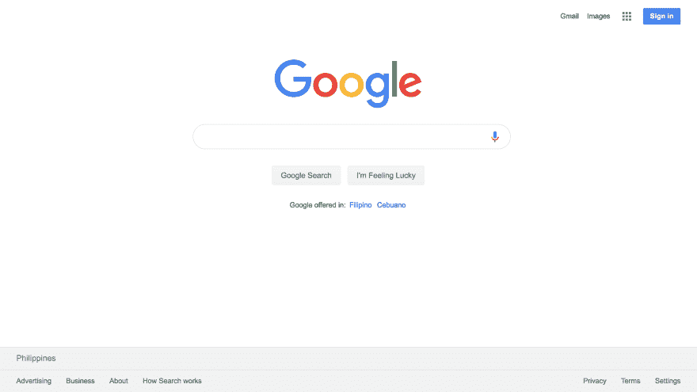
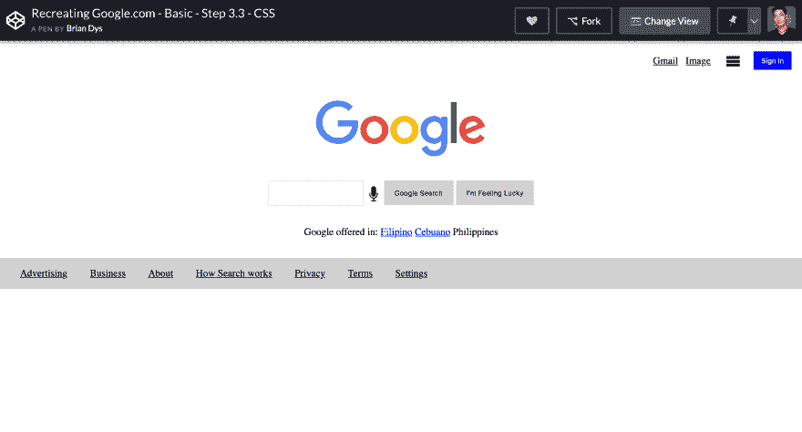

# 回复:创作-基本-Google.com

> 原文：<https://dev.to/dys/re-creation-basic-google-com-53en>

## 更新时间:2019 年 6 月 8 日

我对步骤 3 - CSS 做了一些更新，即:

*   将 CSS 属性限制为填充、边距、宽度、高度、背景色、颜色、显示:块、行内块、行内；文本对齐和垂直对齐。
*   我意识到我们处于基础阶段——所以为了简单起见，我删除了 HTML 中的子容器和 CSS 中的“下一级”CSS 属性，如 display: grid、flex 等。我们将在下一阶段解决它们。

* * *

## 什么是 RE:Creation？

RE:Creation 是一个设计活动，在这个活动中，我们对所选网页的 HTML & CSS 组件进行逆向工程和重新创建。

RE:Creation 是逆向工程创建的简称。它包括发现(理论)和交付(技术)过程。

## 目标

回复:Creation 的目标是提升网站和网络应用等数字产品的设计基础。

这些基础围绕着设计学科，如信息架构、交互设计、用户界面设计、视觉设计和可访问性，以及前端设计。

## 要求

参与再造的要求很简单:首先，HTML & CSS 的基础知识，其次，一台装有这些软件的计算机:

*   文本编辑器(文本编辑、记事本)
*   网络浏览器(Chrome、Firefox)

使用这些软件进行再创作不需要互联网连接。

或者，可以在线使用一个名为 [CodePen](https://codepen.io/) 的网络应用。它既可以作为文本编辑器，也可以作为 web 浏览器，分别用于编辑和显示 Web 文档。

* * *

## 准备好了吗？我们开始吧！

再现 Google.com 基本上有三个步骤:

1.  将内容转换为纯文本
2.  在 HTML 中标记纯文本
3.  CSS 中 HTML 元素的样式

这是我们正在重建的模型:

每一步有 3 个回合，所以我在 CodePen 中一共做了 9 个例子:

## 第一步:纯文本

### 第一步，第一轮:内容盘点

[https://codepen.io/briandys/embed/wbbqaM?height=600&default-tab=html,result&embed-version=2](https://codepen.io/briandys/embed/wbbqaM?height=600&default-tab=html,result&embed-version=2)

### 第一步，第二轮:分组和贴标签

[https://codepen.io/briandys/embed/qGGXbQ?height=600&default-tab=html,result&embed-version=2](https://codepen.io/briandys/embed/qGGXbQ?height=600&default-tab=html,result&embed-version=2)

### 第 1 步，第 3 轮:结构

[https://codepen.io/briandys/embed/dEEVXX?height=600&default-tab=html,result&embed-version=2](https://codepen.io/briandys/embed/dEEVXX?height=600&default-tab=html,result&embed-version=2)

## 第二步:HTML

### 第二步，第一轮:结构标记

[https://codepen.io/briandys/embed/gJJGmG?height=600&default-tab=html,result&embed-version=2](https://codepen.io/briandys/embed/gJJGmG?height=600&default-tab=html,result&embed-version=2)

### 第二步，第二轮:分组标记

[https://codepen.io/briandys/embed/WBBMwJ?height=600&default-tab=html,result&embed-version=2](https://codepen.io/briandys/embed/WBBMwJ?height=600&default-tab=html,result&embed-version=2)

### 第 2 步，第 3 轮:单独标记

[https://codepen.io/briandys/embed/byyLmm?height=600&default-tab=html,result&embed-version=2](https://codepen.io/briandys/embed/byyLmm?height=600&default-tab=html,result&embed-version=2)

## 第三步:CSS

### 第三步，第一轮:个人风格

[https://codepen.io/briandys/embed/QRRrMv?height=600&default-tab=css,result&embed-version=2](https://codepen.io/briandys/embed/QRRrMv?height=600&default-tab=css,result&embed-version=2)

### 第 3 步，第 2 轮:团体风格

[https://codepen.io/briandys/embed/ZNNREm?height=600&default-tab=css,result&embed-version=2](https://codepen.io/briandys/embed/ZNNREm?height=600&default-tab=css,result&embed-version=2)

### 第 3 步，第 3 轮:结构样式

[https://codepen.io/briandys/embed/eaaKyq?height=600&default-tab=css,result&embed-version=2](https://codepen.io/briandys/embed/eaaKyq?height=600&default-tab=css,result&embed-version=2)

* * *

这是我们活动最终状态的截图:

当然，还有很多需要改进的地方，尤其是如果我们做得正确的话——我们将在深潜活动中解决这些问题。

* * *

## 接下来是什么？

更新日期:2019 年 6 月 8 日

*   我最近贴了[中级](https://dev.to/dys/re-creation-intermediate-google-com-349n)
*   关于深潜，我会为那些高级之后的人写一个单独的帖子

我们将深入研究同一个例子(Google.com ),再次经历所有 3 个步骤，每个步骤 3 轮——这一次，处理诸如信息架构、语义、可访问性、渐进式增强、响应式网页设计等概念，以及与构建网站前端相关的其他主题。

感谢阅读！

布莱恩·dys