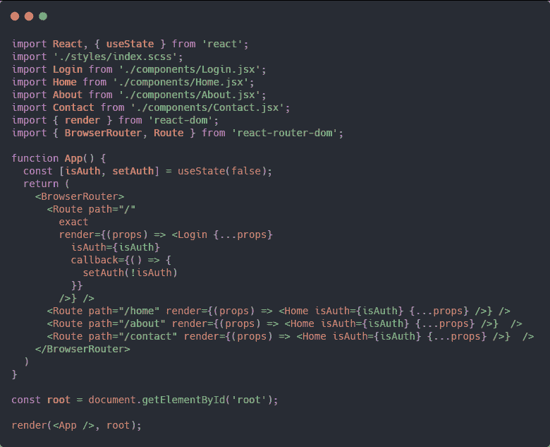
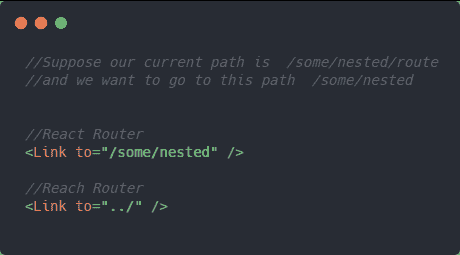
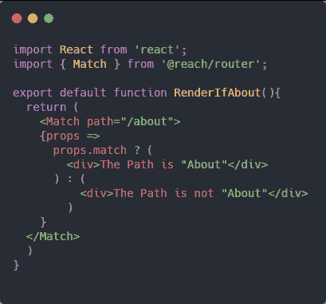
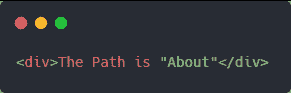
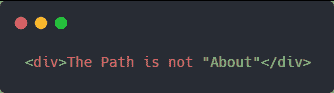
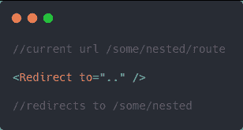
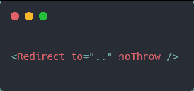
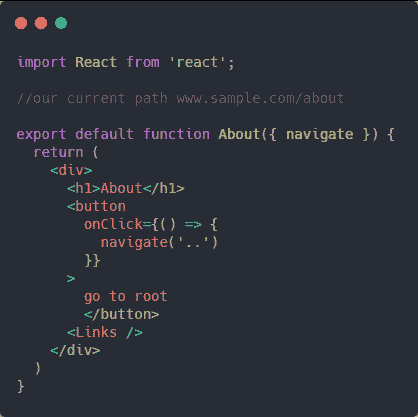

# Reach 路由器——一种简单的替代路由器的方法

> 原文：<https://dev.to/macmacky/reach-router-an-easy-alternative-way-to-react-router-4mgn>

### 嗨伙计们日安！

我已经使用 **react-router** 快一年了，我在使用它的时候遇到了一些问题，主要是因为有很多样板代码需要编写，虽然不是很多，但你知道我在说什么。

#### 使用 React 路由器

#### 使用 Reach 路由器

好了，先看第一张图和第二张图。

第**个**不同的是，我们第一个 pic 我们要导入两个组件**浏览器**和**路由**。第二张图，我们只导入 **Reach Router** 包提供给我们的 **Router** 组件。

第二个与第一个**的不同之处在于，在第一个 pic 中，我们使用了 **Route** 组件来指定我们的配置路由，并使用了 **render** 方法来指定将用于这些路由的组件，但是在第二个 pic 中，我们仅指定了组件的 **path** 属性，并且 **Reach Router** 会基于该**路径**自动呈现组件。不用说，我们不必在组件声明中指定**路径**属性，**到达路由器**会为我们处理它。**

第三个不同点是，在第二张图片中，我们的路线配置中没有精确的道具。**到达路由器**已经知道基于 URL 或路径呈现什么组件。

好的，我将解释一下**到达路由器**为我们提供的一些有用的组件。

#### 链接

该组件与 **React 路由器**中的**链接**组件具有几乎相同的功能，但有一些有用的区别。

这个特性叫做**相对路径**。我们正在导航到**/某/嵌套/路线**的上层路线，所以我们想去**/某/嵌套**。这就像在文件系统的不同目录之间导航。

### 匹配

该组件基本上匹配一个位置路径，如果呈现的路径匹配与否，则返回一个回调。
[T3】](https://res.cloudinary.com/practicaldev/image/fetch/s--7MGEaIfU--/c_limit%2Cf_auto%2Cfl_progressive%2Cq_auto%2Cw_880/https://thepracticaldev.s3.amazonaws.com/i/6uek7s62weelf91z7wl7.png)

基本上，它只呈现
 
这个 **JSX** 如果路径是**/关于**。否则，它会渲染这个 JSX

### 重定向

该组件类似于 **React 路由器的**重定向组件，但两者的区别在于我们可以在 **Reach 路由器的**重定向中使用相对路径。

第二个区别是这个组件在默认情况下调用类组件中的 **componentDidCatch** 生命周期方法，这样我们就可以阻止一个新的树被渲染，并避免一个新的位置，如果你想避免这种情况，你应该使用 **noThrow** prop。

### 导航

**导航**道具与**历史几乎相同。按下**但是关键的区别还是在于我们可以使用**相对路径**进行导航。

如果我们点击这个按钮，它会导航到**[【www.sample.com】](http://www.sample.com)**。

顺便说一下，这个包是由 **React 路由器**包的原作者之一写的，所以试试吧。

#### 感谢各位阅读本文。

# 过得愉快😃！。