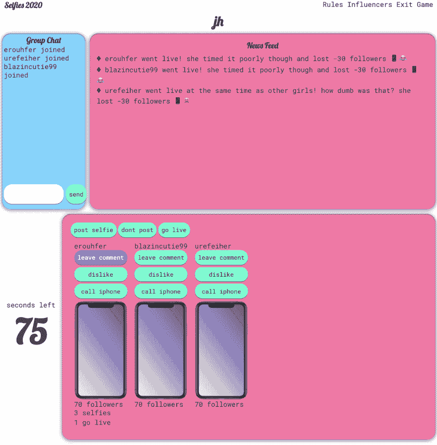

# React 定制钩子——在组件之间共享逻辑

> 原文：<https://dev.to/aduranil/react-custom-hooks-sharing-logic-between-components-19o8>

下面是一个 React 钩子的例子，它负责在两个不同的组件中使一个按钮变成紫色。我用的这个是在我的[项目](https://github.com/aduranil/selfies)里面你可以在这里玩。

```
import { useState } from 'react';

 // hook code 
 function useMoveUpdate() {
  const [currentMove, setCurrentMove] = useState('');

   const newMove = (event) => {
    event.preventDefault();
    let move = event.currentTarget.value;
    let theVictim = null;
    if (event.currentTarget.value.includes('leave_comment')) {
      move = 'leave_comment';
      theVictim = event.currentTarget.id;
    }
    setCurrentMove(event.currentTarget.value);
  };

  return [currentMove, newMove];
} 
```

```
import React from 'react';
import useMoveUpdate from '../hooks/CurrentMove';

function GameMoves({
  game, dispatch
}) {
  // component that uses the hook
  const [currentMove, newMove] = useMoveUpdate();

  return (
    <div>
      {['post_selfie', 'dont_post', 'go_live'].map(item => (
        <button
          className={currentMove === item ? 'button-color' : null}
          type="button"
          style={{ padding: '10px' }}
          value={item}
          onClick={newMove}
          disabled={!game.round_started}
        >
          {item.replace(/_/g, '  ')}
        </button>
      ))}
    </div>
  );
} 
```

```
import React from 'react';
import { Phone } from 'img/iPhone';
import useMoveUpdate from '../hooks/CurrentMove';

function GameBox({ game, dispatch}) {
  // component that uses the hook
  const [currentMove, newMove] = useMoveUpdate();

  return (
    <div>
      <div style={{ display: 'flex', flexDirection: 'row' }}>
        {game.users.map(player => (
          <div style={{ margin: '1%' }} key={player.username}>
            {player.username}
            {!game.round_started && (player.started ? '!' : ' ?')}
            <div>
              {player.followers}
              {player.followers === 1 ? 'follower' : 'followers'}
            </div>
            <div style={{ marginBottom: '3px' }}>
              {player.stories}
              {player.stories === 1 ? 'story' : 'stories'}
            </div>
            <button
              onClick={newMove}
              id={player.id}
              disabled={!game.round_started}
              value={`leave_comment_${player.id}`}
              className={currentMove === `leave_comment_${player.id}` ? 'button-color' : null}
              type="button"
            >
              <Phone />
            </button>
            {'  '}
          </div>
        ))}
      </div>
    </div>
  );
} 
```

它是如何工作的。

```
const [currentMove, setCurrentMove] = useState(''); 
```

`currentMove`保存哪个按钮应该是紫色的值，而`setCurrentMove`执行钩子中定义的动作。

初始钩子的状态是一个空字符串，这意味着所有的按钮都是绿色的，因为当按钮被点击时`className`会改变。`className`决定了 CSS。

钩子返回`[currentMove, newMove]`，这就是`useMoveUpdate`在组件中返回的内容。点击按钮执行`newMove`，这个动作更新被点击的按钮并改变它的颜色。

下面是它在我的项目中的一个例子:
[](https://res.cloudinary.com/practicaldev/image/fetch/s--iJ2Mq42S--/c_limit%2Cf_auto%2Cfl_progressive%2Cq_auto%2Cw_880/https://thepracticaldev.s3.amazonaws.com/i/cyeyfnir720u9s33iuu9.png)