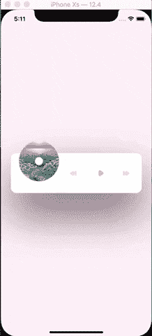

# React 本土动画系列#2

> 原文：<https://dev.to/alvarojsnish/react-native-animation-series-2-3hci>

大家好！我是阿尔瓦罗。这篇文章的第一部分在[媒体](https://medium.com/@alvarohdezex/react-native-animation-series-1-f51739e92fd7)上，但是从现在开始我会在这里写剩下的部分。

今天我们要设计一个我在运球上找到的[音乐播放器](https://dribbble.com/shots/4240318-Made-with-InVision-Studio-Music-Player)。所有的荣誉都要归功于[查尔斯·帕特森](https://dribbble.com/CharlesPatterson)，他启发了我去做这件事。

所以，在帖子的最后我们会有这样的:
[](https://i.giphy.com/media/SABsgwnPOnqNtzTkNk/giphy.gif)

请注意，没有音频将被播放或酒吧的进展，但如果你想，我们可以在另一个职位！

首先，您可以从这里的[克隆 repo，然后在主分支上工作，但是如果您想看到最终的代码，请切换到动画/音乐播放器。](https://github.com/AlvaroJSnish/react-native-animation-series)

如果你有 repo，你需要安装一个依赖项，“react-native-paper”(yarn add react-native-paper/NPM I react-native-paper)。我们正在使用这个 UI 库中的 ProgressBar。

现在，世博会开始了...开始！

在 **App.js** 我正在加载自定义字体，你可以从 google fonts 下载 [roboto](https://fonts.google.com/specimen/Roboto) ，然后把文件放到 assets/fonts 中。

为了加载字体，我们将使用“expo-font ”,等待组件被安装，然后呈现音乐播放器。

如果你从来没有使用过自定义字体，那么在 [expo 文档中](https://docs.expo.io/versions/latest/guides/using-custom-fonts/)已经被很好地编辑了如何加载它们！

```
import React, { useEffect, useState } from "react";

import * as Font from "expo-font";
import styled from "styled-components";

import MusicPlayer from "./src/MusicPlayer";

function App() {
  const [fontLoaded, setLoaded] = useState(false);

  useEffect(() => {
    loadFonts();
  }, []);

  const loadFonts = async () => {
    await Font.loadAsync({
      "roboto-bold": require("./assets/fonts/Roboto-Bold.ttf"),
      "roboto-light": require("./assets/fonts/Roboto-Light.ttf"),
      "roboto-medium": require("./assets/fonts/Roboto-Medium.ttf"),
      "roboto-thin": require("./assets/fonts/Roboto-Thin.ttf")
    });
    setLoaded(true);
  };

  return <Container>{fontLoaded && <MusicPlayer />}</Container>; }

export default App;

const Container = styled.View`
  flex: 1;
  align-items: center;
  justify-content: center;
  background: #fff2f6;
`; 
```

Enter fullscreen mode Exit fullscreen mode

这不是强制性的加载字体，你可以使用其他字体！

如果我们保存这个文件，我们会得到一个错误，因为 expo 找不到 MusicPlayer，所以，让我们创建它！

在 src/ create MusicPlayer.js 中创建一个虚拟组件来消除错误。

在今天的教程中，我们不会使用 spring 来进行设计，但是没关系。我将在名为 parallel 的动画 API 上引入新方法，以同时执行所有动画并循环，在循环中重复相同的动画。

同样，在第一个教程中我使用了类，现在我们将使用钩子(woho！).

我会解释我们需要做的一切，然后在最后你会找到代码，所以你可以挑战自己，使它没有寻找解决方案:p。

1 -我们需要导入 React 和 useState，styled，ProgressBar，TouchableOpacity，Animated 和 Easing 来制作没有剪切的旋转动画。

```
import React, { useState } from "react";
import styled from "styled-components";
import { ProgressBar } from "react-native-paper";
import { TouchableOpacity, Animated, Easing } from "react-native"; 
```

Enter fullscreen mode Exit fullscreen mode

2 -我们需要 4 个动画:

*   将信息从歌曲移到顶部
*   当我们按下播放键时缩放磁盘
*   当我们按下播放键时，旋转磁盘
*   歌曲信息有点不透明

3 -一种在播放歌曲和不播放歌曲之间切换的方式。

4 -知道如何插值不透明度和旋转，但我会在这里给你代码:

```
const spin = rotation.interpolate({
  inputRange: [0, 1],
  outputRange: ["0deg", "360deg"]
});

const opacityInterpolate = opacity.interpolate({
  inputRange: [0, 0.85, 1],
  outputRange: [0, 0, 1]
}); 
```

Enter fullscreen mode Exit fullscreen mode

旋转和不透明度可以有 2 个值，0 和 1，并将逐渐增加到 0 到 1。例如，对于旋转，当值为 0.5 时，输出(度数)将为 180。在这种情况下，不透明度从 0 到 0.85 将为 0，在这 0.15 中，不透明度将从 0 增加到 1。

5 -你需要选一首歌！这一步很重要，希望你选个好的。后退、前进、播放和暂停的图标也可以自由选择，我用的是设计上的图标，但是你可以从 expo 导入矢量图标，或者使用你自己的 png。

6 -有条件地呈现播放/暂停按钮，记住我们有一个状态告诉我们在做什么！

7 -所有有动画的组件都需要是动画组件，你可以将它们声明为普通样式的组件，然后用动画:
来制作动画

```
const Image = styled.Image`
  width: 100px;
  height: 100px;
  position: absolute;
  left: 20px;
  top: -30px;
  border-radius: 50px;
`;

const AnimatedImage = Animated.createAnimatedComponent(Image); 
```

Enter fullscreen mode Exit fullscreen mode

8 -如果出现问题，请耐心等待 1，2...你试了 n 次，最后我们都学会了。

**Animated.parallel**

```
Animated.parallel([
  Animated.timing(translateY, { toValue: -70 }),
  Animated.timing(scale, { toValue: 1.2 }),
  rotationLoop(),
  Animated.timing(opacity, { toValue: 1 })
]).start(); 
```

Enter fullscreen mode Exit fullscreen mode

**Animated.loop**
这个接受一个动画来循环，这是我们的旋转动画:

```
Animated.loop(
  Animated.timing(rotation, {
    toValue: 1,
    duration: 2500,
    easing: Easing.linear
  })
).start(); 
```

Enter fullscreen mode Exit fullscreen mode

一旦我们知道如何做，我们需要在播放或不播放歌曲之间切换...那么我们该怎么做呢？有状态！

```
 const [toggled, setToggled] = useState(true); 
```

Enter fullscreen mode Exit fullscreen mode

我们用具体的动画来处理这个问题:

```
const onPress = () => {
  setToggled(!toggled);
  if (toggled) {
    Animated.parallel([
      Animated.timing(translateY, { toValue: -70 }),
      Animated.timing(scale, { toValue: 1.2 }),
      rotationLoop(),
      Animated.timing(opacity, { toValue: 1 })
    ]).start();
  } else {
    Animated.parallel([
      Animated.timing(translateY, { toValue: 0 }),
      Animated.timing(scale, { toValue: 1 }),
      Animated.timing(rotation, { toValue: 0 }),
      Animated.timing(opacity, { toValue: 0 })
    ]).start();
  }
}; 
```

Enter fullscreen mode Exit fullscreen mode

如果你看到，旋转是在自己的方法 rotationLoop()中进行的，为了让它更具可读性:

```
const rotationLoop = () => {
  return Animated.loop(
    Animated.timing(rotation, {
      toValue: 1,
      duration: 2500,
      easing: Easing.linear
    })
  ).start();
}; 
```

Enter fullscreen mode Exit fullscreen mode

如果你按照设计，你有所有的 css，但如果不是这样，这些是我做的组件:

```
const Container = styled.View`
  width: 326px;
  height: 99.5px;
  background: #ffffff;
  border-radius: 14px;
  box-shadow: 0 50px 57px #6f535b;
  justify-content: center;
  align-items: center;
`;

const Image = styled.Image`
  width: 100px;
  height: 100px;
  position: absolute;
  left: 20px;
  top: -30px;
  border-radius: 50px;
`;

const AnimatedImage = Animated.createAnimatedComponent(Image);

const DiskCenter = styled.View`
  width: 20px;
  height: 20px;
  border-radius: 10px;
  position: absolute;
  left: 60px;
  top: 10px;
  z-index: 10;
  background: #ffffff;
`;

const AnimatedDiskCenter = Animated.createAnimatedComponent(DiskCenter);

const Row = styled.View`
  flex-direction: row;
  align-items: center;
  height: 80px;
  width: 150px;
  justify-content: space-between;
  position: absolute;
  right: 30px;
`;

const Icon = styled.Image``;

const Playing = styled.View`
  background: rgba(255, 255, 255, 0.6);
  width: 300px;
  height: 85px;
  border-radius: 14px;
  z-index: -1;
  align-items: center;
  padding-top: 10px;
`;

const AnimatedPlaying = Animated.createAnimatedComponent(Playing);

const Column = styled.View`
  flex-direction: column;
  height: 100%;
  padding-left: 60px;
`;

const AnimatedColumn = Animated.createAnimatedComponent(Column);

const Artist = styled.Text`
  font-size: 15px;
  font-family: "roboto-bold";
  color: rgba(0, 0, 0, 0.7);
`;

const Title = styled.Text`
  font-size: 12px;
  font-family: "roboto-light";
  color: rgba(0, 0, 0, 0.7);
`; 
```

Enter fullscreen mode Exit fullscreen mode

按照层次结构，连接非常简单。这里有 MusicPlayer.js 的完整代码:

```
import React, { useState } from "react";

import styled from "styled-components";
import { ProgressBar } from "react-native-paper";
import { TouchableOpacity, Animated, Easing } from "react-native";

const translateY = new Animated.Value(0);
const scale = new Animated.Value(1);
const rotation = new Animated.Value(0);
const opacity = new Animated.Value(0);

const MusicPlayer = () => {
  const [toggled, setToggled] = useState(true);

  const spin = rotation.interpolate({
    inputRange: [0, 1],
    outputRange: ["0deg", "360deg"]
  });

  const opacityInterpolate = opacity.interpolate({
    inputRange: [0, 0.85, 1],
    outputRange: [0, 0, 1]
  });

  const rotationLoop = () => {
    return Animated.loop(
      Animated.timing(rotation, {
        toValue: 1,
        duration: 2500,
        easing: Easing.linear
      })
    ).start();
  };

  const onPress = () => {
    setToggled(!toggled);
    if (toggled) {
      Animated.parallel([
        Animated.timing(translateY, { toValue: -70 }),
        Animated.timing(scale, { toValue: 1.2 }),
        rotationLoop(),
        Animated.timing(opacity, { toValue: 1 })
      ]).start();
    } else {
      Animated.parallel([
        Animated.timing(translateY, { toValue: 0 }),
        Animated.timing(scale, { toValue: 1 }),
        Animated.timing(rotation, { toValue: 0 }),
        Animated.timing(opacity, { toValue: 0 })
      ]).start();
    }
  };

  return (
    <Container>
      <AnimatedImage
        source={require("./cots.jpg")}
        style={{ transform: [{ scale }, { rotate: spin }] }}
      />
      <AnimatedDiskCenter style={{ transform: [{ scale }] }} />
      <Row>
        <Icon
          source={require("./back.png")}
          style={{ width: 23.46, height: 16.93 }}
        />
        <TouchableOpacity onPress={onPress}>
          {toggled ? (
            <Icon
              source={require("./play.png")}
              style={{ width: 23.46, height: 16.93 }}
            />
          ) : (
            <Icon
              source={require("./stop.png")}
              style={{ width: 20, height: 16.93 }}
            />
          )}
        </TouchableOpacity>
        <Icon
          source={require("./next.png")}
          style={{ width: 23.46, height: 16.93 }}
        />
      </Row>
      <AnimatedPlaying style={{ transform: [{ translateY }] }}>
        <AnimatedColumn style={{ opacity: opacityInterpolate }}>
          <Artist>Quinn XCII</Artist>
          Another day in paradise
          <ProgressBar
            progress={0.5}
            color="#FF8EAB"
            style={{ width: 150, position: "absolute", bottom: 25, left: 60 }}
          />
        </AnimatedColumn>
      </AnimatedPlaying>
    </Container>
  );
};

export default MusicPlayer;

const Container = styled.View`
  width: 326px;
  height: 99.5px;
  background: #ffffff;
  border-radius: 14px;
  box-shadow: 0 50px 57px #6f535b;
  justify-content: center;
  align-items: center;
`;

const Image = styled.Image`
  width: 100px;
  height: 100px;
  position: absolute;
  left: 20px;
  top: -30px;
  border-radius: 50px;
`;

const AnimatedImage = Animated.createAnimatedComponent(Image);

const DiskCenter = styled.View`
  width: 20px;
  height: 20px;
  border-radius: 10px;
  position: absolute;
  left: 60px;
  top: 10px;
  z-index: 10;
  background: #ffffff;
`;

const AnimatedDiskCenter = Animated.createAnimatedComponent(DiskCenter);

const Row = styled.View`
  flex-direction: row;
  align-items: center;
  height: 80px;
  width: 150px;
  justify-content: space-between;
  position: absolute;
  right: 30px;
`;

const Icon = styled.Image``;

const Playing = styled.View`
  background: rgba(255, 255, 255, 0.6);
  width: 300px;
  height: 85px;
  border-radius: 14px;
  z-index: -1;
  align-items: center;
  padding-top: 10px;
`;

const AnimatedPlaying = Animated.createAnimatedComponent(Playing);

const Column = styled.View`
  flex-direction: column;
  height: 100%;
  padding-left: 60px;
`;

const AnimatedColumn = Animated.createAnimatedComponent(Column);

const Artist = styled.Text`
  font-size: 15px;
  font-family: "roboto-bold";
  color: rgba(0, 0, 0, 0.7);
`;

const Title = styled.Text`
  font-size: 12px;
  font-family: "roboto-light";
  color: rgba(0, 0, 0, 0.7);
`; 
```

Enter fullscreen mode Exit fullscreen mode

如果你觉得这有用和/或有趣，请分享，留下赞或评论，如果你想让我改变一些东西或制作更多的动画，请发给我，我会的！

一如既往，谢谢！

##  [阿尔瓦罗尼斯](https://github.com/AlvaroJSnish) / [反应-原生-动画-系列](https://github.com/AlvaroJSnish/react-native-animation-series)

### 一系列 react 原生动画！

<article class="markdown-body entry-content container-lg" itemprop="text">

# 动画系列

每个分支都包含一个动画，我们正在这里创建它们！和[这里的](https://dev.to/alvarojsnish/react-native-animation-series-2-3hci)

如果你想用 React Native 学习动画，克隆 repo 并跟随教程！

</article>

[View on GitHub](https://github.com/AlvaroJSnish/react-native-animation-series)[](/alvarojsnish)

## [仓](/alvarojsnish)仓

[I'm a young spanish developer and React / GraphQL enthusiast, interested in AI/DL, python ecosystem and self-drived devices.](/alvarojsnish)