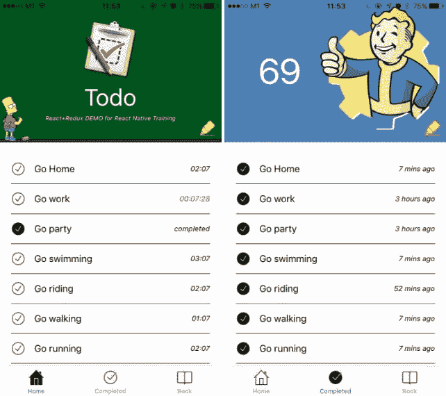

# React 本地食谱—免费简明视频教程

> 原文：<https://dev.to/unbug/react-native-cookbook-free-concise-video-tutorial-17p2>

 
文章:[https://medium . com/@ unbug/react-native-cookbook-简明-免费-视频-教程-f53b9c84216](https://medium.com/@unbug/react-native-cookbook-concise-free-video-tutorial-f53b9c84216)

GitHub:[https://github.com/unbug/react-native-train](https://github.com/unbug/react-native-train)

Udemy 上免费高级 React Native 课程:
[https://medium . com/@ unbug/free-advanced-React-Native-course-on-Udemy-deb7f 2074 e 03](https://medium.com/@unbug/free-advanced-react-native-course-on-udemy-deb7f2074e03)