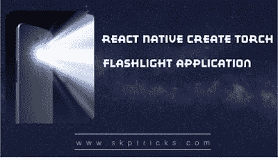

# React 本机创建火炬手电筒应用程序

> 原文：<https://dev.to/skptricks/react-native-create-torch-flashlight-application-2ni3>

来源: [React Native Create Torch 手电筒应用](https://www.skptricks.com/2019/07/react-native-create-torch-flashlight-app.html)

本教程解释了如何在 react 本地应用程序中创建手电筒应用程序。手电筒是当今舞台上每一部手机的重要组成部分。它内置于每部带摄像头的多媒体智能手机中。手电筒基本上用作手机的相机闪光灯，但在晚上也可以用作个人手电筒。在 react naive 中没有直接的内置组件来手动控制手电筒，但是使用 react-native-torch NPM 库，我们可以轻松地控制 android 和 iOS 手机手电筒，并使它们打开和关闭。

点击此处阅读更多内容...