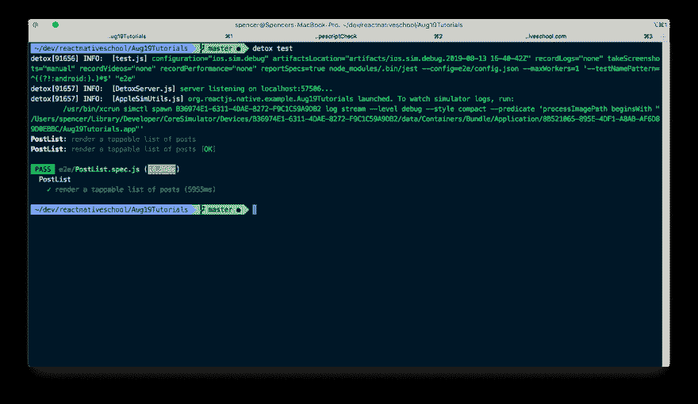

# 使用 Detox 对本地端到端测试做出反应

> 原文：<https://dev.to/spencercarli/react-native-end-to-end-testing-with-detox-56bk>

> 本帖原载于 [React 原生学校](https://www.reactnativeschool.com/react-native-end-to-end-testing-with-detox)。

在 React 本地学校的测试月中，我们将更进一步，覆盖端到端(E2E)测试。之前我们讨论了:

*   [使用 React 本地测试库进行组件测试](https://learn.handlebarlabs.com/courses/426773/lectures/11360156)
*   [使用 Jest 时模仿 Fetch API 调用](https://www.reactnativeschool.com/mocking-fetch-api-calls-when-using-jest)
*   [使用异步存储的测试驱动开发](https://learn.handlebarlabs.com/courses/426773/lectures/11143625)

为此，我们将使用 Wix 的[排毒库。这是一个强大的库，但如果我说它易于设置和管理，那我是在撒谎。我在多个项目中使用过它，但并不广泛——在这一点上，它对我来说太多了，难以管理/维护。](https://github.com/wix/Detox)

也就是说，我觉得测试月如果不包括它将是不完整的，因为它是 E2E 测试的首选工具。

排毒实际上是启动一个模拟器，点击你的应用程序(非常快)。这是最真实的测试。

## 设置

> **注:**我之前只在 iOS 上用过 Detox。它应该也能在 Android 上运行，但我还没有试过。

与其花上一千个单词来创建一个基本的 React Native 项目，我将继续下去，并假设您可以做到这一点。如果没有，你可能还不需要读这一课。先熟悉 React Native，以后再回来讲这个。

我有一个[项目](https://github.com/ReactNativeSchool/testing-example)的例子，里面有排毒测试和其他内容，你可以参考。

该应用程序所做的只是请求获取一系列帖子，然后呈现它们。你可以点击任何帖子，然后查看该帖子的详细内容。

[该项目可在 Github](https://github.com/ReactNativeSchool/testing-example) 上获得。这是我这个月在所有测试课上用的同一款。

你应该熟悉的两个文件是 [PostList.js](https://github.com/ReactNativeSchool/testing-example/blob/master/App/screens/PostList.js) 和 [Post.js](https://github.com/ReactNativeSchool/testing-example/blob/master/App/screens/Post.js) 。

排毒有一个[全面的入门指南](https://github.com/wix/Detox/blob/master/docs/Introduction.GettingStarted.md)，你需要边走边参考。以下是几个亮点。

全局安装 CLI 后，您需要将 detox 安装到您的项目中

末端的

```
yarn add --dev detox 
```

而且是对 package.json 的配置。

package.json

```
{  //  ...  "detox":  {  "configurations":  {  "ios.sim.debug":  {  "binaryPath":  "ios/build/Build/Products/Debug-iphonesimulator/CHANGE_THIS.app",  "build":  "xcodebuild -workspace ios/CHANGE_THIS.xcworkspace -scheme CHANGE_THIS -configuration Debug -sdk iphonesimulator -derivedDataPath ios/build",  "type":  "ios.simulator",  "name":  "iPhone 7"  }  }  }  } 
```

**注意:**您需要将上面代码片段中的`CHANGE_THIS`替换为您的项目名称。更多信息可以在这里找到[。](https://github.com/wix/Detox/blob/master/docs/Introduction.GettingStarted.md#2-add-detox-config-to-packagejson)

最后，您初始化默认的测试和配置。

末端的

```
detox init -r jest 
```

这样做会在项目的根目录下创建一个`e2e`文件夹。

## 写排毒测试

首先删除`e2e/firstTest.spec.js`，然后创建`PostList.spec.js`。

我将所有的 E2E 测试保存在根`e2e/`文件夹中，这样当我想要运行我经常运行的测试(`jest . --testPathIgnorePatterns e2e/ node_modules/`)时，我可以很容易地将它们过滤掉。

因为我们使用 Jest 作为测试运行程序，所以大部分内容看起来与我们这个月讨论的内容相似。detox 要做的是暴露一些额外的全局变量来与我们的应用程序进行交互。

首先是脚手架。

e2e/邮政清单.规格. js

```
describe('PostList', () => {
  beforeEach(async () => {
    await device.reloadReactNative();
  });

  it('render a tappable list of posts', async () => {});
}); 
```

在每次排毒测试运行之前，我们希望重新加载 React Native(相当于按下 cmd + r ),以便下一次测试在某种程度上独立于上一次测试。我说有点，因为该应用程序是物理安装，将有东西保存在存储从以前的测试。不管怎样，在下一次测试之前重新加载是一个最佳实践。

现在进行实际测试。如果你是 React Native School pro 成员，那么这些测试可能与我们上周编写的集成测试非常相似。然而这次测试是在一个设备上进行的。

e2e/邮政清单.规格. js

```
describe('PostList', () => {
  beforeEach(async () => {
    await device.reloadReactNative();
  });

  it('render a tappable list of posts', async () => {
    await expect(element(by.id('post-list'))).toBeVisible();
    await waitFor(element(by.id('post-row-0')))
      .toBeVisible()
      .withTimeout(2000);
    await element(by.id('post-row-0')).tap();
    await expect(element(by.id('post-title'))).toBeVisible();
  });
}); 
```

`element`和`by.id`正从排毒中向我们走来。然后，我们可以使用这些结果来交互/分析我们的应用程序。

首先，我们检查我们的`post-list`组件是否存在。然后，我们将等待 post 行的存在。实际上，我们将在这次测试中使用我们的 API。这可能是一件好事，因为我们想测试实际的应用程序(E2E 测试只是为了取代你手动点击应用程序)。此外，我不知道如何在排毒中模仿 API 反应，所以这是我们所能做的:)。

一旦显示出来，我们就要点击它，进入下一个屏幕。在那个屏幕(`Post.js`)上应该有一个`post-title`，而且应该是可见的。如果所有这些条件都通过了，那么我们的测试就通过了！

## 运行测试

首先，你要通过运行`detox build`来构建排毒应用。

要实际运行该应用程序，您将运行`detox test`。

这应该会启动一个模拟器并开始敲击！

[](https://res.cloudinary.com/practicaldev/image/fetch/s--OY8FzDda--/c_limit%2Cf_auto%2Cfl_progressive%2Cq_66%2Cw_880/https://www.reactnativeschool.com/static/01-4637815082d93f542486b6e7cab95e60.gif)

这可能看起来像我在应用程序中点击，但我向你保证，这是排毒做的工作！

[](https://res.cloudinary.com/practicaldev/image/fetch/s--qGvtkhDP--/c_limit%2Cf_auto%2Cfl_progressive%2Cq_auto%2Cw_880/https://www.reactnativeschool.com/static/06ac96a5feba90c056fd929db6d1d883/62b80/02.png)

## 总结

排毒的设置和管理可能有点痛苦，但它非常有效。如果你有一些需要彻底测试的普通用户流，那么你可以在每次发布之前用一些方便的排毒测试来代替你自己。

## 附加资源

*   [排毒](https://github.com/wix/Detox)
*   [上面代码的例子](https://github.com/ReactNativeSchool/testing-example)