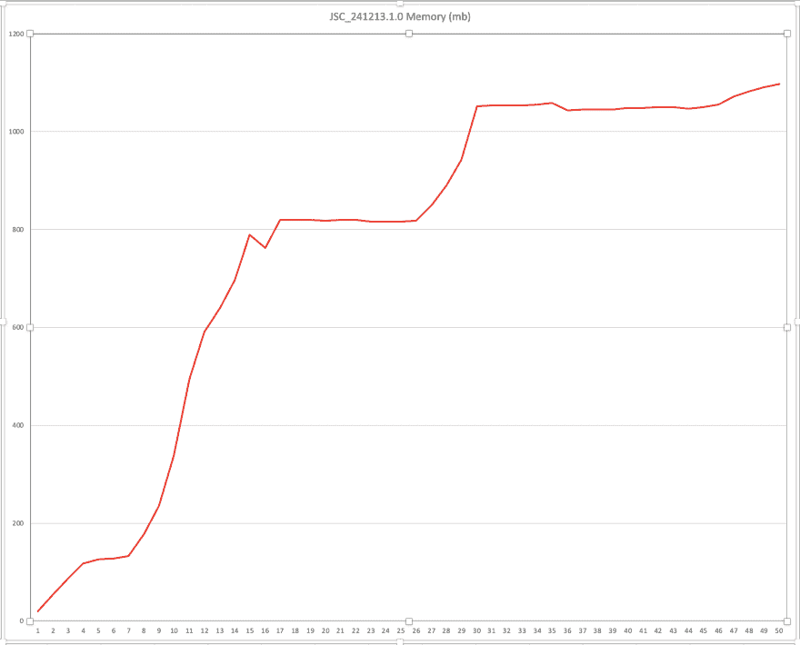
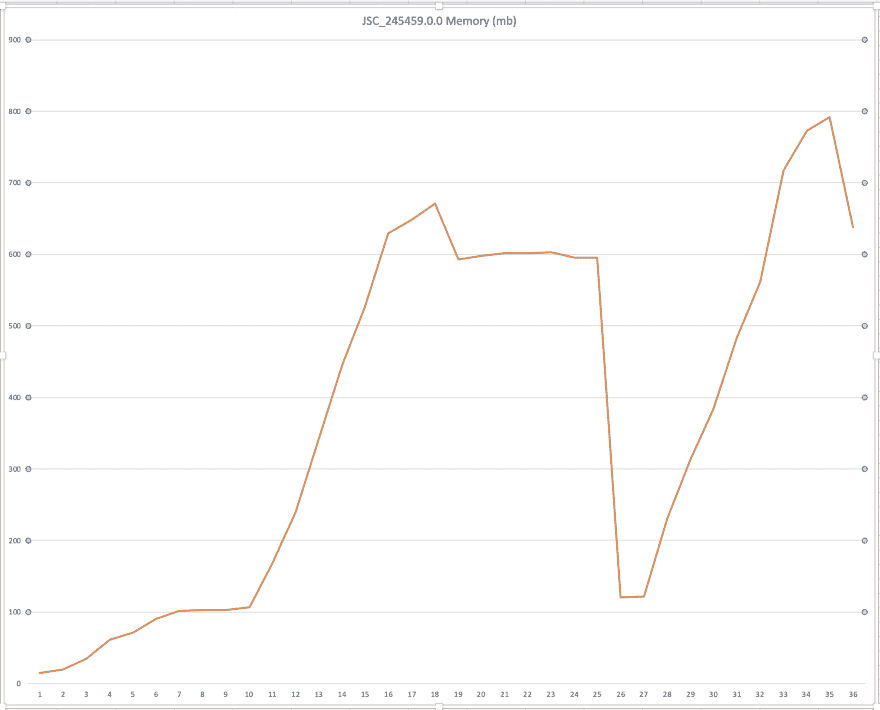
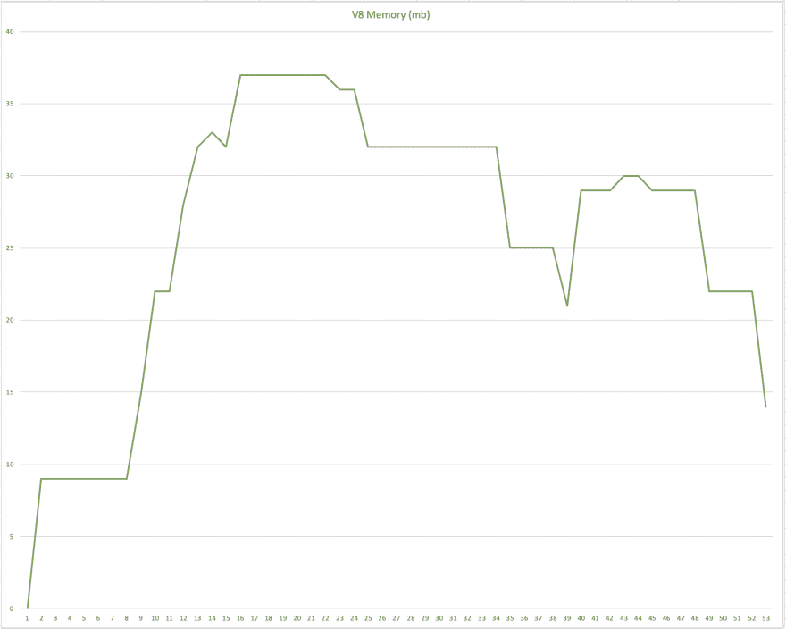
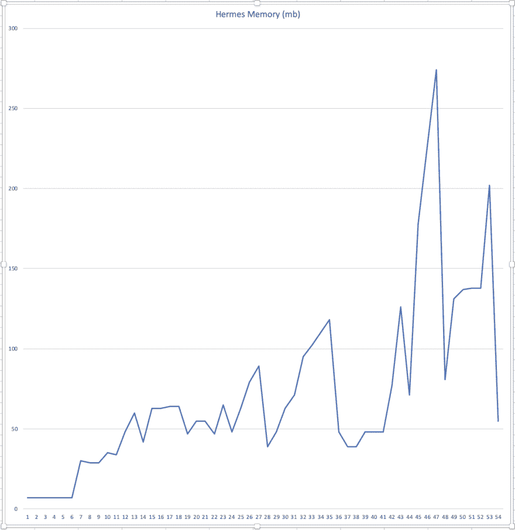
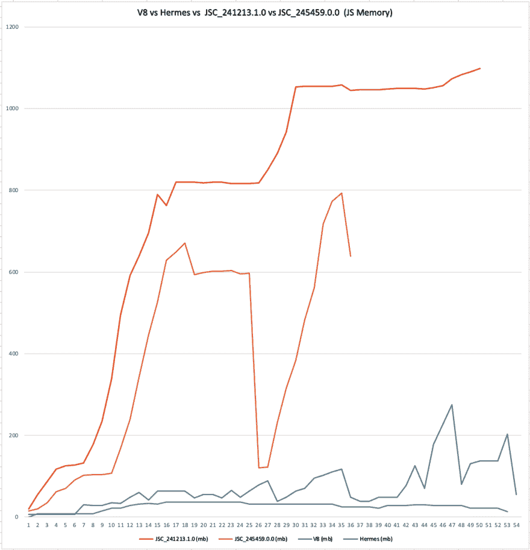

# React 本机内存分析(JSC vs V8 vs Hermes)

> 原文：<https://dev.to/anotherjsguy/react-native-memory-profiling-jsc-vs-v8-vs-hermes-1c76>

## 问题

我们的 Android 应用程序面临着内存问题，因为斯托克·JSC 在 Android 中只做了最少的垃圾收集。我们尝试了很多方法来减少应用程序的内存占用，但都没有成功。【react 本机平面列表包含大量条目(在我们的例子中大约 1k)时，问题变得很严重。随着屏幕之间的每次导航，内存不断增加，即使在清除数据后也不会减少

## 救世主

几周前，@kudochien 在推特上发布了关于 [react-native-v8](https://www.npmjs.com/package/react-native-v8) 包的消息，该包可以让我们将 v8 与 android 的 react-native 捆绑在一起，而不是 JSC

液体错误:内部

在同一时间 [jsc-android](https://www.npmjs.com/package/jsc-android/v/245459.0.0) 也发布了一个更新的版本 245459.0.0，Hermes 在@ChainReactConf 期间宣布

因此，我们决定比较[股票 JSC (v241213.1.0)](https://www.npmjs.com/package/jsc-android/v/241213.1.0) 、新 [JSC(v245459.0.0)](https://www.npmjs.com/package/jsc-android/v/245459.0.0) 、[爱马仕](https://facebook.github.io/react-native/docs/hermes/)和 [react-native-v8](https://www.npmjs.com/package/react-native-v8) 的内存占用，并创建一个样本库来模拟真实世界的用例。

##  [巴斯卡尔吉安](https://github.com/bhaskarGyan) / [反应-原生-记忆-轮廓](https://github.com/bhaskarGyan/react-native-memory-profile)

<article class="markdown-body entry-content container-lg" itemprop="text">

# react-native-memory-profile(JSC 对 V8)

1.  要对其进行内存分析的签出分支
2.  npm 一号
3.  在单独的终端中运行服务器，npm 运行启动服务器
4.  react-native run-android(用于开发)
5.  cd 安卓&&。/gradlew 程序集发布 apk 的发布

## 要在没有设置的情况下测试 apk

从＄{ PROJECT _ ROOT }/release apk 下的相应分支下载 APK

#观察结果 

</article>

[View on GitHub](https://github.com/bhaskarGyan/react-native-memory-profile)

We considered below use cases.

1.  包含约 1k 个项目的平面列表
2.  巨大的数组列表来模拟存储/删除大记录(一个记录是新数组(999999))。在反应状态下连接(“-”)
3.  使用[反应-导航](https://www.npmjs.com/package/react-navigation)的内存占用

### ABI 用过- > x86_64

## 观察

### TL；速度三角形定位法(dead reckoning)

新的 JSC 版本 v241213.1.0 处理内存的能力优于上一版本 v241213.1.0，其次是 Hermes，但 react-native-v8 在应用程序启动内存、处理平面列表内存、大数据内存占用以及最重要的垃圾收集方面远远超过了他们

液体错误:内部

### 样本 APP

### 步骤

*   主页->平面列表
*   滚动到最后一项(870 项)->主页
*   内存饥渴数组->添加记录(100) ->删除->首页
*   平面列表->内存饥饿数组->添加记录(100) ->主页

### 库存 JSC (v241213.1.0)

这是三个国家中表现最差的。内存占用非常高，垃圾收集最少

**App 启动内存(MB)** - 59(总计)【JS】
**平单加载后(MB) (870 项)** - > 239(总计)、128 (JS)
**添加记录后(添加 16 条记录后 App 崩溃)(MB)** - > 1153(总计)、1098(JS)
**垃圾收集** -最小

#### 内存消耗图

### 新 JSC (v245459.0.0)

在处理内存和垃圾收集方面，它比 JSC 股票要好。

**App 启动内存(MB)** - 53(总)，15 (JS)
**平单加载后(MB) (870 项)** - > 191(总)，107 (JS)
**添加记录后(MB)** - > 714(总)，596(JS)
**垃圾回收** - >没错，内存降到了 234 MB(总)，134

#### 内存消耗图

### React-Native-V8

**App 启动内存(MB)** - 40(总)，9(JS)[↓55%(JS)】
**平单加载后(MB) (870 项)** - > 105(总)，36(JS)[↓70%(JS)】
**添加记录后(100)** - > 82(总)，25(JS)【GC ran in-between】
T9

#### 内存消耗图

### 赫尔墨斯

爱马仕于 7 月 11 日在@ChainReactConf 发布。它是一个开源的 JavaScript 引擎，针对在 Android 上运行 React 原生应用进行了优化。

**App 启动内存(MB)** - 33(总)，7(JS)[↓65%(JS)】
**平单加载后(MB) (870 项)** - > 397(总)，110(JS)
**GC 后(MB) ** - > 358(总)，48(JS)
* *添加记录后(添加 50 条记录后 App 崩溃)** - > 55

#### 内存消耗图

## 结论:

根据内存分析图，react-native-v8 是获胜者，紧随其后的是 Hermes。

但是，在 react-native 中没有选择 JS 引擎的灵丹妙药，这完全取决于个人的用例。根据不同的 JS 引擎来衡量你的应用程序的性能并选择最适合你的引擎是非常重要的。

现在 react-native 为用户提供了基于用例选择 JS 引擎的选项，这很好。