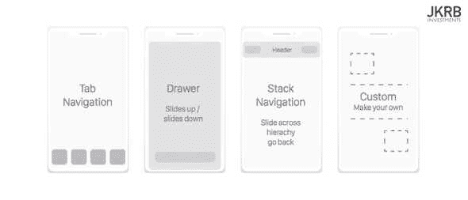
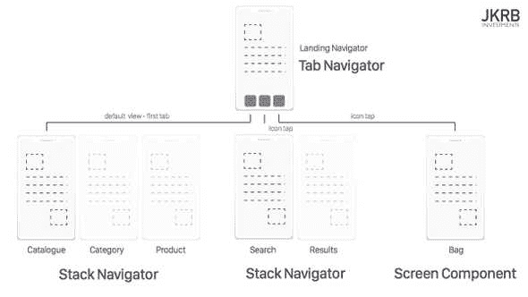
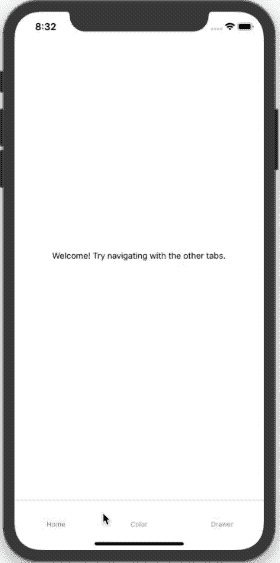

# 反应-本地路由

> 原文：<https://dev.to/thefinnomenon/react-native-routing-2d5a>

任何应用程序最重要的一个方面就是导航。除非你的应用程序真的是一个单一的屏幕，否则你的用户将不得不点击来导航，这需要一个好的导航库。在 React-Native 世界中有一些流行的选项，但最流行的，也是脸书的 React-Native 文档中推荐的，是 [React 导航](https://reactnavigation.org/)。这是我使用的库，在这篇文章中，我们将讨论如何在常见的导航场景中使用它。

# 什么是 React 导航？

React-Navigation 是一个纯 JavaScript(无本机代码)库，用于 React-Native 应用程序的导航。完全用 JavaScript 编写给了你强大的能力和对导航的控制，而无需编写本地代码。这个库用 JavaScript 实现了您在 iOS 和 Android 上习惯使用的本地导航元素和转换，以及一个用于处理导航状态和更改的简单 API。

# 导航仪是什么？

React 导航背后的主要概念是导航器。这款应用本质上是一个导航链，它定义了应用的屏幕，并在它们之间流动。有多种导航类型，每种类型都有其配置选项。

[](https://res.cloudinary.com/practicaldev/image/fetch/s--vW17AjRL--/c_limit%2Cf_auto%2Cfl_progressive%2Cq_auto%2Cw_880/https://thefinnternet.com/static/291a550e90ad6a36897f0707197b72eb/c739e/navigators.jpg)

由您决定哪个或哪些导航器最适合您的应用程序。您不局限于只使用一个，它们甚至可以嵌入到另一个中(例如，嵌入到选项卡导航器中的堆栈导航器)。

[](https://res.cloudinary.com/practicaldev/image/fetch/s--i_dJldLX--/c_limit%2Cf_auto%2Cfl_progressive%2Cq_auto%2Cw_880/https://thefinnternet.com/static/24f99f2f39b0e89f89a0adb7cd108cf3/c739e/navigation_example.jpg)

对于我们的演示应用程序，我们将制作一个带有三个选项卡的选项卡导航器的应用程序。第一个选项卡只是一个普通的屏幕组件，第二个选项卡将有一个嵌入了两个按钮“红色”和“蓝色”的堆栈导航器，这两个按钮导致单击颜色的屏幕。第二个选项卡有一个抽屉导航器，其屏幕包含一个触发抽屉的按钮。

[](https://res.cloudinary.com/practicaldev/image/fetch/s--zUPDJuOt--/c_limit%2Cf_auto%2Cfl_progressive%2Cq_66%2Cw_880/https://thefinnternet.com/1270285460c4a81923d74d520fa86f57/demo.gif)

# 演示 App

### 初始化 App

```
expo init magellan
// Choose blank
// Choose name (magellan)
cd magellan
yarn start
// Open on your device using the Expo app or open in a simulator 
```

### 添加导航库

`yarn add react-navigation`

### 添加标签页导航库

`yarn add react-navigation-tabs`

### 添加堆栈导航库

`yarn add react-navigation-stack`

### 添加抽屉导航库

`yarn add react-navigation-drawer`

### 添加原生手势处理库

`yarn add react-native-gesture-handler@^1.3.0`

### 添加动画库

`yarn add react-native-reanimated@~1.1.0`

### 启用导航优化

将以下代码添加到 App.js 中，以优化视图内存使用([在此阅读更多信息](https://reactnavigation.org/docs/en/react-native-screens.html) )

```
// Before rendering any navigation stack
import { useScreens } from 'react-native-screens';
useScreens(); 
```

### 重启

你可能已经杀死博览会，并重新推出新的软件包。

# 实现导航

## 屏幕

屏幕是您将要实际显示的页面。

### 主屏

在这个屏幕上没有什么疯狂的，只是一个简单的视图和文本组件。

```
export default HomeScreen = () => {
  return (
    <View style={styles.container}>
      <Text>Welcome! Try navigating with the other tabs.</Text>
    </View>
  );
}; 
```

### 选择彩色屏幕

这个屏幕是一个很好的例子，它使用导航属性来触发基于按钮的导航，导航属性被自动传递给导航器中的一个组件。正如你所看到的,`navigate`函数可以接受第二个参数，这个参数是要传递给你要导航到的屏幕的值。在下一个屏幕中，您将看到如何访问它。该屏幕还向您展示了如何使用功能组件上的`navigationOptions`来设置屏幕标题。

```
export default ChooseColorScreen = ({ navigation }) => {
  return (
    <View style={styles.container}>
      <Button
        title="Red"
        onPress={() => navigation.navigate("Color", { color: "red" })}
      />
      <Button
        title="Blue"
        onPress={() => navigation.navigate("Color", { color: "blue" })}
      />
    </View>
  );
};

ChooseColorScreen.navigationOptions = screenProps => ({
  title: "Choose Color"
}); 
```

### 彩屏

使用以下命令从选择颜色屏幕导航到该屏幕

`navigation.navigate("Color", { color: "red" })`

如您所见，传递的颜色值可以使用

`navigation.getParam("color", "white")`

`getParam`的第一个参数是 param 键，第二个是可选的默认值。

```
export default ColorScreen = ({ navigation }) => {
  const color = navigation.getParam("color", "white");

  return <View style={{ flex: 1, backgroundColor: color }} />;
};

ColorScreen.navigationOptions = screenProps => ({
  title: screenProps.navigation.getParam("color", "White")
}); 
```

### 画图屏幕

该屏幕显示在抽屉导航器中。它使用组件`navigationOptions`来设置其`drawerLabel`。此外，它还使用`navigation.toggleDrawer()`按下按钮来切换抽屉。

```
export default DrawerScreen = ({ navigation }) => {
  return (
    <View style={styles.container}>
      <Button
        title="Click this text or swipe in from the left to toggle the drawer"
        onPress={() => navigation.toggleDrawer()}
      />
    </View>
  );
};

DrawerScreen.navigationOptions = {
  drawerLabel: "Home"
}; 
```

### 其他屏幕

这里没有什么太令人兴奋的，基本上只是一个表示性的组件，它也设置了它的`drawerLabel`。

```
export default OtherScreen = () => {
  return (
    <View style={styles.container}>
      <Text>I am another screen!</Text>
    </View>
  );
};

navigationOptions = {
  drawerLabel: "Other"
}; 
```

## 导航器

### 绘制者导航者

这个组件很好地展示了抽屉导航器使用起来有多简单。只需导入屏幕并将它们作为路由传递给 navigator create 函数。

```
import { createDrawerNavigator } from "react-navigation-drawer";

import DrawerScreen from "../screens/DrawerScreen";
import OtherScreen from "../screens/OtherScreen";

export default DrawerNavigator = createDrawerNavigator({
  Default: DrawerScreen,
  Other: OtherScreen
}); 
```

### ColorStackNavigator

这个库又一次很好地展示了如何让你编写一个简短的组件，做很多事情。只需导入屏幕并将它们作为路由传递给 navigator create 函数。

```
import { createStackNavigator } from "react-navigation-stack";

import ChooseColorScreen from "../screens/ChooseColorScreen";
import ColorScreen from "../screens/ColorScreen";

export default ColorStackNavigator = createStackNavigator({
  ChooseColor: ChooseColorScreen,
  Color: ColorScreen
}); 
```

### 选项卡导航器

这个导航器是应用程序的主导航器。如您所见，一个选项卡指向一个屏幕组件，另外两个指向我们的`ColorStackNavigator`和`DrawerNavigator`。配置这个导航器基本上与前两个相同，但是因为这是我们的主导航器，我们需要把它包装在`createAppContainer`中。

```
import { createAppContainer } from "react-navigation";
import { createBottomTabNavigator } from "react-navigation-tabs";

import HomeScreen from "../screens/HomeScreen";
import ColorStackNavigator from "./ColorStackNavigator";
import DrawerNavigator from "./DrawerNavigator";

const TabNavigator = createBottomTabNavigator({
    Home: HomeScreen,
    Color: ColorStackNavigator,
    Drawer: DrawerNavigator
});

export default createAppContainer(TabNavigator); 
```

## App.js

为了我之前提到的优化，`App.js`调用了`useScreens()`，然后简单地导入并返回了`TabNavigator`。

```
import { useScreens } from "react-native-screens";
useScreens();
import TabNavigator from "./src/navigators/TabNavigator";

export default function App() {
  return <TabNavigator />;
} 
```

# 结论

路线对于基本上每个应用程序来说都非常重要，幸运的是，React-导航使快速、漂亮的路线管理和动画过渡变得轻而易举。这篇文章只讲述了如何使用这些主导航器的基础知识，但是应该足够让你开始使用了。当你需要开始设计你的导航栏，添加图标，或者其他什么的时候，去看看漂亮的 React-Navigation 文档。

[在 Github 上查看该项目的代码](https://github.com/thefinnomenon/react-native-routing)