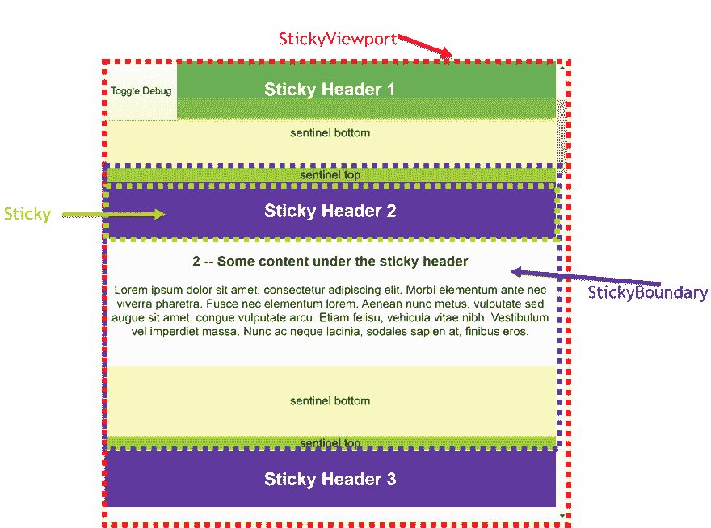

# 使用交叉点观察器对粘性事件做出反应

> 原文：<https://dev.to/dance2die/react-sticky-event-with-intersection-observer-310h>

*照片由[凯利·西克玛](https://unsplash.com/@kellysikkema?utm_source=unsplash&utm_medium=referral&utm_content=creditCopyText)在[Unsplash](https://unsplash.com/search/photos/sticky-notes?utm_source=unsplash&utm_medium=referral&utm_content=creditCopyText)T5 拍摄*

在 CSS ( `position: sticky`)中没有监控组件粘性的方法。

这篇关于 Google 的好文章，[CSS position:sticky 的事件](https://developers.google.com/web/updates/2017/09/sticky-headers)展示了如何在普通 JavaScript 中模拟粘性事件，而不使用 scroll event，而是使用 [IntersectionObserver](https://developer.mozilla.org/en-US/docs/Web/API/IntersectionObserver) 。

我将展示如何创建 React 组件来模拟相同的行为。

## 目录

*   [先决条件](#prerequisite)
*   [我们正在建造的东西](#what-we-are-building)
    *   [这里是工作沙箱](#here-is-the-working-sandbox)
*   [使用粘性事件组件](#using-sticky-event-components)
*   [实现粘性组件](#implementing-sticky-components)
    *   ⚛ [StickyViewport](#%E2%9A%9B-stickyviewport)
    *   ⚛ [胶粘供应商](#%E2%9A%9B-stickyprovider)
    *   ⚛ [粘性边界](#%E2%9A%9B-stickyboundary)
    *   🎣[使用 SentinelOffsets](#usesentineloffsets)
    *   🎣[使用观测台](#useobservetopsentinels)
    *   🎣[使用 observerbottomsentinels](#useobservebottomsentinels)
    *   ⚛ [粘粘的](#%E2%9A%9B-sticky)
*   [资源](#resources)

## 先决条件

这篇文章是基于[一个 CSS 职位的事件:sticky](https://developers.google.com/web/updates/2017/09/sticky-headers) ，它也提供了一个很好的[演示](https://ebidel.github.io/demos/sticky-position-event.html)和关于它是如何实现的解释以及[源代码](https://github.com/ebidel/demos/blob/master/sticky-position-event.html)。

基本思想是，在粘性边界周围添加顶部和底部的哨兵，并使用`IntersectionObserver`观察这些哨兵。

左边是上面链接文章中使用的术语，右边是这里使用的相应组件名称。

*   滚动容器-> `<StickyViewport />`
*   标题-> `<Sticky />`
*   粘性部分-> `<StickyBoundary />`

## 我们在建造什么

在继续之前，让我们看看我们正在构建什么。

[https://www.youtube.com/embed/Mq-g7bSEQvg](https://www.youtube.com/embed/Mq-g7bSEQvg)

粘滞的标题样式在不听[滚动事件](https://developer.mozilla.org/en-US/docs/Web/API/Document/scroll_event)的情况下粘滞和不粘滞时会改变，如果处理不当，会导致站点性能问题。

### 这里是工作沙箱。

[https://codesandbox.io/embed/react-sticky-javascript-refactored-w8otj](https://codesandbox.io/embed/react-sticky-javascript-refactored-w8otj)

*你可以点击`Toggle Debug`按钮来显示哨兵。*

您可以看到粘性标题改变了颜色和框阴影样式。

我们来看看粘性组件的用法。

## 使用粘性事件组件

下面是如何使用该组件来观察 un/stuck 事件。