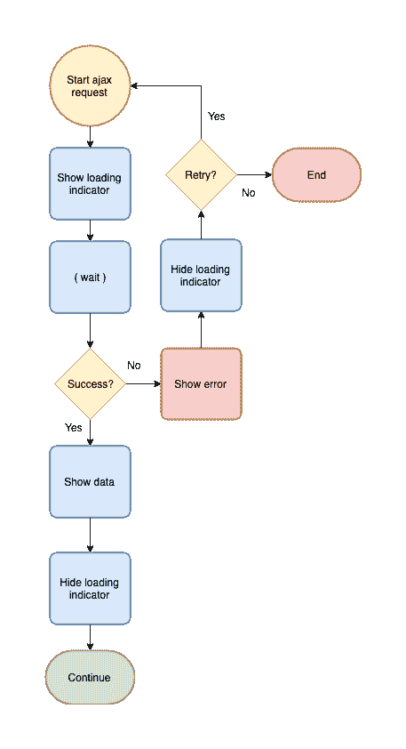

# React:编写自定义 API 挂钩

> 原文：<https://dev.to/patrixr/react-writing-a-custom-api-hook-l16>

让我们编写一个方便的自定义 react 钩子来处理我们已经反复编写的常见 API 逻辑。

## 简介

离开 React 几年后，我正在重新学习最佳实践。这个意思是: **[钩子](//reactjs.org/docs/hooks-reference.html)**

我们在应用程序中发现的一个非常(**非常**)常见的流程是从 API 加载数据并显示出来。

它通常看起来有点像这样:

[](https://res.cloudinary.com/practicaldev/image/fetch/s--NVB_wGAL--/c_limit%2Cf_auto%2Cfl_progressive%2Cq_auto%2Cw_880/https://files.tronica.io/manual-uploads/flowchart_api_fetch_5.png)

这有可能导致非常杂乱的组件。让我们用新发现的钩子知识来解决这个问题。

## 设计钩子

基于上面描述的流程，很容易定义我们希望钩子提供的数据。它将返回:

*   响应数据
*   装货旗
*   错误(成功时为空)
*   重试方法

鉴于我仍然喜欢将请求代码委托给服务类，我的想法是让钩子调用服务。

导致下面的用法:

```
const [ user, isLoading, error, retry ] = useAPI('loadUserById', 56); 
```

Enter fullscreen mode Exit fullscreen mode

## 准备 API 服务

让我们使用一个小服务类，我们可以在其中放置所有漂亮的 ajax 代码。

```
class APIService {
    async loadUsers() {
        // ... ajax magic
    }

    async loadUserById(id) {
        // ... ajax magic
    }
} 

export default new APIService(); 
```

Enter fullscreen mode Exit fullscreen mode

## 写钩

我们在这里的目标只是结合标准的 react 钩子来创建所有我们需要的字段。

### 状态

React 已经为我们提供了 [useState](https://reactjs.org/docs/hooks-reference.html#usestate) 钩子来创建和更新状态属性。

让我们生成我们的字段:

```
function useAPI(method, ...params) { 

  const [data, setData]           = useState(null);
  const [isLoading, setIsLoading] = useState(false);
  const [error, onError]          = useState(null);

} 
```

Enter fullscreen mode Exit fullscreen mode

### 调用服务

这里起作用的 React 钩子是 [useEffect](https://reactjs.org/docs/hooks-reference.html#useeffect) ，我们可以在其中运行我们的异步代码。

```
useEffect(() => {
   // ... async code
}, []); 
```

Enter fullscreen mode Exit fullscreen mode

然而，我们已经决定钩子将返回一个`retry`方法。所以让我们把异步代码移到它自己的函数

```
const fetchData = async () => {
   // ... async code
}

useEffect(() => { fetchData() }, []); 
```

Enter fullscreen mode Exit fullscreen mode

现在让我们根据钩子的参数
调用正确的服务方法

```
const fetchData = async () => {
  // Clear previous errors
  onError(null);

  try {
    // Start loading indicator
    setIsLoading(true);

    // Fetch and set data
    setData(await APIService[method](...params));
  } catch (e) {
    // Set the error message in case of failure
    setError(e);
  } finally {
    // Clear loading indicator
    setIsLoading(false);
  }
};

useEffect(() => { fetchData() }, []); 
```

Enter fullscreen mode Exit fullscreen mode

### 结果

瞧啊。我们的鱼钩已经可以食用了。

```
function useAPI(method, ...params) {
    // ---- State
    const [data, setData]           = useState(null);
    const [isLoading, setIsLoading] = useState(false);
    const [error, setError]         = useState(null);

    // ---- API
    const fetchData = async () => {
      onError(null);
      try {
        setIsLoading(true);
        setData(await APIService[method](...params));
      } catch (e) {
        setError(e);
      } finally {
        setIsLoading(false);
      }
    };

    useEffect(() => { fetchData() }, []);

    return [ data, isLoading, error, fetchData ];
} 
```

Enter fullscreen mode Exit fullscreen mode

## 组件中的用法

让我们写一个小例子来说明如何在组件中使用它

```
function HomeScreen() {
  const [ users, isLoading, error, retry ] = useAPI('loadUsers');

  // --- Display error
  if (error) {
    return <ErrorPopup msg={error.message} retryCb={retry}></ErrorPopup>
  }

  // --- Template
  return (
    <View>
      <LoadingSpinner loading={isLoading}></LoadingSpinner>
      {
          (users && users.length > 0) &&
            <UserList users={users}></UserList>
      }
    </View>
  );
} 
```

Enter fullscreen mode Exit fullscreen mode

## 结论

有许多方法可以避免在整个应用程序中重写公共代码。

在过去，我经常将其中一些委托给一个`Store`，或者使用`Mixins`来创建组件，使所有的逻辑都可以使用。

定制钩子给了我们一种全新的味道，并为处理问题开辟了新的策略。

乐于见证惯例的演变。

干杯，

帕特里克(男子名)