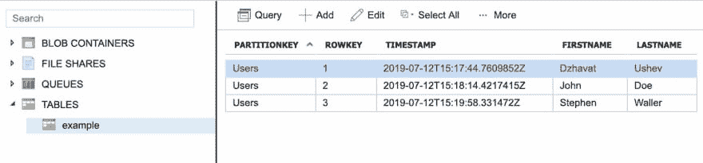
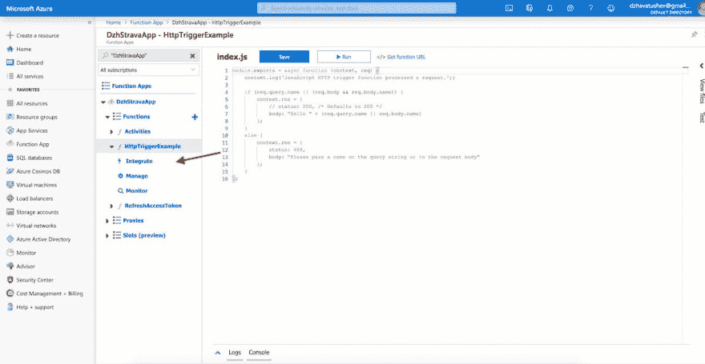
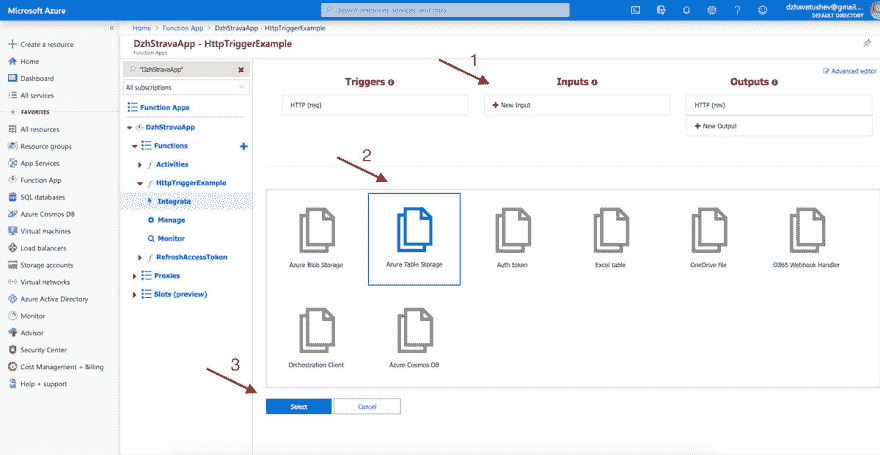
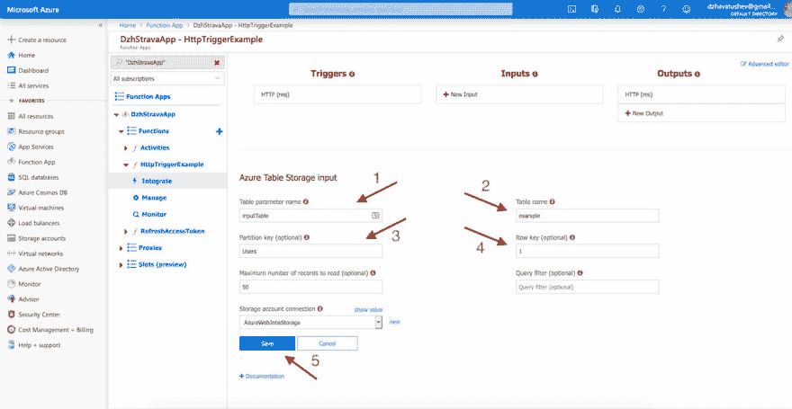
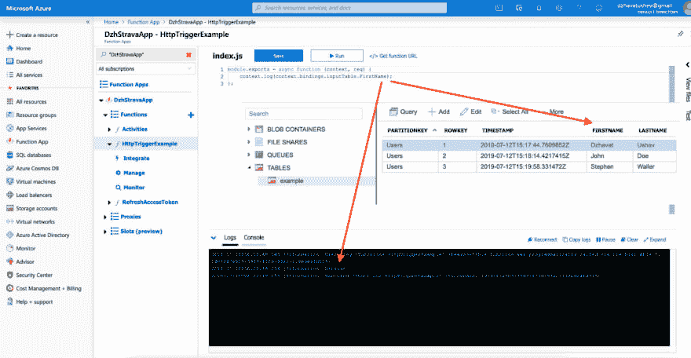

# 从 Node.js 中运行的 Azure 函数内部的表存储中读取(第 1 部分)

> 原文：<https://dev.to/dzhavat/reading-from-table-storage-inside-azure-functions-running-in-node-js-part-1-2h1l>

这篇文章最初发表在我的博客上。

* * *

上周，我花了很多时间研究如何在我的 Azure 函数中读取表存储。我不知道是我，我找到的教程，还是只是一般的概念，但有些东西不工作。这很令人沮丧。在某种程度上，我终于明白了，但对于这样一个简单的任务，我已经花费了过多的时间。

所以我写了下面的指南，主要是为了我自己，也是为了其他有类似问题的人。

不过，在开始之前，我需要设定一些限制。在本文中，我将向您展示如何从表存储中读取单个记录。在第二篇文章中，我将向您展示如何读取多个记录。下面的步骤描述了我是如何在 Azure 门户中完成这项工作的。如果您想在代码编辑器中工作时从表存储中读取数据，请查看本教程。此外，我假设您已经有了一个要读取的表。如果你没有，看看[这个教程](https://microsoft.github.io/AzureTipsAndTricks/blog/tip82.html)。这是我要用的桌子。出于本文的目的，我将读取第一条记录。

[](https://res.cloudinary.com/practicaldev/image/fetch/s--Q6JITfqS--/c_limit%2Cf_auto%2Cfl_progressive%2Cq_auto%2Cw_880/https://thepracticaldev.s3.amazonaws.com/i/iqbup2br2w4ftdzigj2q.jpg) 

<figure>

<figcaption>例表</figcaption>

</figure>

让我们开始吧。

#### 第一步

首先，我们需要一个 Azure 函数。如果您已经有一个，请随意跳过这一步。

1.  点击“功能”旁边的“+”。
2.  点击“HTTP 触发器”。
3.  给你的函数一个名字。
4.  点击“创建”。

[](https://res.cloudinary.com/practicaldev/image/fetch/s--qNOmz2GX--/c_limit%2Cf_auto%2Cfl_progressive%2Cq_auto%2Cw_880/https://thepracticaldev.s3.amazonaws.com/i/ginktlaofsdyegx2jczh.jpg) 

<figure>

<figcaption>创建新的 Azure 函数</figcaption>

</figure>

#### 第二步

一旦创建了函数，您将被重定向到一个名为`index.js`的文件。这就是 HTTP 触发的 Azure 函数目前的样子。我们稍后会回到这一页。现在点击“整合”选项卡。

[](https://res.cloudinary.com/practicaldev/image/fetch/s--tJQB484z--/c_limit%2Cf_auto%2Cfl_progressive%2Cq_auto%2Cw_880/https://thepracticaldev.s3.amazonaws.com/i/ubu9gf1vjlrfe8qp1m5h.jpg) 

<figure>

<figcaption>新创建的 Azure 函数</figcaption>

</figure>

#### 第三步

在此页面上，您可以添加不同的集成。现在，我们感兴趣的是创建一个新的表存储输入绑定。

1.  点击“输入”下的“新输入”按钮。
2.  从列表中选择“Azure Table Storage”。
3.  点击“选择”。

[](https://res.cloudinary.com/practicaldev/image/fetch/s--ncPv15pH--/c_limit%2Cf_auto%2Cfl_progressive%2Cq_auto%2Cw_880/https://thepracticaldev.s3.amazonaws.com/i/qf8hompz653fzaxnuy0i.jpg) 

<figure>

<figcaption>创建天蓝色表格存储绑定</figcaption>

</figure>

#### 第四步

接下来，您将看到一个页面，您可以在其中设置一些设置。

1.  “*表参数名*用于标识代码中的绑定。已经设置到`inputTable`了。您可以保持原样，也可以根据自己的意愿进行更改。记住它，因为你以后会用到它。
2.  "*表名*，顾名思义，就是将要使用的存储表的名称。我的情况是`example`。
3.  "*分区键*"是在表的分区键列中找到的值。该值可以标识一个或多个记录。对我来说，那是`Users`。
4.  "*行关键字*"是在表格的行关键字列中找到的值。该值必须只能标识一条记录。对我来说，那是`1`。
5.  最后，别忘了“保存”一切。

[](https://res.cloudinary.com/practicaldev/image/fetch/s--El-0nQkn--/c_limit%2Cf_auto%2Cfl_progressive%2Cq_auto%2Cw_880/https://thepracticaldev.s3.amazonaws.com/i/jaqk0gltxtgszhtdv1tp.jpg) 

<figure>

<figcaption>设置天蓝色表格存储</figcaption>

</figure>

这里需要注意的是，尽管“分区键”和“行键”字段是可选的，但在其中任何一个字段输入值都会使另一个字段成为必填字段。

#### 第五步

现在是时候回到第 2 步的`index.js`文件了。打开它，用下面的代码替换它的内容(不要忘记用您的表中的列名替换`FirstName`):

```
module.exports = async function (context, req) {
    context.log(context.bindings.inputTable.FirstName);
}; 
```

Enter fullscreen mode Exit fullscreen mode

*   `bindings`属性包含绑定到步骤 4 中创建的表存储的输入。
*   `inputTable`是我们命名表格参数的方式。在我的例子中，这指的是`example`表。
*   `FirstName`是我的表中的列名。

按“保存并运行”。当该功能执行时，您会在下方的日志选项卡中看到一些日志。如果设置正确，您将看到您的值被注销。

[](https://res.cloudinary.com/practicaldev/image/fetch/s--8AnH2_kP--/c_limit%2Cf_auto%2Cfl_progressive%2Cq_auto%2Cw_880/https://thepracticaldev.s3.amazonaws.com/i/30dlqpcmmossskszna57.jpg) 

<figure>

<figcaption>记录单个记录的值</figcaption>

</figure>

就是这样！没那么难吧。现在您知道了如何在 Azure 函数中从表存储中读取单个记录。请继续关注第二部分，我将分享如何读取多个记录。