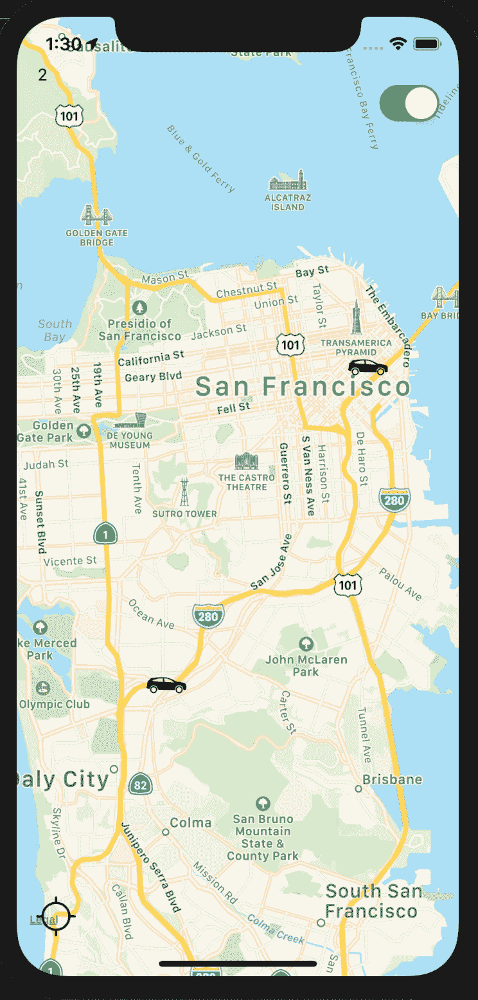
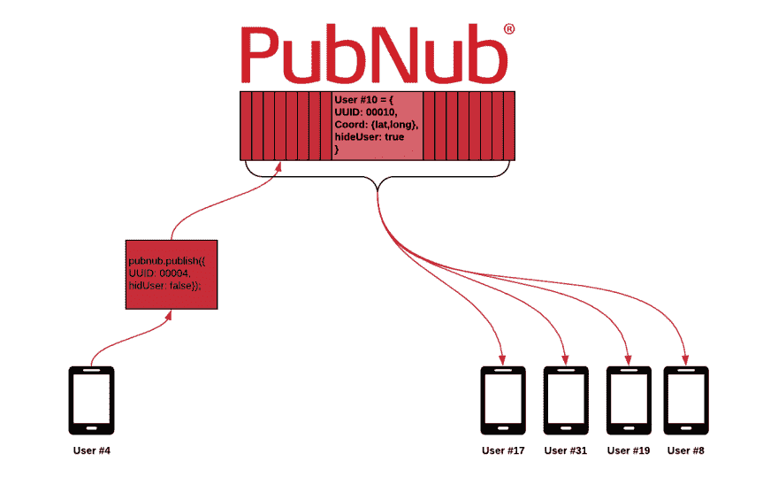

# React Native 实时地理位置跟踪

> 原文：<https://dev.to/pubnub/realtime-geolocation-tracking-with-react-native-327>

在 PubNub，我们相信能够推动互联体验的全球前沿。无论是物联网的新兴[模式还是在线应用的不断扩张，我们的使命都延伸到各种形式和规模的互联网技术。](https://www.pubnub.com/solutions/iot/?utm_source=Syndication&utm_medium=DevTo&utm_campaign=SYN-CY19-Q2-DevTo-July-15)

有了我们完全支持的 [React SDK](https://www.pubnub.com/docs/react-native-javascript/pubnub-javascript-sdk/?utm_source=Syndication&utm_medium=DevTo&utm_campaign=SYN-CY19-Q2-DevTo-July-15) ，开发人员现在可以自由地进行实时网络应用开发。

在本文中，我们将向您展示使用最流行的移动应用程序框架之一构建实时 [地理位置跟踪](https://www.pubnub.com/solutions/realtime-updates/?utm_source=Syndication&utm_medium=DevTo&utm_campaign=SYN-CY19-Q2-DevTo-July-15)是多么容易。无论你是想建立一个 rideshare 应用程序，[按需送货服务](https://www.pubnub.com/blog/what-is-the-on-demand-economy/?utm_source=Syndication&utm_medium=DevTo&utm_campaign=SYN-CY19-Q2-DevTo-July-15)，还是一个口袋妖怪 Go 游戏，这篇文章旨在给你所有必要的工具和技能，让你上路！

今天，我们将构建一个简单的地理跟踪应用程序，在地图视图上呈现多个用户。用户将能够切换他们的位置权限，以及点击按钮缩放他们所在位置的地图。当然，如果我们不包括 [PubNub Presence](https://www.pubnub.com/products/presence/?utm_source=Syndication&utm_medium=DevTo&utm_campaign=SYN-CY19-Q2-DevTo-July-15) 来跟踪应用程序中当前有多少用户在线，它就不是 PubNub。

[](https://res.cloudinary.com/practicaldev/image/fetch/s--ddI1JvRj--/c_limit%2Cf_auto%2Cfl_progressive%2Cq_auto%2Cw_880/https://www.pubnub.com/wp-content/uploads/2019/06/Screen-Shot-2019-06-26-at-1.30.38-PM.png%2522)

在直接进入代码之前，确保你[注册了一个免费的 PubNub 账户](https://dashboard.pubnub.com/signup/?utm_source=Syndication&utm_medium=DevTo&utm_campaign=SYN-CY19-Q2-DevTo-July-15)，这样我们以后就不会遇到任何问题。

## 步骤 1:设置您的环境

在本节中，我们将安装必要的工具和依赖项，以便能够模拟、运行和测试我们的 react-native 应用程序。

你需要添加的第一个工具是 Xcode。对于 Mac 用户，只需在 app store 免费下载 Xcode 即可。对于 PC 用户来说，如果你想为 iPhone 开发应用程序，你需要用虚拟机模拟 Mac OS。你可以在这里看到如何做这个[。](https://codewithchris.com/xcode-for-windows/)

我们要安装的下一个工具是 [Android Studio](https://developer.android.com/studio?gclid=EAIaIQobChMInP6pp6r74gIVE8JkCh2f9A0XEAAYASAAEgJID_D_BwE) 。这将允许你为 Android 开发你的应用程序。

接下来，您将安装我们应用程序的核心:React Native。这是一个由脸书开发的开源平台，多年来非常受欢迎。React Native 允许开发人员在多个平台上用一种语言编写他们的应用程序，这将使我们为 iOS 和 Android 开发的工作变得容易得多。

为了设置 React 本机开发环境，我们将使用 React 本机 CLI，这将允许我们快速安装库、链接包和模拟我们的应用程序。

假设您已经安装了 [Node 10+](https://nodejs.org/en/download/) ，您可以使用 npm 来安装 React Native CLI 命令行实用程序:

```
npm install -g react-native-cli
npm install -g react-native 
```

然后运行以下命令创建一个名为“YourProject”的新 React 本地项目:

```
react-native init YourProject
cd YourProject 
```

若要查看一切是否正常，请运行此命令，用 Xcode 的 iPhone 模拟器测试您的应用程序:

```
react-native run-ios 
```

## 第二步:安装和链接库

现在，我们将安装将要使用的库，然后将它们链接到我们的 React 本机应用程序。

我们要导入和链接的第一个库是 PubNub 的 React SDK，用于处理数据流。在您的项目目录中，安装带有
的库

```
npm install --save pubnub pubnub-react 
```

并将库链接到:

```
react-native link pubnub-react 
```

接下来，我们将需要 Airbnb 为我们的交互式地图 API 制作的 [react-native-maps 库。像以前一样安装库:](https://github.com/react-native-community/react-native-maps) 

```
npm install react-native-maps --save 
```

并将库链接到:

```
react-native link react-native-maps 
```

最后，我们将安装 react-native-response API，这将使我们的组件样式化更加容易:

```
npm install --save react-native-responsive-screen 
```

然后链接:

```
react-native link react-native-responsive-screen 
```

## 第三步:构建应用

现在是时候最终开始在 React Native 中构建我们的应用了！

### 导入库

打开 App.js 文件，导入我们之前安装的库以及一些基本的 React-Native 组件。

```
import React, {Component} from 'react';
import {Platform, StyleSheet, Text, View, TouchableOpacity, Switch, Image} from 'react-native';
import {widthPercentageToDP as wp, heightPercentageToDP as hp} from 'react-native-responsive-screen';
import MapView, {Marker} from 'react-native-maps';
import PubNubReact from 'pubnub-react'; 
```

### 构造函数和状态变量

在同一个 App.js 文件中，初始化一个构造函数来传入我们的 props 并初始化一个 PubNub 实例。

```
constructor(props) {
  super(props);

  this.pubnub = new PubNubReact({
    publishKey: "YOUR PUBLISH KEY",
    subscribeKey: "YOUR SUBSCRIBE KEY"
  });

  this.pubnub.init(this);
} 
```

正如你所看到的，我们首先用发布和订阅键声明了一个 PubNub 实例变量，当[注册一个免费的 PubNub 帐户](https://dashboard.pubnub.com/signup/?utm_source=Syndication&utm_medium=DevTo&utm_campaign=SYN-CY19-Q2-DevTo-July-15)时，我们得到了这个键。然后我们在构造函数的末尾初始化了 PubNub 实例。

注意:在构造函数的末尾初始化 PubNub 实例是非常重要的，否则代码将无法运行。

现在让我们创建一些应用程序运行时需要的状态变量。如果您还没有在 React 中使用过 state，那么在继续之前阅读一下 React Native 中的[状态可能会有所帮助。](https://facebook.github.io/react-native/docs/state) 

```
constructor(props) {
  super(props);

  this.pubnub = new PubNubReact({
    publishKey: "YOUR PUBLISH KEY",
    subscribeKey: "YOUR SUBSCRIBE KEY"
  });

  //Base State
  this.state = {
    currentLoc: { //Track user's current location
      latitude: -1,
      longitude: -1
    },
    numUsers: 0, //track number of users on the app
    username: "A Naughty Moose", //user's username
    fixedOnUUID: "",
    focusOnMe: false, //zoom map to user's current location if true
    users: new Map(), //store data of each user in a Map
    isFocused: false, 
    allowGPS: true, //toggle the app's ability to gather GPS data of the user
  };

  this.pubnub.init(this);
} 
```

虽然大多数状态变量对于地理跟踪应用程序来说似乎相当直观，但用户地图需要进一步解释。

用户地图将有助于我们在应用程序上呈现多个用户。地图中的每个条目将代表一个用户，并将映射到用户包含的特定应用内数据(GPS 坐标、UUID、allowGPS 等)。然后，我们将使用 PubNub 发布来自每个用户的 JSON 数据更新，以更新映射并相应地重新呈现应用程序的状态变量。在后面的部分中，您将看到这一点。

例如，如果我们想要更新用户的 allowGPS 变量，我们发布一个 JSON 对象来更新用户的变量映射:

```
this.pubnub.publish({
  message: {
    hideUser: true
  },
  channel: "channel"
}); 
```

[](///wp-content/uploads/2019/06/Blank-Diagram.png)

### PubNub

首先，在**componentidmount()**中声明一个异步函数。

```
async componentDidMount() {
  this.setUpApp()
} 
```

为了开始在我们的应用程序中接收 PubNub 消息，我们必须声明一个 PubNub 事件侦听器，后跟一个 PubNub 订阅者回调，指定通道如下:

```
async setUpApp(){

    this.pubnub.getMessage("YOUR CHANNEL", msg => {

/*------------WE'LL IMPLEMENT THIS LATER------------*/

    });

    this.pubnub.subscribe({
      channels: ["YOUR CHANNEL"],
    });
  } 
```

我们将在以后的应用程序中进一步实现这个功能。

### 反应原生地图

我们现在将开始为我们的用户实现交互式地图，以及跟踪他们的 GPS 数据。

为了收集用户的位置，我们在我们的 PubNub 订户:
下面实现了 react-native-maps**watch position()**函数

```
//Track motional Coordinates
navigator.geolocation.watchPosition(
  position => {
    this.setState({
      currentLoc: position.coords
    });
    if (this.state.allowGPS) {
      this.pubnub.publish({
        message: {
          latitude: position.coords.latitude,
          longitude: position.coords.longitude,
        },
        channel: "channel"
      });
    }
    //console.log(positon.coords);
  },
  error => console.log("Maps Error: ", error),
  {
    enableHighAccuracy: true,
    distanceFilter: 100 //grab the location whenever the user's location changes by 100 meters
  }
); 
```

现在您应该开始明白我们的用户地图框架的理由了。在我们收集了位置坐标之后，我们将纬度和经度数据发布到通道。该频道稍后将根据发布者的 UUID 更新该用户的位置数据。

现在，就像任何其他地图应用程序一样，我们应该添加一个功能，以便在用户按下按钮时将地图置于用户位置的中心。要添加此功能，请添加此函数实现。

```
focusLoc = () => {
   if (this.state.focusOnMe || this.state.fixedOnUUID) {
     this.setState({
       focusOnMe: false,
       fixedOnUUID: ""
     });
   } else {
     region = {
       latitude: this.state.currentLoc.latitude,
       longitude: this.state.currentLoc.longitude,
       latitudeDelta: 0.01,
       longitudeDelta: 0.01
     };
     this.setState({
       focusOnMe: true
     });
     this.map.animateToRegion(region, 2000);
   }
 } 
```

当被调用时，这个函数将把地图的查看区域集中在用户的当前位置。

最后，如果我们希望用户能够关闭他们的 GPS 定位，我们需要切换 allowGPS 状态。为此，也要在代码中添加这个函数。

```
toggleGPS = () => {
   this.setState({
     allowGPS: !this.state.allowGPS
   });
 }; 
```

### 用户数据汇总

现在，让我们回到我们之前定义的 PubNub 事件监听器。此应用程序的事件监听器的目的是获取发布到我们通道的数据更新，并相应地更新我们应用程序的状态变量。

为了更新用户映射，我们将首先初始化要操作的映射的副本:

```
this.pubnub.getMessage("channel", msg => {
  let users = this.state.users;
}); 
```

然后，我们检查传入的消息是否是用户请求隐藏他们的 GPS 数据，并相应地将他们从地图中删除。

```
if (msg.message.hideUser) {
  users.delete(msg.publisher);
  this.setState({
    users
  });
}else{
/*something else*/
} 
```

否则，消息包含用户的数据更新，我们必须声明一个新用户(用更新的值)来替换旧用户。

```
else{
        coord = [msg.message.latitude, msg.message.longitude]; //Format GPS Coordinates for Payload

        let oldUser = this.state.users.get(msg.publisher);

        let newUser = {
          uuid: msg.publisher,
          latitude: msg.message.latitude,
          longitude: msg.message.longitude,
        };

        if(msg.message.message){
          Timeout.set(msg.publisher, this.clearMessage, 5000, msg.publisher);
          newUser.message = msg.message.message;
        }else if(oldUser){
          newUser.message = oldUser.message
        }
        users.set(newUser.uuid, newUser);

        this.setState({
          users
        });
} 
```

我们只是实现了更新用户数据的接收端。现在，我们将实现发送端，用户将实际发布带有数据更新的消息。

为了知道用户何时更改了他们的数据变量，我们必须使用事件处理程序来检测这些更改。为此，我们将使用 React 的 **componentDidUpdate()** 函数，该函数将在应用程序数据发生变化时触发。

我们首先指定 **componentDidUpdate()** 函数来传入之前的道具和状态。

```
componentDidUpdate(prevProps, prevState) {

} 
```

在这个函数中，我们检查用户是否切换了他们的 **allowGPS** 和 **focusOnMe** 变量，并对应用程序的功能和状态进行必要的更改。

```
if (prevState.allowGPS != this.state.allowGPS) { //check whether the user just toggled their GPS settings
  if (this.state.allowGPS) { //if user toggled to show their GPS data, we add them to the user Map once again
    if (this.state.focusOnMe) { //if user toggled to focus map view on themselves
      this.animateToCurrent(this.state.currentLoc, 1000);
    }
    let users = this.state.users; //make a copy of the users array to manipulate

    //create a new user object with updated user values to replace the old user
    let tempUser = {
      uuid: this.pubnub.getUUID(),
      latitude: this.state.currentLoc.latitude,
      longitude: this.state.currentLoc.longitude,
      image: this.state.currentPicture,
      username: this.state.username
    };
    users.set(tempUser.uuid, tempUser);
    this.setState( //quickly update the user Map locally
      {
        users
      },
      () => {
        this.pubnub.publish({ //publish updated user to update everyone's user Map
          message: tempUser,
          channel: "channel"
        });
      }
    );
  } else { //if user toggled to hide their GPS data
    let users = this.state.users;
    let uuid = this.pubnub.getUUID();

    users.delete(uuid); //delete this user from the user Map
    this.setState({ //update the userMap
      users,
    });
    this.pubnub.publish({ //let everyone else's user Map know this user wants to be hidden
      message: {
        hideUser: true
      },
      channel: "channel"
    });
  }
} 
```

对于那些密切关注我们在这里所做的事情的人来说，你可能已经注意到了这段代码中的冗余。为什么我们在本地设置更新的用户的状态，然后将更新的用户对象发布到通道？那不是设置了两次状态吗？

虽然这个假设是正确的，但疯狂是有方法的。我们首先在本地更新状态，这样我们可以尽快更新用户的屏幕。然后，我们将更新后的用户对象发布到通道，这样网络上的其他人也可以更新他们的状态。

### 渲染

是时候观看我们的实时地理跟踪应用程序完美结合了！我们现在将在我们的 *App.js* 文件的 **render()** 函数中工作。当我们在本节中逐步构建组件时，请务必留意这些评论:

```
/*-----Next Snippet Goes Here-----*/ 
```

...因为它们会指引您在哪里插入下一段代码。

让我们首先将我们的用户映射声明到一个可用的数组中

```
let usersArray = Array.from(this.state.users.values()); 
```

现在在您的返回中，通过将初始区域设置为您想要的任何坐标，从 React-Native-Maps 呈现您的地图组件。

```
return (
     <View style={styles.container}  >
          <MapView
            style={styles.map}
            ref={ref => (this.map = ref)}
            onMoveShouldSetResponder={this.draggedMap}
            initialRegion={{
              latitude: 36.81808,
              longitude: -98.640297,
              latitudeDelta: 60.0001,
              longitudeDelta: 60.0001
            }}
          >
/*-----Next Snippet Goes Here-----*/          
          </MapView>
     </View> ); 
```

我们现在将遍历地图，开始渲染网络上的每个用户。

```
{usersArray.map((item) => (/*------Next Snippet Goes Here-------*/))} 
```

对于每个用户，我们必须从 React-Native-Maps 中呈现一个标记组件以及一个图像来表示该用户。

```
<Marker
  style={styles.marker}
  key={item.uuid} //distinguish each user's marker by their UUID
  coordinate={{ //user's coordinates 
    latitude: item.latitude,
    longitude: item.longitude
  }}
  ref={marker => {
    this.marker = marker;
  }}
>
  <Image
      style={styles.profile}
      source={require('./LOCATION OF YOUR USER IMAGE PROFILES')} //User's image 
  /> </Marker> 
```

在 MapView 下面，我们可以为用户定义一个切换开关来切换他们的 **allowGPS** 状态

```
<View style={styles.topBar}>
  <View style={styles.rightBar}>
      <Switch
      value={this.state.allowGPS}
      style={styles.locationSwitch}
      onValueChange={this.toggleGPS}
      />
  </View> </View> 
```

最后，我们可以添加一个按钮，将地图放在用户的中心。

```
<View style={styles.bottom}>
<View style={styles.bottomRow}>   
  <TouchableOpacity onPress={this.focusLoc}>
    <Image style={styles.focusLoc} source={require('./heart.png')} />
  </TouchableOpacity> </View> </View> 
```

### 造型

当然，你可以随心所欲地设计你的组件，但是这里有一个我在这个项目中使用的简单模板:

```
const styles = StyleSheet.create({
  bottomRow:{
    flexDirection: "row",
    justifyContent: "space-between",
    alignItems: "center"
  },
  marker: {
    justifyContent: "center",
    alignItems: "center",
    marginTop: Platform.OS === "android" ? 100 : 0,
  },
  topBar: {
    top: Platform.OS === "android" ? hp('2%') : hp('5%'),

    flexDirection: "row",
    justifyContent: "space-between",
    alignItems: "center",
    marginHorizontal: wp("2%"),
  },
  rightBar: {
    flexDirection: "row",
    justifyContent: "flex-end",
    alignItems: "center"
  },
  leftBar: {
    flexDirection: "row",
    justifyContent: "flex-start",
    alignItems: "center"
  },
  locationSwitch: {
    left: 300,
  },
  container: {
    flex: 1
  },
  bottom: {
    position: "absolute",
    flexDirection:'column',
    bottom: 0,
    justifyContent: "center",
    alignSelf: "center",
    width: "100%",
    marginBottom: hp("4%"),
  },
  focusLoc: {
    width: hp("4.5%"),
    height: hp("4.5%"),
    marginRight: wp("2%"),
    left: 15
  },
  userCount: {
    marginHorizontal: 10
  },
  map: {
    ...StyleSheet.absoluteFillObject
  },
  profile: {
    width: hp("4.5%"),
    height: hp("4.5%")
  },
}); 
```

### 安卓兼容性

为了与 Android 操作系统兼容，将这段代码放在您的 **setUpApp()** 函数的开头:

```
let granted;

if (Platform.OS === "android"){
  granted = await PermissionsAndroid.request( PermissionsAndroid.PERMISSIONS.ACCESS_FINE_LOCATION ,
    {
      title: 'Location Permission',
      message:
        'PubMoji needs to access your location',
      buttonNegative: 'No',
      buttonPositive: 'Yes',
    });      
} 
```

然后在 **watchPosition()** 函数周围放置一个 **if()** 语句，就像这样

```
if (granted === PermissionsAndroid.RESULTS.GRANTED || Platform.OS === "ios") { /*-----watchPosition()----*/ } 
    else {
      console.log( "ACCESS_FINE_LOCATION permission denied" )
    } 
```

## 第四步:测试 App

当您一切就绪后，您可以使用以下任一选项来模拟您的应用程序:

#### 模拟 IOS

```
react-native run-ios 
```

#### 或为安卓系统

```
react-native run-android 
```

## 结论

恭喜你！您已经在 React Native 中创建了自己的实时地理跟踪应用程序！欢迎在[devrel@pubnub.com](mailto:devrel@pubnub.com)向我们发送您的任何问题、疑虑或评论。

如果您仍然渴望更多的 PubNub React 原生内容，这里有一些您可能感兴趣的其他文章:

*   [构建 React 原生聊天应用–第一部分:基本消息传递](https://www.pubnub.com/blog/building-a-chat-app-with-react-native-and-pubnub-part-one-messaging/)
*   [如何用 PubNub](https://www.pubnub.com/blog/react-native-push-notifications-ios-android/) 在 React Native (iOS & Android)中设置推送通知
*   [实时物联网分析指南:使用仪表盘可视化您的数据](https://www.pubnub.com/blog/guide-to-realtime-iot-analytics-data-visualization-dashboard/)