# 在 Git 中重置分支

> 原文：<https://dev.to/godori/rebasing-a-branch-in-git-3bc>

> 在这篇文章中，你将学习如何使用 Rebase 来合并两个分支。

## 整合 Git 中的分支

如果您有两个分叉的分支，并且想要从一个分支集成到另一个分支，那么在 Git 中您通常会用两种方式来完成。

*   合并
*   重定…的基准

从它的名字可以很清楚地看出`merge`是做什么的。但是`rebase`到底是什么意思，你为什么需要它？在你进入`rebase`之前，让我们先来看看`merge`是如何工作的。

## 合并

`merge`命令在两个最近的分支提交和作为两个分支的最近共同祖先的基本提交之间执行`three-way merge`。

例如下面，有两个分支:一个有一些提交的“特性”分支和一个“主”分支。

[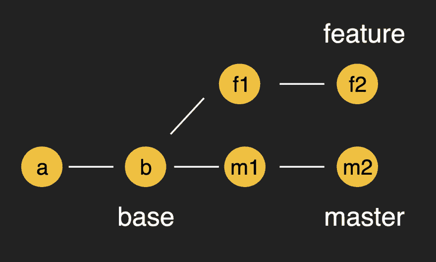](https://res.cloudinary.com/practicaldev/image/fetch/s--jII6LUam--/c_limit%2Cf_auto%2Cfl_progressive%2Cq_auto%2Cw_880/https://images.velog.io/post-images/godori/bfb81f20-b147-11e9-a131-ff9a59280693/git-branches.png)

假设每个特性和主的最后提交是`f2`和`m2`，并且有`b`是两个分支的共同祖先。因此，您可以基于这三个提交创建新的提交。

好的，那么实际上`three-way merge`的过程是什么呢？如果你在做一个`two-way merge`会怎么样？

### 三路合并

让我们看看为什么 3 路合并更有效。

注意，每个 a、b、c、d 都是从作为共同祖先的基本提交修改而来的部分。

[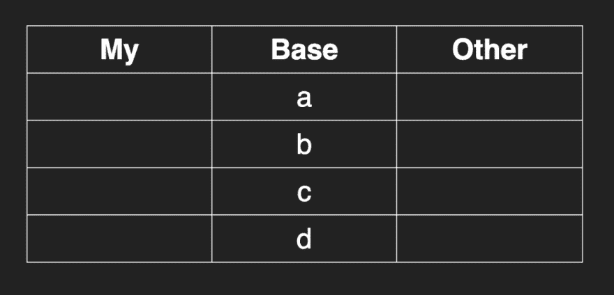](https://res.cloudinary.com/practicaldev/image/fetch/s--JNWtKFv2--/c_limit%2Cf_auto%2Cfl_progressive%2Cq_auto%2Cw_880/https://images.velog.io/post-images/godori/cc6dd5f0-b149-11e9-9a09-5b90e5f36c66/image.png)

下表显示了`My`分支和`Other`分支的修改部分。

[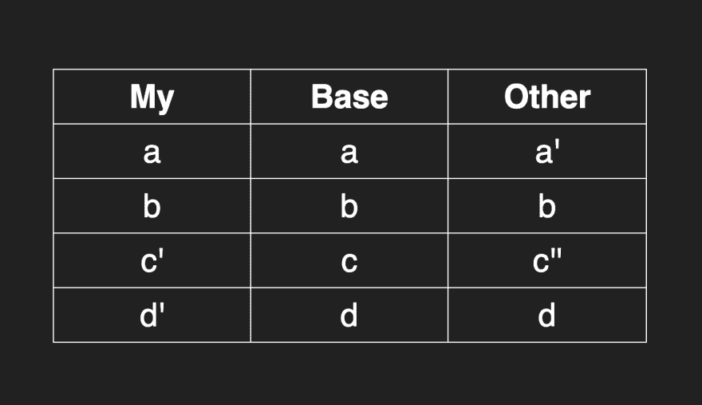](https://res.cloudinary.com/practicaldev/image/fetch/s--2UU-xNFu--/c_limit%2Cf_auto%2Cfl_progressive%2Cq_auto%2Cw_880/https://images.velog.io/post-images/godori/ba58aa60-b14a-11e9-a131-ff9a59280693/image.png)

首先，`a`在我的分支中没有改变，但是其他人修改了它。其次，`b`两边不变。`c`变了样。最后`d`只在我的分支上改变了。

假设我们将合并两个没有共同祖先的分支。

[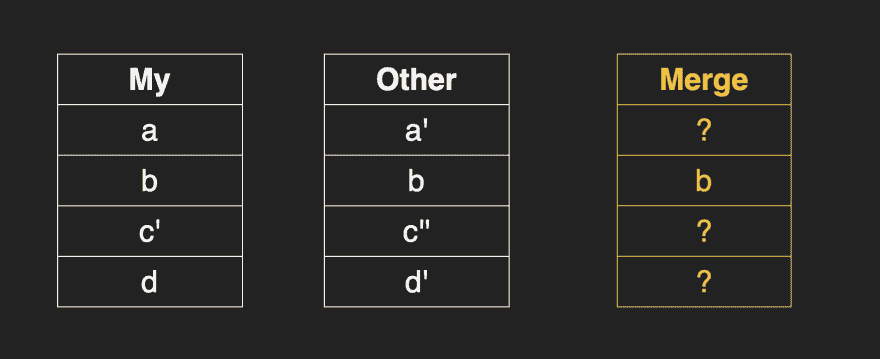](https://res.cloudinary.com/practicaldev/image/fetch/s--Tlr4tbkc--/c_limit%2Cf_auto%2Cfl_progressive%2Cq_auto%2Cw_880/https://images.velog.io/post-images/godori/a2ba1b40-b14b-11e9-a131-ff9a59280693/image.png)

但是很难知道是否发生了冲突，除了双方都观察到的 b 部分。

出于这个原因，我们在比较期间使用包括基本提交在内的三向合并来更清楚地决定合并提交的状态。

[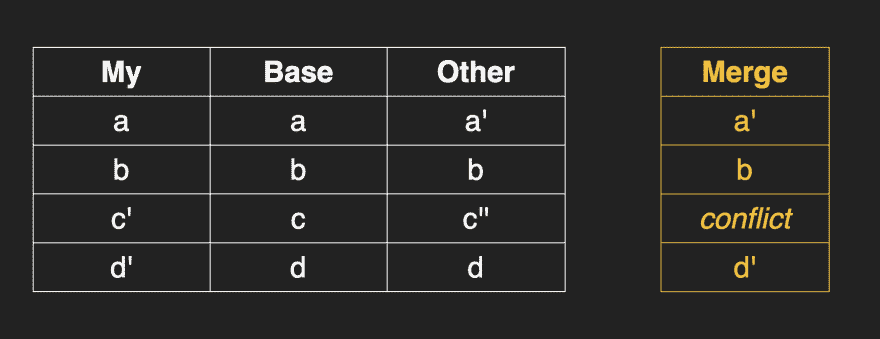](https://res.cloudinary.com/practicaldev/image/fetch/s--4M8vzdCr--/c_limit%2Cf_auto%2Cfl_progressive%2Cq_auto%2Cw_880/https://images.velog.io/post-images/godori/2e3c85e0-b14c-11e9-9a09-5b90e5f36c66/image.png)

简而言之，当将两个提交合并成一个时，我们使用每个分支的最后一次提交和它们的最新公共祖先。

## Rebase

重定基础是将多个分支合并成一个分支的第二种方法，它将公共祖先的基础更改为不同的提交点。让我们再看看树枝的照片。
[T3】](https://res.cloudinary.com/practicaldev/image/fetch/s--Uoa7Qwh8--/c_limit%2Cf_auto%2Cfl_progressive%2Cq_auto%2Cw_880/https://images.velog.io/post-images/godori/a27c8b20-b14d-11e9-a131-ff9a59280693/git-branches.png)

我们希望看到的使用 rebase 是这样的！

[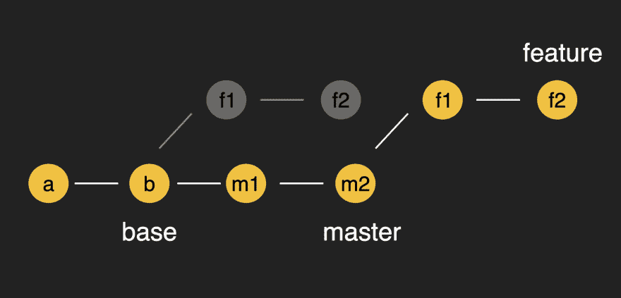](https://res.cloudinary.com/practicaldev/image/fetch/s--mQh3DfIx--/c_limit%2Cf_auto%2Cfl_progressive%2Cq_auto%2Cw_880/https://images.velog.io/post-images/godori/bf044d70-b2d1-11e9-a332-d525eafa8638/image.png)

换句话说，您确实将特性的基本提交重新基于`m2`而不是`b`。

**下面是`rebase`** 的基本策略

首先，git 从提交中获取修改的补丁，并将其保存在某个地方。然后它将这些应用到主分支来创建新的提交。

将特征重置为主分支需要经过一系列步骤。

```
1\. Checkout to the feature branch
2\. Rebase into the master branch
3\. Fast-Forward Merge: feature branch into the master branch 
```

[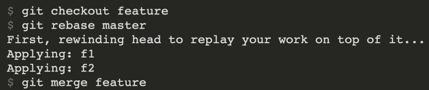](https://res.cloudinary.com/practicaldev/image/fetch/s--7jCvXfdv--/c_limit%2Cf_auto%2Cfl_progressive%2Cq_auto%2Cw_880/https://images.velog.io/post-images/godori/6e494040-b15d-11e9-8bdc-2f7c5d6ac42c/image.png)

> 为什么我们在重置基础时需要一个`merge`？看一看[快进合并](https://www.youtube.com/watch?v=_4JdLEhxlBQ)

这里有一个分步指南。

### 第一步

```
git checkout feature 
```

结账后，头指向特征。

[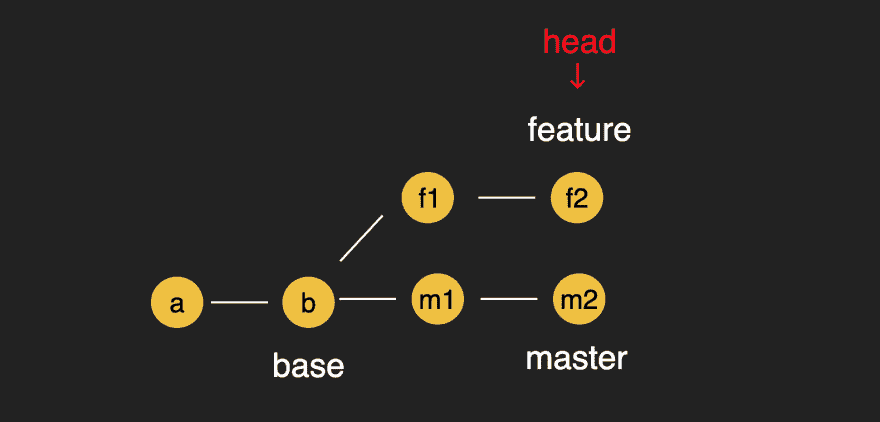](https://res.cloudinary.com/practicaldev/image/fetch/s--Kls-fwQf--/c_limit%2Cf_auto%2Cfl_progressive%2Cq_auto%2Cw_880/https://images.velog.io/post-images/godori/174abe40-b15d-11e9-a131-ff9a59280693/image.png)

### 第二步

```
$ git rebase master 
```

Git 存储从主和特征的基础提交到当前分支的提交的差异(`▵1`，`▵2`)。

[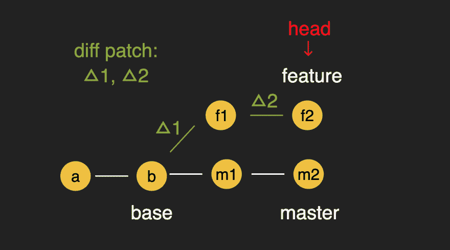](https://res.cloudinary.com/practicaldev/image/fetch/s--Q2rCrcrx--/c_limit%2Cf_auto%2Cfl_progressive%2Cq_auto%2Cw_880/https://images.velog.io/post-images/godori/8fa81e80-b15f-11e9-a308-131479da2b82/image.png)

### 第三步

让头指向主人

[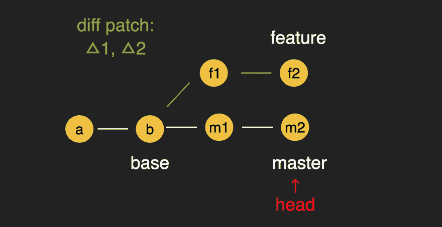](https://res.cloudinary.com/practicaldev/image/fetch/s--MCEMdBtx--/c_limit%2Cf_auto%2Cfl_progressive%2Cq_auto%2Cw_880/https://images.velog.io/post-images/godori/8b3a3d10-b15f-11e9-a308-131479da2b82/image.png)

### 第四步

```
Applying f1 
```

之后，通过将`▵1`应用到`m2`中来创建提交`f1`。

[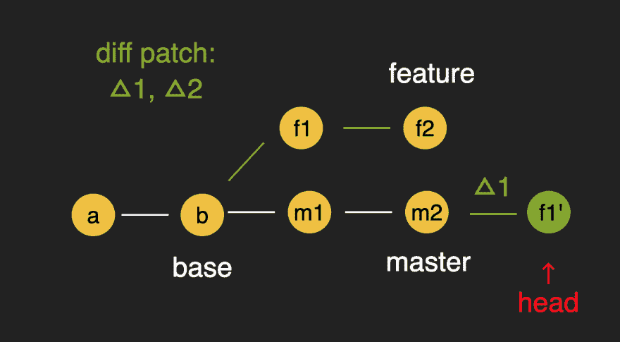](https://res.cloudinary.com/practicaldev/image/fetch/s--BPIqXYG8--/c_limit%2Cf_auto%2Cfl_progressive%2Cq_auto%2Cw_880/https://images.velog.io/post-images/godori/ade9a210-b15f-11e9-9a9a-0f3d00cfbaf3/image.png)

### 第五步

```
Applying f2 
```

在`f1'`上应用`▵2`差异创建新的提交`f2'`

[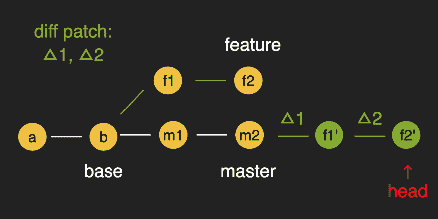](https://res.cloudinary.com/practicaldev/image/fetch/s--pT7_YiHS--/c_limit%2Cf_auto%2Cfl_progressive%2Cq_auto%2Cw_880/https://images.velog.io/post-images/godori/f4617d30-b15f-11e9-9a9a-0f3d00cfbaf3/image.png)

### 第六步

现在制作`feature`分支点`f2'`。

[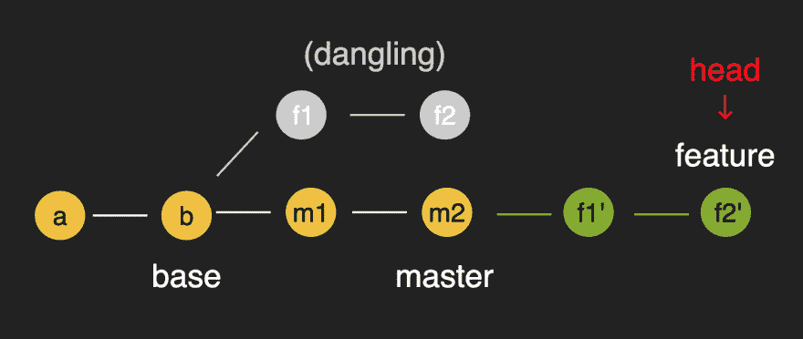](https://res.cloudinary.com/practicaldev/image/fetch/s--tMRgxqno--/c_limit%2Cf_auto%2Cfl_progressive%2Cq_auto%2Cw_880/https://images.velog.io/post-images/godori/2429d990-b160-11e9-9a9a-0f3d00cfbaf3/image.png)

### 第七步

```
git merge feature 
```

重设基础不会移动母版的位置。重置基础后，您可以使用`fast-forward merge`完成所有过程。

[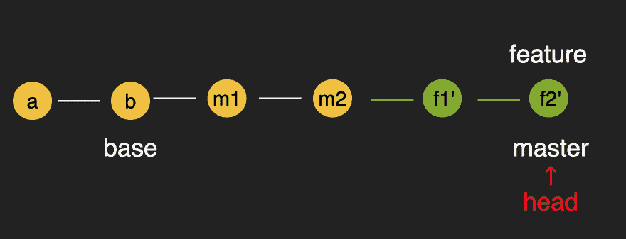](https://res.cloudinary.com/practicaldev/image/fetch/s--xnU8gF3x--/c_limit%2Cf_auto%2Cfl_progressive%2Cq_auto%2Cw_880/https://images.velog.io/post-images/godori/b9224b40-b160-11e9-9a9a-0f3d00cfbaf3/image.png)

## 合并 vs 重置基础

两个分支合并哪个好？这要看你的团队和项目的情况。

如果您想保留所有提交，包括更改历史，您可以使用`merge`。另一方面，如果您想保持一个线性历史而不进行任何合并提交，您应该选择`rebase`。

## 参考文献

*   [Pro Git-rebase](https://git-scm.com/book/en/v2/Git-Branching-Rebasing)