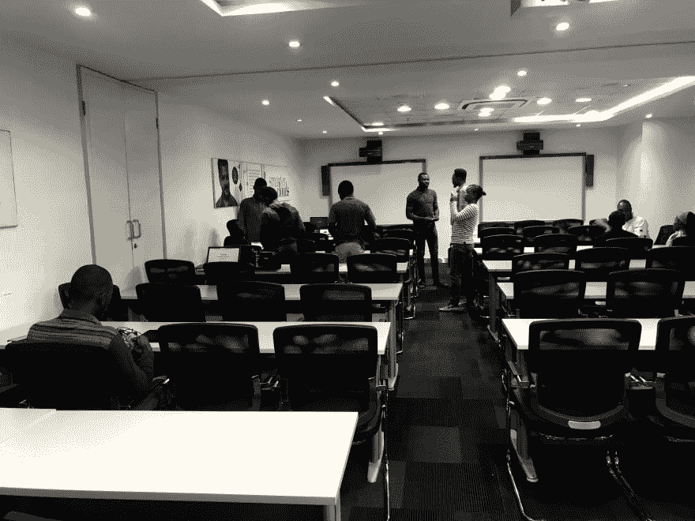
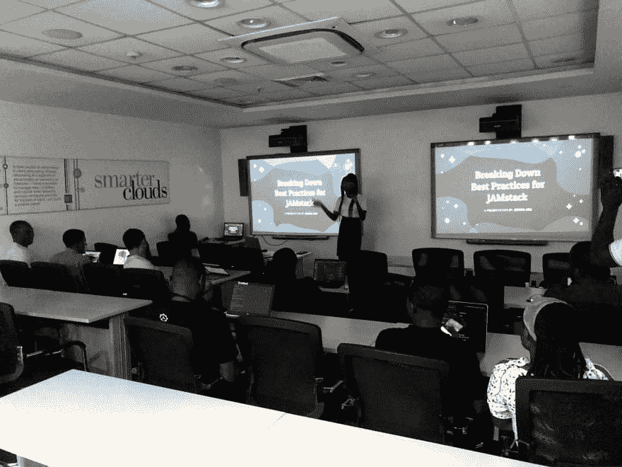
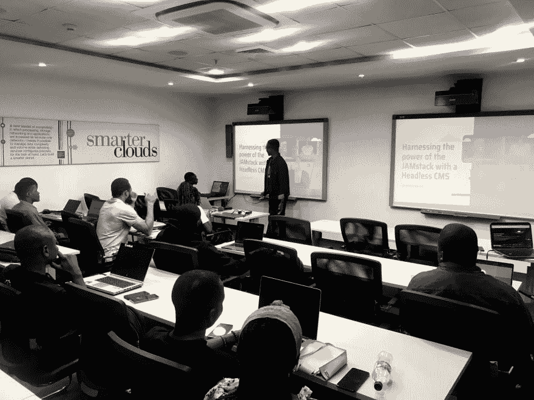
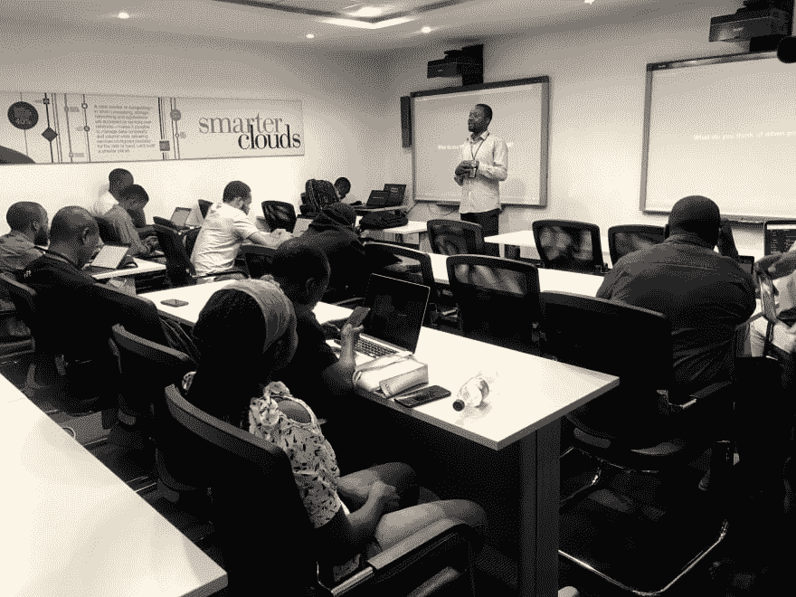
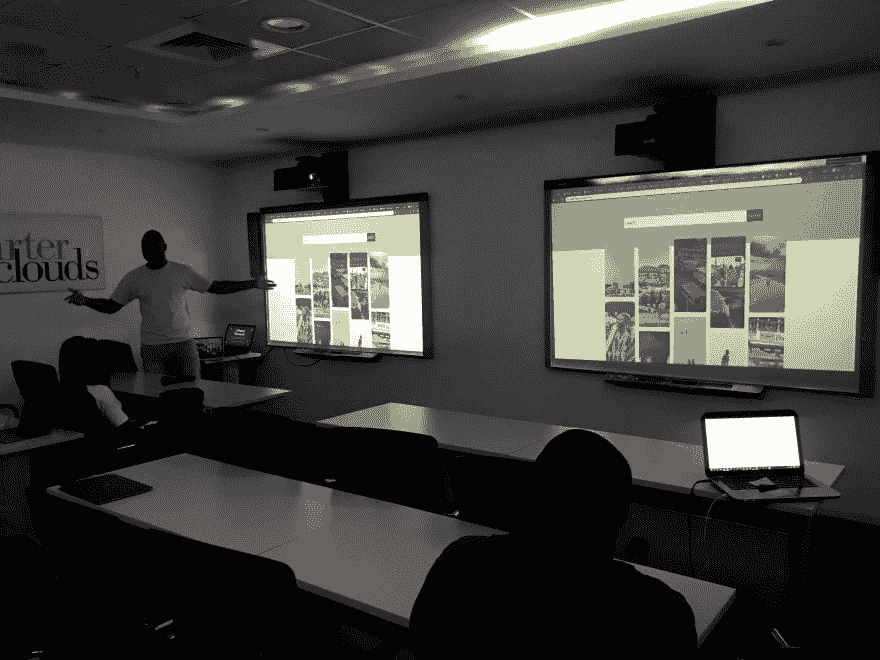
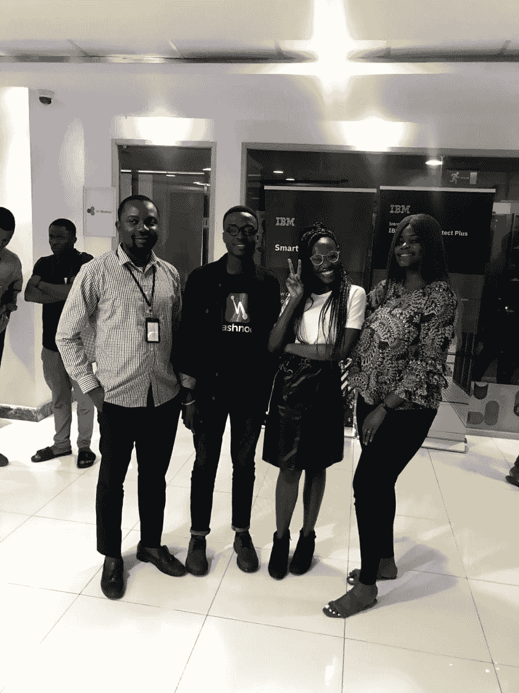
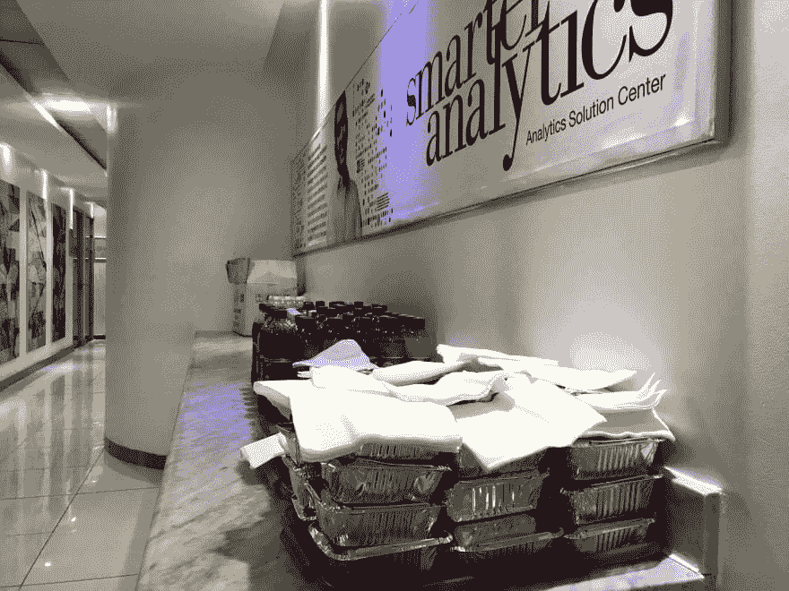
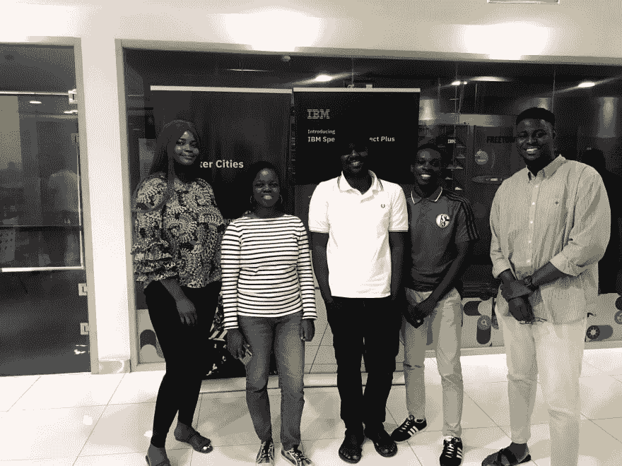
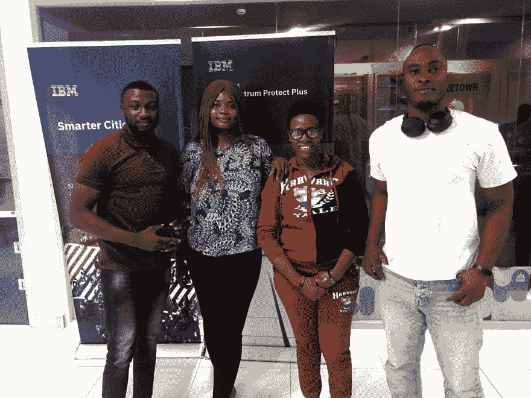
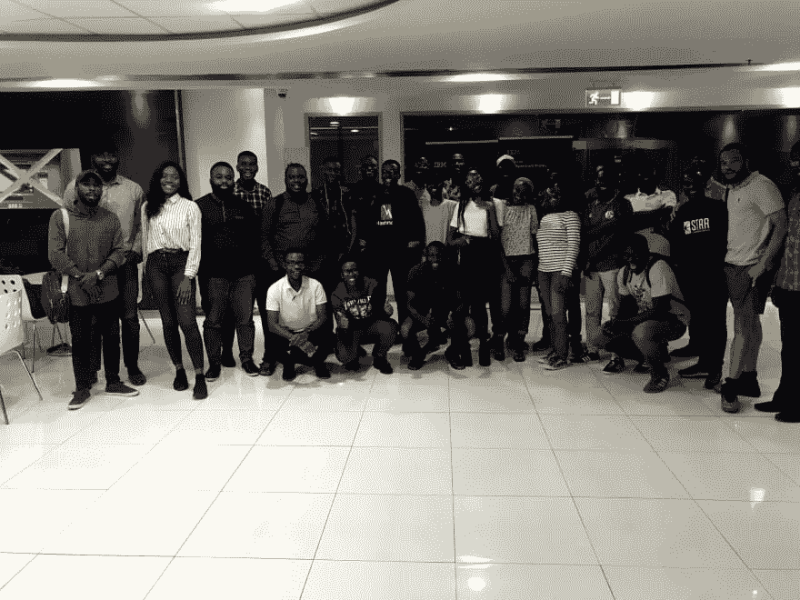

# 摘要:JAMstack 拉各斯会议

> 原文：<https://dev.to/lauragift21/recap-jamstack-lagos-meetup-i9f>

嗯，首先，多好的一个周末！我仍然对最近在拉各斯举行的 JAMstack meetup 的成功感到震惊。这是第二届，虽然我们在五月举办了第一届。我决定写一个整个活动的快速回顾，这只是为了看看这个活动随着时间的推移发展得有多好，也是为了让那些无法参加的人看一看我们分享的精彩。

液体错误:内部

策划这次活动很棒，因为我和我的合作组织者 William 事先做了所有的安排。该活动于 9 月 14 日在拉各斯的 IBM 创新中心举行。我们公开征集演讲者，收到了几个非常棒的提案，这意味着人们对 JAMstack 感到非常兴奋，这让我非常高兴。我们只有两个发言人的位置，所以我们必须做出选择。我们请来了杰迈玛·阿布和 T2 作为本期节目的发言人，稍后我们将详细介绍他们的谈话。

## 事件回顾附图片

我们有 90 多名与会者回复了我们的会议邀请，但是只有大约 35 名与会者到场，这仍然很棒！我已经计划好了议程，所以整个活动进行得很顺利。由于一些技术问题，活动于上午 11:50 开始，而不是上午 11:00 开始，这些问题后来得到了解决。但你知道吗，与其等待，为什么不允许与会者的网络真棒是吗？我们举办这些社交活动是因为参加这样的聚会的目的是为了学习和结识新朋友。

杰迈玛作为我们今天的第一位演讲者开始发言。她的演讲是关于[分解 JAMstack 的最佳实践。](https://docs.google.com/presentation/d/14A5M-v6KBQof6MNqgnDXK5X5sDD7f1LtwFC6J_83lAc/edit#slide=id.p)她分享了使用 JAMstack 开发时需要考虑的最佳实践。我最喜欢的是缓存失效和自动构建。她几乎扼杀了这个演讲，并且还做了一个现场演示来进一步向我们解释这些实践。

接下来，我们有请[博拉吉](https://twitter.com/iambolajiayo/status/1172905156511490048)，他做了一个关于[利用无头 CMS 的 JAMstack 能力的演讲。](https://slides.com/bolajiayodeji/jamstack-headless-cms#/)。博拉吉手把手给我们讲了内容管理系统。深入解释了 CMS 的历史，并告诉我们传统 CMS 和 Headless CMS 之间的区别，还概述了两者的特点，并给了我们一些例子。我喜欢他的演讲。

就在观众认为他们已经拥有足够多的精彩内容时，我们迎来了一位令人惊讶的演讲者 [Tosin Amuda](https://twitter.com/tosinamuda) ，他是 IBM 的一名开发人员。他谈到了如何用 IBM cloud 函数构建 JAMstack 应用程序。当我发现 IBM 能做些什么时，我惊呆了。我迫不及待地想尝试一下我从他的演讲中学到的所有好处。

在进行了这些会谈后，我决定通过引入推销会谈来增加聚会的趣味性。这是与会者分享他们所做的事情(附带项目、工作机会等)的一个途径。每位与会者有 3 分钟的时间来分享，我们有超过 5 名与会者站出来向我们展示他们正在做的伟大的事情。

[T6】](https://res.cloudinary.com/practicaldev/image/fetch/s--smqC853L--/c_limit%2Cf_auto%2Cfl_progressive%2Cq_auto%2Cw_880/https://thepracticaldev.s3.amazonaws.com/i/3wr3wrhu6xvzl17wz37n.jpg)

最后，我们在下午 3 点左右吃了午饭，真是漫长的一天，是时候上网和吃饭了。我将与与会者和演讲者分享一些集体照片。

这是一次成功！分享令人惊叹的内容，令人惊叹的人，分享许多乐趣和知识。我们对这一切的结果感到兴奋。策划活动并不是世界上最容易的事情。但是最终看到这种成功让我们想做更多。没有我们的赞助商，我们将无法做到这一点！感谢 IBM 创新中心提供的场地和我们忠实的赞助商。❤️❤️❤️