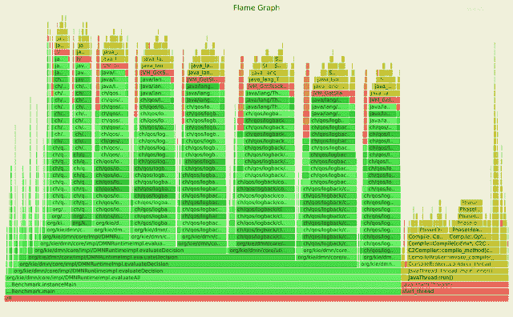
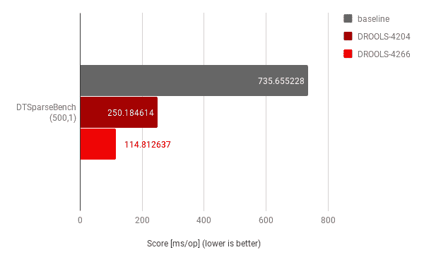
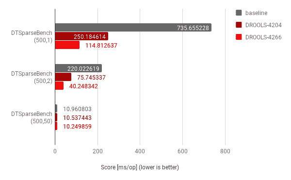
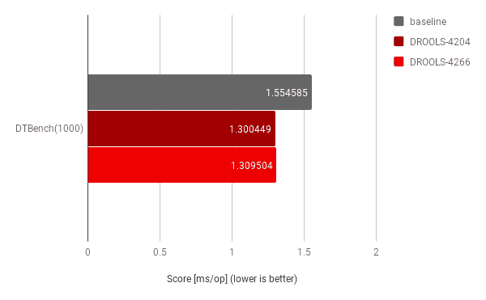

# 最近 Drools DMN 开源引擎的性能改进

> 原文：<https://dev.to/tarilabs/recent-drools-dmn-open-source-engine-performance-improvements-4bmc>

我们一直在寻求提高 Drools DMN 开源引擎的性能。我们最近审查了一个 DMN 用例，其中输入数据节点的实际输入数量在某种程度上有所不同；这突出了引擎的次优行为，我们在最近的版本中对此进行了改进。我想分享我们的发现！

## 基准开发

当我们开始运行这个用例的支持基准时，特别是在研究具有稀疏填充的输入数据节点的大型 DMN 模型的场景时，我们注意到一些奇怪的结果:flamegraph 数据在记录消息时突出了显著的性能影响，与应用程序逻辑本身相比，消耗了非常多的时间。

这个火焰图特别强调了堆栈跟踪合成消耗了很大一部分时间，这是由日志记录框架人为引起的。在这种情况下，纠正措施是调整日志记录配置以避免这个问题；具体来说，我们禁用了日志框架的一个特性，这个特性在调试活动中非常方便，能够快速定位原始调用类和方法:不幸的是，这个特性是以合成 stacktraces 为代价的，它最初污染了基准测试结果。这里学到的经验:总是首先检查非功能性需求是否掩盖了真正的问题！

在继续更详细地研究用例之前，这是一个必要的预备步骤。

## 提高性能

现在继续关注 DMN 优化，我们专门开发了一个足够通用的基准，但也突出了呈现给我们的用例。该基准由一个 DMN 模型组成，该模型有许多(500)个决策节点需要评估。另一个参数控制用于评估的输入数据节点价值化的稀疏性；范围从所有输入都被填充的值 1 到两个输入中只有一个被实际填充的值 2，等等。

这个特定的基准被证明是一个非常有用的工具，可以突出一些潜在的改进。

将比较基线设置为 Drools 7 . 23 . 0 . final 版本，使用 [DROOLS-4204](https://issues.jboss.org/browse/DROOLS-4204) 实现的第一次优化侧重于在评估 FEEL 表达式时改进上下文处理，并证明提供了大约 3 倍的性能提升，而使用 [DROOLS-4266](https://issues.jboss.org/browse/DROOLS-4266) 实现的进一步优化侧重于决策表输入子句的特定情况，证明在 DROOLS-4204 的基础上又有大约 2 倍的性能提升。

我们还在下图中收集了这些测量值。

该图突出了稀疏因子等于 1 的情况下的复合改进，其中所有输入都被填充；这是一个非常重要的结果，因为事实上它确实代表了最初用例中的 **main** 、“快乐之路”场景。

换句话说，与在 7.23.0.Final 上运行相同的用例相比，我们实现了大约 6 倍的性能提升。我在这里学到的经验是，尽可能地争取这种*复合*的性能提升，因为它们实际上是建立在彼此的基础上，以获得更好的结果！

为了完整性，我们重复了稀疏因子等于 2(实际上每 2 个输入中有 1 个被填充)和 50(实际上每 50 个输入中有 1 个被填充)的分析，测量结果如下:

结果表明，稀疏因子等于 2 时，优化也很重要，但随着该因子的增长，相关的改进就不那么显著了——这是预期的，因为决策节点评估对整体执行逻辑的影响现在变得不那么相关了。

为了完整起见，还使用另一个已经存在的基准对包含许多规则行的单个决策表进行了分析:

结果表明，这些代码变化作为一个整体，仍然提供了相关的改进；尽管显然与原始用例的*数量级*不同。这是另一个重要的检查，以确保这些改进不会过度适应特定的用例。

## 结论

考虑到 Drools 7 . 23 . 0 . final 版本作为基准，以及一个包含许多待评估决策节点的 DMN 模型的参考基准，我们实现了几个优化，这些优化一旦结合起来，就证明在那个特定用例上总共提供了大约 6 倍的速度提升！

我希望这是一个有趣的帖子，强调一些维度，以实现更好的性能；让我们知道你的想法和反馈。

今天，您已经可以从 Drools 最新版本中的这些 Kie [DMN 开源引擎](https://drools.org/learn/dmn.html)改进中受益！