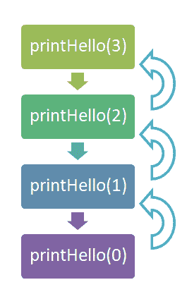
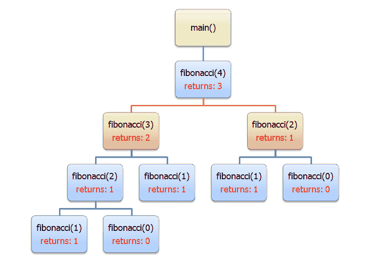

# 递归

> 原文：<https://dev.to/giladri/recursion-4llc>

如果你谷歌“递归”，谷歌问你:“你的意思是:递归”。

[](https://res.cloudinary.com/practicaldev/image/fetch/s---ilwv3BW--/c_limit%2Cf_auto%2Cfl_progressive%2Cq_auto%2Cw_880/https://thepracticaldev.s3.amazonaws.com/i/7cj7q2i5gotwrvwz8um7.jpg)

这是一个愚蠢的笑话，但它可以告诉我们这个话题有多重要，谷歌选择在搜索引擎中添加一个内置的笑话。

不管怎样，尽管递归被认为是学生最讨厌的科目之一，但它在实践中并不是一个很难的科目，而且非常有用。

递归只是一种由调用自身的函数创建循环的方式。仅此而已。让我们看一个例子。首先，有一个代码使用了一个 **`for`** 循环:

```
#include <stdio.h> 
void printHello(int times) {
    for (int i = times; i > 0; i--) {
        printf("Hello\n");
    }
}

int main() {
    printHello(3);
    // Success
    return 0;
} 
```

Enter fullscreen mode Exit fullscreen mode

您可能已经发现，上面的代码只打印了“Hello”三次。现在，让我们看看同样的代码，但是使用了递归:

```
#include <stdio.h> 
void printHello(int times) {
    if (times <= 0) { // You can write instead: if (!times)
        return;
    }
    printf("Hello\n");
    printHello(--times);
}

int main() {
    printHello(3);
    // Success
    return 0;
} 
```

Enter fullscreen mode Exit fullscreen mode

此代码**也**打印:

```
Hello
Hello
Hello 
```

Enter fullscreen mode Exit fullscreen mode

> “但是...为什么？”

因为 **`main`** 函数调用 **`printHello(3)`** 。这个函数有 **`times==3`** 因此它打印并调用自己: **`printHello(2)`** 。同样，条件不满足，函数打印并调用自身: **`printHello(1)`** 。又有: **`printHello(0)`** 。**现在**，终于，条件满足，我们回到 **`printHello(1)`** 。这个函数也完成了它的作用域，我们返回到 **`printHello(2)`** 。该功能与我们返回到 **`printHello(3)`** 相同。之后，我们返回到 **`main`** ，我们代码的运行以退出代码 0 结束(成功)。

> “什么，什么什么？!"

下面的流程图会解释一切:
[](https://res.cloudinary.com/practicaldev/image/fetch/s--M7Vl9StE--/c_limit%2Cf_auto%2Cfl_progressive%2Cq_auto%2Cw_880/https://thepracticaldev.s3.amazonaws.com/i/s4g29r75n1fzdc0ope4w.PNG) 
可以看到，每个 **`printHello(n)`** 调用 **`printHello(n-1)`** 直到达到 0。然后，每个 **`printHello(k)`** 完成它的运行，并返回到它的调用者——函数 **`printHello(k+1)`** 。仅此而已！

让我们看另一个例子。在这个例子中，我们的应用程序向用户请求一个索引，并打印在斐波纳契数列中有这个索引的[斐波纳契](https://en.wikipedia.org/wiki/Fibonacci_number)数。

```
#include <stdio.h> 
int fibonacci(int index){
    if (index == 0) {         // First stop condition
        return 0;
    } else if (index == 1) {  // Second stop condition
        return 1;
    } else {
        // The recursive call
        return (fibonacci(index - 1) + fibonacci(index - 2));
    }
}

int main() {
    int index;
    // Gets an index from the user
    printf("Enter the index\n");
    scanf("%d", &index);
    // Prints the number in the 
    printf("%d\n", fibonacci(index));
    // Success
    return 0;
} 
```

Enter fullscreen mode Exit fullscreen mode

下面的流程图解释了在索引 4 的代码中发生了什么。注意每个函数都有两次递归调用，第一次调用总是在左边:
[](https://res.cloudinary.com/practicaldev/image/fetch/s--aorKzJma--/c_limit%2Cf_auto%2Cfl_progressive%2Cq_auto%2Cw_880/https://thepracticaldev.s3.amazonaws.com/i/9hly2md6q5yuqpi5tpoa.PNG)

总之，每个递归函数必须有一个停止条件和一个递归调用(当然)。如果我们没有停止条件，我们的递归将像一个无限循环——但在这种情况下，我们的程序将相对较快地崩溃，因为它的内存结束了。每次函数调用都会产生新的局部变量和其他计算机需要保存在内存中的东西，因此，在大量的递归调用之后，我们的函数可能会崩溃。因此，注意并且**总是确保你的递归**有一个极限。

确保你完全理解这个主题——许多面试官喜欢在工作面试中给出递归问题。

#### **永远记住，事情比你想象的要复杂得多！**

问候，
吉拉德