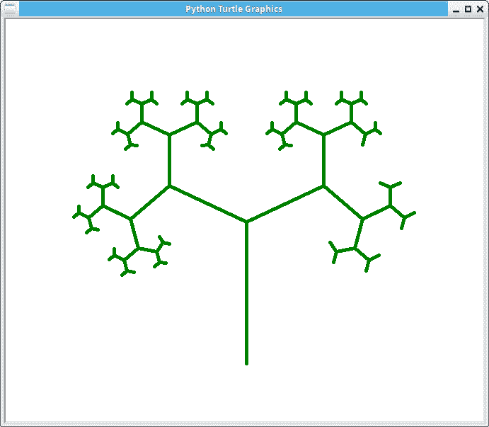
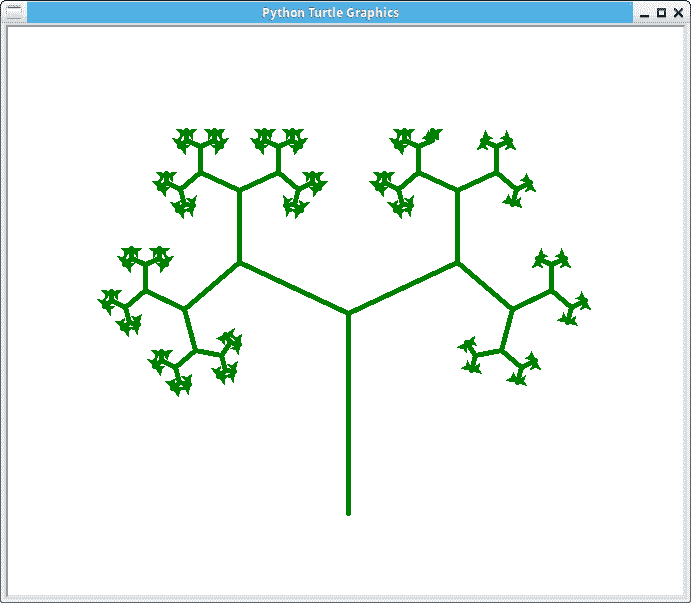

# 递归，用巨蟒龟画一棵树

> 原文：<https://dev.to/petercour/recursion-draw-a-tree-with-python-turtle-7f>

您可以使用递归来绘制形状。递归是当一个函数用停止条件调用自己时。

递归的一个著名例子是“droste 效应”，但与编程中的递归不同，它没有停止条件。它会一直持续下去。

[](https://res.cloudinary.com/practicaldev/image/fetch/s--6vfwJFy_--/c_limit%2Cf_auto%2Cfl_progressive%2Cq_66%2Cw_880/https://proxy.duckduckgo.com/iu/%3Fu%3Dhttps%253A%252F%252Fmedia.giphy.com%252Fmedia%252FuudNRE0I3Ehyg%252Fgiphy.gif%26f%3D1)

好吧，比如说一棵树。一棵树有分枝，每个分枝都有分枝。那些分支有分支等等。

递归函数可以画出它自己，它的分支，它们的分支。很明显，你需要用递归来画一棵包含所有分支的树。

下面的代码就是一个例子:

```
#!/usr/bin/python3
from turtle import Turtle, mainloop

def tree(plist, l, a, f):
    """ plist is list of pens
    l is length of branch
    a is half of the angle between 2 branches
    f is factor by which branch is shortened
    from level to level."""
    if l > 5: 
        lst = []
        for p in plist:
            p.forward(l)
            q = p.clone()
            p.left(a)
            q.right(a)
            lst.append(p)
            lst.append(q)
        tree(lst, l*f, a, f)

def main():
    p = Turtle()
    p.color("green")
    p.pensize(5)

    p.hideturtle() 
    p.speed(100)
    p.left(90)
    p.penup()
    p.goto(0,-200)
    p.pendown()

    t = tree([p], 200, 65, 0.6)

main() 
```

[](https://res.cloudinary.com/practicaldev/image/fetch/s--pGJixIPX--/c_limit%2Cf_auto%2Cfl_progressive%2Cq_auto%2Cw_880/https://thepracticaldev.s3.amazonaws.com/i/7z9b6ww3z0q2b0r4sodn.png)

乌龟被藏了起来

```
p.hideturtle() 
```

没有这条线，树看起来更好:

[](https://res.cloudinary.com/practicaldev/image/fetch/s--MhgEaQoO--/c_limit%2Cf_auto%2Cfl_progressive%2Cq_auto%2Cw_880/https://thepracticaldev.s3.amazonaws.com/i/p11jbip76qwfh2izla7r.png)

相关链接:

*   [递归](https://en.wikipedia.org/wiki/Recursion)
*   [Python 教程](https://pythonprogramminglanguage.com/)
*   [功能](https://pythonprogramminglanguage.com/functions/)