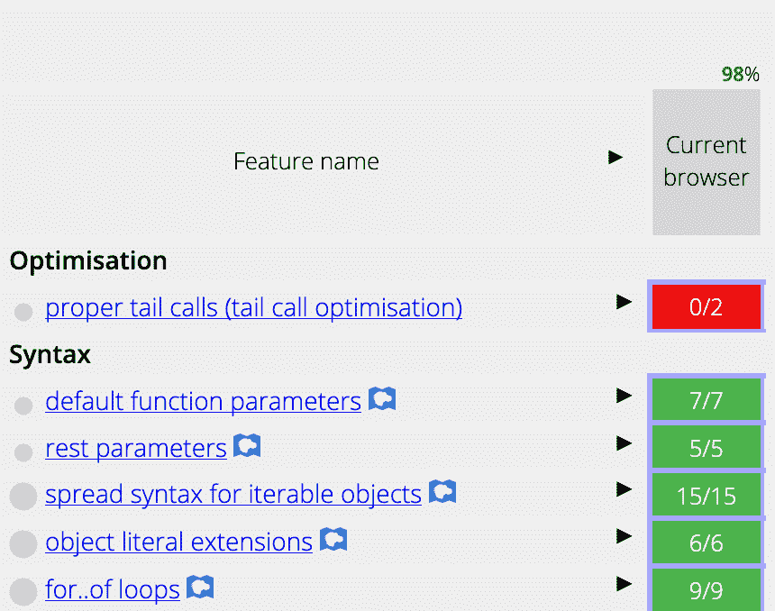

# JS 中的递归优化-在哪里？PTC、TCO 和 FUD

> 原文：<https://dev.to/snird/recursion-optimization-in-js-where-is-it-ptc-tco-and-fud-4fka>

ES6 现在已经是旧闻了。它已经在所有现代浏览器上完全实现了。这里没什么可看的。我们用来检查进度的 kangax 的 ES6 兼容表现在应该都是绿色的，对吗？

其实不是。

[](https://res.cloudinary.com/practicaldev/image/fetch/s--dFhsCyCa--/c_limit%2Cf_auto%2Cfl_progressive%2Cq_auto%2Cw_880/https://thepracticaldev.s3.amazonaws.com/i/wdk8tparph1j8ej0dgob.png)

正确的尾部调用部分(尾部调用优化)是红色的。

为什么？是 JS 实现不了的功能吗？没有。有一个浏览器实现了这个功能。游猎。

那么这是可能的，并且它在 Safari 中面向大量观众。为什么 chrome 和 firefox 会落后？

答案很复杂。从我浏览的关于 V8、Firefox JS 引擎、github 问题、TC39 委员会讨论等许多 bug 追踪器的评论来看，也非常政治化和固执己见。

我会试着在这里给出一些关于这个主题的背景，希望能让你知道为什么这很难。

### PTC 吗？总拥有成本？

PTC -适当的尾部调用
TCO -尾部代码优化
这两个术语是不一样的。对于前面的讨论，理解它们之间的区别是很重要的。

### 假设向前移动

我不想让这篇文章成为递归和调用栈的入门。我想你已经知道那部分了。如果你不知道， [freecodecamp](https://www.freecodecamp.org/news/how-recursion-works-explained-with-flowcharts-and-a-video-de61f40cb7f9/) 有一篇关于这个的很棒的文章。

### 恰到好处的尾呼

在开始之前，我要说，正确的尾部调用应该在 ES6 中实现，而不是尾部代码优化(我们将在后面讨论)。
它在 [ES6 标准文件](https://www.ecma-international.org/ecma-262/6.0/)中，如果你看不懂它的[正式定义](https://www.ecma-international.org/ecma-262/6.0/#sec-tail-position-calls)(别担心，我也看不懂)你可以看看简介:

```
Goals for ECMAScript 2015 include providing better support for [...].
Some of its major enhancements include modules, class declarations, [..]
and proper tail calls. 
```

Enter fullscreen mode Exit fullscreen mode

适当的尾部调用是一种技术，在这种技术中，程序不会为符合尾部调用定义的递归创建额外的堆栈帧。
这个，也只有这个才是恰当的尾呼价值主张。

因此，我们将只保存一级堆栈，优化递归堆栈，而不是将递归的所有堆栈都保存在内存中。

但是怎么可能呢？尾部递归函数基本上不断地传递它需要的所有必要数据，所以你不必依赖堆栈。

这里的经典例子是斐波那契函数。

在经典的(头)递归中考虑这一点:

```
function factorial(n) {
  if (n === 0) {
    return 1
  }
  return n * factorial(n - 1)
} 
```

Enter fullscreen mode Exit fullscreen mode

它必须依赖于每一步的堆栈，因为每一步都必须“处理”到`n * factorial(n - 1)`。

现在考虑这个尾部递归版本:

```
function factorial(n, acc = 1) {
  if (n === 0) {
    return acc
  }
  return factorial(n - 1, n * acc)
} 
```

Enter fullscreen mode Exit fullscreen mode

在这个版本中，我们有一个累加器作为参数。这会记录到目前为止的总数。因此，这里的栈没有用，所有的数据都可以通过递归调用得到。

太好了！递归编程有时比没有调用堆栈问题的迭代编程更容易掌握。基本上是等价的！

只是，他们不是。在 PTC 案例中没有。在 Ecmascript 最近的一份 TCO 提案中,对 PTC 的问题进行了漂亮的描述。

基本上，它们是这样的:

*   性能问题。这只会优化调用堆栈，而不是调用本身。
*   调试。调用栈将被不自然地调节，这可能会使调试更加困难。

Yicks。难怪人们如此热衷于他们在这方面的立场。有人说调试问题是交易的破坏者，而性能问题会扼杀剖析。其他人认为这是 FUD，因为 Safari 实现了 PTC，而 hell 仍然是关闭的。

你可以在这里找到成年人为自己的信仰而激情奋斗的人:
[https://github.com/tc39/proposal-ptc-syntax/issues/23](https://github.com/tc39/proposal-ptc-syntax/issues/23)
[https://bugs.chromium.org/p/v8/issues/detail?id=4698](https://bugs.chromium.org/p/v8/issues/detail?id=4698)

### 尾部调用优化

尾部调用优化来拯救！嗯，不完全是，但我想变得戏剧化。

尾代码优化的不同之处在于，它不是简单地消除额外的堆栈调用，而是将递归函数完全重新编译为迭代函数。

在幕后，尾代码优化采用一个递归函数并生成一个迭代函数，在内部使用`goto`，然后运行它。

它不限制堆栈调用，因为一旦函数实际上不在后台递归，就没有堆栈调用了。

这完美地解决了性能问题。事实上，Lua 在很久以前就已经实现了这个功能，而且效果很好。递归函数与其等价的迭代函数在性能上是相同的。

### 好吧，那为什么不实施 TCO 呢？

良好的...关于这一点也有很多争论。有人想要“隐式”TCO，也就是说，当它识别出一个适合尾部优化的函数时，就在适当的地方做。

有些人想要“明确的”TCO——只有当这是开发人员有意为之时才这样做。

这就是当前关于句法尾调用的提议的全部内容。

它为尾部调用优化引入了新的语法和新的关键字，即`continue`关键字。

而且，这里似乎也有很多争议。

*   我们将不得不乞求第三方库所有者重写他们的代码吗？
*   所需的新语法基本上会在任何人使用它之前扼杀这个特性。
*   等等等等。

这就是目前 JS 中尾部调用优化的故事。当然，我没有深究细节，但我觉得这应该能让你对为什么这个问题如此复杂和难以解决有一个基本的了解。
一如既往——感谢所有致力于这个主题和 Ecmascript 提案的人。你的工作和充满激情的讨论最终让我们所有人受益。