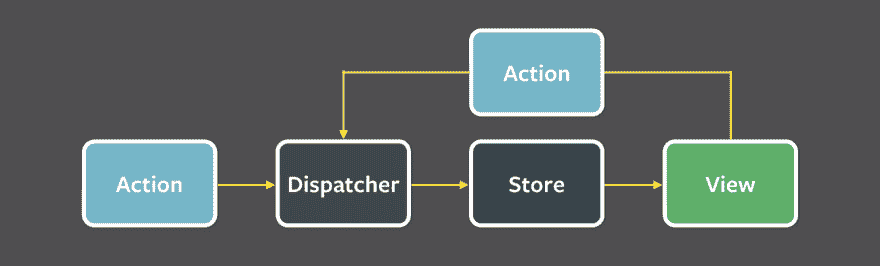

# 客户端的冗余预测状态管理

> 原文：<https://dev.to/akshay5995/redux-predictive-state-management-on-the-client-side-2a1d>

嗨，伙计们，我已经很久没有写博客了。我开始养成定期写博客的习惯，记录我学到的东西。我计划写关于技术和非技术主题的博客。

没有任何进一步的麻烦。

Redux 是 javascript 应用程序的状态管理库。在状态管理变得过于复杂或者状态难以跟踪的项目中，它会派上用场。Redux 通过使状态可预测、集中化、可调试和灵活来帮助我们。

让我们一分钟后详细了解一下这意味着什么。我们先来看看 Flux 架构。你可能会想，*“通量？为什么？*”。

这真的很重要，因为 Redux 的灵感来自于 Flux 架构。请原谅我。

## 通量

Flux 是应用程序中处理数据的一种模式。Flux 和 React 一起在脸书长大。就像 Redux 一样，Flux 和 React 在应用程序中通常一起使用，尽管它们可以独立使用。

Flux 是为了解决 facebook 当时的一个非常具体的问题而创建的。我强烈推荐你阅读林·克拉克的《通量入门》。

Flux 和 Redux 基本上非常相似。你不能在不触发动作的情况下直接改变商店。

他们试图在 facebook 解决的根本问题是数据在应用程序中流动的方式。

他们拥有保存数据的模型，并将数据传递给视图层来呈现数据。有几种情况可以更新您的模型。用户交互可以更新模型，或者模型可以更新另一个模型。甚至有级联更新的复杂场景。林在这篇文章中打了一个比方:“把一整袋乒乓球扔进你的乒乓球场，让它们飞来飞去，穿过一条条小路”。这些更新也是异步发生的。这使得调试变得非常困难。

*解决方案* : *单向数据流*

脸书提出了这种单向数据流体系结构，其中数据只在一个方向上流动。他们称之为*通量*。

这就是流动中的数据流的样子:

[](https://res.cloudinary.com/practicaldev/image/fetch/s--OtLx2dja--/c_limit%2Cf_auto%2Cfl_progressive%2Cq_auto%2Cw_880/https://facebook.github.io/flux/img/flux-simple-f8-diagram-with-client-action-1300w.png)

在本文中，我不会深入探讨 Flux，因为它是关于 Redux 的。我强烈推荐你阅读 flux 架构。

现在回到 Redux。

Redux 的灵感来自于 Flux 建筑。丹·阿布拉莫夫想提高通量。他希望围绕状态管理生态系统开发更好的工具，并使其可扩展。(比如，[时间旅行调试](https://www.youtube.com/watch?v=xsSnOQynTHs))。

根据官方 Redux 的官网。Redux 可以用下面的[原则]((http://redux.js.org/docs/introduction/ThreePrinciples.html))来解释。

1.  真理的唯一来源。
2.  状态为只读。
3.  变化是由纯函数产生的

Redux 由以下实体组成:

1.  动作创建者
2.  还原剂
3.  商店
4.  视图，即智能和非智能组件

### 商店

*一、单一真相来源*

商店是数据仓库，是储存你所有信息的地方。根据第一原理的定义。商店是您的应用程序的唯一来源。

### 减速器

*二。状态为只读*

"为了指定状态树是如何被动作转换的，你需要编写纯 reducers . "

Reducers 是*纯函数*，它获取应用程序的先前状态，并基于传递给它的动作返回一个新状态。

它们看起来像这样:

```
const initialState = {}

const myReducer = (state = initialState, action) => {
  switch (action.type) {
    case "ADD_TODO": {
      const { id, todo } = payload
      return { ...state, [id]: todo }
    }
  }
} 
```

### 动作创建者

动作是应用程序中发生的事件，可以在模型(商店)中改变。它们是将数据从应用程序发送到 Redux 存储的唯一方式。

动作是普通的 JavaScript 对象，它们必须有一个 type 属性来指示要执行的动作的类型。它们还必须有一个*有效载荷*，其中包含该动作应该处理的信息。

动作有这个签名:

```
{
  type: "UPDATE_MY_STORE",
  payload: {
    "dummy": "data"
  }
} 
```

动作由名为*动作创建器*的函数创建。他们看起来像这样:

```
const signIn = (username. password) => {
  return({
    type: types.SIGN_IN,
    payload: {
      username,
      password
    }
  });
} 
```

*三世。用纯函数进行更改*

我们使用存储的函数来调度这些动作，而缩减器(一个*纯函数*)接收这个动作和当前状态，并给我们*新状态*。

### 观点(聪明和愚蠢)

视图只是订阅存储的组件。

智能组件= *容器*

哑组件= *表示组件*

智能组件可以被看作是 Redux 存储和非智能组件之间的接口。它们只处理从存储到哑组件的动作和/或状态的订阅和传递。不要用电子邮件发送任何他们自己的 DOM。

哑组件纯粹负责呈现 DOM。因此被称为表象成分。它们接收容器组件传递给它们的动作和状态。

这种区别是一种重要的模式，是您将遇到的大多数项目的标准。[阅读更多](https://medium.com/@dan_abramov/smart-and-dumb-components-7ca2f9a7c7d0)

使用 redux 时，需要记住以下几点:

用户能够改变状态的唯一方式是通过动作。

归约器是状态树中的纯函数。应用程序的每个状态属性都由一个提供状态更新的函数来表示。每个缩减器对于每个状态属性都是唯一的，反之亦然。

商店是单一的，包含应用程序的整个状态。当我们以这种方式使用它时，我们可以跟踪应用程序状态的每一个变化。

归约器可以被认为是状态树属性的行为定义。

如果你正在构建一个小的应用程序，我建议你使用 React 的组件状态或者新的上下文 API 在你的组件之间共享状态。不要让 *Redux* 成为你所有 React 应用或项目事实上的状态管理工具。

(权衡)Redux 要求您:

1.  将应用程序状态描述为普通对象和数组。
2.  将系统中的变化描述为简单的对象。
3.  将处理变更的逻辑描述为纯函数。

好吧，你不必相信我的话。反而，[信丹]('https://medium.com/@dan_abramov/you-might-not-need-redux-be46360cf367)。

在你选择的任何解决方案中都有*权衡*，所以请仔细分析你的使用案例和可用解决方案列表，做出明智的选择。我总是建议从最简单的开始，当你遇到障碍时，再向更高级的发展。

如果你对 redux 如何在引擎盖下工作感兴趣。我强烈建议您尝试从[开始](https://www.jamasoftware.com/blog/lets-write-redux/)实现 Redux。

希望这篇文章值得你花时间。感谢您的阅读:)