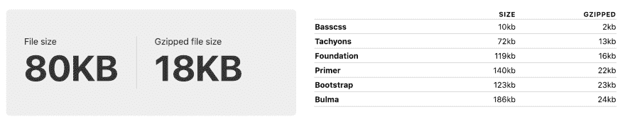
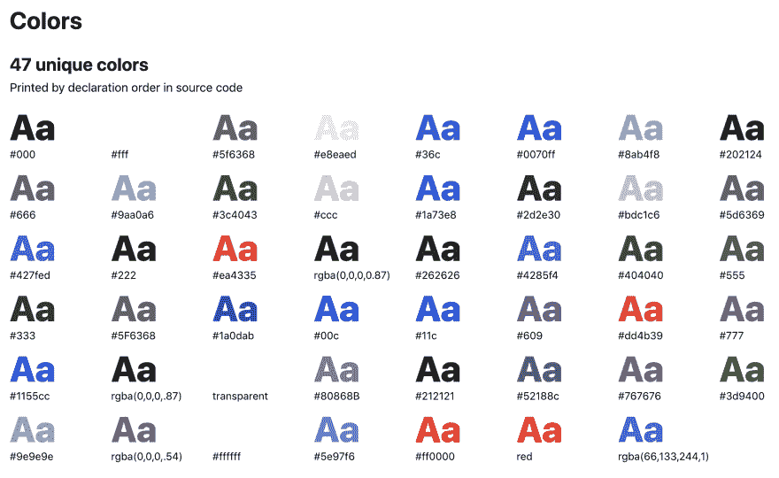

# 重构 CSS

> 原文：<https://dev.to/inktrap/refactoring-css-2a91>

# 重构 CSS

## 当考虑重构你的 CSS 时，要记住什么

[](https://res.cloudinary.com/practicaldev/image/fetch/s--YM8PPbME--/c_limit%2Cf_auto%2Cfl_progressive%2Cq_auto%2Cw_880/https://miro.medium.com/max/10800/0%2AmnEV1SDJ52G8sXu0)

Clem Onojeghuo 在 [Unsplash](https://unsplash.com/?utm_source=medium&utm_medium=referral) 拍摄的照片

作为开发人员，我们在一个其他人享受不到的行业工作。我们可以编辑已经发表的东西。

在许多其他行业，追溯性地改变事情是非常困难的。作家不能把他们的书从书架上拿下来，然后重新写一个句子。艺术家不能移除油漆层来改善下面的层，建筑公司也不能在场外建一层新地板，并在完工后再装回去。

美国开发商？我们可以在前端或后端对设计进行内部迭代，然后在产品上线后继续推动变更。

这是一件*非常*的好事。

因为，不管我们有多小心，我们几乎肯定会遇到这样的代码，我们看着它并想，“这可能会更好。”这时你和你的团队可能会决定是时候改进它了。

# 值得注意的是…

> "一盎司预防抵得上一磅治疗."本杰明·富兰克林

尽管重构的思想存在于大多数成熟的产品中，但这并不意味着你应该抱着以后再重写的心态来编码。

拥有一个[风格指南](https://sass-guidelin.es/)，一个项目大纲，一个接近它的计划，一个合适的[目录结构](https://zellwk.com/blog/css-architecture-3/)，和[命名约定](https://snipcart.com/blog/organize-css-modular-architecture)仍然很重要。有了这些，快速重构就不会变成彻底的改革。

> “每个人都知道调试比一开始写程序要难两倍。所以，如果你在编写它的时候尽可能聪明，你将如何调试它呢？”— Brian Kernighan,《编程风格的要素》

重构可能是困难的，并且经常被认为是一种事后的想法。事实是，就像可访问性和响应性一样，它应该作为*主要*工作的一部分来计划和处理。不是项目的延伸。

# 为什么我必须重构？

[](https://res.cloudinary.com/practicaldev/image/fetch/s--868gXiw7--/c_limit%2Cf_auto%2Cfl_progressive%2Cq_auto%2Cw_880/https://miro.medium.com/max/8640/0%2Amb1dKSfnTOS6xE1P)

CSS 乱七八糟。一个塞斯，如果你愿意的话。

正如我们在开头提到的，我们可以不断地迭代我们所做的工作。正因为如此，我们的工作在推向生产后继续进行，代码库可以变得越来越大。我们可以在这个过程中保持代码尽可能的干净，但是如果有足够多的“快速变化”，拉取和合并，事情就会变得混乱。

让我们以下面这个虚构的例子为例:

一个网站有一个漂亮的卡片布局的博客部分。CSS(如果使用 BEM)可能如下所示:

```
/* _blog-post.scss */
.blog-post {}
.blog-post__header {}
.blog-post__title {}
.blog-post__image {}
.blog-post__footer {} 
```

Enter fullscreen mode Exit fullscreen mode

产品发生变化，要求您添加新闻部分。它有相似的布局和风格。你不会想把一篇新闻文章和一篇博客文章归为一类。因此，您创建了另一个文件:

```
/* _news-article.scss */
.news-article {}
.news-article__header {}
.news-article__title {}
.news-article__image {}
.news-article__footer {} 
```

Enter fullscreen mode Exit fullscreen mode

您可能会被要求提供类似的活动部分，但让我们保持原样。现在我们有了不必要的重复代码的问题。我们可能想要的是删除上面的文件，并有一些更像:

```
/* _post.scss */
.post {
    &__header {}
    &__title {}
    &__image {}
    &__footer{}

    &.post--blog {  
        /* Modifier stuff here */  
    }  
} 
```

Enter fullscreen mode Exit fullscreen mode

但当然，CSS 是挑剔的，并在全球范围内运作。当一个新的开发者开始使用这个 CSS 时，他们可能害怕改变它，因为害怕它会破坏其他地方的东西。最重要的是，他们可能会在一个截止日期前工作，或者他们可能会说“我以后再回来”，但永远不会。

这些小事日积月累，可能会导致您的团队决定进行重构。

# 何时以及何时不进行重构

也许你在想，如果它有用，我为什么还要碰它？这是一个非常重要和必要的问题，因为你可能不需要。以下并不是一份详尽的清单，只是对可能会影响你的事情的一个想法。

## 该重构的时候了

*   您的 CSS 过大。
*   以某种方式影响性能(加载时间长，特定用例中的布局中断)
*   开发人员花时间围绕代码工作，而不是与代码一起工作。
*   你想增加新人的可读性。
*   你在一个非常大的团队中工作，现在重构意味着你为很多人节省了一点时间。
*   许多人提出了一个特定的问题。
*   重构会很快。

## 在没有必要的时候

*   重写或重新设计即将到来，从头开始写会更容易。
*   CSS“看起来很糟糕”，但是没有开发人员对此有异议。没有用户报告任何问题
*   CSS *是*坏的，但属于不会被触及的元素或组件。以一个不会改变的页脚为例。如果一个开发者有一些最初的问题，但是它已经完成并工作了，这可能值得你关注网站的不同部分。

当然，某个东西是否值得重构是你的选择。以上只是我了解到的指标。所以你决定是时候了，然后呢？

# 重构“在移动中”

这应该是你的第一站。这些都是小部分的整理工作，比全面的重构更轻松、更轻松。

它包括检查你的。css 或者。scss 文件，并对它们进行组合，以找到拥有相同样式声明或具有相互覆盖的声明的类。你应该给那些没有直接意义或者看起来没用的规则添加注释。例如，该类可能不会出现在 HTML 中，但后来由 JavaScript 添加。例如:

```
.faq {  
     &.is-expanded {  
        /* Toggled when user clicks on element */  
    }  
} 
```

Enter fullscreen mode Exit fullscreen mode

当然，手动操作可能需要一段时间，所以使用[棉绒](https://atom.io/packages/linter)。您可以调整您的配置，并提前得到关于重复声明或空选择器的警告。

你也可以使用 [CSS Stats](https://cssstats.com/) 获得一些关于你的 CSS 的有价值的信息。这个网站可以提供关于你正在使用的内联和链接 CSS 的有价值的信息。你可以和流行的图书馆进行比较。布局、间距等的声明计数，它显示一个特性图…以及颜色或字体大小等独特声明的数量。

[](https://res.cloudinary.com/practicaldev/image/fetch/s--sZVftHV8--/c_limit%2Cf_auto%2Cfl_progressive%2Cq_auto%2Cw_880/https://miro.medium.com/max/4456/1%2ASk1oV64e2PoIO9sTxQYgvA.png)

对这些统计数据要有所保留，并对您正在开发的代码库有一个大致的概念。因为对于一个标准的营销网站来说，拥有 40 个独特的颜色声明可能看起来很多，但对于拥有色板的在线服装店来说，这些结果不会那么令人惊讶。

[](https://res.cloudinary.com/practicaldev/image/fetch/s--4o-jMIwe--/c_limit%2Cf_auto%2Cfl_progressive%2Cq_auto%2Cw_880/https://miro.medium.com/max/4180/1%2AQDU__D3iYs0iq6qOkG6cPQ.png)

如果使用得当，统计数据可以非常有洞察力，可以用来剔除不必要的规则。如果你的[设计系统](https://medium.com/inktrap/metamorphosis-converting-your-design-files-into-a-design-system-63172f8c71f)在其类型范围中列出了 7 种不同的大小，而你有 30 多种，也许是时候将这些声明重构为一个单独的类，或者移除那些从未实际应用的声明了。

# 【组件重构】

这是针对一个特定的元素或组件进行的重构。例如，您决定处理 header，因为多个开发人员在添加或修改它时遇到了问题。

对许多人来说，一头扎进去，让一切变得更好的想法可能会激励他们。但是，请慢下来，问自己或团队成员以下问题:

## **哪些*真的需要重构？***

 *假设我们有一个很大很乱的页脚，里面有一些未使用的 CSS 和一些 hacks。

它可能看起来是一个理想的候选，但是如果它是网站的一部分，没有用户报告过问题，并且暂时不会更新，它很可能被推到队列的后面。

也许你有一个有许多不同变化的导航，或者州可能是更好的目标。也许它像滚雪球一样越滚越大，开发人员不断添加更多具有更特定规则的类来覆盖它已经特定的选择器。或者我们知道客户希望在未来的更新中添加更多的状态。或者，您最终放弃了对旧浏览器的支持，您可以使用 flexbox 等新功能，并重写以前的 hacky float 填充 CSS。

## 重构够短吗？

重构整个页面所需的时间可能比您想象的要长。设定一个较小的目标可能对你有好处。与其处理整个页面，不如只处理按钮或表单？拥有更小的目标意味着你可以更快地展示改进，并且比处理像主页这样的大项目更快地回到其他项目/开发工作中。你应该始终把最终目标放在眼前。重构，继续，重复。

## 我应该在哪里做我的“重构”？

基本上，除了它来自的项目之外的任何地方。CodePen，jsFiddle，您的开发环境中的一个 playground HTML 文件。

主要的一点是，它应该建立在旧的陈旧代码基础之上，尽管如果绝对必要的话可以导入网格。以这种方式重构意味着我们重新设计我们的组件，远离所有的冲突或重写，这些冲突或重写首先会导致组件变得混乱。我们可以构建它，并在一个新的无菌环境中测试它，因为我们知道当它完成并重新整合到网站中时，我们可以更容易地识别冲突来自哪里。

## 我应该如何实现重构后的代码？

[](https://res.cloudinary.com/practicaldev/image/fetch/s--TFUHJURl--/c_limit%2Cf_auto%2Cfl_progressive%2Cq_auto%2Cw_880/https://miro.medium.com/max/9856/0%2AcEF12X1m-kt5dJcu)

孤立地👀

一旦完成，你就可以把旧的导航换成新的了。此时，可能会与旧的 CSS 发生一些冲突。那我们该怎么办？

我们现在需要写一些简单的 CSS 来帮助我们以后保持理智。这听起来适得其反，但在重构时，这实际上是一个很好的策略。我们可以隔离、标记和编写这个“快速修复”的 CSS，直到我们重构的组件看起来像它应该的那样，然后当旧的 CSS 被移除并且这些冲突消失时，我们可以移除这些黑客攻击。让我们看一个有导航的实际例子。

*   **步骤 1** :我们已经单独重构了导航。它遵循所有的最佳实践，并准备取代旧的笨重的。我们换出 HTML 并导入新的。scss 文件。
*   第二步:我们已经带来了，但是看起来不太对。颜色和字体大小的样式是关闭的，因为一些旧的糟糕的代码的特殊性。

*代码如下:*

```
/* _links.scss (old) */

    header > nav li a {  
    color: blue;  
    display: inline-block;  
    padding: 0 0 0 10px;  
    font-size: 12px;
}

/* _new-nav.scss (new) */

.nav__link {  
    padding-left: 10px;  
    color: red;  
    font-size: 14px;  
} 
```

Enter fullscreen mode Exit fullscreen mode

*   **步骤 3** :我们编码来解决问题，**但是**我们这样做是远离我们干净的 CSS。在一个注释良好、命名恰当的文件中，专门为“坏”代码保留(fixes.scss、hacks.scss、shame.scss 或 temporary.scss 都可以)。

*代码如下:*

```
/* _fixes.scss *//*  
    Add !important declarations to the .nav__link class because more specific code from _links.scss is overwriting the colour and font-size.  
*/

.nav__link {  
    color: red !important;  
    font-size: 14px !important;  
} 
```

Enter fullscreen mode Exit fullscreen mode

*   **第四步**:现在我们“攻击”坏的 CSS。我们进去，去掉与我们闪亮的新导航相冲突的陈旧的 CSS。
*   第 5 步:现在我们可以移除针对特定冲突的修复 CSS 了。
*   **步骤 6** :重复直到旧 CSS 和黑客 CSS 被移除。
*   第七步:漫威看着你创造的美景。

Harry Roberts 在 2017 年 WeAreDeveloper 大会的演讲中彻底解释了这种方法。[https://youtu.be/fvTryZjGyg8](https://youtu.be/fvTryZjGyg8)

# 结论

通过不断改进并在工作流程中引入有用的构建工具(如 linters)或产品(如 [CSS stats](https://cssstats.com/) ),可以抑制重构需求。但是，如果重构是必要的，那么应该有条不紊地进行，并像实际产品本身一样仔细地计划和迭代。希望上面的信息可以帮助你更好的准备。

> 感觉不一样？有什么补充的，同意的，不同意的？如果您有任何反馈，我们希望听到您的反馈，请在此留下评论，或在 Twitter 上给我们留言。我们是 [@InktrapDesign](https://twitter.com/InktrapDesign) 。*