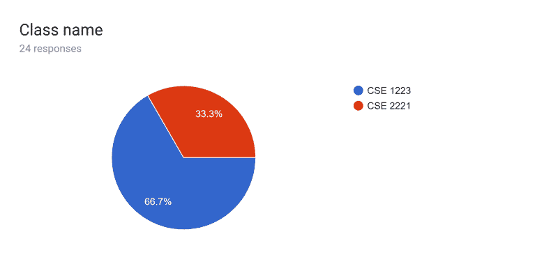
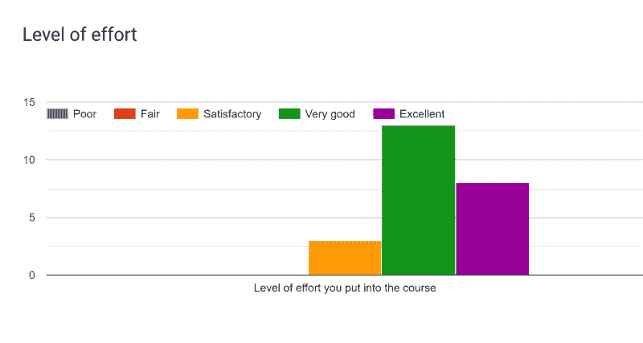
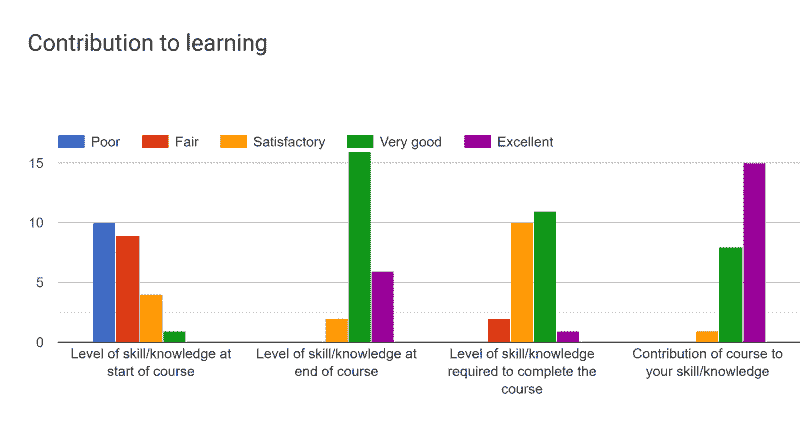
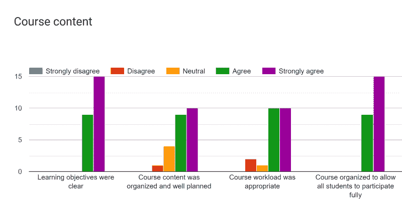
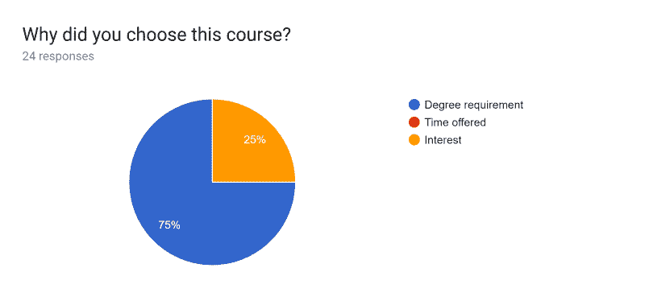

# 反思我的第三学期教学

> 原文：<https://dev.to/renegadecoder94/reflecting-on-my-third-semester-of-teaching-31hi>

在这个系列的这一点上，标题变得有点可笑，但我真的没有计划那么远。无论如何，让我们谈谈我教书的第三个学期。

## 物流

不幸的是，这个夏天我并没有真正去教书。然而，从技术上来说，我仍然是一名研究生助教，我甚至比平时承包了更多的时间。我只是不在教室前面——我在评分！

更明确地说，我在俄亥俄州立大学接受了教授 CSE 2221(软件 1)课程的培训。作为训练的一部分，我基本上像普通学生一样上课。换句话说，我做了所有的作业并上交以获得反馈。此外，我还在办公室工作，在实验室帮忙。

就时间承诺而言，我发现自己每天从上午 10:20 到 11:15 都在教室里。每天我们在教室和实验室之间轮换，所以有些星期我们有 3 个实验室，有些星期我们有 3 个讲座。

像往常一样，我有大约 40 名学生，但工作量被分配给了四个人，而不是一个人。除了我自己，还有一个指导老师和另外两个助教。结果，这学期的评分变得简单多了(大部分情况下)。特别是，我只需要给 6 个项目打分。同时，其他 5 个项目和大约 20 个家庭作业由其他助教评分。此外，3 门考试由教授管理和评分。

不幸的是，我无法获得任何学生的信息，但我可以给出最终成绩的大致想法。

| 级别 | 总数 |
| --- | --- |
| A | four |
| 表示“不” | six |
| B+ | eight |
| B | four |
| B- | five |
| C+ | one |
| C | four |
| C- | Zero |
| D+ | one |
| D | four |
| E | Zero |
| 在中 | Zero |

请记住，我是在期末考试前得出这些分数的，所以我不确定事情最后是如何解决的。

## 倒影

和往常一样，我喜欢花些时间反思过去的一学期。

### 好人

到目前为止，这学期我最喜欢的部分是和同龄人一起工作。这不仅让实验室变得更加愉快，而且当我不知道某个问题的答案时，有人可以依靠也很好。

同样，我真的很喜欢这些材料。虽然我认为自己是最适合初学者的人，但谈论更多哲学话题肯定更有趣。事实上，这学期我学到了很多，这体现在一些文章中，包括:

*   [表达式和语句的区别](https://therenegadecoder.com/code/the-difference-between-statements-and-expressions/)
*   [为什么我鼓励我的学生使用 DrJava](https://therenegadecoder.com/teach/why-i-urge-my-students-to-use-drjava/)

此外，我真的很喜欢有时间向教授学习，并利用这些知识开始为秋季课程做准备。其实我已经有[大礼帽](https://tophat.com/)设置听课了！希望这能在未来为我节省一些时间。

### 坏了

因为这是一个夏季学期，所以没有时间喘气。即使作为一名经验丰富的程序员，我也很难跟上这些材料，我知道学生们有时会因为我缺乏帮助而变得不耐烦。

此外，评分仍然是一件痛苦的事。当然，我没有批改那么多的作业，但是我花在批改作业上的时间可能和以前一样多。特别是，我负责一半的项目，他们通常花我几天时间来评分。不像上学期，我有一个工具来帮助我评分，这学期的项目更加自由，所以很难建立任何形式的常规或评分过程。

最后，学生的抵触情绪比我过去经历的要多得多。不管是什么原因，我觉得学生们比过去更不容易接受这些材料，我也不确定为什么会这样。显然，在课程的这一点上，许多学生觉得他们已经想通了一些事情，所以他们并不真正欣赏我们的教学方法。谁知道呢？！

### 丑陋

如果你在这里呆过一段时间，你就会知道我不喜欢批评。作为一个努力工作的人，我认为批评可能是一记耳光。现在，我不一定认为我的工作应该因为我努力了而受到表扬，但批评真的会让我觉得我浪费了时间。

无论如何，我很幸运，过去没有很多人审查我的代码，尽管事实如此，我通常对我的代码评价很高。然后，这学期我被迫和学生们交同样的项目，以了解我应该给他们什么样的反馈。

虽然这个前提是有道理的，但我发现这种经历令人沮丧，因为我经常得到充满负面评论的项目。作为一个本可以休假一个夏天(大部分时间)来关注我的精神健康的人，我经常觉得自己做出了错误的工作决定。

更糟糕的是，我们每周都见面，主要讨论我们在项目中犯的错误。很自然地，当我越来越接近那些可怕的会议时，我的焦虑就越来越大——这让我想起了我在通用电气公司实习时参加的每周进度会议。

### 骇人听闻

作为一个热爱教学的人，我认为对这份工作抱怨这么多是不公平的，但我必须谈谈一些事情。还记得我的第一个学期吗？当时有一个学生滥用了我的信任。这个学期我又经历了一次。

随着学期开始接近尾声，我正在给其中一个项目评分。在这个项目中，学生被要求编写代码来处理表达式树。本质上，学生们必须编写一个递归函数来处理四种基本的算术运算:加、减、乘、除。另外，他们必须实现两次:一次用整数，一次用自然数(任何大于 0 的整数)。

当我执行测试时，[我使用了一些 XML 文档来测试](https://data.therenegadecoder.com/arithmetic-expression-trees/)诸如单节点树、负减法和被零除之类的东西。当然，仅仅搞定这些案子还不足以获得满分。学生们也被期望有好的风格(这是我们定义的)，他们被要求遵守严格的纪律(例如，没有多次返回，没有休息，等等)。).

无论如何，有几个学生选择使用开关盒，我觉得由于各种原因(例如，打开字符串，没有默认盒，等等),这与我们的学科不太相符。).结果我扣了一分。就是这样！他们没有得到满分 10 分，而是得到了 9 分。

有一个学生对分数非常不满，所以据说他们联系了教授，教授说没问题，但是忘记更新分数了。很自然的，当教授不在的时候，他们就来找我哭诉他们想要的单点。当然，我发现他们的论点令人沮丧，因为他们没有参考我的任何反馈。他们只是不停地说他们应该得到这一分。

在盛怒之下，我告诉他们，他们不会拿回他们的观点，如果他们想要，他们将不得不向教授哭诉。当然，当我回家的时候，我想这可能会让他们感到压力，所以我把它和一篇五段的文章一起给了他们，希望能让他们明白这一点。

不到一个星期后，我发现同一个学生试图欺骗教授。当时，他们刚刚拿到考试卷，他们决定去求教授给他们更多的分数。特别是，他们声称**有人修改了他们的答案**。我不知道你怎么想，但对我来说这是个疯狂的指控。只是没有办法证明。

幸运的是，教授基本上是说“运气不好”，但我无法想象这很容易做到。为什么有些学生觉得把老师放在那样的位置上很舒服？

## 反馈

因为我这学期没有教书，所以我没有通过大学评估(又名学生教学评估或 SEI)。然而，我还是一如既往地发出了我的谷歌表单，所以我将再次分享这些结果。像以前一样，我有点懒得提取这一学期的评论，所以所有的图表都包含以前学期的数据。

### 类名

因为这是我第一次教一个新的班级，我想我应该分享一下有多少人填写了调查问卷以及哪些班级的统计数据。

作为一个一直在研究数据可视化的人，我有点害怕饼图。也就是说，我真正需要做的是，从上学期开始，我又积累了 8 份提交材料。

### 努力程度

像往常一样，有一个问题与表单上的工作量有关。特别是，我让学生评价他们完成课程的努力程度。

即使在新的班级，学生似乎也必须非常努力才能做好。希望下学期我能找到一些方法来减轻他们的负担。

### 对学习的贡献

除了努力程度之外，我还问了学生们一系列问题，关于他们觉得这门课程对他们的学习有什么帮助。

我总是觉得这个图表很有趣，因为你可以看到学生的学习轨迹。特别是，大多数学生说他们一开始对这门课程几乎一无所知。然而，在课程快结束时，大多数学生对他们的课程知识感觉非常好。

### 讲师的技能和反应能力

当然，我也问了学生们几个问题，关于他们对我的教学的感受。

自然，这是我最喜欢的图表，因为评论总是如此积极。此外，我喜欢条形图越向右越好的趋势。老实说，我不知道结果如何，但我喜欢。

### 课程内容

之后我让学生给课程内容打分。

与前几个学期不同，我在课程内容中没有任何角色。因此，我对这些结果没有任何影响。换句话说，向课程协调员大声疾呼，为学生提供高质量的内容。

### 课程选择

为了收集一些人口统计信息，我还询问了学生们为什么选择这门课程。

不足为奇的是，CSE 2221 课程是通向该专业的大门，所以很多人说这是一个学位要求。在这一点上，这个问题有点荒谬，但有些人可能会认为这是他们自己的乐趣。谁知道呢？！

### 值

在所有的选择题之后，我想问学生一个开放式的问题，关于他们在课程中发现的最有价值的东西。总的来说，大多数学生喜欢实验室:

> 家庭作业、实验室、办公时间和作业反馈
> 
> <cite>匿名，2019 年夏天</cite>
> 
> 实验室非常有价值
> 
> <cite>匿名，2019 年夏天</cite>
> 
> 实验室在支持从讲座和作业中学习方面非常有用。
> 
> <cite>匿名，2019 年夏天</cite>

老实说，我也是实验室的超级粉丝。就我个人而言，我喜欢每周的实验次数是 Java 入门课的两倍，而且实验没有评分。换句话说，学生能够在低风险的环境中学习材料。

最重要的是，其中一名学生非常喜欢我们的在线学生问题论坛:

> 广场很有用。
> 
> <cite>匿名，2019 年夏天</cite>

虽然我不喜欢广场，但我可以看到一些学生可能会从中受益。

### 改进

不考虑价值，我喜欢问学生一些他们希望看到改进的东西。

#### 过于物质丰富

也许我从一门课程中得到的最好的反馈之一是给下面这个学生的:

> 物质太丰富。对于如何有效地设计 JUnit 框架，我仍然只有粗略的了解。我还努力设计词汇表项目，感觉我的计划很快就让位于一系列被迫的妥协，证明了我的设计是无效的。
> 
> <cite>匿名，2019</cite>

据这位学生说，这门课进行得太快了，因为我们从一个话题跳到另一个话题，而没有明确的联系。老实说，我同意。当然，需要注意的是，这是一个压缩的夏季课程，所以吸收材料的时间很少。

也就是说，这门课有一大堆话题，其中很多是在最后突然出现的。更糟糕的是，我们在让学生自己想出解决方案方面做得不好。相反，我们提供了许多模板供学生填写。当我们最终提供一个开放式项目时，许多学生感到失落，我不怪他们。

无论如何，我喜欢这样的反馈，因为它帮助我思考如果我自己制作一个课程，我可能希望它是什么样子的。

#### 没有足够的过渡时间

我的另一个学生觉得课程没有给他们足够的时间适应:

> 我用 C++而不是 java，所以我必须在两种语言之间转换。为了跟上进度，我不得不在开始时多下一点功夫，但课程感觉进行得很顺利。我确实对某些术语感到困惑，比如“类”、“方法”、“构造函数”以及整个项目的概念，所以也许在学期开始前给学生们提个醒，让他们选择学习作业对那些来自 C++的学生是有益的。
> 
> <cite>匿名，2019 年夏天</cite>

老实说，这是那些真正击中我要害的评论之一。在我大学期间，只有一门正式的编程语言课程:Java。当然，几位教授有他们自己选择的语言，所以我有时不得不即时学习一门语言，如 C、C++、MATLAB 和 C#。作为一名学生，这种感觉并不好。

更糟糕的是，许多教授有这种精英主义的心态，认为编程语言只是你可以在业余时间随便学习的工具。作为一个花了大量时间玩编程语言的人，这与事实相去甚远。虽然语言语法很容易掌握，但导航习惯用法和库可能非常具有挑战性。

无论如何，这种反馈对我很有帮助。一旦我知道谁在我的班里，我会用一些资源发一封电子邮件。

### 奖状

最后，我请学生们分享一份感言。特别是，我希望对我和课程有一个好的总体评价。通常情况下，我会浏览每一条推荐，并分享我的一些想法，但我想我只是在这里列出一些我最喜欢的:

> 优秀的知识资源。我发现，每当身边的人问[杰里米]问题时，我都会认真倾听，并通过这种方式获得了很多有用的信息。
> 
> <cite>匿名，2019 年夏天</cite>
> 
> 杰里米留下了对项目有用的反馈，很明显他知道自己在说什么，并且喜欢帮助别人学习。
> 
> <cite>匿名，2019 年夏天</cite>
> 
> 我喜欢这学期所有的三个助教，但我觉得杰里米是三个中知识最丰富的。如果需要的话，我会很乐意让杰里米代替斯沃洛普。
> 
> <cite>匿名，2019 年夏天</cite>
> 
> 伟大的导师，肯定会想再次从他那里学习另一门课程
> 
> <cite>匿名，2019 年夏天</cite>
> 
> 非常有效的教学和难以置信的帮助。课程快结束时，项目的反馈确实帮助我提高了编码水平
> 
> <cite>匿名，2019 年夏天</cite>

而且，就是这样！作为一个热爱教学的人，我喜欢看到这种努力在这些奖状中闪耀。一如既往，我要感谢我的学生们给了我美好的一学期，尽管我不是他们的主要老师。和他们一起工作总是令人愉快的。

## 下学期计划

在这一点上，我通常会完成我的反思，但我想我需要一些时间来开始计划下学期。特别是，我想谈谈我的计划在未来会有什么不同。

现在我在教一门更高水平的课程，我的学生群体将会有很大的变化。特别是，我将更多地与对编码感兴趣的学生一起工作，所以我希望他们对我的教学有更多的批评。事实上，这学期我看到了一点，所以我需要提高我的知识水平。

因此，我需要专注于我的一些弱项。例如，我们广泛地涉及递归，所以我需要准备回答与那个主题相关的问题。目前，我正在写一篇递归文章，试图为下学期做准备。

此外，我需要学习如何管理评分员。特别是，我将有一对自己是学生的评分员。不管怎样，我需要确保他们跟上评分。此外，我想确保他们给出了有用的反馈。

除此之外，我认为一切照旧。很明显，我推动的一个大课题是同理心，所以我希望我能在下学期初在课堂上灌输这一点。当然，我们会看到事情如何发展。祝我好运！

## 向前看

综上所述，我很期待下学期教这门课。毕竟，我会减少大量的评分，引入更有趣的内容。谁能抱怨呢？

最重要的是，我下学期要修几门工程教育课程，所以我希望在我的技能组合中增加一些新工具。当然，我也需要开始做研究，对此我一点也不兴奋。对于那些只想成为教授的[博士生来说，没有教学轨道真的很不幸。](https://www.jamesgmartin.center/2013/03/why-must-professors-publish/)

无论如何，为另一个学期干杯。到 2019 年 12 月，你可以期待看到又一次这样的反思。现在，我得回去工作了。同时，看看我的其他一些想法:

*   回顾我第一学期的教学经历
*   回顾我第二学期的教学

你在这里的时候，可以考虑通过付费会员来支持我的工作。如果你更喜欢[加入邮件列表](https://newsletter.therenegadecoder.com/)，那也很有帮助！

不管怎样，谢谢你过来。特别感谢[我所有的赞助人](https://www.patreon.com/TheRenegadeCoder)，包括我最近的赞助人，塞斯·亨特和[罗伯特·马尔多纳多](http://virtual-flat.com/)。下次见！

反思我第三学期教学的帖子最先出现在《变节的程序员 T2》上。