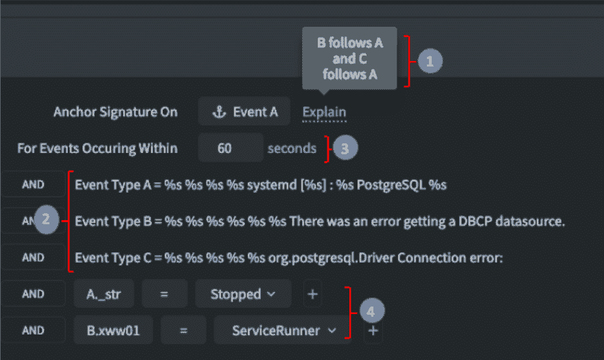

# 检测已知软件故障的可靠签名

> 原文：<https://dev.to/gdcohen/reliable-signatures-to-detect-known-software-faults-1897>

你有没有花时间追踪一个错误或失败，却发现你以前见过它？或者这个问题的一个变体:在自动化测试完成时，您必须花时间对每个失败进行分类，即使许多失败是由同一个 bug 引起的。所有这些都会影响生产力，尤其是在持续集成和持续部署(CI/CD)环境中，情况变化很快。

对此有一个解决方案——当问题发生时，构建一个“签名”,在日志文件和问题发生时出现的指标中寻找特定模式。

大多数签名实现都涉及编写解析数据的脚本，使用正则表达式(regexes)和标准 Unix 命令，如 grep 和 awk。

**签名示例**

在大多数当前的(非 Zebrium)实现中，签名是通过编写脚本来构建的，这些脚本使用正则表达式(regexes)和标准 Unix 命令(如 grep 和 awk)来解析数据。下面是几个典型的例子:

**很简单:**发生“Host: linux01 not found”事件时触发，与哪个主机名无关:
*if`grep -q "Host.*not found"`；然后回声触发；fi*

**简单:**每当“内存利用率达到 XX% -需要注意”事件发生时触发，如果 XX%大于 95%:
*awk 'match ($0，/内存利用率达到。* -注意/){ if $ 4+0>95){ print " Triggers " } } ' * 00

**它很快变得复杂:**当事件“Host: linux01 not found”发生时触发，与主机名无关，但只有在 10 分钟内事件“内存利用率达到 XX% -需要注意”并且 XX%大于 95%时才触发。

**当条件跨越日志文件时甚至更难:**首先查看日志文件 1 并找到事件类型 1 在事件类型 2 的 5 分钟内发生的时间，然后找到在事件 1 之前设置的事务 ID 的最近值。现在，如果在日志文件 2 中发现具有相同事务 ID 的事件类型 3，只要它发生在事件 1 和 2 之间的时间跨度内，就会触发。

更糟糕的是:假设你成功地构建了一堆脚本。在新的软件版本中，一个小的日志行变化可能意味着已知的问题被完全忽略了。

我们在许多客户身上看到的是，实际挑战使得广泛构建和部署自动化签名检测变得非常困难，除了少数“低挂水果”问题。这是因为:

开发签名需要专业技能和大量时间，因此只有一小部分工程师(有时是在专门的团队中)来构建它们。

创建签名后，需要额外的时间来跨产品版本测试、改进和维护它们。

有限的资源意味着总会有一长串尚未识别的已知问题。

除了创建签名的挑战之外，还需要在人员、工具、数据管道、流程和基础设施方面进行大量投资，以保持自动化签名管理能力。

**Zebrium CI/CD 取证**

我们平台的一个关键部分是围绕使开发人员和测试人员创建确定性签名变得简单而构建的。我们的目标是让它变得简单快捷，成为 CI/CD 流程的一部分。它是这样工作的:

一旦问题得到解决，用户选择表征该问题的事件和/或指标(这需要在 UI 中点击几次)。因为我们使用机器学习来完美地构造日志行，所以我们已经能够实现“签名生成器”,该生成器基于所选择的事件、它们的相对顺序和定时以及事件的参数(可变部分)中的值来建议定义。

下面是它的一个例子:

切勿对同一问题进行两次故障排除
在本例中，只有在发现三个事件(A、B 和 C)并且满足以下条件时，才会触发签名:

事件 A 首先发生，然后是事件 B 和 c。

三个事件 A、B 和 C 与上图所示的形式完全匹配(注意可变部分%s 和固定文本)。

这三个事件必须在 60 秒内发生。

事件 A 和 B 中的特定变量必须匹配特定文本(Stopped 和 ServiceRunner)

它看起来很复杂，需要专业知识来创建，花了很长时间来创建，对不对？

你会大吃一惊的！不到 30 秒，只需点击几下鼠标。事实上，仅仅通过选择 3 个事件，签名生成器就完成了大部分工作。但是真正令人印象深刻的是已经创建的签名的可靠性——事件结构和持续的模式管理(因为事件结构可以在不同的版本中改变)是由我们的 ML 自动完成的。

请访问[此处](http://www.zebrium.com/)预注册测试版访问。