# 远程连接:一个连接数据库和其他数据源的 GraphQL API

> 原文：<https://dev.to/hasurahq/remote-joins-a-graphql-api-to-join-across-your-database-and-other-data-sources-43b0>

[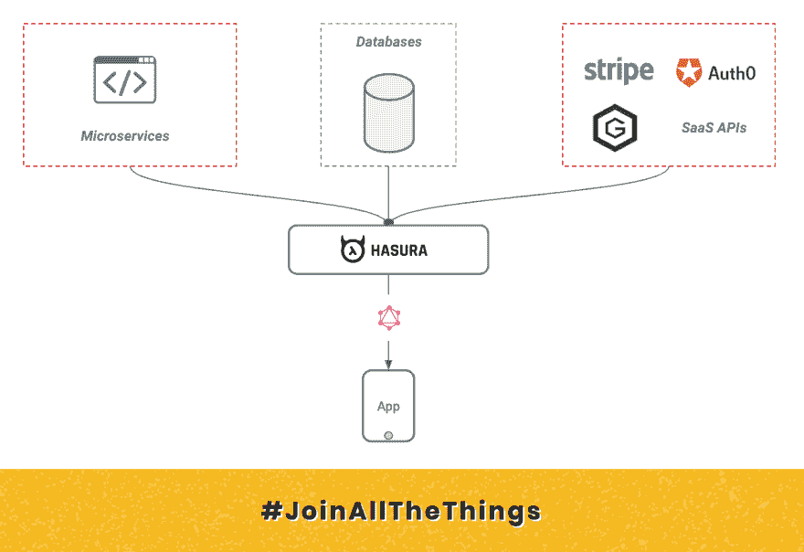](https://res.cloudinary.com/practicaldev/image/fetch/s--DmYIhrMd--/c_limit%2Cf_auto%2Cfl_progressive%2Cq_auto%2Cw_880/https://thepracticaldev.s3.amazonaws.com/i/eojjuif7x24wv408azoc.png) 

<figure>

<figcaption>远程连接:一个连接数据库和其他数据源的 graph QL API</figcaption>

</figure>

我们一直在努力开发一个核心的 Hasura 特性，它将允许你使用 GraphQL 获取数据库和远程数据源中与*相关的*数据。(目前在预览中，如果你想在它发布时得到通知，请在这里注册！)

随着开发人员和团队越来越多地使用第三方 API，多个数据库和微服务、数据和“真实的来源”正在这些数据源中传播。应用程序开发人员很难访问精确的数据切片，并且要花费大量的开发周期来安全地将所有数据整合在一起。

Hasura 中的远程连接扩展了跨表连接数据的概念，能够跨表和远程数据源连接数据。一旦在来自数据库的类型和从 API 创建的类型之间创建了关系，就可以通过运行 GraphQL 查询来“联接”它们。#JoinAllTheThings

*前往[公关](https://github.com/hasura/graphql-engine/pull/2392)查看更多细节，阅读预览文件，并尝试一个你可以旋转的测试 Hasura 图像。跳到我们的[不和](https://discordapp.com/invite/hasura)或者评论 [github](https://github.com/hasura/graphql-engine) 让我们知道你的想法！*

远程连接可以跨数据库和 API 进行连接。这些 API 可以是您编写的自定义 GraphQL 服务器、第三方 SaaS API，甚至是其他 Hasura 实例。

当然，因为 Hasura 是一个 GraphQL 服务器，您可以直接向您的应用程序公开，所以 Hasura 在提供远程连接的同时还处理安全性和授权。

* * *

## 用例 1:客户数据与条带中的账户/账单/支付信息相结合

如果你的应用程序中有一种使用 Stripe 的支付方式，那么关于你的客户的许多账户和账单信息都存在于 Stripe 中。例如，客户保存的卡、账户余额、账单/发票历史记录。

<figure>

[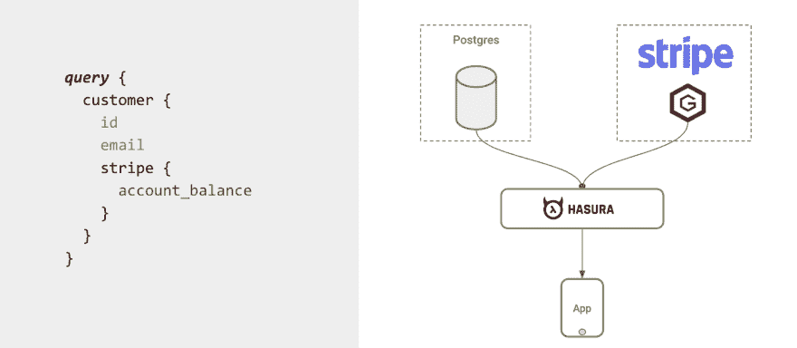](https://res.cloudinary.com/practicaldev/image/fetch/s--dj56cGfX--/c_limit%2Cf_auto%2Cfl_progressive%2Cq_auto%2Cw_880/https://thepracticaldev.s3.amazonaws.com/i/wzrqxwtefi93sn2xceeq.png)

<figcaption>Customer data joined with account, billing, payment-transaction data in Stripe</figcaption>

</figure>

在你的应用程序中，你通常会希望向用户显示他们保存的卡和发票历史。您需要编写代码，从 Stripe API 中为正确的用户/发票获取正确的数据，并将其作为 API 响应返回给您的应用程序。

这是这个设置在 Hasura 上的样子:

<figure>

**第一步:设置 [OneGraph](https://www.onegraph.com/) 连接到您的条纹账户**
[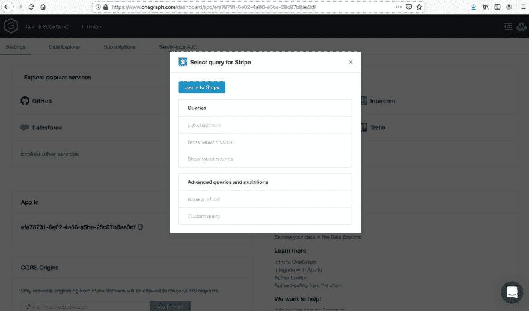](https://res.cloudinary.com/practicaldev/image/fetch/s--gr3f5dZk--/c_limit%2Cf_auto%2Cfl_progressive%2Cq_auto%2Cw_880/https://thepracticaldev.s3.amazonaws.com/i/vbd8fax3oos86vviamqn.png)

<figcaption>Setup OneGraph to connect to your Stripe account</figcaption>

</figure>

<figure>

**步骤 2:将 OneGraph 作为远程模式添加到 Hasura**
[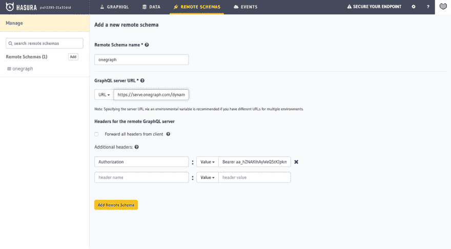](https://res.cloudinary.com/practicaldev/image/fetch/s--yhxa3NOi--/c_limit%2Cf_auto%2Cfl_progressive%2Cq_auto%2Cw_880/https://thepracticaldev.s3.amazonaws.com/i/osqnwcz61slc0l2hipea.png)

<figcaption>Add OneGraph as a remote schema to Hasura</figcaption>

</figure>

<figure>

**步骤 3:使用`stripe_customer_id`作为“连接”键**
[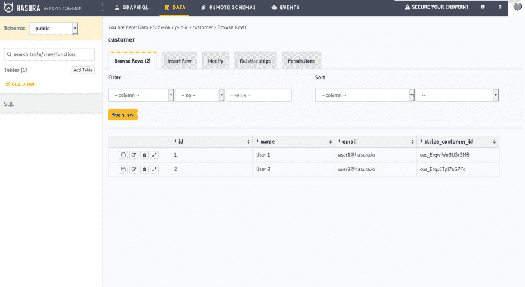](https://res.cloudinary.com/practicaldev/image/fetch/s--J-1lLEt7--/c_limit%2Cf_auto%2Cfl_progressive%2Cq_auto%2Cw_880/https://thepracticaldev.s3.amazonaws.com/i/ivkecou95hfijsm84wsu.png) ，设置从客户表到条带解析器的远程关系

<figcaption>Your table should have the stripe_customer_id column</figcaption>

</figure>

<figure>

[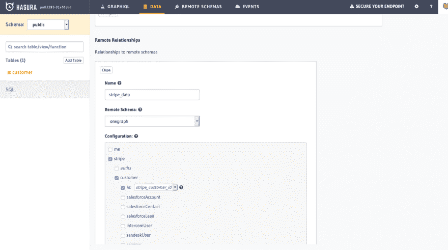](https://res.cloudinary.com/practicaldev/image/fetch/s--_QVLLaIA--/c_limit%2Cf_auto%2Cfl_progressive%2Cq_auto%2Cw_880/https://thepracticaldev.s3.amazonaws.com/i/qtcnkew2w3x7b14g6kdw.png)

<figcaption>Setup a remote relationship from your customer table to the Stripe resolver using the stripe_customer_id as the "join" key</figcaption>

</figure>

<figure>

**步骤 4:执行 GraphQL 查询，一次性获取客户和条带信息！**
[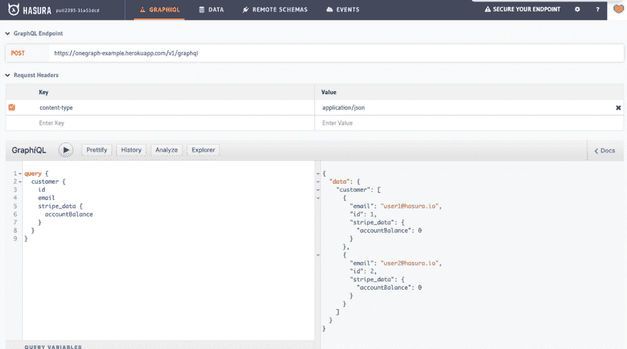T5】](https://res.cloudinary.com/practicaldev/image/fetch/s--8zhbiodH--/c_limit%2Cf_auto%2Cfl_progressive%2Cq_auto%2Cw_880/https://thepracticaldev.s3.amazonaws.com/i/hzuulvy137illv09k31u.png)

<figcaption>Make GraphQL queries to fetch customer and stripe information in one shot!</figcaption>

</figure>

* * *

## 用例#2:用户数据与 Auth0 中的配置文件信息相结合

当您使用外部身份验证提供者(甚至是您的团队不直接拥有的身份验证/用户管理微服务)时，会有一些信息只由 auth 服务提供。比如`last_login`、`verified_email`、`login_count`等等。

在您的数据库中，通常会有一个带有`auth0_id`的用户表。要获取特定于 auth 的信息，您需要使用这个 id 和 Auth0 API。

<figure>

[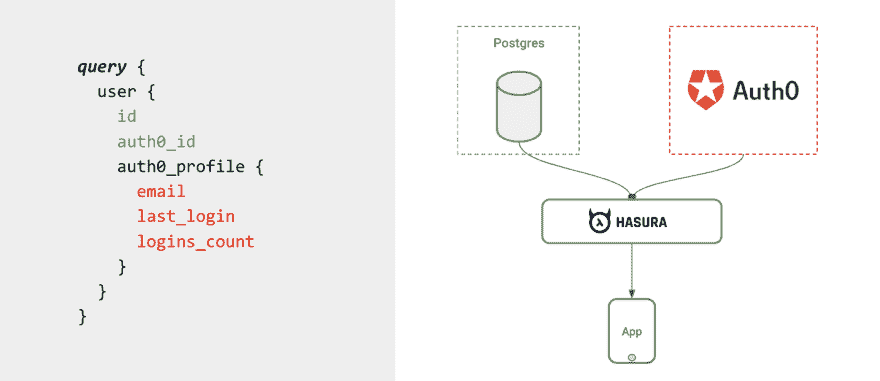](https://res.cloudinary.com/practicaldev/image/fetch/s--iNNtTKJh--/c_limit%2Cf_auto%2Cfl_progressive%2Cq_auto%2Cw_880/https://thepracticaldev.s3.amazonaws.com/i/nrv4ckecyf0um7effj6x.png)

<figcaption>User data joined with account/profile/auth information in Auth0</figcaption>

</figure>

以下是 Hasura 如何帮助你自动化这个过程:

<figure>

**步骤 1:编写一个无服务器函数，将 Auth0 profile API 封装在一个 GraphQL 查询解析器中。**
[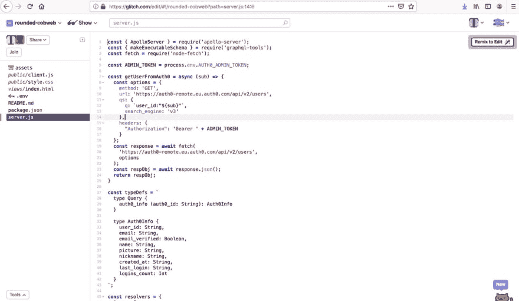T5】](https://res.cloudinary.com/practicaldev/image/fetch/s--RO4F4NFR--/c_limit%2Cf_auto%2Cfl_progressive%2Cq_auto%2Cw_880/https://thepracticaldev.s3.amazonaws.com/i/dvcao1jz4a3qudmq3wb7.png)

<figcaption>Write a serverless function that wraps the Auth0 profile API in a GraphQL query resolver.</figcaption>

</figure>

<figure>

**步骤 2:在 Hasura**
[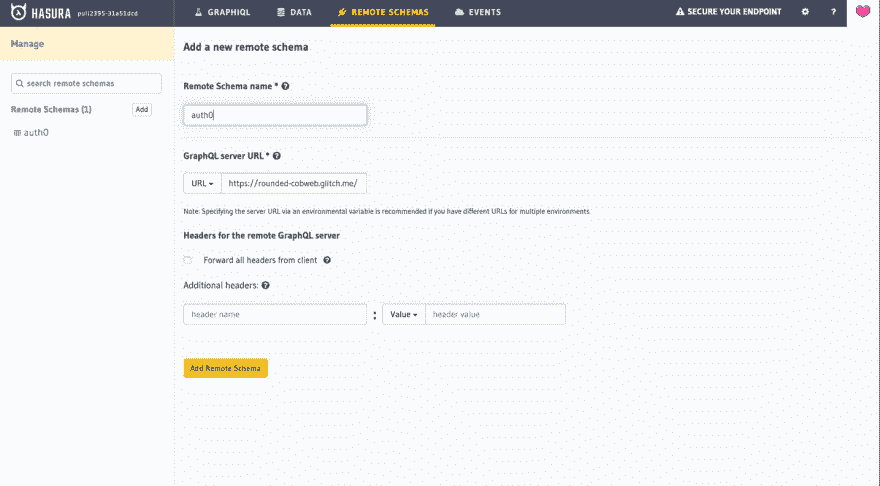](https://res.cloudinary.com/practicaldev/image/fetch/s--v1KRPDJV--/c_limit%2Cf_auto%2Cfl_progressive%2Cq_auto%2Cw_880/https://thepracticaldev.s3.amazonaws.com/i/ue4p4y8gexh8p7a92w8y.png) 中连接这个作为远程模式

<figcaption>Connect this as a remote schema in Hasura</figcaption>

</figure>

<figure>

**第三步:转到 Hasura 上的用户表，向上面添加的模式添加一个“远程关系”**
[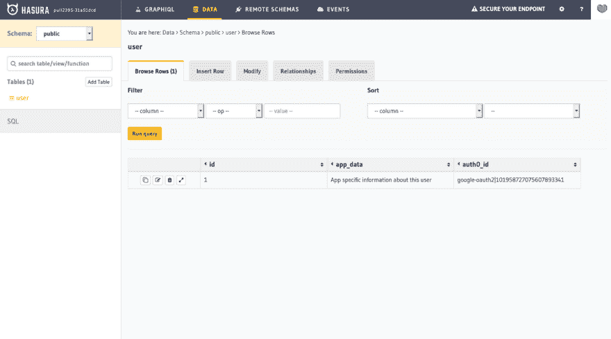](https://res.cloudinary.com/practicaldev/image/fetch/s--q4TSfYV3--/c_limit%2Cf_auto%2Cfl_progressive%2Cq_auto%2Cw_880/https://thepracticaldev.s3.amazonaws.com/i/lnacxrbyp0kj73w9q9j2.png)

<figcaption>The auth0_id identifier is the "join" key from your database</figcaption>

</figure>

<figure>

[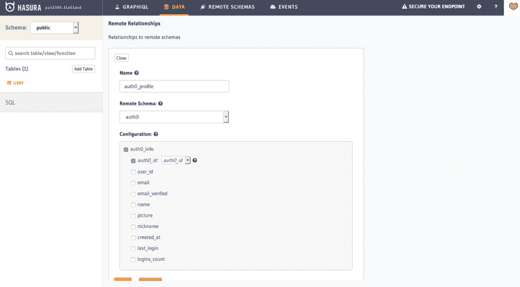](https://res.cloudinary.com/practicaldev/image/fetch/s--hLDzI8CW--/c_limit%2Cf_auto%2Cfl_progressive%2Cq_auto%2Cw_880/https://thepracticaldev.s3.amazonaws.com/i/gi0zrmmumst5b0szwuna.png)

<figcaption>Add a "remote relationship" to the auth0 schema</figcaption>

</figure>

<figure>

**步骤 4:进行 GraphQL 查询，同时从用户表和 Auth0 配置文件信息中查询数据**
[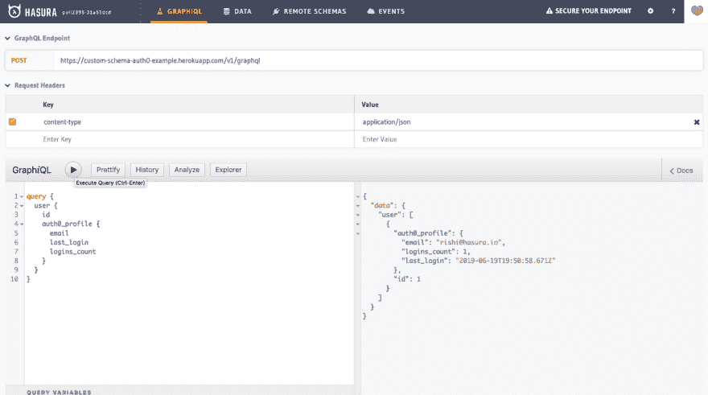](https://res.cloudinary.com/practicaldev/image/fetch/s--3ydzoVph--/c_limit%2Cf_auto%2Cfl_progressive%2Cq_auto%2Cw_880/https://thepracticaldev.s3.amazonaws.com/i/cpm3abrylj4b077c680e.png)

<figcaption>Make a GraphQL query to query data from the user table and the Auth0 profile information simultaneously</figcaption>

</figure>

* * *

## 用例 3:连接两个独立数据库的数据

<figure>

[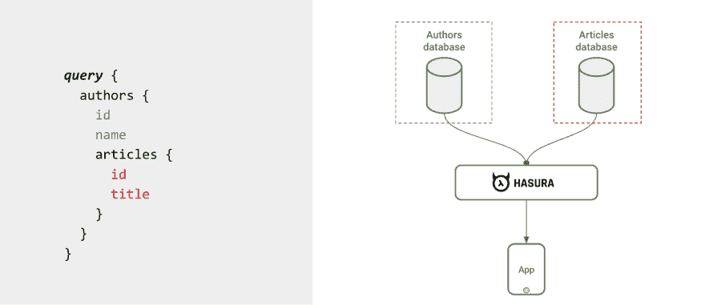](https://res.cloudinary.com/practicaldev/image/fetch/s--mGvedi-N--/c_limit%2Cf_auto%2Cfl_progressive%2Cq_auto%2Cw_880/https://thepracticaldev.s3.amazonaws.com/i/alkei41fqwuiktgyuws7.png)

<figcaption>Joining data across 2 databases</figcaption>

</figure>

标题说明了一切🤓。这就是 Hasura 的工作原理！

<figure>

第一步:设置 Hasura 以正确的访问控制规则指向数据库 1 和数据库 2，这样你的 GraphQL API 是安全的。
[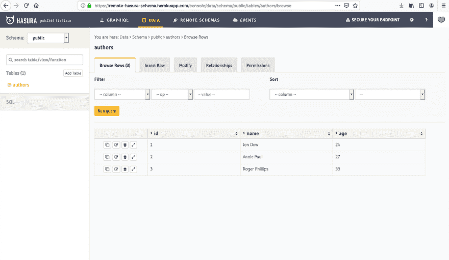T5】](https://res.cloudinary.com/practicaldev/image/fetch/s--tyrbr_RG--/c_limit%2Cf_auto%2Cfl_progressive%2Cq_auto%2Cw_880/https://thepracticaldev.s3.amazonaws.com/i/z8bc7hnxue0z8k03rmj7.png)

<figcaption>The "remote" Hasura + Postgres</figcaption>

</figure>

<figure>

[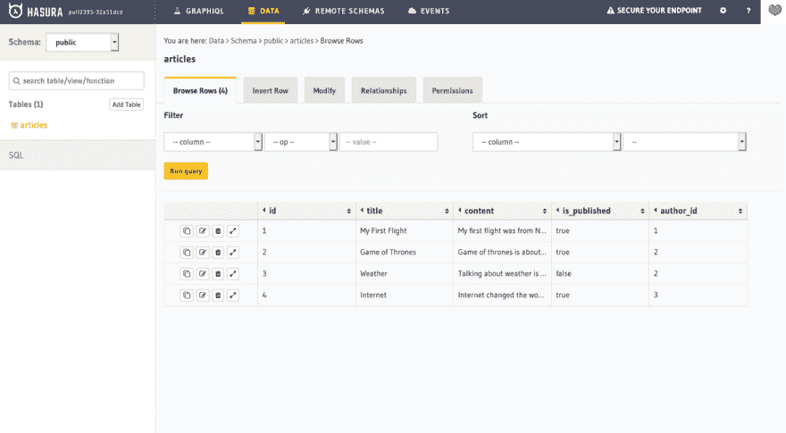](https://res.cloudinary.com/practicaldev/image/fetch/s--x3uJS8vq--/c_limit%2Cf_auto%2Cfl_progressive%2Cq_auto%2Cw_880/https://thepracticaldev.s3.amazonaws.com/i/vq09byicsi5ut7mfqeke.png)

<figcaption>The "primary" Hasura + Postgres</figcaption>

</figure>

<figure>

**步骤 2:在您的“主”数据库的 Hasura 上，添加第二个 Hasura 作为远程模式**
[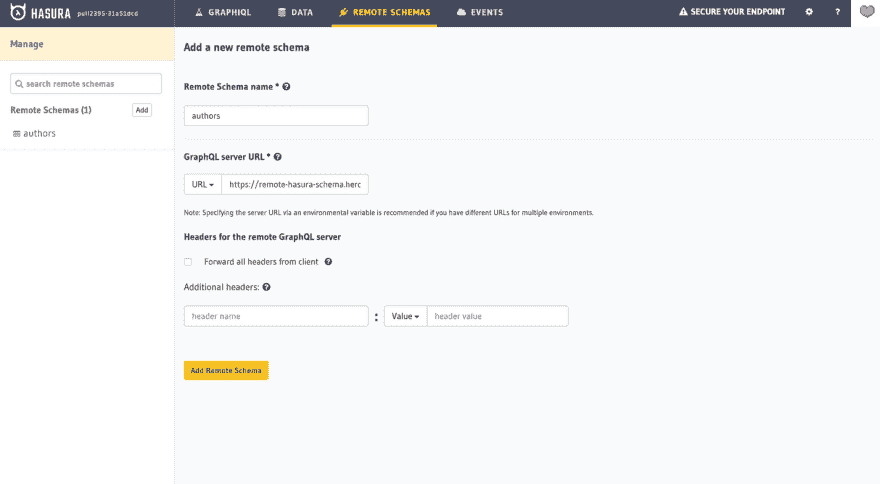](https://res.cloudinary.com/practicaldev/image/fetch/s--qoZfdVx1--/c_limit%2Cf_auto%2Cfl_progressive%2Cq_auto%2Cw_880/https://thepracticaldev.s3.amazonaws.com/i/cagseommrdjhw6697k7q.png)

<figcaption>On the Hasura of your "primary" database, add the second Hasura as a remote schema</figcaption>

</figure>

<figure>

步骤 3:建立从“主”数据库中的任何表到另一个数据库中的解析器的远程关系。
[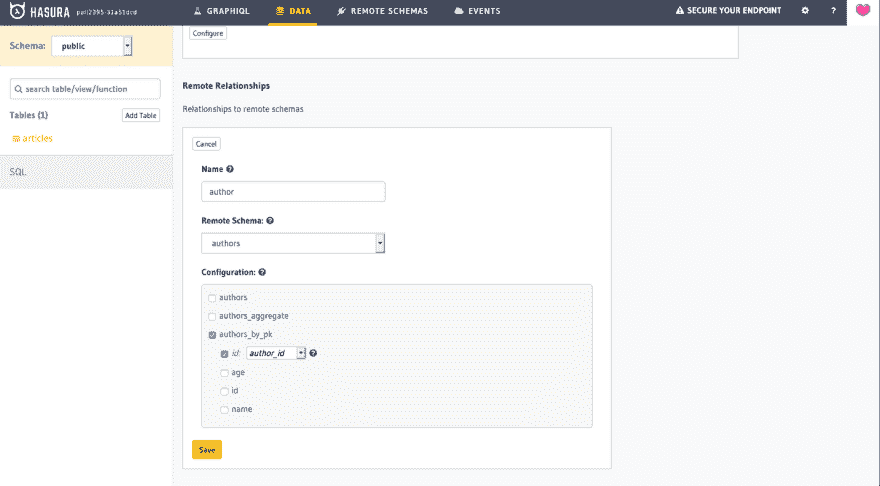T5】](https://res.cloudinary.com/practicaldev/image/fetch/s--llDZxbQt--/c_limit%2Cf_auto%2Cfl_progressive%2Cq_auto%2Cw_880/https://thepracticaldev.s3.amazonaws.com/i/ukqmeq9956kbz4rd6tsv.png)

<figcaption>Set up remote relationships from any table in your "primary" database to resolvers in the other database</figcaption>

</figure>

<figure>

第四步:运行一个 GraphQL 查询来连接两个数据库的数据！
[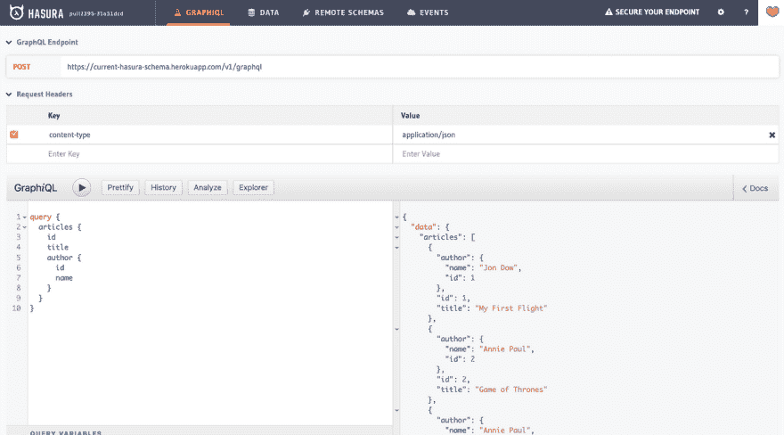T5】](https://res.cloudinary.com/practicaldev/image/fetch/s--gXMTnxQp--/c_limit%2Cf_auto%2Cfl_progressive%2Cq_auto%2Cw_880/https://thepracticaldev.s3.amazonaws.com/i/nk7544owsgm4qpyzsbfc.png)

<figcaption>A GraphQL query that joins data across 2 databases!</figcaption>

</figure>

* * *

**注意:** Hasura Remote Joins 是 GraphQL 联邦的一种，类似于 Apollo 联邦。关键的区别在于，Apollo Federation 旨在帮助拥有多个 GraphQL 团队的组织“联合”一个全球 GraphQL 模式。Hasura remote joins 帮助您跨多个数据源(或 GraphQL 微服务)进行“join ”,从而获得一个统一的 GraphQL API。这个统一的 GraphQL API 可能是应用程序有多个数据源的团队所需要的，也可能是由组织中的中央数据 API 团队维护的跨不同团队(如 Apollo Federation)的统一 GraphQL API。

尝试一下，让我们知道你的想法！我们❤️你的反馈。请点击我们的 github 或 T2 的 discord。远程连接将不再是预览版，很快就会发布供生产使用！

* * *

*本文由[坦迈·戈帕尔](https://twitter.com/tanmaigo)原创并发表在[哈苏拉博客](https://blog.hasura.io/remote-joins-a-graphql-api-to-join-database-and-other-data-sources/)T5 上。*