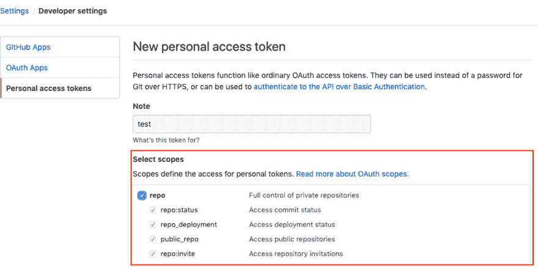

# 从目标 Gituhub 帐户的所有存储库中删除指定的协作者。

> 原文：<https://dev.to/rinstarskykujat/removes-the-specified-collaborators-from-all-repositories-of-the-target-gituhub-account-mkm>

# 从目标 Gituhub 帐户的所有存储库中删除指定的协作者。

详情请查看此 [Github](https://github.com/TakuyaTaniguchi/removeGitCollaborators) 。

## 整体画面

```
 /**
     * GLOBAL
     * gitアカウントのメールアドレス
     * ログインパスワード
     * githubのアカウント名
     * 削除したいユーザー
     * を入力してください。
     */
    $Email = '';
    $PASS = '';
    $USER = '';
    $DELTE_USER = '';

    /**
     * 下記のAPIを実行し、api.jsonを作成してください。別途アクセストークンが必要です。
     * curl  "https://api.github.com/user/repos?access_token={token}&per_page=100&page=1&sort=created" > api.json
     */

    $url = './api.json';
    $json = file_get_contents($url);
    $json = mb_convert_encoding($json, 'UTF8', 'ASCII,JIS,UTF-8,EUC-JP,SJIS-WIN');
    $arr = json_decode($json,true);
    echo $count = count($arr);

    for ($i = 0; $i < $count; ++$i) {
        $repoName = $arr[$i]['name'];

        $cmd = "curl -X DELETE -u $Email:$PASS 'https://api.github.com/repos/$USER/$repoName/collaborators/$DELTE_USER'";
        echo $repoName;
        echo exec($cmd);
    } 
```

首先，请从 Github 管理界面的设置中获取 APIKey。在这种情况下，请检查所选范围的回购。

[](https://res.cloudinary.com/practicaldev/image/fetch/s--drAJNpMe--/c_limit%2Cf_auto%2Cfl_progressive%2Cq_auto%2Cw_880/https://thepracticaldev.s3.amazonaws.com/i/xwhz8g7j1c95iwv1b4o2.png)

获得访问令牌后，执行以下命令创建 api.json.

```
curl  "https://api.github.com/user/repos?access_token={token}&per_page=100&page=1&sort=created" > api.json 
```

指定一个 remove.php 变量。

```
$Email = 'hoge@gmail.com';
$PASS = 'password';
$USER = 'MyName';
$DELTE_USER = 'user_id'; 
```

跑 remove.php

```
php remove.php 
```

## 补充

最多可以获得 100 个存储库。
如果您想要获得 100 个以上的存储库，单独创建额外的 json 文件，如下所示，
指定文件，再次运行 PHP。

```
curl  "https://api.github.com/user/repos?access_token={token}&per_page=100&page=2&sort=created" > api_2.json 
```

remove.php

```
$url = './api_2.json'; 
```