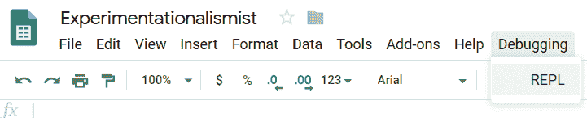
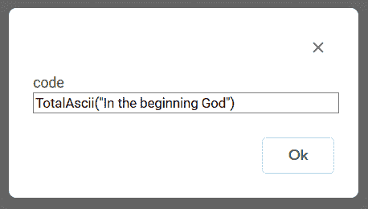
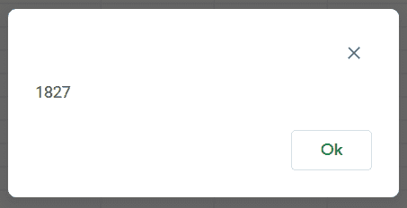

# 谷歌应用程序脚本中的 REP 和几乎 L

> 原文：<https://dev.to/bugmagnet/rep-and-almost-l-in-google-apps-script-5448>

我已经很久没有写关于计算的博客了(我通常写关于 T2 烘焙的博客了)，但是现在开始。

最近，我一直在爬一条陡峭的学习曲线，试图理解 Google Apps 脚本(GAS)。现在，几个电子表格后，我应该看到我在大约一个月内坠毁在行星附加土地上的轨迹。

长期以来，REPL(读取-评估-打印-循环)一直是各种编程语言的一大亮点。那么为什么不是天然气呢？(好吧，它比 REPL 更有代表性，因为没有发生循环，但它很接近。)

在我的 Code.gs 中，我有下面的代码(还有其他的)

```
function onOpen() { 
  var ui = SpreadsheetApp.getUi();
  ui.createMenu('Debugging')
  .addItem('REPL', 'REPL')
  .addToUi();  
} 
```

这将一个自定义菜单添加到菜单栏，并填充一个条目，即“REPL”，当选择它时，运行一个名为“REPL”的功能。

```
function REPL() {
  var code = Browser.inputBox('code');
  if (code !== 'cancel') {
    Browser.msgBox(eval(code));
  }
} 
```

出于演示的目的，这里还有一个对参数字符串中字符的 ASCII 值求和的函数。

```
function TotalAscii(str) {
  return str.split("").reduce(function (result, item, index) {
    return result + item.charCodeAt(0)
  }, 0)
} 
```

视觉上，我们从调试菜单 [](https://res.cloudinary.com/practicaldev/image/fetch/s--ojwHuR1K--/c_limit%2Cf_auto%2Cfl_progressive%2Cq_auto%2Cw_880/https://thepracticaldev.s3.amazonaws.com/i/e6gsqisdagqo8y8es4oi.png) 
中选择 REPL 选项，输入要评估的内容并获得响应。 [ ](https://res.cloudinary.com/practicaldev/image/fetch/s--4kTPaCC---/c_limit%2Cf_auto%2Cfl_progressive%2Cq_auto%2Cw_880/https://thepracticaldev.s3.amazonaws.com/i/skl0g3azc3mec6acye0o.png)

我想在某个阶段把一个 HTML 表单和一个文本区放在一起。也许等我爬出火山口后。