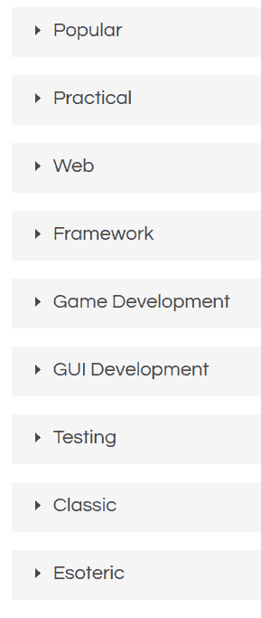

# Repl.it -优点和缺点

> 原文：<https://dev.to/12944qwerty/repl-it-pros-cons-fj7>

*这是我的第一篇帖子，所以希望它会有好的结果*

我过去曾多次使用过 [repl.it](//repl.it) ，因为我用的是 chromebook，不想把它转换成面包丁。我发现这真的是一种很好的编码方式，在任何语言中。几个月来，我一直用它来编写我的不和谐机器人[棘轮](https://github.com/12944qwerty/Ratchet)。为此，我主要使用 python，但是所有的优点和缺点应该适用于许多语言。

这些类别中的所有语言都包括在内: 

| *优点* | *缺点* |
| --- | --- |
| 这是一个网络浏览器应用程序。你不需要下载任何东西。 | 您需要连接到 internet 才能运行代码。 |
| 插件很容易“下载”。只要写下他们的名字。 | 我只知道 python 有这个功能 |
| 这可能会持续很长时间 | 但不是永远。如果你关闭电脑，它就会停止。 |
| 自动保存到云。如果您离线，也可以下载所有文件 | 不保存到云上。所以，如果你刷新.... |
| 排除故障 | 我从来没有尝试过这个功能，所以，我不知道任何缺点... |
| 实时协作 | 目前处于测试阶段 |
| 一个社区。您可以就 repl 或编码方面的问题提出任何问题 | 它没有堆栈溢出快。 |
| 它也有一个控制台，使用 linux | 这个主机真的很难用，(对我来说)。我不知道如何使用 bash 命令等等。 |

我会继续更新，因为我发现更多。(或者给你找到的东西留言)

如果有任何我可以改进的地方，请通过写帖子告诉我。正如我所说，这是我的第一篇文章。