# 更换 JHipster UI 组件(第 2 部分。添加 SideNavbar 和自定义更多组件)

> 原文：<https://dev.to/antonioortizpola/replacing-jhipster-ui-components-part-2-adding-sidenavbar-and-customizing-more-components-3fmm>

在最后一部分，我改变了顶部的导航条，使其具有与 JHipster 相同的功能，现在是时候对其进行一些定制，以添加我们自己的风格了。

# 为导航栏定制

首先，我将使用 [flag-icon-css](https://github.com/lipis/flag-icon-css) 来使语言栏更具描述性。正如他们的医生所说，我只是运行

```
npm install flag-icon-css 
```

安装后，我需要将`svg`文件复制到我的内容文件夹，这样样式就可以正确加载了。

```
node_modules/flag-icon-css/sass/flag-icon.scss 
```

至

```
app/bjt/sass/flag-icon.scss 
```

但是我需要覆盖变量文件，这样我就可以更新`svg`文件所在的路径，为了简单起见，我将定制我的新`flag-icon.scss`

```
// Override paths for svgs
$flag-icon-css-path: '/content/bjt/vendor/flags' !default;
$flag-icon-rect-path: '/4x3' !default;
$flag-icon-square-path: '/1x1' !default;

@import '~flag-icon-css/sass/flag-icon-base';
@import '~flag-icon-css/sass/flag-icon-list'; 
```

然后在我的`bjt/bjt-style.scss`

```
@import 'sass/flag-icon.scss'; 
```

现在，为了运行一个测试，我可以在某个地方添加样式

```
<span class="flag-icon flag-icon-gr"></span>
<span class="flag-icon flag-icon-gr flag-icon-squared"></span> 
```

现在我们有一些旗子了！

[](https://res.cloudinary.com/practicaldev/image/fetch/s--EVpHtUv_--/c_limit%2Cf_auto%2Cfl_progressive%2Cq_auto%2Cw_880/https://thepracticaldev.s3.amazonaws.com/i/zgot91zlns0feaikbuou.png)

但并不是所有的事情都那么好，很快我就遇到了困难，非常困难。

## Vue.js 和 TypeScript `super`算不上什么朋友

下一部分是基于一些搜索和我对 Vue 的一点点了解，如果有什么问题或者有更好的方法，请告诉我！

虽然在 angular 中我可以利用继承和调用 super 来执行已经放在 JHipster 父类中的代码，但在 Vue.js 中却不是这样，正如 [Ashraful Islam](https://dev.to/ashraful/call-super-method-in-vue-component-3pl2) 所说:

> 到目前为止(VueJS v2 ),我们还没有像 react 这样的基于类的组件。有自己的语法，而不是传统的 javascript。

进一步调查后，我意识到这不仅是真的，而且是设计出来的，我认为这不会很快改变，因为许多人都知道这是 [vue.js](https://github.com/vuejs/vue/issues/2371) 中的一个老讨论，重点如下:

> 我的观点是，除了语法偏好之外，ES6 类与普通对象定义相比没有任何实际优势。

或者

> 我不认为我会改变 Vue 的默认 API 来使用类。

最重要的是:

> 那些“只想要类”的人可能从来没有真正尝试过想象 Vue 当前的 API 使用类会是什么样子...
> 
> ...嗯，我试过了，我的结论是只使用 ES2017 的特定功能，根本没有办法提供足够优雅的东西。您最终会遇到繁琐的构造函数调用(别忘了`super`，将实例方法绑定到`this`)，像`static get option () { return { ... }}`这样笨拙的变通方法，或者在类声明块后附加静态属性，等等。等等。

*[https://github . com/vuej/view/issues/2371 #发布 comment-330068362](https://github.com/vuejs/vue/issues/2371#issuecomment-330068362)*

虽然我不完全同意 yyx990803 的观点，但我完全理解他的观点

> ...今天的标准还不足以提供与 Vue 当前 API 相当的东西

关于如何编写用户界面(功能性的、面向对象的、可变性/不可变性)的最佳方法，有很多争论..)，为了更清楚起见，我倾向于稍微详细一点，使用“类型安全”和静态代码检查。与此同时，我发现 vue.js 比 angular 更容易开发，也没有 angular 那么正式(声明组件，如果要在其他组件中使用它们，就使用模块)，所以，我知道它并没有相同的设计，而且总是有所取舍。

所以 vue.js 首选这个

```
export default {
  props: {
    propA: {
      type: Number
    },
    propB: {
      default: 'default value'
    },
    propC: {
      type: [String, Boolean]
    }
  }
} 
```

到此

```
import { Vue, Component, Prop } from 'vue-property-decorator'

@Component
export default class YourComponent extends Vue {
  @Prop(Number) readonly propA: number | undefined
  @Prop({ default: 'default value' }) readonly propB!: string
  @Prop([String, Boolean]) readonly propC: string | boolean | undefined
} 
```

问题是 JHipster 用 angular 和 react 的类来生成组件，所以尝试用 vue.js 来适应相同的方法似乎是更明智的方法，甚至有一个[官方组件](https://github.com/vuejs/vue-class-component)以便您可以将组件声明为类，但这只是部分解决方案，它需要一些注释和约定，并将其转换为具有各自属性的 VueJs 组件。

这导致，即使你认为你在使用类来为你的组件编程，它们也不是真正的类，它们被“解析”来与 vue.js 一起工作，并且，因为它没有类，它也没有`super`的概念。

我不知道对 JHipster 来说什么是最好的，是将类改为 VueJs 组件，还是保持原样，到目前为止，这是我发现的唯一主要问题。在我看来，这可能是理解 VueJs 设计哲学的一个障碍，但另一方面，我非常习惯于上课，在这种特殊情况下，它帮助我更快地理解和提高效率，所以我将把决定权留给读者。

对我来说，我必须记住我的第二条规则

> 根据 JHipster 调整布局，而不是相反

所以，我决定，现在，我将更改我需要覆盖的方法的名称，以添加一个下划线`_`,这样我就不会遇到问题，可悲的是，每个修改的组件都意味着在我的 UI 和 JHipster 的 UI 之间切换的代码的一个更改，这也意味着当我更新我的 JHipster 时，可能会有更多的冲突，但目前看来这仍然是一个简单的任务。

## 回到我们的节目！

为了最终包含我的语言标志，我需要对 JhiNavbar 做一个简单的更改，使语言受到保护，这样我就可以访问我的类中的属性，并给创建的方法添加一个下划线，这样我就可以替换它。

[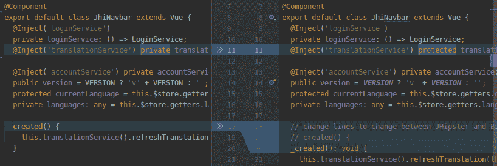](https://res.cloudinary.com/practicaldev/image/fetch/s--MATfOfj7--/c_limit%2Cf_auto%2Cfl_progressive%2Cq_auto%2Cw_880/https://thepracticaldev.s3.amazonaws.com/i/mq3r7rbefjsvdxe2mv5j.png)

然后，我只需要给我的 bjt/bjt-navbar
添加一些方法

```
public flagLanguages = {
  es: 'mx',
  en: 'us'
};
public flag: string;

created() {
  this._created();
  this.flag = this.flagLanguages[this.currentLanguage];
} 
```

语言下拉菜单现在可以用它来更直观一点

```
<b-nav-item-dropdown no-caret :right="!isRTL" v-if="languages && Object.keys(languages).length > 1">
    <template slot="button-content">
        <i class="navbar-icon align-middle flag-icon flag-icon-squared" :class="'flag-icon-' + flag"></i>
        <span class="d-lg-none align-middle" v-text="$t('global.menu.language')">&nbsp; Language</span>
    </template>

    <b-dd-item v-for="(value, key) in languages" :key="`lang-${key}`" v-on:click="bjtChangeLanguage(key)"
                     :class="{ active: isActiveLanguage(key)}">
        <i class="flag-icon flag-icon-squared mr-1" :class="'flag-icon-' + flagLanguages[key]"></i>
        {{value.name}}
    </b-dd-item>
</b-nav-item-dropdown> 
```

现在我们的语言栏看起来更好了

[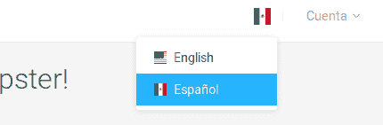](https://res.cloudinary.com/practicaldev/image/fetch/s--9gXi9aYb--/c_limit%2Cf_auto%2Cfl_progressive%2Cq_auto%2Cw_880/https://thepracticaldev.s3.amazonaws.com/i/ejjv6z3ve359kigrb700.png)

最后，让我们让用户名也可以访问

```
public get username(): string {
  return this.$store.getters.account ? this.$store.getters.account.firstName : '';
} 
```

这看起来越来越好了

[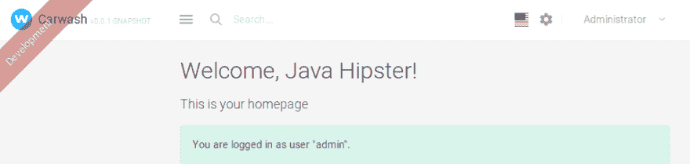](https://res.cloudinary.com/practicaldev/image/fetch/s--aWXr5q0m--/c_limit%2Cf_auto%2Cfl_progressive%2Cq_auto%2Cw_880/https://thepracticaldev.s3.amazonaws.com/i/e66hy7yd4fx9lglq86yi.png)

# 在 JHipster 中实现 SideNavBar

从现在起，我们应该能够更容易地前进，因为我们已经解决了大多数共同问题。

检查 Appwork 演示，漂亮的页面使用 layout2，所以我相应地修改了`bjt/App.vue`文件

```
<template>
    <div class="layout-wrapper layout-2" id="app">
        <ribbon></ribbon>
        <div class="layout-inner">
            <bjt-sidebar />

            <div class="layout-container">
                <bjt-navbar />

                <div class="layout-content">
                    <div class="router-transitions container-fluid flex-grow-1 container-p-y">
                        <router-view />
                    </div>

                    <b-modal id="login-page" hide-footer lazy>
                        <span slot="modal-title" id="login-title" v-text="$t('login.title')">Sign in</span>
                        <login-form></login-form>
                    </b-modal>

                    <jhi-footer></jhi-footer>
                </div>
            </div>
        </div>
        <div class="layout-overlay" @click="closeSidenav"></div>
    </div>
</template> 
```

然后我基于 Appwork 的`LayoutSidenav.vue`组件创建我的`bjt-sidebar.component.ts`文件。

[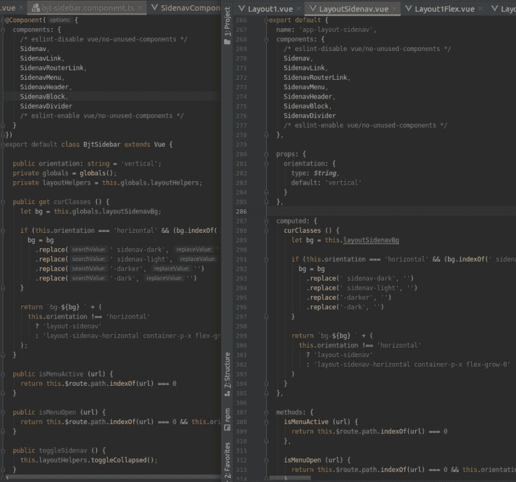](https://res.cloudinary.com/practicaldev/image/fetch/s--FYtraxG9--/c_limit%2Cf_auto%2Cfl_progressive%2Cq_auto%2Cw_880/https://thepracticaldev.s3.amazonaws.com/i/p2iqwiy6ph6s3nfezk3j.png)

正如您所注意到的，这只不过是对组件类的解析。我还创建了包含所有视图代码的`bjt-sidebar.component.ts`。现在我们的基础项目就要完成了！

[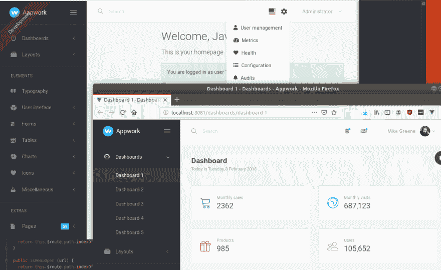](https://res.cloudinary.com/practicaldev/image/fetch/s--gtDxLRWk--/c_limit%2Cf_auto%2Cfl_progressive%2Cq_auto%2Cw_880/https://thepracticaldev.s3.amazonaws.com/i/1a2i2tmm5cm5gexdrdvu.png)

然后，我对页脚组件重复这个过程，如果需要进行翻译，就创建新的 i18n 文件。在用实体菜单替换了菜单之后，你可以说我们有了一个带有 Appwork 布局的 JHipster 应用程序库！

[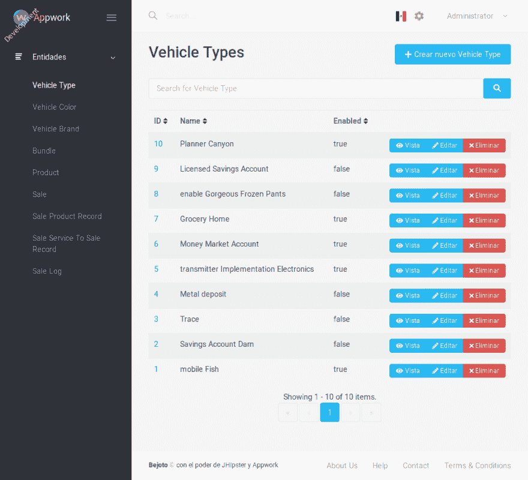](https://res.cloudinary.com/practicaldev/image/fetch/s--VSBDFNdX--/c_limit%2Cf_auto%2Cfl_progressive%2Cq_auto%2Cw_880/https://thepracticaldev.s3.amazonaws.com/i/t4e5gupae31k7jcc5m9m.png)

[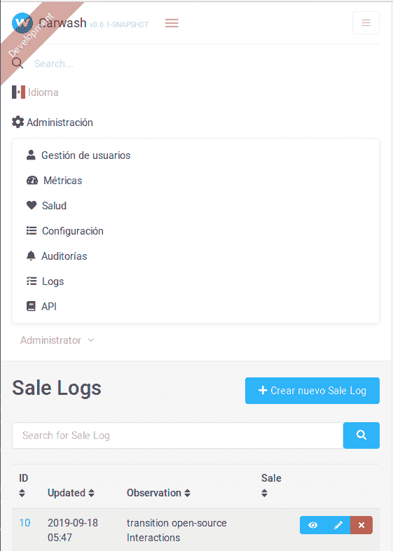](https://res.cloudinary.com/practicaldev/image/fetch/s--LnRkVC_f--/c_limit%2Cf_auto%2Cfl_progressive%2Cq_auto%2Cw_880/https://thepracticaldev.s3.amazonaws.com/i/749xynz3qyo96vk1m3h9.png)

在欣赏了我们的作品一段时间后，我想比较我接触了多少部分来整合我的布局。

检查基本文件

[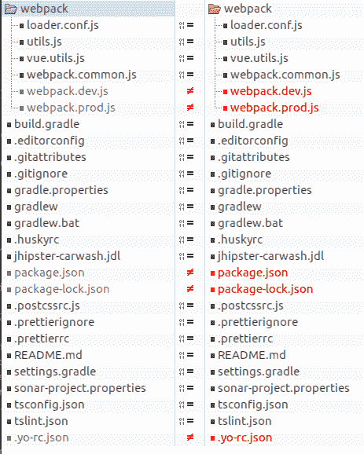](https://res.cloudinary.com/practicaldev/image/fetch/s--0Rt5F0oD--/c_limit%2Cf_auto%2Cfl_progressive%2Cq_auto%2Cw_880/https://thepracticaldev.s3.amazonaws.com/i/ykqjc3ypihin113xhro9.png)

我们只有一个 JHipster 未接触项目的 5 个不同的文件

*   仅仅修改了一行代码来加载我们的风格，而不是来自 JHipster 的风格
*   `webpack/webpack.prod.js`:和以前一样
*   我们安装了一些新的库并更新了一个，这个文件预计会随着系统的增长而有很大的变化
*   `.yo-rc.json`:这个文件之所以被更改，是因为每次生成应用程序时都会生成一个随机的`jwtSecretKey`

检查源文件，我们可以看到我们没有触及许多文件

[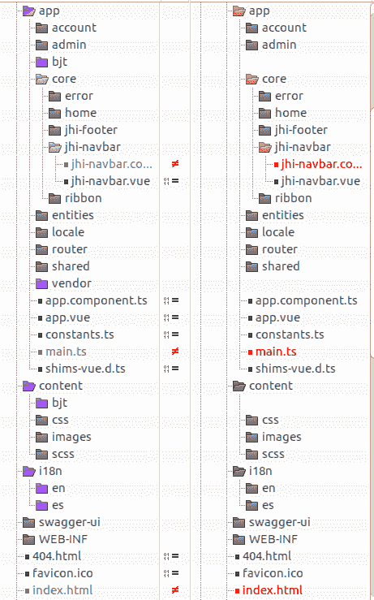](https://res.cloudinary.com/practicaldev/image/fetch/s--od4rbH5Z--/c_limit%2Cf_auto%2Cfl_progressive%2Cq_auto%2Cw_880/https://thepracticaldev.s3.amazonaws.com/i/zd7o7zj0panhhwyect8v.png)

*   文件夹是我所有自定义代码所在的地方
*   有一些我翻译的新文件
*   `core/jhi-navbar.component`需要两个改变，使属性`currentLanguage`受保护而不是私有，以及一个下划线以避免在子类中重写方法时的冲突
*   有 3 个变化，JHipster 应用程序和我的应用程序之间的导入交换，我的自定义组件的初始化和 JHipster 风格的注释，以避免与我的风格冲突
*   基于 Appwork 的索引，头部仅做了一些小改动

因此，如果我们想要检查我们的 JHipster 应用程序，我们可以进行以下更改:

1.-更改`webpack/webpack.dev.js`和`webpack/webpack.prod.js`以便加载 JHipster 样式

```
 entry:  {  //  Change  import  for  JHipster  or  BJT  UX  global:  './src/main/webapp/content/scss/global.scss',  //  global:  './src/main/webapp/app/bjt/style.scss',  main:  './src/main/webapp/app/main'  } 
```

2.-在`main.ts`
中更改应用程序类的导入

```
// Change imports for JHipster or BJT UX
import App from './app.vue';
// import App from './bjt/App.vue'; 
```

3.-取消对`main.ts`
中供应商样式的注释

```
// Comment to activate BJT UX
import '../content/scss/vendor.scss'; 
```

4.-更改`jhi-navbar.component.ts`，使其使用`created`方法，而不是修改后的`_created`方法

```
 // change lines to change between JHipster and BJT UX
  created() {
  // _created(): void {
    this.translationService().refreshTranslation(this.currentLanguage);
  } 
```

如你所见，我添加了注释，所以很容易通过搜索找到所有需要更改的部分

[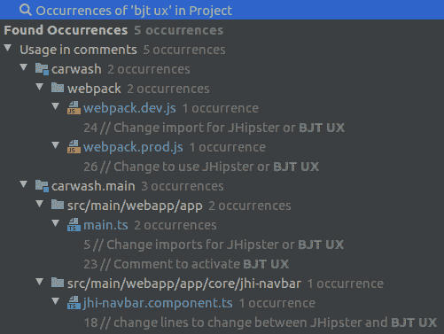](https://res.cloudinary.com/practicaldev/image/fetch/s--a50NbvJ6--/c_limit%2Cf_auto%2Cfl_progressive%2Cq_auto%2Cw_880/https://thepracticaldev.s3.amazonaws.com/i/6brjc7361xgywb40dpz7.png)

经过这个简单的修改，我们可以看到 JHipster UI 又回来了！

[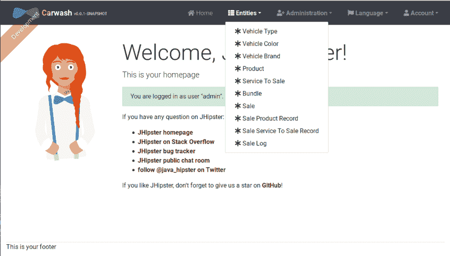](https://res.cloudinary.com/practicaldev/image/fetch/s--nVj5wijQ--/c_limit%2Cf_auto%2Cfl_progressive%2Cq_auto%2Cw_880/https://thepracticaldev.s3.amazonaws.com/i/qjp2b4c4j7y67l36oh89.png)

恢复这些更改以返回到我们的 Appwork 布局

[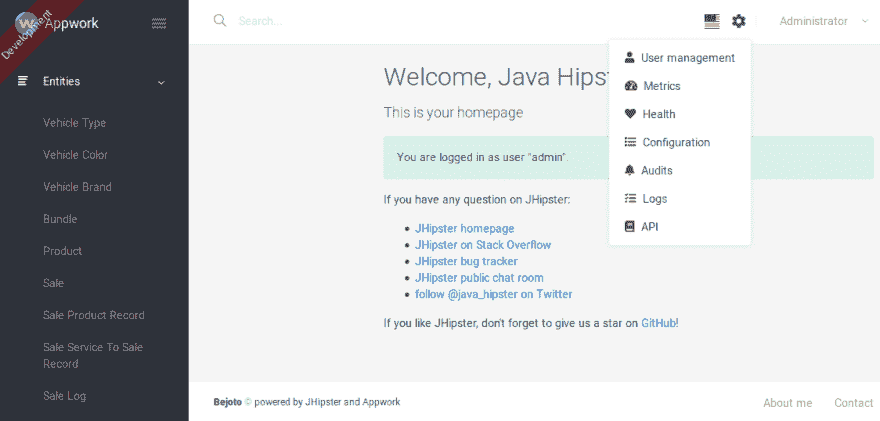](https://res.cloudinary.com/practicaldev/image/fetch/s--fA9Xy8-n--/c_limit%2Cf_auto%2Cfl_progressive%2Cq_auto%2Cw_880/https://thepracticaldev.s3.amazonaws.com/i/ja3ezmhim3daruj3qs8u.png)

好了，现在我们有了一个易于更新的基础，几乎完全与 JHipster 分离，我们可以相对容易地在实现之间切换。

在最后一部分，我将自定义我的实体，这样它们就不仅仅是一个简单的 crud，我们可以在服务器端看到一些并排的例子。