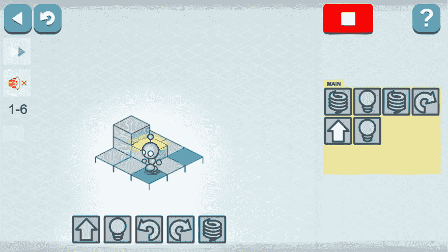
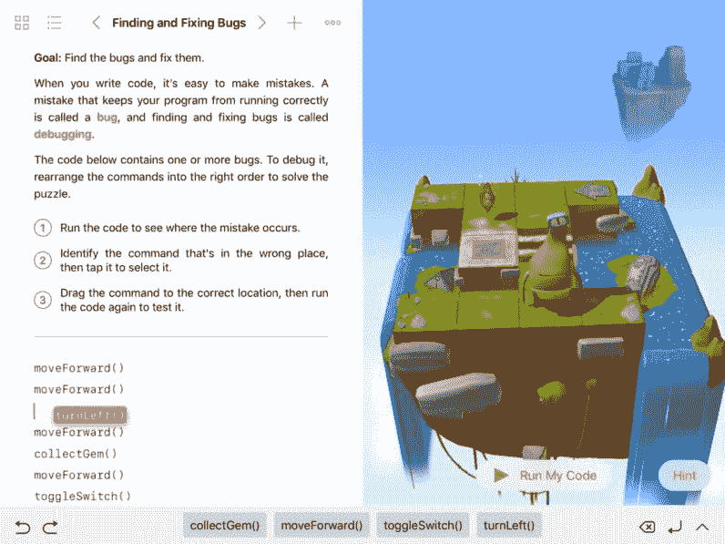
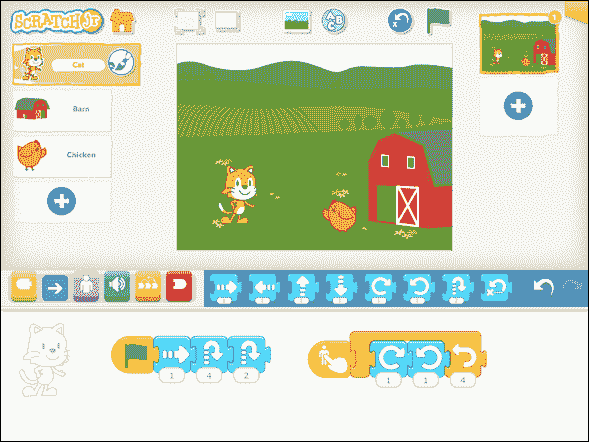
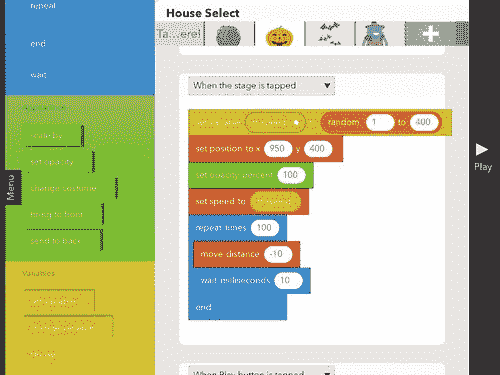
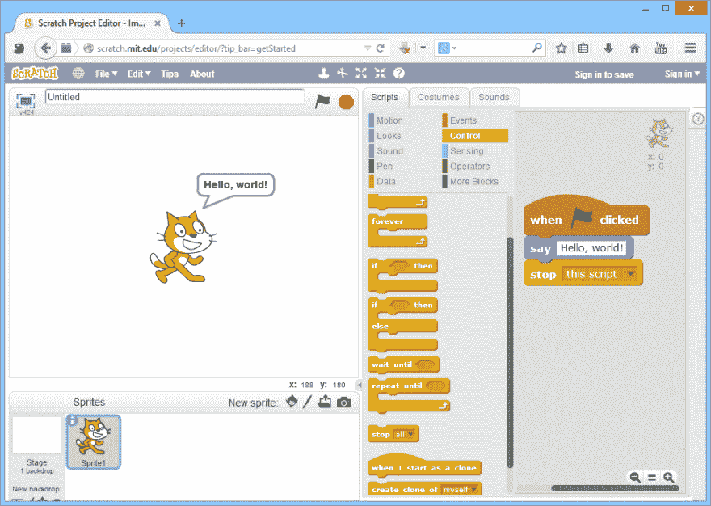
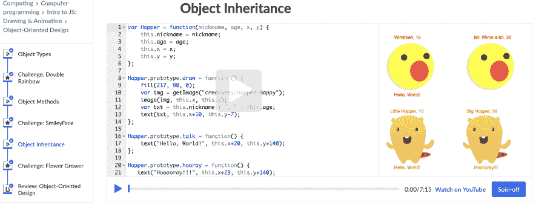
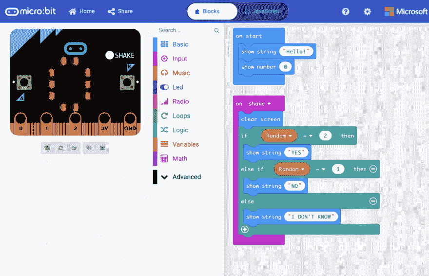
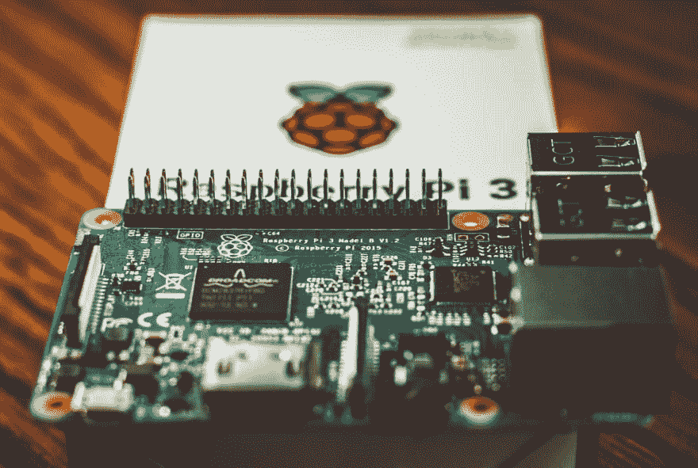

# 儿童编程教学资源

> 原文：<https://dev.to/voidjuneau/resources-for-teaching-programming-to-children-1oc0>

通过第二次[时间](https://dev.to/ljuneaul/useful-links-for-code-newbies-who-want-to-study-more-than-coding-5fik)这样做，我觉得我应该给我的朋友发一系列的“电子邮件”。

这篇文章基于我昨天发给一个朋友的电子邮件。他是四个聪明女孩的父亲。我昨天遇到了他，他想教她的女儿编程，但不知道从哪里开始。

对他来说幸运的是，在为几个组织做志愿者时，我成了这方面的专家。这篇文章中的大部分资源是我实际上和孩子们一起使用的。除了硬件和组织在和，我列出了一个顺序，我想一个孩子会采取。

* * *

*   基本概念

    *   [LightBot](http://lightbot.com/) - iOS &安卓

        一个很好的起点。有了这个应用程序，孩子可以学习代码的基本概念，如给出特定的指令、循环和功能。由于每一步的空间都是有限的，他们还必须学习如何编写紧凑的代码而不重复。

        

    *   [雨燕游乐场](https://www.apple.com/ca/swift/playgrounds/)(苹果)- iOS & macOS

        我比 LightBot 更先进一点，因为它使用(有点)真正的代码行，用文本代替图标。但是孩子们喜欢他们在现实世界中玩耍的想法。

        

*   实际编码

    *   [ScratchJr](https://www.scratchjr.org/) (麻省理工学院)- iOS &安卓

        爱死了。孩子们几乎可以做任何事情，如条件，事件处理程序，变量，创建图形和音频。但是每个功能都是图形而不是文本，所以非常简单直观。

        下面是一个游戏控制器的视频，我的一个学生创作了不到半个小时。

        

    *   [跳房子](https://www.gethopscotch.com/) - iOS

        为什么它没有安卓版本？太可惜了。

        这比 ScratchJr 要难一点，因为它是基于文本的，但我非常喜欢它的一点是，它有这么多的教程，所以即使是那些缺乏创造力和不知道该做什么的人(像我一样)也可以按照教程来制作游戏。

        

    *   [Scratch](https://scratch.mit.edu/) (由麻省理工学院)-网络

        最著名的一个。这是有原因的。甚至哈佛大学也在他们的计算机科学导论课开始时使用它

        可能性是无限的。例子:[马里奥赛车吃豆人](https://scratch.mit.edu/projects/290030950/)

        下面是 Pong 的[快速教程。](https://en.scratch-wiki.info/wiki/Pong)

        由于它的名气和悠久的历史，它被很好地记录下来，并且有数百万的资源和例子。

        

    *   [JS 简介:由](https://www.khanacademy.org/computing/computer-programming/programming)[可汗学院](https://www.khanacademy.org/)绘制&动画-Web

        我主要用可汗学院学数学，不过还有 JS 课程也不错。有视频和集成的网络编辑器，逐步给予指导。

        事实上，我决定写这篇文章的原因之一是，几个小时前，我在看 JavaScript 系列的女主角们，她们是[迈克尔·乔利](https://twitter.com/michaeljolley)的女儿劳伦&蕾拉采访[萨拉·维埃拉](https://twitter.com/NikkitaFTW)的女孩们，询问她们如何能更好地编码。我粘贴了聊天的链接，迈克尔说其中一个女孩确实在使用它。

        我也第一次用这个学习了 JavaScript(不是作为一个孩子而是作为一个成年人，但无论如何)。

        

*   五金器具

    *   [微:位](https://microbit.org/)(由 BBC) - iOS & Android & PC

        它可以通过使用类似于 Scratch 的工具在平板电脑上编码，甚至在 PC 上使用 Python。孩子们喜欢它，因为它使编程变得切实可行。即使是最没脑子的人也对此着迷。

        

    *   [树莓派](https://www.raspberrypi.org/) - PC

        唯一一个没自己试过的。它主要使用 Python，但也支持其他语言。

        今年在我们学校举办的[湾区科技与工程博览会](http://www.basef.ca/)上，我看到一个小孩做了一个可以放在婴儿尿布里的尿液探测器&报警器。

        

*   计划和组织

    *   全世界的

        *   [国际代码俱乐部](https://www.codeclubworld.org/)

            它更像是一个俱乐部和项目的门户。你可以在那里早点找到你当地的。

        *   [CoderDojo](https://coderdojo.com/)

            对初学者来说通常是一天的研讨会。他们使用 Scratch，他们还使用一个带有简单控制器的可爱机器人。

    *   加拿大

        *   [女生学习码](https://www.canadalearningcode.ca/experiences/)由[加拿大学习码](https://www.canadalearningcode.ca/)

            一天 3 小时的研讨会和 5 天的夏令营。研讨会的价格通常有一个“量力而行”的选项。

    *   汉密尔顿，on

        *   [汉密尔顿代码俱乐部](https://hamiltoncodeclubs.com/)由 [IEC](https://iechamilton.ca/)

            应学校要求提供的 6 周免费项目。他们使用上面的许多应用程序和可汗学院。

        *   [麦克马斯特外联](http://outreach.mcmaster.ca/)

            他们开发了自己的图书馆，用 Elm 来教孩子们。

            各种类型的讲习班和辅导课，还有夏令营。

            根据学校的要求提供程序，但是工具也可以在线获得。

        *   [编码区](https://codifyzone.com/)

            这家不是 NPO 而是公司，也就是说不是免费的。但它会比完全值得。有很多选择，比如游戏、3D 打印、网络开发。，甚至还有 AI。他们过去也有机器人课程。

            8 周的课程和夏令营。

* * *

> 如果你想给自己的孩子或者侄子侄女教代码，希望这篇帖子能帮到你。或者，就算是为了你奶奶。
> 
> 我相信编码适合每个人。如果你愿意帮助别人学习它，请自愿参加上述组织或你当地的组织。
> 
> 如果你还有什么想和别人分享的，请在下面留下评论。