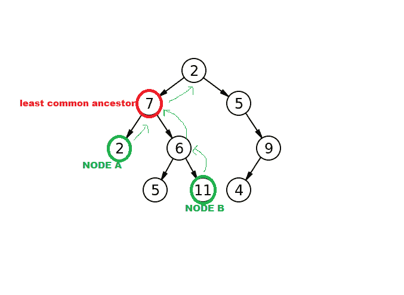
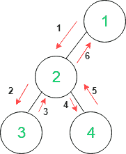
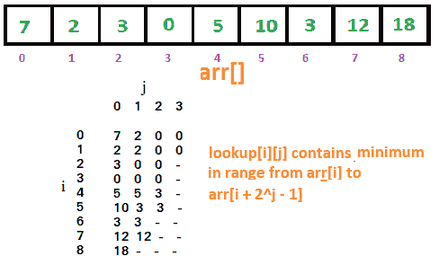

# 重新审视生命周期评价问题

> 原文：<https://dev.to/navi/revisiting-lca-problem-2npf>

今天，我读了迈克尔·a·本德&马特·法拉赫-科尔顿的一篇论文，这篇论文是关于树的最基本的算法问题之一，**LCA 算法**。

下面是我从中了解到的情况。

<figure> 

<figcaption>最少共同祖先</figcaption>

</figure>

树中两个节点 A 和 B 的 ***最小共同祖先*** 是距离根最远的 A 和 B 的共同祖先。LCA 问题是一个非常有趣的问题，因为 LCA 问题的快速算法可以用来解决其他算法问题。 *Harel 和 Tarjan* 表明，通过对树进行一些线性预处理，LCA 查询可以在恒定时间内得到响应。不幸的是，也很好理解的是，实际的算法太复杂而不能有效实现。算法设计者所做的假设是，LCA 问题仍然没有可实现的最优解。因此，结论是最好有一个不依赖于预处理的 LCA 问题的解决方案。这一观点在论文中得到了论证。

在本文中，作者提出了重新设计的 PRAM 算法，这可能不是一个有前途的解决方案。但是，当 PRAM 的复杂性被移除时，我们只剩下一个极其简单的算法。

我们从 **RMQ** 、*范围最小查询问题、*开始，这可能看起来与 LCA 非常不同，但却密切相关。根据维基百科，

> **范围最小值查询** (RMQ)解决了在可比较对象数组的子数组中寻找最小值的问题。

<figure> 

<figcaption>范围最小查询</figcaption>

</figure>

现在，我们引入一些符号来简化算法的描述。如果一个算法有预处理时间 **f(n)** &查询时间 **g(n)** 如果**我们就说该算法有复杂性。**我们对生命周期评价的解决方案源自 RMQ，因此我们将生命周期评价问题简化为 RMQ 问题。

我们建立一个引理，如果 RMQ 有**个时间解，那么 LCA 就有**个时间解，其中 **O(n)** 是预处理成本， **(2n - 1)** 是合成数组的长度， **O(1)** 是将 RMQ 答案转换成 LCA 答案所需的时间。****

 ****<figure> 

<figcaption>欧拉游</figcaption>

</figure>

现在，我们创建一个长度为 **(2n - 1)** 的数组 **E** ，对树进行欧拉游。计算水平数组，其中 **L[i]** 是节点 **E[i]** 的深度。让欧拉游中的节点的代表成为游中第一次出现的节点的索引。并计算长度为 n 的代表数组 **R** ，其中**R【I】**为代表节点 ***i*** 的索引。这一切都需要时间。

我们观察到，

*   第一次访问 **u** 和 **v** 之间的欧拉旅行中的节点是**E【R【u】，…。，R[v]]。**
*   这个子旅程中最浅的节点位于索引 **RMQ(R[u]，R[v])。**
*   这个位置的节点是 **E[RMQ(R[u]，R[v])】**，这样就是 **LCA(u，v)的输出。**

因此，我们可以完成预处理用于 RMQ 的水平阵列 L 的所述时间和空间复杂度的降低。

从现在开始，我们将把重点放在 RMQ 和如何优化它。通过动态规划，RMQ 的预处理时间可以从 **O(n )** 减少到 **O(n )** 。

我们进一步简化这种强力算法，得到 RMQ 的稀疏表(ST)算法，其复杂度为 O( n log n)。

在上述简化的级别数组 L 中，相邻元素相差+1 & -1。这是因为在 Euler 漫游中，一个元素始终是另一个元素的父元素，因此它们的级别相差一级。我们认为这是一个**特殊的**T2(+1，-1) RMQ 问题。

现在我们用第**个算法**来解决我们特殊的 RMQ 问题。我们将使用查表技术从预计算中移除 **O(log n)** 部分。我们使用 2 个数组和 ST 算法来将运行时间减少到 **O(n)。**

<figure> 

<figcaption>疏表</figcaption>

</figure>

这适用于我们特殊的 RMQ 问题。为了证明它适用于一般的 RMQ 问题，我们首先将 RMQ 简化为 LCA，然后回到我们特殊的 RMQ 问题。我们可以在 **O(n)** 时间内很容易地做到这一点，因此我们的算法在 **O(n)** 时间内适用于所有 RMQ 问题。****