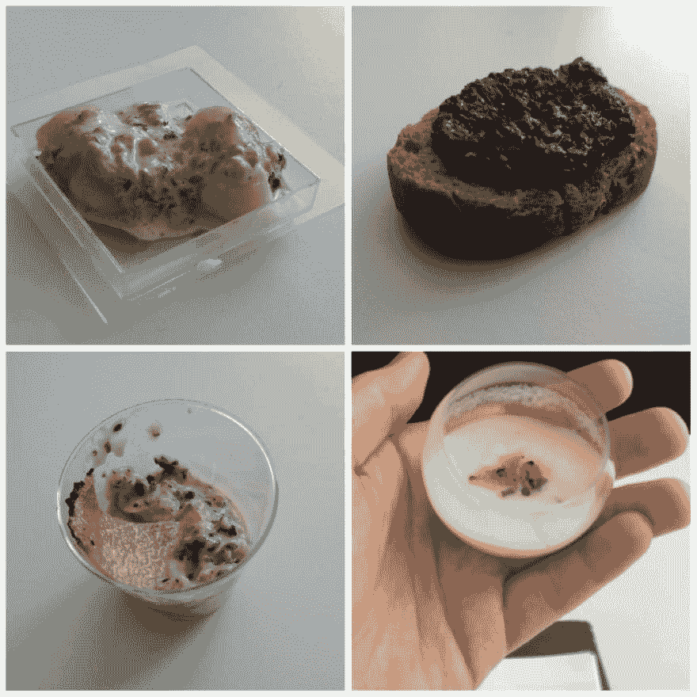
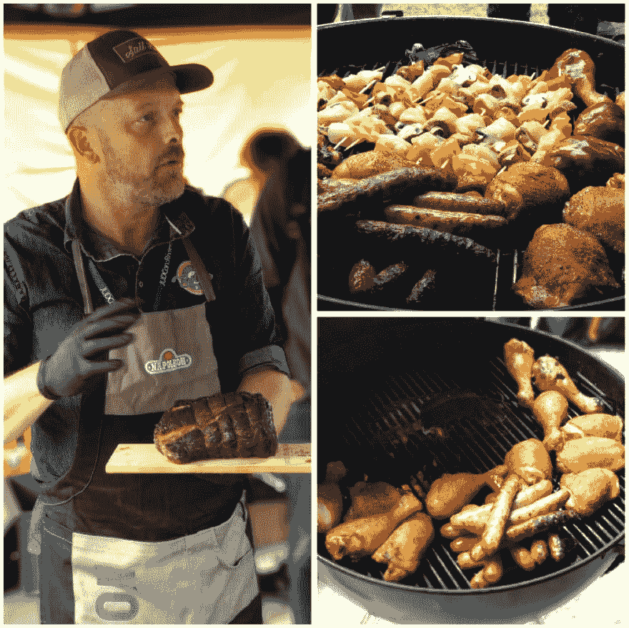

# RivieraDev 2019 -美食发展大会

> 原文：<https://dev.to/sandordargo/rivieradev-2019-the-gastronomical-dev-conference-1g6n>

今年五月，我有机会再次参加 Riviera Dev，甚至谈论我的爱好。那是美食吗？你打赌它是！但稍后会详细介绍。

这是大会第二年以额外的实践日开始。我的雇主给员工发了一百多张正常工作日有效的罚单。作为一名演讲者，我获得了额外一天的入场券，这是一个很酷的福利！

## 亲力亲为的日子

早上，我去了一个关于最新 Java SDKs 的动手实验室。 [Rémi Forax](https://github.com/forax) 是一位 [Java 冠军](https://blogs.oracle.com/java/remi-forax)和许多 Java 专家组的贡献者，他谈了一点 Java 的历史，说它不是一种非常原创的语言，它总是从其他语言中吸取好的东西。除了两件事。Java 是第一个拥有接口和通配符的扩展。从一个像他这样的人口中听到这些真是令人捧腹，毕竟，把别人已经被证明是好的东西结合起来并没有错。

我们谈了很多关于(不)可变性和 Java 中新的 C struct 类数据容器，它被称为[记录](https://cr.openjdk.java.net/~briangoetz/amber/datum.html)。有趣的是，它是不可变的，没有为`equals` / `hashcode` / `toString`函数生成字节码，而是直接调用 JDK。

他还讲了很多关于[可返回开关表达式](https://blog.codefx.org/java/switch-expressions/)的内容，但我不想详细讲述，只想分享他的一个结束语。

> “不要手工做并发。即使对专业人士来说，这也不好用。”

然后，他提到了您手头的不同 SDK 构造，以避免手动执行并发操作。

下午，我参加了一个关于渐进式网络应用的实验室。我这样做是因为我不知道它们是什么，我想学习。兴趣真的很高，房间里挤满了人，我们中的许多人坐在地板上，膝上放着笔记本电脑。向组织者致敬，他们在几分钟内带来了一些额外的椅子，让空闲时间更加舒适。

该课程的目标是将一个纯 HTML/JS 编写的网页变成一个渐进式 Web 应用程序。如果我理解得不错的话，PWA 需要两样东西:https 和清单文件。拥有一个本地 https 并不难，但也不容易。特别是，如果你不能在你的机器上安装任何东西——大多数公司的笔记本电脑都是这种情况。事实上，我陷入了困境，无法让我的应用程序运行——使用 Chrome。我在最后意识到，使用 Firefox 相当不错。

无论如何，这次会议让我受益匪浅，现在我对 PWAs 有了更高层次的认识。

## 发布会

在两天的时间里，有 4 条不同的赛道，这意味着很多的展示。我不写我参加的所有活动，只写一些我特别喜欢的活动。

[Tifanny Souterre](https://twitter.com/tiffanysouterre) 谈到了 [Tensorflow 以及如何破解机器学习](https://rivieradev.fr/session/629)。看到你如何用正确的知识欺骗人工智能是非常有趣的。你拍摄一个正常的图像，加入一些噪声，你仍然看到一个正常的图像。或者你带上一些看起来很滑稽的眼镜，你的朋友仍然能认出你，对吗？嗯，也许人工智能不能！[也许你会从瑞茜·威瑟斯彭变成拉塞尔·克罗。](https://slides.com/tiffanysouterre/deck#/6)

我喜欢 Tiffany 的演示，因为她成功地将好的例子与数学和编程背景相结合。

我必须谈谈第四个，也是最后一个，但并非最不重要的方面:*“我们不仅仅是开发者”*。不，我们不仅仅是软件人，我们是...(要说出令人吃惊或高兴的事情)听着...吃货也是！

在这两天里，我参加了三个关于美食的会议。

莎拉·塔图维尔和[亚当·艾迪科弗](https://2018.rivieradev.fr/orateur/398)去年已经给我们带来了一些美味的松露，他们又做了一次。他们真的给我们带来了同样的食谱，除了今年的汤团。但是如果好吃的话，吃一样的也不错。相信我，他们是。

他们一起进行会议真的很有用。当一个人烹饪和服务时，另一个人可以谈论松露，你可以用不同的方法来准备它们。

再次感谢你在午餐前的美味佳肴。

我只拿了一份清淡的，因为午饭后我就要做报告了，还是关于食物的。尤其是面包。

大约 7-8 年前，我们开始和我的妻子一起制作自己的面包，大约 3 年来，我们一直在用这种传统的方法制作自己的发酵面团，不仅烘焙大部分的面包，甚至还烘焙一些甜点。

我认为我的陈述进行得很顺利，尽管我非常累。用酸面团烘焙需要相当多的计划，我从来没有在这么短的时间内烘焙过 4 种不同的食谱。令人敬畏的演讲者晚宴使它成为一个更大的考验，因为它从我的时间表中删除了一个晚上。但我接受了挑战，这完全值得。

我真的很高兴有这么多人来，希望大多数人喜欢。

有些人可能会觉得我在 RivieraDev 谈论非技术话题很奇怪，但我发现这是练习演讲技巧的绝佳机会，也是认识当地社区更多人的绝佳机会。此外，这是一个主要致力于 Java 世界的会议，这些年我更多地参与了 C++。

无论如何，今年有一些新的更短的讲座，对软/核心技能开放了一点，所以明年我会尝试介绍可能是关于代码审查或编码指南。

在我结束我的演讲后，我保管好了我随身携带的所有物品，我吃了午餐时藏起来的三明治，并且没有参加下一个时段的任何活动。相反，我在看台上走来走去，和人们交谈。

我想我现在被安全思维感染了。在一个摊位上，我们可以填写网页上的表格来赢得一些东西，我发现双击表格，我就可以检索到姓名和相应的电子邮件地址和电话号码。我把这个问题告诉了摊位上的人，他们友好地说了声谢谢，然后开始打电话。在这样的现场发现这些问题，很搞笑。就数据隐私而言，我们在任何地方都有很多事情要做！

尽管我发现了这个数据隐私问题——可能还有其他问题，不仅仅是数字问题——但安全性并没有被忽视。我们甚至有一个由[Julien topu](https://twitter.com/JulienTopcu)用法语做的有趣的[演示，基本上是关于](https://slides.com/julientopcu/comment-se-faire-hacker-bien-comme-il-faut#/) [OWASP 十强](https://www.owasp.org/index.php/Category:OWASP_Top_Ten_Project)。我认为对于那些不直接参与安全开发生命周期活动的人来说，这是一个非常好的起点。也许你在附近找不到比 OWASP 组织成员更有能力的人了。谢谢，Julien，这是一个有趣且非常重要的演示！

我写道，我参加了三个与食品相关的演示，但我目前只提到了两个。第三次是在周五午饭前。嗯，这不是一个演示，这是更好的东西。法国烧烤冠军 Anthony Le Brière 来到里维埃拉德夫！他带来了一个吸烟者和一些烧烤架，并分享了一些关于如何在家里成功烧烤的要点，以及在几次不成功的尝试后如何避免这种情况。你厌倦了，卖掉了你珍贵的烤架。当他说话的时候，一大块猪肉正在烧烤，更不用说那一大块鲑鱼了。

还有一些香肠和鸡肉。有了这些，我们就能有所帮助。包括准备和烧烤部分。

研讨会一直持续到午餐时间，但完全值得。每个人都可以品尝到 4-5 种不同的肉类，当他带来面包片、面包卷和不同的酱料时，我们都可以准备一个热狗或三明治。

之后我留下来问了几个关于安东尼使用的温度计的问题，也许我会买一个自己的。不是为了烧烤，而是为了在烤箱里烤一些肉。

有些会议上的谈话会给你带来最大的价值，有些会议上的谈话会让你受益匪浅。我曾经在几个项目中使用 Java，但是正如我已经提到的，我更喜欢 C++。或许这也解释了，虽然有很多精彩的演讲，但对我来说，今年的边谈更有价值。但这根本不是问题，这只是意味着非常有趣的人参加了会议，这是主办方的优点！

我很感激我能在里维埃拉德夫，我祝愿车队好运，特别是米歇尔·莱盖特，他在这么多年的成功之后从 T2 手中接过了领导权。

*这篇文章最初发表在我的[博客](http://sandordargo.com/blog/2019/07/16/riviera-dev-2019)上。如果你有兴趣接收我的最新文章，请[注册我的简讯](http://eepurl.com/gvcv1j)和[在 Twitter 上关注我](https://twitter.com/SandorDargo)。*